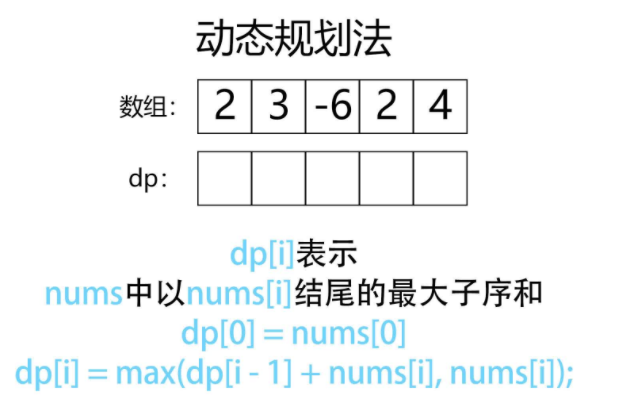

# 贪心算法

## 1 算法解释

回到贪心算法的定义：（下面是来自《算法导论（第三版）》第 16 章的叙述）


 顾名思义，贪心算法或贪心思想采用贪心的策略，保证每次操作都是局部最优的，从而使最后得到的结果是全局最优的。

举一个最简单的例子：

例如，有一堆钞票，你可以拿走十张，如果想达到最大的金额，你要怎么拿？指定每次拿最大的，最终结果就是拿走最大数额的钱。每次拿最大的就是局部最优，最后拿走最大数额的钱就是推出全局最优。因为全局结果是局部结果的简单求和，且局部结果互不相干，因此局部最优的策略也同样是全局最优的策略。

## 2 入门练习

### 455. 分发饼干

**[455. 分发饼干](https://leetcode-cn.com/problems/assign-cookies/)**

假设你是一位很棒的家长，想要给你的孩子们一些小饼干。但是，每个孩子最多只能给一块饼干。

对每个孩子 i，都有一个胃口值 g[i]，这是能让孩子们满足胃口的饼干的最小尺寸；并且每块饼干 j，都有一个尺寸 s[j] 。如果 s[j] >= g[i]，我们可以将这个饼干 j 分配给孩子 i ，这个孩子会得到满足。你的目标是尽可能满足越多数量的孩子，并输出这个最大数值。

**示例 1:**

> 输入: g = [1,2,3], s = [1,1]
>
> 输出: 1
>
> **解释:** 
> 你有三个孩子和两块小饼干，3个孩子的胃口值分别是：1,2,3。
>
> 虽然你有两块小饼干，由于他们的尺寸都是1，你只能让胃口值是1的孩子满足。
>
> 所以你应该输出1。

**示例 2:**

> 输入: g = [1,2], s = [1,2,3]
>
> 输出: 2
>
> **解释:** 
>
> 你有两个孩子和三块小饼干，2个孩子的胃口值分别是1,2。
>
> 你拥有的饼干数量和尺寸都足以让所有孩子满足。
>
> 所以你应该输出2.

**题解:**
因为饥饿度最小的孩子最容易吃饱，所以我们先考虑这个孩子。为了尽量使得剩下的饼干可以满足饥饿度更大的孩子，所以我们应该把大于等于这个孩子饥饿度的、且大小最小的饼干给这个孩子。满足了这个孩子之后，我们采取同样的策略，考虑剩下孩子里饥饿度最小的孩子，直到没有满足条件的饼干存在。

简而言之，这里的贪心策略是，给剩余孩子里最小饥饿度的孩子分配最小的能饱腹的饼干。
至于具体实现，因为我们需要获得大小关系，一个便捷的方法就是把孩子和饼干分别排序。这样我们就可以从饥饿度最小的孩子和大小最小的饼干出发，计算有多少个对子可以满足条件。

**代码：**

```java
class Solution {
    public int findContentChildren(int[] g, int[] s) {
        Arrays.sort(g);
        Arrays.sort(s);
        int child = 0;
        int cookie = 0;
        while( cookie < s.length && child < g.length){
            if(s[cookie] >= g[child]){
                child ++;
            }
            cookie ++;
        } 
        return child;
    }
}
```

### 135. 分发糖果

[135. 分发糖果](https://leetcode-cn.com/problems/candy/)

老师想给孩子们分发糖果，有 *N* 个孩子站成了一条直线，老师会根据每个孩子的表现，预先给他们评分。

你需要按照以下要求，帮助老师给这些孩子分发糖果：

- 每个孩子至少分配到 1 个糖果。
- 评分更高的孩子必须比他两侧的邻位孩子获得更多的糖果。

那么这样下来，老师至少需要准备多少颗糖果呢？

**示例 1：**

> 输入：[1,0,2]
>
> 输出：5
>
> 解释：你可以分别给这三个孩子分发 2、1、2 颗糖果。

**示例 2：**

> 输入：[1,2,2]
>
> 输出：4
>
> 解释：你可以分别给这三个孩子分发 1、2、1 颗糖果。第三个孩子只得到 1 颗糖果，这已满足上述两个条件。

**思路及解法:**

规则定义： 设学生 A 和学生 B 左右相邻，A 在 B 左边；
左规则： 当 `ratings_B > ratings_A ` 时，B 的糖比 A 的糖数量多。
右规则： 当 `ratings_A > ratings_B` 时，A 的糖比 B 的糖数量多。
相邻的学生中，评分高的学生必须获得更多的糖果  等价于  所有学生满足左规则且满足右规则。

**算法流程：**

先从左至右遍历学生成绩 ratings，按照以下规则给糖，并记录在 left 中：

若 `ratings_i > ratings_i-1` ，则第 i 名学生糖比第 i - 1 名学生多 1 个。
若 `ratings_i <= ratings_i-1` ，则给第 i 名学生1个糖果。
经过此规则分配后，可以保证所有学生糖数量 满足左规则 。
同理，在此规则下从右至左遍历学生成绩并记录在 right 中，可以保证所有学生糖数量 满足右规则 。

最终，取以上 2 轮遍历 left 和 right 对应学生糖果数的 最大值 ，这样则 同时满足左规则和右规则 ，即得到每个同学的最少糖果数量。

**复杂度分析：**

时间复杂度 O(N)O(N) ： 遍历两遍数组即可得到结果；
空间复杂度 O(N)O(N) ： 需要借用left，right的线性额外空间。

如下图：红色为left  绿色为right


**代码：**

```java
class Solution {
    public int candy(int[] ratings) {
        int n = ratings.length;
        int[] left = new int[n];
        for(int i = 0; i < n; i++){
            if(i > 0 && ratings[i] > ratings[i-1]){
                left[i] = left[i-1] + 1;
            }else{
                left[i] = 1;
            }
        }
        int minCount = 0;
        int[] right = new int[n];
        for(int i = n-1; i >= 0; i--){
            if(i < n-1 && ratings[i] > ratings[i+1]){
                right[i] = right[i+1] + 1;
            }else{
                right[i] = 1;
            }
            minCount += Math.max(left[i],right[i]);
        }
        return minCount;
    }
}
```


### 860. 柠檬水找零

[860. 柠檬水找零](https://leetcode-cn.com/problems/lemonade-change/)


在柠檬水摊上，每一杯柠檬水的售价为 `5` 美元。

顾客排队购买你的产品，（按账单 `bills` 支付的顺序）一次购买一杯。

每位顾客只买一杯柠檬水，然后向你付 `5` 美元、`10` 美元或 `20` 美元。你必须给每个顾客正确找零，也就是说净交易是每位顾客向你支付 `5` 美元。

注意，一开始你手头没有任何零钱。

如果你能给每位顾客正确找零，返回 `true` ，否则返回 `false` 。

示例 1：

> 输入：[5,5,5,10,20]
>
> 输出：true
>
> 解释：
>
> 前 3 位顾客那里，我们按顺序收取 3 张 5 美元的钞票。
>
> 第 4 位顾客那里，我们收取一张 10 美元的钞票，并返还 5 美元。
>
> 第 5 位顾客那里，我们找还一张 10 美元的钞票和一张 5 美元的钞票。
>
> 由于所有客户都得到了正确的找零，所以我们输出 true。

示例 2：

> 输入：[5,5,10]
>
> 输出：true

示例 3：

> 输入：[10,10]
>
> 输出：false

示例 4：

> 输入：[5,5,10,10,20]
>
> 输出：false
>
> 解释：
>
> 前 2 位顾客那里，我们按顺序收取 2 张 5 美元的钞票。
>
> 对于接下来的 2 位顾客，我们收取一张 10 美元的钞票，然后返还 5 美元。
>
> 对于最后一位顾客，我们无法退回 15 美元，因为我们现在只有两张 10 美元的钞票。
>
> 由于不是每位顾客都得到了正确的找零，所以答案是 false。

**题解：**

由于顾客只可能给你三个面值的钞票，而且我们一开始没有任何钞票，因此我们拥有的钞票面值只可能是 55 美元，1010 美元和 2020 美元三种。基于此，我们可以进行如下的分类讨论。

55 美元，由于柠檬水的价格也为 55 美元，因此我们直接收下即可。

1010 美元，我们需要找回 55 美元，如果没有 55 美元面值的钞票，则无法正确找零。

2020 美元，我们需要找回 1515 美元，此时有两种组合方式，一种是一张 1010 美元和 55 美元的钞票，一种是 33 张 55 美元的钞票，如果两种组合方式都没有，则无法正确找零。当可以正确找零时，两种找零的方式中我们更倾向于第一种，即如果存在 55 美元和 1010 美元，我们就按第一种方式找零，否则按第二种方式找零，因为需要使用 55 美元的找零场景会比需要使用 1010 美元的找零场景多，我们需要尽可能保留 55 美元的钞票。

基于此，我们维护两个变量 `five` 和 `ten` 表示当前手中拥有的 55 美元和 1010 美元钞票的张数，从前往后遍历数组分类讨论即可。

- 时间复杂度：O(N)，其中 N 是`bills`的长度。
- 空间复杂度：O(1)。

**代码:**

```java
class Solution {
    public boolean lemonadeChange(int[] bills) {
        int five = 0, ten = 0;
        for(int i = 0; i < bills.length; i++){
            if(bills[i] == 5){  //5元 直接入口袋
                five ++;
            }else if(bills[i] == 10){  //10元  
                if(five > 0){   //如果口袋有5元的   找零，5元数量减一，10元数量加一
                    five --;
                    ten ++;
                }
                else{           //找不开  直接返回false
                    return false;
                }
            }else{   //20元 
                if(five > 0 && ten > 0){  //优先使用 十元 和 五元 一起 进行找零
                    five --;
                    ten --;
                    //twenty ++;  这个变量用不上 没什么影响  可以不写
                }else if(five >= 3){   //没有十元的 使用三张五元找零
                    five = five - 3;  
                }else{
                    return false;
                }
            }
        }
        return true;
    }
}
```

### 435. 无重叠区间

[435. 无重叠区间](https://leetcode-cn.com/problems/non-overlapping-intervals/)

给定一个区间的集合，找到需要移除区间的最小数量，使剩余区间互不重叠。

**注意:**

可以认为区间的终点总是大于它的起点。
区间 [1,2] 和 [2,3] 的边界相互“接触”，但没有相互重叠。
**示例 1:**

> 输入: [ [1,2], [2,3], [3,4], [1,3] ]
>
> 输出: 1
>
> 解释: 移除 [1,3] 后，剩下的区间没有重叠。

**示例 2:**

> 输入: [ [1,2], [1,2], [1,2] ]
>
> 输出: 2
>
> 解释: 你需要移除两个 [1,2] 来使剩下的区间没有重叠。
>

**题解:**
在选择要保留区间时，区间的结尾十分重要：选择的区间结尾越小，余留给其它区间的空间就越大，就越能保留更多的区间。因此，我们采取的贪心策略为，优先保留结尾小且不相交的区间。

具体实现方法为，先把区间按照结尾的大小进行增序排序，每次选择结尾最小且和前一个选择的区间不重叠的区间。我们这里使用 C++ 的 Lambda，结合 std::sort() 函数进行自定义排序。

在样例中，排序后的数组为 [[1,2], [1,3], [2,4]]。按照我们的贪心策略，首先初始化为区间[1,2]；由于 [1,3] 与 [1,2] 相交，我们跳过该区间；由于 [2,4] 与 [1,2] 不相交，我们将其保留。因此最终保留的区间为 [[1,2], [2,4]]。

> 注意 需要根据实际情况判断按区间开头排序还是按区间结尾排序。

**代码：**

```java
class Solution {
    public int eraseOverlapIntervals(int[][] intervals) {
        if(intervals.length == 0){
            return 0;
        }
        Arrays.sort(intervals,new Comparator<int[]>(){
            public int compare(int[] o1, int[] o2) {
                return o1[1] - o2[1];
            }
        });
        int n = intervals.length;
        int right = intervals[0][1];
        int count = 1;
        for(int i = 1; i < n; i++){
            if(intervals[i][0] >= right){
                count ++;
                right = intervals[i][1];
            }
        }
        return n - count;
    }
}
```

### 122. 买卖股票的最佳时机 II

[122. 买卖股票的最佳时机 II](https://leetcode-cn.com/problems/best-time-to-buy-and-sell-stock-ii/)

给定一个数组 prices ，其中 prices[i] 是一支给定股票第 i 天的价格。

设计一个算法来计算你所能获取的最大利润。你可以尽可能地完成更多的交易（多次买卖一支股票）。

注意：你不能同时参与多笔交易（你必须在再次购买前出售掉之前的股票）。

示例 1:

> 输入: prices = [7,1,5,3,6,4]
>
> 输出: 7
>
> 解释: 在第 2 天（股票价格 = 1）的时候买入，在第 3 天（股票价格 = 5）的时候卖出, 这笔交易所能获得利润 = 5-1 = 4 。随后，在第 4 天（股票价格 = 3）的时候买入，在第 5 天（股票价格 = 6）的时候卖出, 这笔交易所能获得利润 = 6-3 = 3 。

示例 2:

> 输入: prices = [1,2,3,4,5]
>
> 输出: 4
>
> 解释: 在第 1 天（股票价格 = 1）的时候买入，在第 5 天 （股票价格 = 5）的时候卖出, 这笔交易所能获得利润 = 5-1 = 4 。注意你不能在第 1 天和第 2 天接连购买股票，之后再将它们卖出。因为这样属于同时参与了多笔交易，你必须在再次购买前出售掉之前的股票。

示例 3:

> 输入: prices = [7,6,4,3,1]
>
> 输出: 0
>
> 解释: 在这种情况下, 没有交易完成, 所以最大利润为 0。

**解题：**
股票买卖策略：

单独交易日： 设今天价格 p1、明天价格 p2  ，则今天买入、明天卖出可赚取金额 p2 - p1(负值代表亏损）。
连续上涨交易日： 设此上涨交易日股票价格分别为 p1, p2, ... , pn，则第一天买最后一天卖收益最大，即 pn - p1
；等价于每天都买卖，即 pn - p1=(p2 - p1)+(p3 - p2)+...+(p(n) - p(n-1)）。
连续下降交易日： 则不买卖收益最大，即不会亏钱。

算法流程：

遍历整个股票交易日价格列表 price，策略是所有上涨交易日都买卖（赚到所有利润），所有下降交易日都不买卖（永不亏钱）。
设 tmp 为第 i-1 日买入与第 i 日卖出赚取的利润，即 tmp = prices[i] - prices[i - 1] ；
当该天利润为正 tmp > 0，则将利润加入总利润 sum；当利润为 0 或为负，则直接跳过；
遍历完成后，返回总利润 sum。

复杂度分析：

时间复杂度 O(N)O(N) ： 只需遍历一次price；
空间复杂度 O(1)O(1) ： 变量使用常数额外空间。

**代码:**

```java
class Solution {
    public int maxProfit(int[] prices) {
        int sum=0;
        for(int i = 1; i<prices.length; i++){
            if(prices[i] > prices[i-1]){
                sum += (prices[i]-prices[i-1]);
            }
        }
        return sum;
    }
}
```

**方法2：动态规划**

考虑到「不能同时参与多笔交易」，因此每天交易结束后只可能存在手里有一支股票或者没有股票的状态。

定义状态 `dp[i][0]` 表示第 i 天交易完后手里没有股票的最大利润，`dp[i][1]`表示第 i 天交易完后手里持有一支股票的最大利润（i 从 0 开始）。

考虑`dp[i][0]` 的转移方程，如果这一天交易完后手里没有股票，那么可能的转移状态为前一天已经没有股票，即 `dp[i-1][0]`，或者前一天结束的时候手里持有一支股票，即 `dp[i-1][1]`，这时候我们要将其卖出，并获得 `prices[i]` 的收益。因此为了收益最大化，我们列出如下的转移方程：

`dp[i][0] = max{dp[i-1][0],dp[i-1][1]+prices[i]}`

再来考虑 `dp[i][1]`，按照同样的方式考虑转移状态，那么可能的转移状态为前一天已经持有一支股票，即 `dp[i-1][1]`，或者前一天结束时还没有股票，即 `dp[i-1][0]`，这时候我们要将其买入，并减少 `prices[i]`的收益。可以列出如下的转移方程：

`dp[i][1]=max{dp[i−1][1],dp[i−1][0]−prices[i]}`

对于初始状态，根据状态定义我们可以知道第 00 天交易结束的时候 `dp[0][0]=0`，`dp[0][1]=−prices[0]`。

因此，我们只要从前往后依次计算状态即可。由于全部交易结束后，持有股票的收益一定低于不持有股票的收益，因此这时候`dp[n−1][0] `的收益必然是大于`dp[n−1][1] `的，最后的答案即为 `dp[n−1][0]`。

**代码：**

```java
class Solution {
    public int maxProfit(int[] prices) {
        int n = prices.length;
        int[][] dp = new int[n][2];
        dp[0][0] = 0;
        dp[0][1] = -prices[0];
        for(int i = 1; i < n; i++){
            dp[i][0] = Math.max(dp[i-1][0],dp[i-1][1]+prices[i]);
            dp[i][1] = Math.max(dp[i-1][1],dp[i-1][0]-prices[i]);
        }
        return dp[n-1][0];
    }
}
```

###  53. 最大子序列和

[53. 最大子序和](https://leetcode-cn.com/problems/maximum-subarray/)

给定一个整数数组 nums ，找到一个具有最大和的连续子数组（子数组最少包含一个元素），返回其最大和。

示例 1：

> 输入：nums = [-2,1,-3,4,-1,2,1,-5,4]
> 输出：6
> 解释：连续子数组 [4,-1,2,1] 的和最大，为 6 。

示例 2：

> 输入：nums = [1]
> 输出：1

示例 3：

> 输入：nums = [0]
> 输出：0

示例 4：

> 输入：nums = [-1]
> 输出：-1

**题解：**

**暴力**

第一层for循环设置起始位置，第二层for循环遍历数组寻找最大值。

时间复杂度：O(n^2)

空间复杂度：O(1)

```java
class Solution {
    public int maxSubArray(int[] nums) {
        int ans = Integer.MIN_VALUE;
        for(int i = 0; i < nums.length; i++){
            int sum = 0;
            for(int j = i; j < nums.length; j++){
                sum += nums[j];
                ans = Math.max(ans,sum);
            }
        }
        return ans;
    }
}
```

这道题虽然也能过：


**贪心**

举个例子：

如果 -2 1 在一起，计算起点的时候，一定是从1开始计算，因为负数只会拉低总和，这就是贪心贪的地方！

局部最优：当前“连续和”为负数的时候立刻放弃，从下一个元素重新计算“连续和”，因为负数加上下一个元素 “连续和”只会越来越小。

全局最优：选取最大“连续和”

局部最优的情况下，并记录最大的“连续和”，可以推出全局最优。

从代码角度上来讲：遍历nums，从头开始用sum累积，如果sum一旦加上nums[i]变为负数，那么就应该从nums[i+1]开始从0累积sum了，因为已经变为负数的sum，只会拖累总和。

时间复杂度：O(n^2)

空间复杂度：O(1)

```java
class Solution {
    public int maxSubArray(int[] nums) {
        int ans = Integer.MIN_VALUE;
        int sum = 0;
        for(int i = 0; i < nums.length; i++){
            sum += nums[i];
            ans = Math.max(ans,sum);
            if(sum < 0){  //出现负数，直接舍去
                sum = 0;
            }
        }
        return ans;
    }
}
```

**动态规划**

当然这道题也可以使用动态规划来完成:



```java
class Solution {
    public int maxSubArray(int[] nums) {
        int[] dp = new int[nums.length];
        dp[0] = nums[0];
        int max = nums[0];
        for(int i=1; i<nums.length; i++){
           dp[i]=Math.max(dp[i-1]+nums[i],nums[i]);
           max = Math.max(max,dp[i]);
        }
        return max;
    }
}
```

使用单个变量来替代dp数组，使控件复杂度降为O(1)；

```java
class Solution {
    public int maxSubArray(int[] nums) {
        int ans = Integer.MIN_VALUE;
        int sum = 0;
        for(int i = 0; i < nums.length; i++){
            sum = Math.max(nums[i],sum+nums[i]);
            ans = Math.max(ans,sum);
        }
        return ans;
    }
}
```


## 3 强化练习


## 4 进阶挑战


