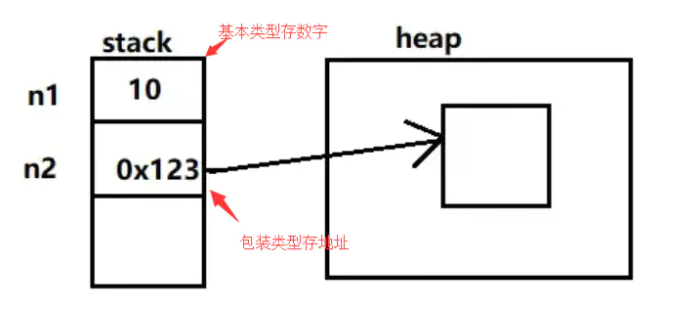

# 基本类型和包装类型的区别

## 简介

**Java 的每个基本类型都对应了一个包装类型，比如说 int 的包装类型为 Integer，double 的包装类型为 Double。基本类型和包装类型的区别主要有以下 4 点**

## 区别

### 1.包装类型可以为 null，而基本类型不可以

它使得包装类型可以应用于 POJO 中，而基本类型则不行
**POJO**：简单无规则的 Java 对象，只有属性字段以及 setter 和 getter 方法，示例如下。

```java
class Writer {
    private Integer age;
    private String name;

    public Integer getAge() {
        return age;
    }

    public void setAge(Integer age) {
        this.age = age;
    }

    public String getName() {
        return name;
    }

    public void setName(String name) {
        this.name = name;
    }
}
```

> **为什么 POJO 的属性必须要用包装类型?**
>  《阿里巴巴 Java 开发手册》上有详细的说明
>  数据库的查询结果可能是 null，如果使用基本类型的话，因为要自动拆箱（将包装类型转为基本类型，比如说把 Integer 对象转换成 int 值），就会抛出 `NullPointerException` 的异常。

### 2.包装类型可用于泛型，而基本类型不可以

```java
List<int> list = new ArrayList<>();
 // 提示 Syntax error, insert "Dimensions" to complete ReferenceType
List<Integer> list = new ArrayList<>();
```

### 3.基本类型比包装类型更高效

**基本类型在栈中直接存储的具体数值，而包装类型则存储的是堆中的引用**



相比较于基本类型而言，包装类型需要占用更多的内存空间。假如没有基本类型的话，对于数值这类经常使用到的数据来说，每次都要通过 new 一个包装类型就显得非常笨重。
**两个包装类型的值可以相同，但却不相等**

### 4.自动装箱和自动拆箱

有了基本类型和包装类型，肯定有些时候要在它们之间进行转换。
 **把基本类型转换成包装类型的过程叫做装箱**。
 **反之，把包装类型转换成基本类型的过程叫做拆箱**
 在 Java SE5 之前，开发人员要手动进行装拆箱

```java
Integer chenmo = new Integer(10);  // 手动装箱
int wanger = chenmo.intValue();  // 手动拆箱
```

Java SE5 为了减少开发人员的工作，**提供了自动装箱与自动拆箱的功能**

```java
Integer chenmo  = 10;  // 自动装箱
int wanger = chenmo;     // 自动拆箱

等价于
=>

Integer chenmo = Integer.valueOf(10);
int wanger = chenmo.intValue();
```

也就是说，自动装箱是通过`Integer.valueOf()`完成的；自动拆箱是通过 `Integer.intValue()` 完成的
 特别注意：

##### 当需要进行自动装箱时，如果数字在 -128 至 127 之间时，会直接使用缓存中的对象，而不是重新创建一个对象

```java

// 1）基本类型和包装类型
int a = 100;
Integer b = 100;
System.out.println(a == b);//true

// 2）两个包装类型
Integer c = 100;
Integer d = 100;
System.out.println(c == d);//true

// 3）
Integer c = 200;
Integer d = 200;
System.out.println(c == d);//false
```

