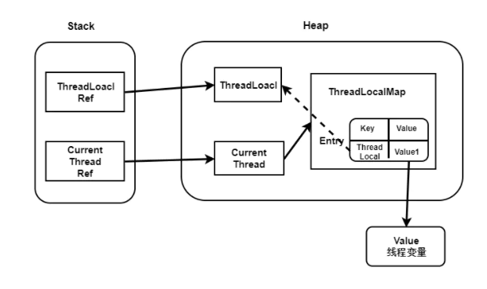
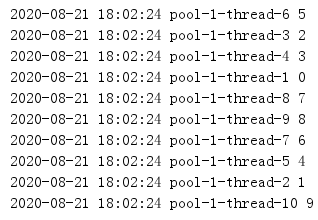
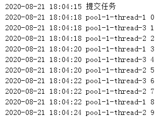
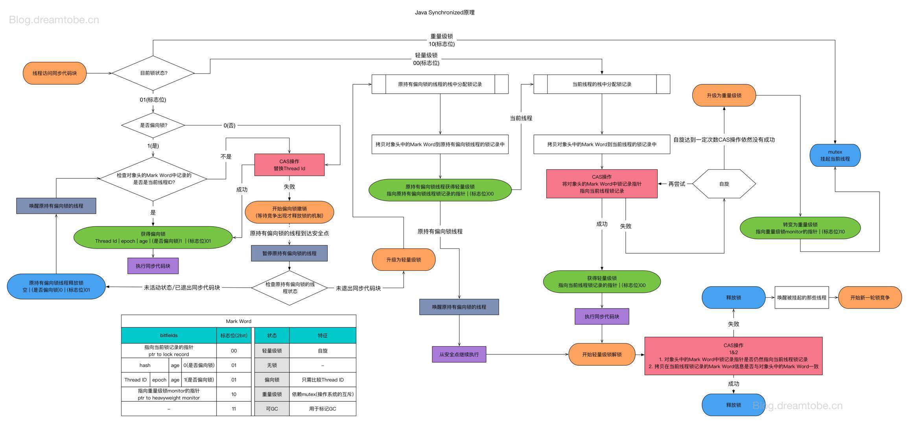

# Java 多线程

## 简述线程、程序、进程的基本概念？

**程序**是含有指令和数据的文件，被存储在磁盘或其他的数据存储设备中，也就是说程序是静态的代码。

**进程**是程序的一次执行过程，是系统运行程序(资源分配)的基本单位，因此进程是动态的。系统运行一个程序即是一个进程从创建，运行到消亡的过程。简单来说，一个进程就是一个执行中的程序，同时，每个进程还占有某些系统资源如 CPU 时间，内存空间，文件，输入输出设备的使用权等等。

**线程**与进程相似，但线程是一个比进程更小的调度和执行单位。一个进程在其执行的过程中可以产生多个线程。与进程不同的是同类的多个线程共享同一块内存空间和一组系统资源，所以系统在产生一个线程，或是在各个线程之间作切换工作时，负担要比进程小得多，也正因为如此，线程也被称为轻量级进程。

线程是进程划分成的更小的运行单位。线程和进程最大的不同在于基本上各进程是独立的，而各线程则不一定，因为同一进程中的线程极有可能会相互影响。同类的多个线程共享进程的堆和方法区资源，但每个线程有自己的程序计数器、虚拟机栈和本地方法栈。

## 进程间通信方式

**管道(pipe)**

管道是一种半双工的通信方式，数据只能单向流动，而且只能在具有亲缘关系的进程间使用。进程的亲缘关系通常是指父子进程关系。

**有名管道 (namedpipe)**

有名管道也是半双工的通信方式，但是它允许无亲缘关系进程间的通信。

**信号量(semaphore)**

信号量是一个计数器，可以用来控制多个进程对共享资源的访问。它常作为一种锁机制，防止某进程正在访问共享资源时，其他进程也访问该资源。因此，主要作为进程间以及同一进程内不同线程之间的同步手段。

**消息队列(messagequeue)**

消息队列是由消息的链表，存放在内核中并由消息队列标识符标识。消息队列克服了信号传递信息少、管道只能承载无格式字节流以及缓冲区大小受限等缺点。

**信号 (sinal)**

信号是一种比较复杂的通信方式，用于通知接收进程某个事件已经发生。

**共享内存(shared memory)**

共享内存就是映射一段能被其他进程所访问的内存，这段共享内存由一个进程创建，但多个进程都可以访问。共享内存是最快的 IPC 方式，它是针对其他进程间通信方式运行效率低而专门设计的。它往往与其他通信机制，如信号量，配合使用，来实现进程间的同步和通信。

**套接字(socket)**

套接口也是一种进程间通信机制，与其他通信机制不同的是，它可用于不同设备及其间的进程通信。

## 线程间通信方式

**1. wait/notify等待通知方式**

基于synchronized和wait()和notify()

**2. 管道流**

管道输入/输出流的形式

**3. Volatile 内存共享**

共享内存：线程之间共享程序的公共状态，线程之间通过读-写内存中的公共状态来隐式通信。

**4. 阻塞队列**

Java5提供了一个BlockingQueue接口，虽然BlockingQueue也是Queue的子接口，但它的主要用途不是作为容器，而是作为线程同步的工具。

BlockingQueue具有一个特征：当生产者线程试图向BlockingQueue中放入元素时，如果该队列已满则线程被阻塞。而消费者线程 在取元素时，如果该队列已空则该线程被阻塞。

程序的两个线程通过交替向BlockingQueue中放入元素、取出元素，即可很好地控制线程的通信。

**5. 使用JUC工具类 **

CountDownLatch 并发工具

CyclicBarrier 并发工具

**6. 基于Lock和Condition的await()和signal()**

**7. 基于LockSupport的park()和unpark()**

## 线程的创建方式?

1. 继承Thread类
2. 实现Runnable接口
3. 使用Callable和Future
4. 使用线程池

## 实现 Runnable 接口和 Callable 接口的区别？

Callable  接口可以返回结果或抛出检查异常，Runnable  接口不会。

如果任务不需要返回结果或抛出异常推荐使用 Runnable  接口，这样代码看起来会更加简洁。

## 线程有哪些基本状态?

Java 线程在运行的生命周期中的指定时刻只可能处于下面 6 种不同状态的其中一个状态（图源《Java 并发编程艺术》4.1.4 节）。


线程在生命周期中并不是固定处于某一个状态而是随着代码的执行在不同状态之间切换。Java 线程状态变迁如下图所示（图源《Java 并发编程艺术》4.1.4 节）：


由上图可以看出：

线程创建之后它将处于 NEW（新建） 状态，调用 start()  方法后开始运行，线程这时候处于 READY（RUNABLE 可运行） 状态。可运行状态的线程获得了 cpu 时间片（timeslice）后就处于 RUNNING（运行） 状态。

当线程执行 wait() 方法之后，线程进入 WAITING（等待）状态。进入等待状态的线程需要依靠其他线程的通知才能够返回到运行状态，而 TIME_WAITING(超时等待) 状态相当于在等待状态的基础上增加了超时限制，比如通过sleep(long millis)方法或 wait(long millis) 方法可以将 Java 线程置于 TIMED WAITING 状态。当超时时间到达后 Java 线程将会返回到 RUNNABLE 状态。

1、新建状态（New）：当线程对象对创建后，即进入了新建状态，如：Thread t= new MyThread()；

2、就绪状态（Runnable）：当调用线程对象的 start()方法（t.start();），线程即进入就绪状态。处于就绪状态的线程，只是说明此线程已经做好了准备，随时等待 CPU 调度执行，并不是说执行了 t.start()此线程立即就会执行；

3、运行状态（Running）：当 CPU 开始调度处于就绪状态的线程时，此时线程才得以真正执行，即进入到运行状态。注：就 绪状态是进入到运行状态的唯一入口，也就是说，线程要想进入运行状态执行，首先必须处于就绪状态中；

4、阻塞状态（Blocked）：处于运行状态中的线程由于某种原因，暂时放弃对 CPU的使用权，停止执行，此时进入阻塞状态，直到其进入到就绪状态，才 有机会再次被 CPU 调用以进入到运行状态。

根据阻塞产生的原因不同，阻塞状态又可以分为三种：

1. 等待阻塞：运行状态中的线程执行 wait()方法，使本线程进入到等待阻塞状态；
2. 同步阻塞：线程在获取 synchronized 同步锁失败(因为锁被其它线程所占用)，它会进入同步阻塞状态；
3. 其他阻塞：通过调用线程的 sleep()或 join()或发出了 I/O 请求时，线程会进入到阻塞状态。当 sleep()状态超时、join()等待线程终止或者超时、或者 I/O 处理完毕时，线程重新转入就绪状态。

5、死亡状态（Dead）：线程执行完了或者因异常退出了 run()方法，该线程结束生命周期。

当线程调用同步方法时，在没有获取到锁的情况下，线程将会进入到 BLOCKED（阻塞） 状态。线程在执行 完Runnable 的 run() 方法之后将会进入到 TERMINATED（终止） 状态。

> 操作系统隐藏 Java 虚拟机（JVM）中的 READY 和 RUNNING 状态，它只能看到 RUNNABLE 状态（图源：HowToDoInJava：Java Thread Life Cycle and Thread States），所以 Java 系统一般将这两个状态统称为 RUNNABLE（运行中） 状态 。

## 什么是线程死锁?如何避免死锁?

线程死锁描述的是这样一种情况：多个线程同时被阻塞，它们中的一个或者全部都在等待某个资源被释放。由于线程被无限期地阻塞，因此程序不可能正常终止。

如下图所示，线程 A 持有资源 2，线程 B 持有资源 1，他们同时都想申请对方的资源，所以这两个线程就会互相等待而进入死锁状态。


**死锁代码：**

```java
package Algorithm;

public class DeadLock {
    private static Object resource1 = new Object(); //资源1
    private static Object resource2 = new Object(); //资源2

    public static void main(String[] args) {
        new Thread(()->{
            synchronized (resource1){
                System.out.println(Thread.currentThread().getName() + "get resource1");
                try {
                    Thread.sleep(1000);
                } catch (InterruptedException e) {
                    e.printStackTrace();
                }
                System.out.println(Thread.currentThread().getName() + "waiting resource2");
                synchronized (resource2){
                    System.out.println(Thread.currentThread().getName() + "get resource2");
                }
            }
        },"线程 1 ").start();

        new Thread(()->{
            synchronized(resource2){
                System.out.println(Thread.currentThread().getName() + "get resource2");
                try {
                    Thread.sleep(1000);
                } catch (InterruptedException e) {
                    e.printStackTrace();
                }
                System.out.println(Thread.currentThread().getName() + "waiting resource1");
                synchronized (resource1){
                    System.out.println(Thread.currentThread().getName() + "get resource1");
                }
            }
        },"线程 2 ").start();
    }
}
```

运行结果：


线程 A 通过 synchronized (resource1) 获得 resource1 的监视器锁，然后通过Thread.sleep(1000); 让线程 A 休眠 1s 为的是让线程 B 得到执行然后获取到 resource2 的监视器锁。线程 A 和线程 B 休眠结束了都开始企图请求获取对方的资源，然后这两个线程就会陷入互相等待的状态，这也就产生了死锁。上面的例子符合产生死锁的四个必要条件。

## 产生死锁必须具备以下四个条件

1. 互斥条件：该资源任意一个时刻只由一个线程占用。
2. 请求与保持条件：一个进程因请求资源而阻塞时，对已获得的资源保持不放。
3. 不剥夺条件:线程已获得的资源在末使用完之前不能被其他线程强行剥夺，只有自己使用完毕后才释放资源。
4. 循环等待条件:若干进程之间形成一种头尾相接的循环等待资源关系。

## 如何避免线程死锁?

1. 破坏互斥条件 ：这个条件我们没有办法破坏，因为我们用锁本来就是想让他们互斥的（临界资源需要互斥访问）。
2. 破坏请求与保持条件 ：一次性申请所有的资源。
3. 破坏不剥夺条件 ：占用部分资源的线程进一步申请其他资源时，如果申请不到，可以主动释放它占有的资源。
4. 破坏循环等待条件 ：靠按序申请资源来预防。按某一顺序申请资源，释放资源则反序释放。破坏循环等待条件。

## 什么场景会导致线程的上下文切换？

上下文切换就是一个工作的线程被另外一个线程暂停，另外一个线程占用了处理器开始执行任务的过程。

**导致线程上下文切换的有两种类型：**

**自发性上下文切换**是指线程由 Java 程序调用导致切出，在多线程编程中，执行**调用sleep()、wait()、yield()、join()、park()、方法或 synchronized 关键字和 lock **，常常就会引发自发性上下文切换。

**非自发性上下文切换**指线程由于调度器的原因被迫切出。常见的有：线程被分配的时间片用完、JVM垃圾回收（STW、线程暂停）、线程执行优先级。

## 那么虚拟机垃圾回收为什么会导致上下文切换 ？

在 Java 虚拟机中，对象的内存都是由虚拟机中的堆分配的，在程序运行过程中，新的对象将不断被创建，如果旧的对象使用后不进行回收，堆内存将很快被耗尽。Java 虚拟机提供了一种回收机制，对创建后不再使用的对象进行回收，从而保证堆内存的可持续性分配。而这种垃圾回收机制的使用有可能会导致`stop-the-world`事件的发生，这其实就是一种线程暂停行为。

## sleep() 方法和 wait() 方法区别和共同点?

- **两者最主要的区别在于： sleep()  方法没有释放锁，而 wait()  方法释放了锁 。**
- sleep()方法属于Thread类中的。而wait()方法属于Object类中的。
- wait()  通常被用于线程间交互/通信， sleep() 通常被用于暂停执行。
- wait()  方法被调用后，线程不会自动苏醒，需要别的线程调用同一个对象上的 notify() 或者 notifyAll()  方法。 sleep(long timeout) 方法执行完成后，线程会自动苏醒。使用 wait(long timeout)  超时后线程会自动苏醒。
- 两者都可以暂停线程的执行。

## 生产者消费者代码

```java

```

## start() 方法和 run() 方法?

**调用 start()  方法可启动线程并使线程进入就绪状态，直接执行 run()  方法的话不会以多线程的方式执行。**

new 一个 Thread，线程进入了新建状态。调用 start() 方法，会启动一个线程并使线程进入了就绪状态，当分配到时间片后就可以开始运行了。 start()  会执行线程的相应准备工作，然后自动执行 run()  方法的内容，这是真正的多线程工作。 但是，直接执行 run()  方法，会把 run()  方法当成一个 main 线程下的普通方法去执行，并不会在某个线程中执行它，所以这并不是多线程工作。

## 说一说对于 synchronized 关键字的了解？

synchronized  关键字解决的是多个线程之间访问资源的同步性， synchronized 关键字可以保证被它修饰的方法或者代码块在任意时刻只能有一个线程执行。

synchronized 关键字最主要的三种使用方式：

1. 修饰实例方法: 作用于当前对象实例加锁，进入同步代码前要获得 当前对象实例的锁。
2. 修饰静态方法: 也就是给当前类加锁，会作用于类的所有对象实例 ，进入同步代码前要获得 当前 class 的锁。
3. 修饰代码块 ：指定加锁对象，对给定对象/类加锁。 synchronized(this/object)  表示进入同步代码库前要获得给定对象的锁。 synchronized(类.class)  表示进入同步代码前要获得 当前 class 的锁。

**synchronized底层原理：**

Synchronized在JVM里的实现都是 基于进入和退出Monitor对象来实现方法同步和代码块同步，虽然具体实现细节不一样，但是都可以通过成对的MonitorEnter和MonitorExit指令来实现。  monitor对象存在于每个Java对象的对象头中(存储的指针的指向)，synchronized锁便是通过这种方式获取锁的，也是为什么Java中任意对象可以作为锁的原因，同时也是notify/notifyAll/wait等方法存在于顶级对象Object中的原因。

1. MonitorEnter指令：插入在同步代码块的开始位置，当代码执行到该指令时，将会尝试获取该对象Monitor的所有权，即尝试获得该对象的锁；
2. MonitorExit指令：插入在方法结束处和异常处，JVM保证每个MonitorEnter必须有对应的MonitorExit；

在 Java 早期版本中，`synchronized` 属于 **重量级锁**，效率低下。

因为监视器锁（monitor）是依赖于底层的操作系统的 `Mutex Lock` 来实现的，Java 的线程是映射到操作系统的原生线程之上的。如果要挂起或者唤醒一个线程，都需要操作系统帮忙完成，而操作系统实现线程之间的切换时需要从用户态转换到内核态，这个状态之间的转换需要相对比较长的时间，时间成本相对较高。

庆幸的是在 Java 6 之后 Java 官方对从 JVM 层面对 `synchronized` 较大优化，所以现在的 `synchronized` 锁效率也优化得很不错了。JDK1.6 对锁的实现引入了大量的优化，如自旋锁、适应性自旋锁、锁消除、锁粗化、偏向锁、轻量级锁等技术来减少锁操作的开销。

## synchronized可重入锁的实现原理

synchronized底层是利用计算机系统mutex Lock实现的。每一个可重入锁都会关联一个线程ID和一个锁状态status。

当一个线程请求方法时，会去检查锁状态。

1. 如果锁状态是0，代表该锁没有被占用，使用CAS操作获取锁，将线程ID替换成自己的线程ID。
2. 如果锁状态不是0，代表有线程在访问该方法。此时，如果线程ID是自己的线程ID，如果是可重入锁，会将status自增1，然后获取到该锁，进而执行相应的方法；如果是非重入锁，就会进入阻塞队列等待。

在释放锁时，

1. 如果是可重入锁的，每一次退出方法，就会将status减1，直至status的值为0，最后释放该锁。
2. 如果非可重入锁的，线程退出方法，直接就会释放该锁。

## volatile关键字的作用？

一个共享变量（类的成员变量、类的静态成员变量）被 volatile 修饰之后，那么就具备了两层语义：

- 保证了不同线程对这个变量进行操作时的**可见性**，即一个线程修改了某个变量的值，这新值对其他线程来说是立即可见的。
- **保证有序性**：禁止进行指令重排序。

**volatile原理：**

volatile 可以保证线程可见性且提供了一定的有序性，但是无法保证原子性。在JVM底层 volatile 是采用“内存屏障”来实现的。加入volatile关键字时，会多出一个 lock 前缀指令，lock 前缀指令实际上相当于一个内存屏障（也成内存栅栏），内存屏障会提供3个功能：

（1）它确保指令重排序时不会把其后面的指令排到内存屏障之前的位置，也不会把前面的指令排到内存屏障的后面；即在执行到内存屏障这句指令时，在它前面的操作已经全部完成；

（2）它会强制将对缓存的修改操作立即写入主存；

（3）如果是写操作，它会导致其他CPU中对应的缓存行无效。

## synchronized 关键字和 volatile 关键字的区别？

`synchronized`  关键字和` volatile`  关键字是两个互补的存在，而不是对立的存在！

- volatile  关键字是线程同步的轻量级实现，所以 volatile 性能肯定比 synchronized 关键字要好。但是 volatile  关键字只能用于变量而 synchronized  关键字可以修饰方法以及代码块。
- volatile  关键字能保证数据的可见性，但不能保证数据的原子性。 synchronized  关键字两者都能保证。
- volatile 关键字主要用于解决变量在多个线程之间的可⻅性，而 synchronized  关键字解决的是多个线程之间访问资源的同步性。

## sychronized 和 ReentrantLock 的区别

相似点：

这两种同步方式有很多相似之处，它们都是加锁方式同步，而且都是阻塞式的同步，也就是说当如果一个线程获得了对象锁，进入了同步块，其他访问该同步块的线程都必须阻塞在同步块外面等待，而进行线程阻塞和唤醒的代价是比较高的。

不同点：

1. sychronized是一个关键字，ReentrantLock是一个类；
2. sychronized会自动的加锁与释放锁，ReentrantLock需要程序员手动加锁与释放锁；
3. sychronized的底层是JVM层面的锁，ReentrantLock是API层面的锁；
4. sychronized是非公平锁，ReentrantLock可以选择公平锁或非公平锁；
5. sychronized锁的是对象，锁信息保存在对象头中，ReentrantLock通过代码中int类型的state标识来标识锁的状态；
6. sychronized底层有一个锁升级的过程；

由于ReentrantLock是java.util.concurrent包下提供的一套互斥锁，相比Synchronized，ReentrantLock类提供了一些高级功能，主要有以下3项：

1. 等待可中断，持有锁的线程长期不释放的时候，正在等待的线程可以选择放弃等待，这相当于
   Synchronized 来说可以避免出现死锁的情况。
2. 公平锁，多个线程等待同一个锁时，必须按照申请锁的时间顺序获得锁，Synchronized锁非公平锁，ReentrantLock默认的构造函数是创建的非公平锁，可以通过参数 true 设为公平锁，但公平锁表现的性能不是很好。
3. 锁绑定多个条件，一个ReentrantLock对象可以同时绑定对个对象 。ReenTrantLock提供了一个Condition（条件）类，用来实现分组唤醒需要唤醒的线程们，而不是像synchronized要么随机唤醒一个线程要么唤醒全部线程。

## 原子性，可见性，有序性

并发编程中，我们通常会遇到以下三个问题：原子性问题，可见性问题，有序性问题。我们先看具体看一下这三个概念：

- 原子性：即一个操作或者多个操作 要么全部执行并且执行的过程不会被任何因素打断，要么就都不执行。
- 可见性：是指当多个线程访问同一个变量时，一个线程修改了这个变量的值，其他线程能够立即看得到修改的值。
- 有序性：即程序执行的顺序按照代码的先后顺序执行。

## ThreadLocal 了解么？

通常情况下，我们创建的变量是可以被任何一个线程访问并修改的。如果想实现每一个线程都有自己的专属本地变量该如何解决呢？

ThreadLocal 类主要解决的就是让每个线程绑定自己的值，可以将 ThreadLocal 类形象的比喻成存放数据的盒子，盒子中可以存储每个线程的私有数据。如果你创建了一个 ThreadLocal 变量，那么访问这个变量的每个线程都会有这个变量的本地副本，这也是 ThreadLocal 变量名的由来。他们可以使用 get（）  和 set（）方法来获取默认值或将其值更改为当前线程所存的副本的值，从而避免了线程安全问题。

**对ThreadLocal的理解、底层原理**
ThreadLocal是 JDK java.lang 包下的一个类，ThreadLocal为变量在每个线程中都创建了一个副本，那么每个线程可以访问自己内部的副本变量，并且不会和其他线程的局部变量冲突，实现了线程间的数据隔离。ThreadLocal的应用场景主要有：
（1）保存线程上下文信息，在需要的地方可以获取
（2）线程间数据隔离
（3）数据库连接；
*底层原理*：每个线程的内部都维护了一个 ThreadLocalMap，它是一个键值对数据格式，key 是一个弱引用，也就是 ThreadLocal 本身，而 value 是强引用，存的是线程变量的值。也就是说 ThreadLocal 本身并不存储线程的变量值，它只是一个工具，用来维护线程内部的 Map，帮助存和取变量。

**使用threadLocal会出现什么问题**
ThreadLocal 在 ThreadLocalMap 中是以一个弱引用身份被 Entry 中的 Key 引用的，因此如果 ThreadLocal 没有外部强引用来引用它，那么 ThreadLocal 会在下次 JVM 垃圾收集时被回收。这个时候 Entry 中的 key 已经被回收，但是 value 又是一强引用不会被垃圾收集器回收，这样 ThreadLocal 的线程如果一直持续运行，value 就一直得不到回收，这样就会发生内存泄露。

**ThreadLocal的key是哪种引用类型？为啥这么设计？**
ThreadLocalMap 中的 key 是弱引用，而 value 是强引用才会导致内存泄露的问题

1. 若key 使用强引用：这样会导致一个问题，引用的 ThreadLocal 的对象被回收了，但是 ThreadLocalMap 还持有 ThreadLocal 的强引用毫无意义，如果没有手动删除，ThreadLocal 不会被回收，则会导致内存泄漏。
2. 若key 使用弱引用：这样的话，引用的 ThreadLocal 的对象被回收了，由于 ThreadLocalMap 持有 ThreadLocal 的弱引用，即使没有手动删除，ThreadLocal 也会被回收。value 在下一次 ThreadLocalMap 调用 set、get、remove 的时候会被清除（清理key为null的记录），使用完了ThreadLocal最好在手动的remove一下。
3. 比较以上两种情况：由于 ThreadLocalMap 的生命周期跟 Thread 一样长，如果都没有手动删除对应 key，都会导致内存泄漏，但是使用弱引用可以多一层保障，弱引用 ThreadLocal 不会内存泄漏，对应的 value 在下一次 ThreadLocalMap 调用 set、get、remove 的时候被清除，算是最优的解决方案。

**什么是内存泄漏**
内存泄漏是指用户向系统申请分配内存进行使用，可是使用完了以后却没有释放，结果那块内存用户不能访问（也许你把它的地址给弄丢了），而系统也不能再把它分配给需要的程序。

**Java有哪些引用类型？分别有哪些使用场景**

1. 强引用，任何时候都不会被；垃圾回收器回收，如果内存不足，宁愿抛出OutOfMemoryError
   使用场景：我们平常大部分使用的场景都是使用了强引用，比如new创建对象，反射获得一个对象等。
2. 软引用，只有在内存将满的时候才会被垃圾回收器回收，如果还有可用内存，垃圾回收器不会回收。
   软引用可以和一个引用队列进行关联，如果这个软引用的对象被垃圾回收，就会将这个软引用加入到关联的队列中去。 可用于高速缓存。
3. 弱引用（WeakReference），生命周期更短，只要垃圾回收器运行，就肯定会被回收，不管还有没有可用内存。
   使用场景： 弱引用用于生命周期更短的，对内存更敏感的场景中，比如占用内存很大的Map，java api中就提供了WeakHashMap使用，就会是的大Map被及时清理掉。
4. 虚引用（PhantomReference），虚引用等于没有引用，任何时候都有可能被垃圾回收。虚引用必须和引用队列联合使用，引用队列的作用和软弱引用一样。
   使用场景： 我觉得他的使用场景应该在判断一个对象是否被垃圾回收了，什么时候引用队列有新的引用入队了，就说明他被回收了。

**ThreadLocal  内部维护的是一个类似 Map  的 ThreadLocalMap  数据结构， key  为当前对象的 ThreadLocal  对象，值为 Object 对象。**

比如我们在同一个线程中声明了两个 ThreadLocal 对象的话，会使用 ThreadLocal 对象的Thread 内部都是使用ThreadLocalMap  存放数据的， ThreadLocalMap 的 key 就是 ThreadLocal 对象，value 就是 ThreadLocal  对象调用 set 方法设置的值。


## ThreadLocal的内存泄露是什么原因？

ThreadLocal的内存泄露分析：

先看ThreadLocalMap的源码：

```java
static class ThreadLocalMap {
    static class Entry extends WeakReference<ThreadLocal<?>> {
        /** The value associated with this ThreadLocal. */
        Object value;

        Entry(ThreadLocal<?> k, Object v) {
            super(k);
            value = v;
        }
    }
    ...
   }
```

ThreadLocal的实现原理，每一个Thread维护一个ThreadLocalMap，key为使用**弱引用**的ThreadLocal实例，value为线程变量的副本。这些对象之间的引用关系如下：



实心箭头表示强引用，空心箭头表示弱引用

从上图中可以看出，hreadLocalMap使用ThreadLocal的弱引用作为key，如果一个ThreadLocal不存在外部**强引用**时，Key(ThreadLocal)势必会被GC回收，这样就会导致ThreadLocalMap中key为null， 而value还存在着强引用，只有thead线程退出以后,value的强引用链条才会断掉。

但如果当前线程再迟迟不结束的话，这些key为null的Entry的value就会一直存在一条强引用链：

> Thread Ref -> Thread -> ThreaLocalMap -> Entry -> value

永远无法回收，造成内存泄漏。

**ThreadLocal正确的使用方法**

- 每次使用完ThreadLocal都调用它的remove()方法清除数据
- 将ThreadLocal变量定义成private static，这样就一直存在ThreadLocal的强引用，也就能保证任何时候都能通过ThreadLocal的弱引用访问到Entry的value值，进而清除掉 。

**ThreadLocal 代码示例：**

相信看了上面的解释，大家已经搞懂 ThreadLocal 类是个什么东西了。

```java
import java.text.SimpleDateFormat;
import java.util.Random;

public class ThreadLocalExample implements Runnable{

     // SimpleDateFormat 不是线程安全的，所以每个线程都要有自己独立的副本
    private static final ThreadLocal<SimpleDateFormat> formatter = ThreadLocal.withInitial(() -> new SimpleDateFormat("yyyyMMdd HHmm"));

    public static void main(String[] args) throws InterruptedException {
        ThreadLocalExample obj = new ThreadLocalExample();
        for(int i=0 ; i<10; i++){
            Thread t = new Thread(obj, ""+i);
            Thread.sleep(new Random().nextInt(1000));
            t.start();
        }
    }

    @Override
    public void run() {
        System.out.println("Thread Name= "+Thread.currentThread().getName()+" default Formatter = "+formatter.get().toPattern());
        try {
            Thread.sleep(new Random().nextInt(1000));
        } catch (InterruptedException e) {
            e.printStackTrace();
        }
        //formatter pattern is changed here by thread, but it won't reflect to other threads
        formatter.set(new SimpleDateFormat());

        System.out.println("Thread Name= "+Thread.currentThread().getName()+" formatter = "+formatter.get().toPattern());
    }

}
```

Output:

```java
Thread Name= 0 default Formatter = yyyyMMdd HHmm
Thread Name= 0 formatter = yy-M-d ah:mm
Thread Name= 1 default Formatter = yyyyMMdd HHmm
Thread Name= 2 default Formatter = yyyyMMdd HHmm
Thread Name= 1 formatter = yy-M-d ah:mm
Thread Name= 3 default Formatter = yyyyMMdd HHmm
Thread Name= 2 formatter = yy-M-d ah:mm
Thread Name= 4 default Formatter = yyyyMMdd HHmm
Thread Name= 3 formatter = yy-M-d ah:mm
Thread Name= 4 formatter = yy-M-d ah:mm
Thread Name= 5 default Formatter = yyyyMMdd HHmm
Thread Name= 5 formatter = yy-M-d ah:mm
Thread Name= 6 default Formatter = yyyyMMdd HHmm
Thread Name= 6 formatter = yy-M-d ah:mm
Thread Name= 7 default Formatter = yyyyMMdd HHmm
Thread Name= 7 formatter = yy-M-d ah:mm
Thread Name= 8 default Formatter = yyyyMMdd HHmm
Thread Name= 9 default Formatter = yyyyMMdd HHmm
Thread Name= 8 formatter = yy-M-d ah:mm
Thread Name= 9 formatter = yy-M-d ah:mm
```

从输出中可以看出，Thread-0 已经改变了 formatter 的值，但仍然是 thread-2 默认格式化程序与初始化值相同，其他线程也一样。

## 为什么要用线程池？

**使用线程池的好处：**

- **降低资源消耗**。通过重复利用已创建的线程降低线程创建和销毁造成的消耗。
- **提高响应速度**。当任务到达时，任务可以不需要的等到线程创建就能立即执行。
- **提高线程的可管理性**。线程是稀缺资源，如果无限制的创建，不仅会消耗系统资源，还会降低系统的稳定性，使用线程池可以进行统一的分配，调优和监控。

## 如何创建线程池?

**一、通过Executors工具类提供的方法。**

**1、newCachedThreadPool**

创建一个可缓存的线程池，若线程数超过处理所需，缓存一段时间后会回收，若线程数不够，则新建线程。

```java
private static void createCachedThreadPool() {
        ExecutorService executorService = Executors.newCachedThreadPool();
        for (int i = 0; i < 10; i++) {
            final int index = i;
            executorService.execute(() -> {
                // 获取线程名称,默认格式:pool-1-thread-1
                System.out.println(DateUtil.now() + " " + Thread.currentThread().getName() + " " + index);
                // 等待2秒
                sleep(2000);
            });
        }
    }
```

结果：



因为初始线程池没有线程，而线程不足会不断新建线程，所以线程名都是不一样的。

**2、newFixedThreadPool**

创建一个固定大小的线程池，可控制并发的线程数，超出的线程会在队列中等待。

```java
private static void createFixedThreadPool() {
        ExecutorService executorService = Executors.newFixedThreadPool(3);
        for (int i = 0; i < 10; i++) {
            final int index = i;
            executorService.execute(() -> {
                // 获取线程名称,默认格式:pool-1-thread-1
                System.out.println(DateUtil.now() + " " + Thread.currentThread().getName() + " " + index);
                // 等待2秒
                sleep(2000);
            });
        }
    }
```

结果：


因为线程池大小是固定的，这里设置的是3个线程，所以线程名只有3个。因为线程不足会进入队列等待线程空闲，所以日志间隔2秒输出。

**3、newScheduledThreadPool**

创建一个周期性的线程池，支持定时及周期性执行任务。

```java
private static void createScheduledThreadPool() {
        ScheduledExecutorService executorService = Executors.newScheduledThreadPool(3);
        System.out.println(DateUtil.now() + " 提交任务");
        for (int i = 0; i < 10; i++) {
            final int index = i;
            executorService.schedule(() -> {
                // 获取线程名称,默认格式:pool-1-thread-1
                System.out.println(DateUtil.now() + " " + Thread.currentThread().getName() + " " + index);
                // 等待2秒
                sleep(2000);
            }, 3, TimeUnit.SECONDS);
        }
    }
```

结果：



因为设置了延迟3秒，所以提交后3秒才开始执行任务。因为这里设置核心线程数为3个，而线程不足会进入队列等待线程空闲，所以日志间隔2秒输出。

> **注意：这里用的是ScheduledExecutorService类的schedule()方法，不是ExecutorService类的execute()方法。**

**4、newSingleThreadExecutor**

创建一个单线程的线程池，可保证所有任务按照指定顺序(FIFO, LIFO, 优先级)执行。

```java
private static void createSingleThreadPool() {
        ExecutorService executorService = Executors.newSingleThreadExecutor();
        for (int i = 0; i < 10; i++) {
            final int index = i;
            executorService.execute(() -> {
                // 获取线程名称,默认格式:pool-1-thread-1
                System.out.println(DateUtil.now() + " " + Thread.currentThread().getName() + " " + index);
                // 等待2秒
                sleep(2000);
            });
        }
    }
```

结果：


　因为只有一个线程，所以线程名均相同，且是每隔2秒按顺序输出的。

**二、通过ThreadPoolExecutor类自定义。**

ThreadPoolExecutor类提供了4种构造方法，可根据需要来自定义一个线程池。

```java
public ThreadPoolExecutor(int corePoolSize,
                              int maximumPoolSize,
                              long keepAliveTime,
                              TimeUnit unit,
                              BlockingQueue<Runnable> workQueue,
                              ThreadFactory threadFactory,
                              RejectedExecutionHandler handler) {
        // 省略...
    }
```

共7个参数如下：

（1）corePoolSize：核心线程数，线程池中始终存活的线程数。

（2）maximumPoolSize: 最大线程数，线程池中允许的最大线程数。（当队列中存放的任务达到队列容量的时候，当前可以同时运行的线程数量变为最大线程数。）

（3）keepAliveTime: 存活时间，线程没有任务执行时最多保持多久时间会终止。

（4）unit: 单位，参数keepAliveTime的时间单位，7种可选。

（5）workQueue: 一个阻塞队列，用来存储等待执行的任务，均为线程安全，7种可选。( 当新任务来的时候会先判断当前运行的线程数量是否达到核心线程数，如果达到的话，新任务就会被存放在队列中。)

（6）threadFactory: 线程工厂，主要用来创建线程，默及正常优先级、非守护线程。

（7）handler：拒绝策略，拒绝处理任务时的策略，4种可选，默认为AbortPolicy。

> 阿里代码规范《阿里巴巴Java开发手册》中明确不建议使用Executors类提供的这4种方法：
>
> 【强制】线程池不允许使用Executors去创建，而是通过ThreadPoolExecutor的方式，这样的处理方式让写的同学更加明确线程池的运行规则，规避资源耗尽的风险。
>
> Executors返回的线程池对象的弊端如下:
>
> FixedThreadPool和SingleThreadPool：允许的请求队列长度为Integer.MAX_VALUE，可能会堆积大量的请求，从而导致OOM。
>
> CachedThreadPool和ScheduledThreadPool：允许的创建线程数量为Integer.MAX_VALUE，可能会创建大量的线程，从而导致OOM。

**ThreadPoolExecutor  阻塞队列**

1. ArrayBlockingQueue ：由数组结构组成的有界阻塞队列。
2. LinkedBlockingQueue ：由链表结构组成的有界阻塞队列。
3. PriorityBlockingQueue ：支持优先级排序的无界阻塞队列。
4. DelayQueue：使用优先级队列实现的无界阻塞队列。
5. SynchronousQueue：不存储元素的阻塞队列。
6. LinkedTransferQueue：由链表结构组成的无界阻塞队列。
7. LinkedBlockingDeque：由链表结构组成的双向阻塞队列

**ThreadPoolExecutor  拒绝策略**

如果当前同时运行的线程数量达到最大线程数量并且队列也已经被放满了任务时， ThreadPoolTaskExecutor  定义一些策略:

- ThreadPoolExecutor.AbortPolicy ：抛出 RejectedExecutionException 来拒绝新任务的处理。
- ThreadPoolExecutor.CallerRunsPolicy ：调用执行调用者自己的线程运行任务。但是这种策略会降低对于新任务提交速度，影响程序的整体性能。另外，这个策略喜欢增加队列容量。如果您的应用程序可以承受此延迟并且你不能任务丢弃任何一个任务请求的话，你可以选择这个策略。
- ThreadPoolExecutor.DiscardPolicy ： 不处理新任务，直接丢弃掉。
- ThreadPoolExecutor.DiscardOldestPolicy ： 此策略将丢弃最早的未处理的任务请求。

## 线程池执行原理？

为了搞懂线程池的原理，我们需要首先分析一下 execute 方法，executor.execute(worker) 用来提交一个任务到线程池中去，这个方法非常重要，下面我们来看看它的源码：

```java
// 存放线程池的运行状态 (runState) 和线程池内有效线程的数量 (workerCount)
   private final AtomicInteger ctl = new AtomicInteger(ctlOf(RUNNING, 0));

    private static int workerCountOf(int c) {
        return c & CAPACITY;
    }

    private final BlockingQueue<Runnable> workQueue;

    public void execute(Runnable command) {
        // 如果任务为null，则抛出异常。
        if (command == null)
            throw new NullPointerException();
        // ctl 中保存的线程池当前的一些状态信息
        int c = ctl.get();

        //  下面会涉及到 3 步 操作
        // 1.首先判断当前线程池中之行的任务数量是否小于 corePoolSize
        // 如果小于的话，通过addWorker(command, true)新建一个线程，并将任务(command)
添加到该线程中；然后，启动该线程从而执行任务。
        if (workerCountOf(c) < corePoolSize) {
            if (addWorker(command, true))
                return;
            c = ctl.get();
        }
        // 2.如果当前之行的任务数量大于等于 corePoolSize 的时候就会⾛到这里
        // 通过 isRunning 方法判断线程池状态，线程池处于 RUNNING 状态才会被并且队列可以
加入任务，该任务才会被加入进去
        if (isRunning(c) && workQueue.offer(command)) {
            int recheck = ctl.get();
            // 再次获取线程池状态，如果线程池状态不是 RUNNING 状态就需要从任务队列中移除
任务，并尝试判断线程是否全部执行完毕。同时执行拒绝策略。
            if (!isRunning(recheck) && remove(command))
                reject(command);
                // 如果当前线程池为空就新创建一个线程并执行。
            else if (workerCountOf(recheck) == 0)
                addWorker(null, false);
        }
        //3. 通过addWorker(command, false)新建一个线程，并将任务(command)添加到该线
程中；然后，启动该线程从而执行任务。
        //如果addWorker(command, false)执行失败，则通过reject()执行相应的拒绝策略的内
容。
        else if (!addWorker(command, false))
            reject(command);
    }
```

简单来说，在执行execute()方法时如果状态一直是RUNNING时，的执行过程如下：

1. 如果workerCount < corePoolSize，则创建并启动一个线程来执行新提交的任务；
2. 如果workerCount >= corePoolSize，且线程池内的阻塞队列未满，则将任务添加到该阻塞队列中；
3. 如果workerCount >= corePoolSize && workerCount < maximumPoolSize，且线程池内的阻塞队列已满，则创建并启动一个线程来执行新提交的任务；
4. 如果workerCount >= maximumPoolSize，并且线程池内的阻塞队列已满, 则根据拒绝策略来处理该任务, 默认的处理方式是直接抛异常。


## 执行execute()和 submit()的区别是什么呢？

1. **execute() 方法用于提交不需要返回值的任务，**所以无法判断任务是否被线程池执行成功与否；
2. **submit() 方法用于提交需要返回值的任务。**线程池会返回一个 Future  类型的对象，通过这个 Future  对象可以判断任务是否执行成功，并且可以通过 Future  的 get() 方法来获取返回值， get() 方法会阻塞当前线程直到任务完成，而使用 get(long timeout，TimeUnit unit) 方法则会阻塞当前线程一段时间后立即返回，这时候有可能任务没有执行完。

## 介绍一下 Atomic 原子类

Atomic  翻译成中文是原子的意思。在化学上，我们知道原子是构成一般物质的最小单位，在化学反应中是不可分割的。在我们这里 Atomic 是指一个操作是不可中断的。即使是在多个线程一起执行的时候，一个操作一旦开始，就不会被其他线程干扰。所以，所谓原子类说简单点就是具有原子/原子操作特征的类。

并发包 java.util.concurrent  的原子类都存放在 java.util.concurrent.atomic 下,如下图所示。


**JUC 包中的原子类是分为4类：**

**基本类型**

使用原子的方式更新基本类型

- AtomicInteger ：整形原子类
- AtomicLong ：长整型原子类
- AtomicBoolean ：布尔型原子类

**数组类型**

使用原子的方式更新数组里的某个元素

- AtomicIntegerArray ：整形数组原子类
- AtomicLongArray ：长整形数组原子类
- AtomicReferenceArray ：引用类型数组原子类

**引用类型**

- AtomicReference ：引用类型原子类
- AtomicStampedReference ：原子更新带有版本号的引用类型。该类将整数值与引用关联起来，可用于解决原子的更新数据和数据的版本号，可以解决使用 CAS 进行原子更新时可能出现的 ABA 问题。
- AtomicMarkableReference  ：原子更新带有标记位的引用类型

**对象的属性修改类型**

- AtomicIntegerFieldUpdater ：原子更新整形字段的更新器
- AtomicLongFieldUpdater ：原子更新长整形字段的更新器
- AtomicReferenceFieldUpdater ：原子更新引用类型字段的更新器

## AtomicInteger 的使用

**AtomicInteger 类常用方法**

```java
public final int get() //获取当前的值
public final int getAndSet(int newValue)//获取当前的值，并设置新的值
public final int getAndIncrement()//获取当前的值，并自增
public final int getAndDecrement() //获取当前的值，并自减
public final int getAndAdd(int delta) //获取当前的值，并加上预期的值
boolean compareAndSet(int expect, int update) //如果输入的数值等于预期值，则以原子方式将该值设置为输入值（update）
public final void lazySet(int newValue)//最终设置为newValue,使用 lazySet 设置之后可能导致其他线程在之后的一小段时间内还是可以读到旧的值。
```

**AtomicInteger 类的使用示例**

使用 AtomicInteger 之后，不用对 increment() 方法加锁也可以保证线程安全。

```java
class AtomicIntegerTest {
    private AtomicInteger count = new AtomicInteger();
    //使用AtomicInteger之后，不需要对该方法加锁，也可以实现线程安全。
    public void increment() {
        count.incrementAndGet();
    }

    public int getCount() {
        return count.get();
    }
}
```

**AtomicInteger 线程安全原理简单分析**

AtomicInteger 类的部分源码：

```java
// setup to use Unsafe.compareAndSwapInt for updates（更新操作时提供“比较并替换”的作用）
private static final Unsafe unsafe = Unsafe.getUnsafe();
private static final long valueOffset;

static {
    try {
        valueOffset = unsafe.objectFieldOffset
            (AtomicInteger.class.getDeclaredField("value"));
    } catch (Exception ex) { throw new Error(ex); }
}

private volatile int value;
```

AtomicInteger 类主要利用 CAS (compare and swap) + volatile 和 native 方法来保证原子操作，从而避免 synchronized 的高开销，执行效率大为提升。

CAS 的原理是拿期望的值和原本的一个值作比较，如果相同则更新成新的值。UnSafe 类的 objectFieldOffset() 方法是一个本地方法，这个方法是用来拿到“原来的值”的内存地址，返回值是 valueOffset。另外 value 是一个 volatile 变量，在内存中可见，因此 JVM 可以保证任何时刻任何线程总能拿到该变量的最新值。

## 什么是 CAS ?

CAS 是 compare and swap 的缩写，即我们所说的比较交换。

cas 是一种基于锁的操作，而且是乐观锁。在 java 中锁分为乐观锁和悲观锁。悲观锁是将资源锁住，等一个之前获得锁的线程释放锁之后，下一个线程才可以访问。而乐观锁采取了一种宽泛的态度，通过某种方式不加锁来处理资源，比如通过给记录加 version 来获取数据，性能较悲观锁有很大的提高。

CAS 操作包含三个操作数 —— 内存位置（V）、预期原值（A）和新值(B)。如果内存地址里面的值和 A 的值是一样的，那么就将内存里面的值更新成 B。CAS是通过无限循环来获取数据的，若果在第一轮循环中，a 线程获取地址里面的值被b线程修改了，那么 a 线程需要自旋，到下次循环才有可能机会执行。java.util.concurrent.atomic 包下的类大多是使用 CAS 操作来实现的( AtomicInteger,AtomicBoolean,AtomicLong)。

**CAS 的问题**

**1、CAS 容易造成 ABA 问题**

一个线程 a 将数值改成了 b，接着又改成了 a，此时 CAS 认为是没有变化，其实是已经变化过了，而这个问题的解决方案可以使用版本号标识，每操作一次version 加 1。在 java5 中，已经提供了 AtomicStampedReference 来解决问题。

**2、不能保证代码块的原子性**

CAS 机制所保证的知识一个变量的原子性操作，而不能保证整个代码块的原子性。比如需要保证 3 个变量共同进行原子性的更新，就不得不使用 synchronized 了。

**3、CAS 造成 CPU 利用率增加**

之前说过了 CAS 里面是一个循环判断的过程，如果线程一直没有获取到状态，cpu 资源会一直被占用。

## AQS 了解么？

AQS 的全称为（ AbstractQueuedSynchronizer ），这个类在 java.util.concurrent.locks 包下面。


AQS 是一个用来构建锁和同步器的框架，使用 AQS 能简单且高效地构造出应用⼴泛的大量的同步器，比如我们提到的 ReentrantLock ， Semaphore ，其他的诸如 ReentrantReadWriteLock ， SynchronousQueue ， FutureTask  等等皆是基于 AQS 的。当然，我们自己也能利用 AQS 非常轻松容易地构造出符合我们自己需求的同步器。

**AQS 原理:**

AQS 核心思想是，如果被请求的共享资源空闲，则将当前请求资源的线程设置为有效的工作线程，并且将共享资源设置为锁定状态。如果被请求的共享资源被占用，那么就需要一套线程阻塞等待以及被唤醒时锁分配的机制，这个机制 AQS 是用 CLH 队列锁实现的，即将暂时获取不到锁的线程加入到队列中。

> CLH(Craig,Landin,and Hagersten)队列是一个虚拟的双向队列（虚拟的双向队列即不存在队列实例，仅存在结点之间的关联关系）。AQS 是将每条请求共享资源的线程封装成一个 CLH 锁队列的一个结点（Node）来实现锁的分配。

AQS(AbstractQueuedSynchronizer)原理图：


AQS 使用一个volatile修饰的 int 成员变量来表示同步状态，通过内置的 FIFO 队列来完成获取资源线程的排队工作。AQS 使用 CAS 对该同步状态进行原子操作实现对其值的修改。

```java
private volatile int state;//共享变量，使用volatile修饰保证线程可⻅性
```

状态信息通过 protected 类型的 getState，setState，compareAndSetState 进行操作

```java
//返回同步状态的当前值
protected final int getState() {
        return state;
}
 // 设置同步状态的值
protected final void setState(int newState) {
        state = newState;
}
//原子地（CAS操作）将同步状态值设置为给定值update如果当前同步状态的值等于expect（期望值）
protected final boolean compareAndSetState(int expect, int update) {
        return unsafe.compareAndSwapInt(this, stateOffset, expect, update);
}
```

**AQS 定义两种资源共享方式：**

`Exclusive（独占）：`只有一个线程能执行，如 ReentrantLock 。又可分为公平锁和非公平锁：

- 公平锁：按照线程在队列中的排队顺序，先到者先拿到锁
- 非公平锁：当线程要获取锁时，无视队列顺序直接去抢锁，谁抢到就是谁的

`Share（共享）：`多个线程可同时执行，如CountDownLatch 、 Semaphore  、 CyclicBarrier 、 ReadWriteLock 。

## 如何自定义同步器

不同的自定义同步器争用共享资源的方式也不同。**自定义同步器在实现时只需要实现共享资源state的获取与释放方式即可**，至于具体线程等待队列的维护（如获取资源失败入队/唤醒出队等），AQS已经在底层实现好了。自定义同步器实现时主要实现以下几种方法：

- isHeldExclusively()：该线程是否正在独占资源。只有用到condition才需要去实现它。
- tryAcquire(int)：独占方式。尝试获取资源，成功则返回true，失败则返回false。
- tryRelease(int)：独占方式。尝试释放资源，成功则返回true，失败则返回false。
- tryAcquireShared(int)：共享方式。尝试获取资源。负数表示失败；0表示成功，但没有剩余可用资源；正数表示成功，且有剩余资源。
- tryReleaseShared(int)：共享方式。尝试释放资源，如果释放后允许唤醒后续等待结点返回true，否则返回false。

默认情况下，每个方法都抛出 UnsupportedOperationException 。 这些方法的实现必须是内部线程安全的，并且通常应该简短而不是阻塞。AQS 类中的其他方法都是 final ，所以无法被其他类使用，只有这几个方法可以被其他类使用。

以 ReentrantLock 为例，state 初始化为 0，表示未锁定状态。A 线程 lock()时，会调用 tryAcquire()独占该锁并将 state+1。此后，其他线程再 tryAcquire()时就会失败，直到 A 线程 unlock()到 state=0（即释放锁）为止，其它线程才有机会获取该锁。当然，释放锁之前，A 线程自己是可以重复获取此锁的（state 会累加），这就是可重入的概念。但要注意，获取多少次就要释放多么次，这样才能保证 state 是能回到零态的。

再以 CountDownLatch  以例，任务分为 N 个子线程去执行，state 也初始化为 N（注意 N 要与线程个数一致）。这 N 个子线程是并行执行的，每个子线程执行完后 countDown()  一次，state 会 CAS(Compare and Swap)减 1。等到所有子线程都执行完后(即 state=0)，会 unpark()主调用线程，然后主调用线程就会从 await()  函数返回，继续后余动作。

## AQS 组件总结

**Semaphore (信号量)-允许多个线程同时访问：** synchronized  和 ReentrantLock  都是一次只允许一个线程访问某个资源， Semaphore (信号量)可以指定多个线程同时访问某个资源。

**CountDownLatch （倒计时器）：** CountDownLatch  是一个同步工具类，用来协调多个线程之间的同步。这个工具通常用来控制线程等待，它可以**让某一个线程等待直到倒计时结束，再开始执行**。

CountDownLatch 的一个非常典型的应用场景是：有一个任务想要往下执行，但必须要等到其他的任务执行完毕后才可以继续往下执行。假如我们这个想要继续往下执行的任务调用一个CountDownLatch 对象的 await()方法，其他的任务执行完自己的任务后调用同一个 CountDownLatch 对象上的countDown()方法，这个调用 await()方法的任务将一直阻塞等待，直到这个 CountDownLatch 对象的计数值减到 0 为止。

**CyclicBarrier (循环栅栏)：** CyclicBarrier  和 CountDownLatch  非常类似，它也可以实现线程间的技术等待，但是它的功能比 CountDownLatch  更加复杂和强大。主要应用场景和 CountDownLatch  类似。 CyclicBarrier  的字面意思是可循环使用（ Cyclic ）的屏障（ Barrier ）。它要做的事情是，**让一组线程到达一个屏障（也可以叫同步点）时被阻塞，直到最后一个线程到达屏障时，屏障才会开门，所有被屏障拦截的线程才会继续干活。** CyclicBarrier  默认的构造方法是 CyclicBarrier(int parties) ，其参数表示屏障拦截的线程数量，每个线程调用 await()  方法告诉 CyclicBarrier  我已经到达了屏障，然后当前线程被阻塞。

## ReentrantLock的非公平锁和公平锁的两处不同

1. 非公平锁在调用 lock 后，首先就会调用 CAS 进行一次抢锁，如果这个时候恰巧锁没有被占用，那么直接就获取到锁返回了。
2. 非公平锁在 CAS 失败后，和公平锁一样都会进入到 tryAcquire 方法，在 tryAcquire 方法中，如果发现锁这个时候被释放了（state == 0），非公平锁会直接 CAS 抢锁，但是公平锁会判断等待队列是否有线程处于等待状态，如果有则不去抢锁，乖乖排到后面。

公平锁和非公平锁就这两点区别，如果这两次 CAS 都不成功，那么后面非公平锁和公平锁是一样的，都要进入到阻塞队列等待唤醒。

相对来说，非公平锁会有更好的性能，因为它的吞吐量比较大。当然，非公平锁让获取锁的时间变得更加不确定，可能会导致在阻塞队列中的线程长期处于饥饿状态。

## Java 锁升级过程

### 锁种类

**偏向锁：**

偏向锁是JDK6中引入的一项锁优化，大多数情况下，锁不仅不存在多线程竞争，而且总是由同一线程多次获得，为了让线程获得锁的代价更低而引入了偏向锁。通过在锁对象的对象头中记录一下当前获取到该锁的线程ID，这样该线程下次如果又来获取该锁就可以直接获取到了；

**轻量级锁：**

如果明显存在其它线程申请锁，那么偏向锁将很快升级为轻量级锁。之所以叫轻量级锁，是为了和重量级锁区分开来，轻量级锁底层是通过自旋来实现的，并不会阻塞线程；

**自旋锁：**

自旋锁原理非常简单，如果持有锁的线程能在很短时间内释放锁资源，那么那些等待竞争锁的线程就不需要做内核态和用户态之间的切换进入阻塞挂起状态，它们只需要等一等（自旋），等持有锁的线程释放锁后即可立即获取锁，这样就避免用户线程和内核的切换的消耗。

**重量级锁：**

指的是原始的Synchronized的实现，重量级锁的特点：除拥有锁的线程外阻塞其他所有竞争线程，只有持有锁的线程释放锁之后才会唤醒这些线程。

### 锁升级具体过程

**锁的4种状态：无锁状态、偏向锁状态、轻量级锁状态、重量级锁状态（级别从低到高）**



1. 线程A在进入同步代码块前，先检查MarkWord中的线程ID是否与当前线程ID一致，如果一致（还是线程A获取锁对象），则无需使用CAS来加锁、解锁。
2. 如果不一致，再检查是否为偏向锁，如果不是，则自旋等待锁释放。
3. 如果是，再检查该线程是否存在（偏向锁不会主动释放锁），如果不在，则设置线程ID为线程A的ID，此时依然是偏向锁。
4. 如果还在，则暂停该线程，同时将锁标志位设置为00即轻量级锁（将MarkWord复制到该线程的栈帧中并将MarkWord设置为栈帧中锁记录Lock record）。线程A自旋等待锁释放。
5. 如果自旋次数到了该线程还没有释放锁，或者该线程还在执行，线程A还在自旋等待，这时又有一个线程B过来竞争这个锁对象，那么这个时候轻量级锁就会膨胀为重量级锁。重量级锁把除了拥有锁的线程都阻塞，防止CPU空转。
6. 如果该线程释放锁，则会唤醒所有阻塞线程，重新竞争锁。

## 多线程操作long和double类型的问题？

JAVA内存模型要求，变量的读取和写入必须是原子操作，但对于非volatile类型的long和double变量，JVM允许将64位的读操作或写操作分解成两个32位的操作。当读取一个非volatile类型的long时，如果读操作和写操作在不同的线程中执行，那么很可能读取到某个值的高32位和另一个值的低32位。就是说，在多线程环境下，使用共享且可变的long和double变量是不安全的，必须用关键字volatile声明或者用锁保护起来。
