# JVM

## 什么是JMM模型？

`JMM并不真实存在，只是一种规范，通过这种规范来让定义程序中各个变量的访问方式。`JVM运行程序的实体是线程，而每个线程创建时JVM都会为其创建一个工作内存(有些地方称为栈空间)，用于存储线程私有的数据，而Java内存模型中规定所有变量都存储在主内存，主内存是共享内存区域，所有线程都可以访问，但线程对变量的操作(读取赋值等)必须在工作内存中进行，首先要将变量从主内存拷贝的自己的工作内存空间，然后对变量进行操作，操作完成后再将变量写回主内存，不能直接操作主内存中的变量，工作内存中存储着主内存中的变量副本拷贝，前面说过，工作内存是每个线程的私有数据区域，因此不同的线程间无法访问对方的工作内存，线程间的通信(传值)必须通过主内存来完成。

JMM是围绕原子性，有序性、可见性展开

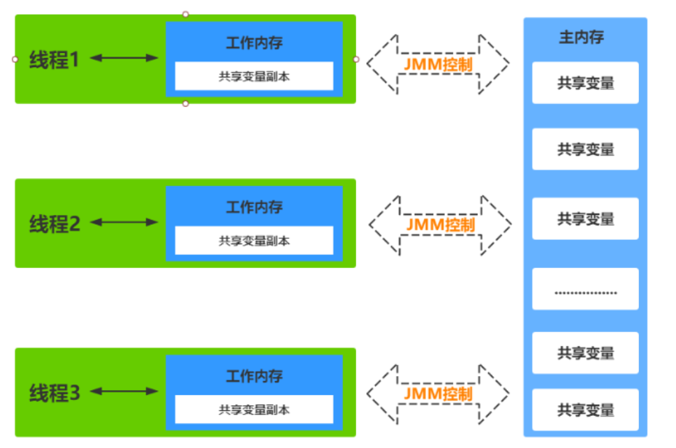

**JMM-同步八种操作介绍**

1. lock(锁定)：作用于主内存的变量，把一个变量标记为一条线程独占状态
2. unlock(解锁)：作用于主内存的变量，把一个处于锁定状态的变量释放出来，释放后的变量才可以被其他线程锁定
3. read(读取)：作用于主内存的变量，把一个变量值从主内存传输到线程的工作内存中，以便随后的load动作使用
4. load(载入)：作用于工作内存的变量，它把read操作从主内存中得到的变量值放入工作内存的变量副本中
5. use(使用)：作用于工作内存的变量，把工作内存中的一个变量值传递给执行引擎
6. assign(赋值)：作用于工作内存的变量，它把一个从执行引擎接收到的值赋给工作内存的变量
7. store(存储)：作用于工作内存的变量，把工作内存中的一个变量的值传送到主内存中，以便随后的write的操作
8. write(写入)：作用于工作内存的变量，它把store操作从工作内存中的一个变量的值传送到主内存的变量中

　　如果要把一个变量从主内存中复制到工作内存中，就需要按顺序地执行read和load操作，如果把变量从工作内存中同步到主内存中，就需要按顺序地执行store和write操作。但Java内存模型只要求上述操作必须按顺序执行，而没有保证必须是连续执行。


## 介绍下 Java 内存区域(运行时数据区)

JVM 内存区域主要分为：

线程私有区域【程序计数器、虚拟机栈、本地方法区】、线程共享区域【JAVA 堆、方法区】。

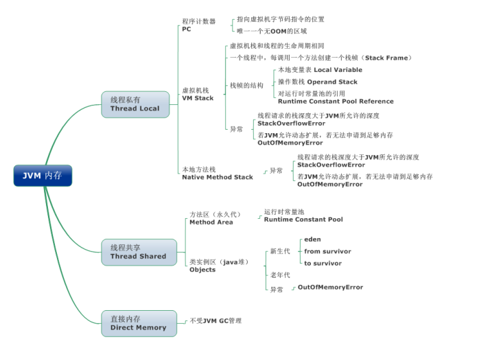

线程私有数据区域生命周期与线程相同, 依赖用户线程的启动/结束 而 创建/销毁。

线程共享区域随虚拟机的启动/关闭而创建/销毁。

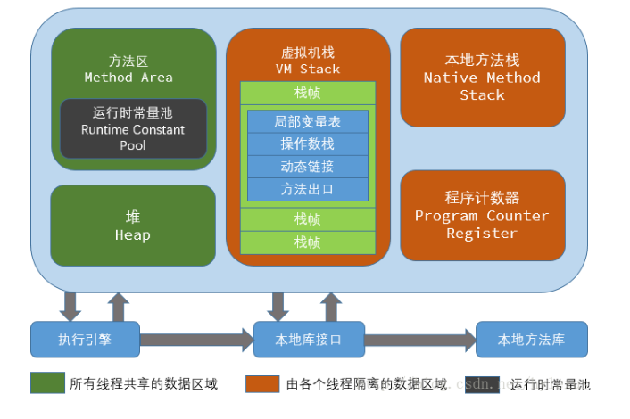

### 程序计数器(线程私有)

一块较小的内存空间, 是当前线程所执行的字节码的行号指示器，为了线程切换后能恢复到正确的执行位置，每条线程都要有一个独立的程序计数器，这类内存也称为“线程私有”的内存。

正在执行 java 方法的话，计数器记录的是虚拟机字节码指令的地址（当前指令的地址）。如果还是 Native 方法，则为空。

这个内存区域是唯一一个在虚拟机中没有规定任何 OutOfMemoryError 情况的区域。

### 虚拟机栈(线程私有)

是描述 java 方法执行的内存模型，每个方法在执行的同时都会创建一个栈帧（Stack Frame）用于存储局部变量表、操作数栈、动态链接、方法出口等信息。每一个方法从调用直至执行完成的过程，就对应着一个栈帧在虚拟机栈中入栈到出栈的过程。

栈帧（ Frame）是用来存储数据和部分过程结果的数据结构，同时也被用来处理动态链接 (Dynamic Linking)、 方法返回值和异常分派（ Dispatch Exception）。栈帧随着方法调用而创建，随着方法结束而销毁——无论方法是正常完成还是异常完成（抛出了在方法内未被捕获的异常）都算作方法结束。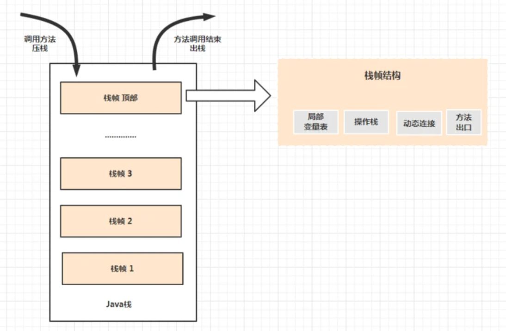

局部变量表主要存放了编译期可知的各种数据类型（boolean、byte、char、short、int、float、long、double）、对象引用（reference 类型，它不同于对象本身，可能是一个指向对象起始地址的引用指针，也可能是指向一个代表对象的句柄或其他与此对象相关的位置）。

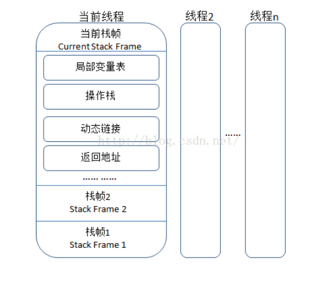

Java 虚拟机栈会出现两种错误： StackOverFlowError  和 OutOfMemoryError 。

- StackOverFlowError ： 若 Java 虚拟机栈的内存大小不允许动态扩展，那么当线程请求栈的深度超过当前 Java 虚拟机栈的最大深度的时候，就抛出 StackOverFlowError 错误。
- OutOfMemoryError ： 若 Java 虚拟机堆中没有空闲内存，并且垃圾回收器也无法提供更多内存的话。就会抛出 OutOfMemoryError 错误。

### 本地方法栈(线程私有)

和虚拟机栈所发挥的作用非常相似，区别是： 虚拟机栈为虚拟机执行 Java 方法 （也就是字节码）服务，而本地方法栈则为虚拟机使用到的 Native 方法服务。 在 HotSpot 虚拟机中和 Java 虚拟机栈合二为一。

### 堆（Heap-线程共享）

Java 虚拟机所管理的内存中最大的一块，Java 堆是所有线程共享的一块内存区域，在虚拟机启动时创建。此内存区域的唯一⽬的就是存放对象实例，几乎所有的对象实例以及数组都在这里分配内存。

在 JDK 7 版本及JDK 7 版本之前，堆内存被通常被分为下面三部分：

1. 新生代内存(Young Generation)
2. 老生代(Old Generation)
3. 永生代(Permanent Generation)

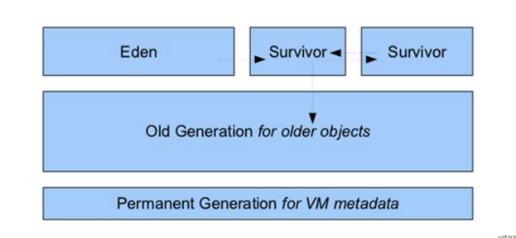

JDK 8 版本之后方法区（HotSpot 的永久代）被彻底移除了（JDK1.7 就已经开始了），取而代之是元空间，元空间使用的是直接内存。

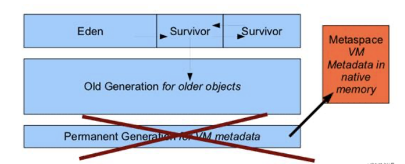

大部分情况，对象都会首先在 Eden 区域分配，在一次新生代垃圾回收后，如果对象还存活，则会进入 s0 或者 s1，并且对象的年龄还会加  1(Eden 区->Survivor 区后对象的初始年龄变为 1)，当它的年龄增加到一定程度（默认为 15 岁），就会被晋升到老年代中。对象晋升到老年代的年龄阈值，可以通过参数 -XX:MaxTenuringThreshold  来设置。

### 方法区

方法区与 Java 堆一样，是各个线程共享的内存区域，它用于存储已被虚拟机加载的类信息、常量、静态变量、即时编译器编译后的代码等数据。

> 方法区和永久代的关系很像 Java 中接口和类的关系，类实现了接口，而永久代就是 HotSpot 虚拟机对虚拟机规范中方法区的一种实现方式。 也就是说，永久代是 HotSpot 的概念，方法区是 Java 虚拟机规范中的定义，是一种规范，而永久代是一种实现，一个是标准一个是实现，其他的虚拟机实现并没有永久代这一说法。

**运行时常量池**

运行时常量池是方法区的一部分。Class 文件中除了有类的版本、字段、方法、接口等描述信息外，还有常量池表（用于存放编译期生成的各种字面量和符号引用），class文件中常量池保存的是字符串常量，类和接口名字，字段名，和其他一些在class中引用的常量。每个class都有一份。

运行时常量池保存的是从class文件常量池构建的静态常量引用和符号引用。每个class都有一份。

字符串常量池保存的是“字符”的实例，供运行时常量池引用。

> 1. JDK1.7之前运行时常量池包含字符串常量池存放在方法区, 此时hotspot虚拟机对方法区的实现为永久代
> 2. JDK1.7 字符串常量池被从方法区拿到了堆中, 这里没有提到运行时常量池,也就是说字符串常量池被单独拿到堆,运行时常量池剩下的东西还在方法区, 也就是hotspot中的永久代 。
> 3. JDK1.8 hotspot移除了永久代用元空间(Metaspace)取而代之, 这时候字符串常量池还在堆, 运行时常量池还在方法区, 只不过方法区的实现从永久代变成了元空间(Metaspace)。

**直接内存**

直接内存并不是 JVM 运行时数据区的一部分, 但也会被频繁的使用。在 JDK 1.4 引入的 NIO 提供了基于 Channel 与 Buffer 的 IO 方式, 它可以使用 Native 函数库直接分配堆外内存, 然后使用DirectByteBuffer 对象作为这块内存的引用进行操作, 这样就避免了在 Java堆和 Native 堆中来回复制数据, 因此在一些场景中可以显著提高性能。

## OOM与SOF的区别

两个都是由于内存不足导致的。

OOM 是OUT OF MEMORY的简称，是因为栈的大小不足，想要继续扩展的时候，但是由于JAVA虚拟机的可用内存不足导致的。

SOF是 Stack Over Flow的简称。是因为方法执行的时候，创建新的栈帧，但是虚拟机栈的内存不足以放下新的栈帧导致的。

## 说一下堆内存中对象的分配的基本策略

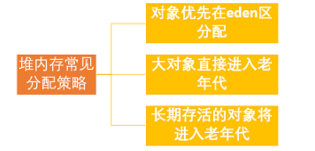

**对象优先在 eden 区分配**

大多数情况下，对象在新生代中 eden 区分配。当 eden 区没有足够空间进行分配时，虚拟机将发起一次 Minor GC.

**大对象直接进入老年代**

为了避免为大对象分配内存时由于分配担保机制带来的复制而降低效率。

大对象就是需要大量连续内存空间的对象（比如：字符串、数组）。

**长期存活的对象将进入老年代**

既然虚拟机采用了分代收集的思想来管理内存，那么内存回收时就必须能识别哪些对象应放在新生代，哪些对象应放在老年代中。为了做到这一点，虚拟机给每个对象一个对象年龄（Age）计数器。

如果对象在 Eden 出生并经过第一次 Minor GC 后仍然能够存活，并且能被 Survivor 容纳的话，将被移动到 Survivor 空间中，并将对象年龄设为 1.对象在 Survivor 中每熬过一次 MinorGC,年龄就增加 1 岁，当它的年龄增加到一定程度（默认为 15 岁），就会被晋升到老年代中。对象晋升到老年代的年龄阈值，可以通过参数 -XX:MaxTenuringThreshold  来设置。

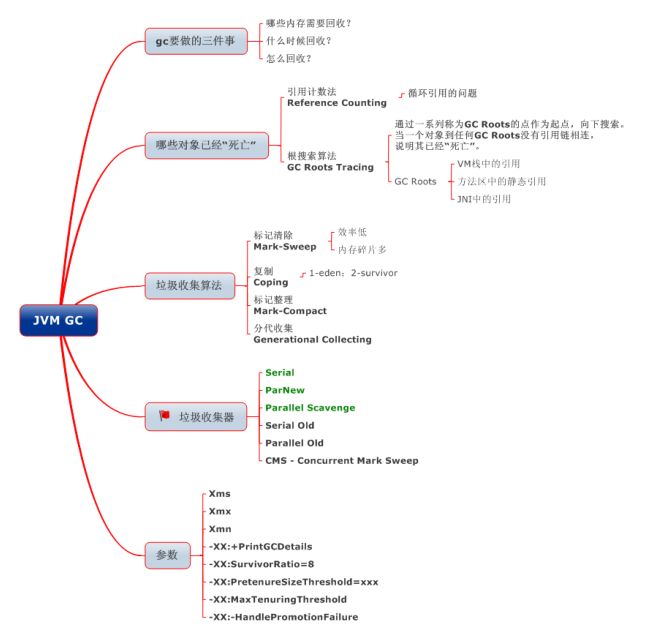

## 如何判断对象是否死亡?(两种方法)

**引用计数法**

给对象中添加一个引用计数器，每当有一个地方引用它，计数器就加1；当引用失效，计数器就减1；任何时候计数器为0的对象就是不可能再被使用的。

**可能出现的问题：循环引用**

**可达性分析算法**

这个算法的基本思想就是通过一系列的称为 “GC Roots” 的对象作为起点，从这些节点开始向下搜索，节点所⾛过的路径称为引用链，当一个对象到 GC Roots 没有任何引用链相连的话，则证明此对象是不可用的。

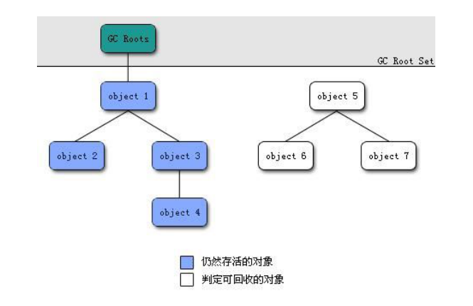

## GC ROOT对象都有哪些？

- 当前正在被调用的方法里局部变量引用的对象，即虚拟机栈的**局部变量**表中引用的对象；
- 方法区中**静态变量**引用的对象；
- 方法区中**常量**引用的对象；
- 本地方法栈中**Native方法引用的对象**；

## 介绍一下强引用,软引用,弱引用,虚引用？

**强引用(StrongReference)**

以前我们使用的大部分引用实际上都是强引用，这是使用最普遍的引用。如果一个对象具有强引用，那就类似于必不可少的生活用品，垃圾回收器绝不会回收它。当内存空 间不足，Java虚拟机宁愿抛出OutOfMemoryError错误，使程序异常终止，也**不会靠随意回收具有强引用的对象**来解决内存不足问题。

**软引用(SoftReference)**

如果一个对象只具有软引用，那就类似于可有可无的生活用品。如果内存空间足够，垃圾回收器就不会回收它，**如果内存空间不足了，就会回收这些对象的内存。**只要垃圾回收器没有回收它，该对象就可以被程序使用。软引用可用来实现内存敏感的高速缓存。软引用可以和一个引用队列（ReferenceQueue）联合使用，如果软引用所引用的对象被垃圾回收，JAVA虚拟机就会把这个软引用加入到与之关联的引用队列中。

**弱引用(WeakReference)**

如果一个对象只具有弱引用，那就类似于可有可无的生活用品。弱引用与软引用的区别在于：只具有弱引用的对象拥有更短暂的生命周期。在垃圾回收器线程扫描它所管辖的内存区域的过程中，一旦发现了只具有弱引用的对象，**不管当前内存空间足够与否，都会回收它的内存。**不过，由于垃圾回收器是一个优先级很低的线程， 因此不一定会很快发现那些只具有弱引用的对象。 弱引用可以和一个引用队列（ReferenceQueue）联合使用，如果弱引用所引用的对象被垃圾回收，Java虚拟机就会把这个弱引用加入到与之关联的引用队列中。

**虚引用（PhantomReference）**
"虚引用"顾名思义，就是形同虚设，与其他几种引用都不同，虚引用并不会决定对象的生命周期。如果一个对象仅持有虚引用，那么它就和没有任何引用一样，**在任何时候都可能被垃圾回收**。

虚引用需要 PhantomReference 类来实现，它不能单独使用，必须和引用队列联合使用。虚引用的主要作用是跟踪对象被垃圾回收的状态。

> 虚引用与软引用和弱引用的一个区别在于：` 虚引用必须和引用队列（ReferenceQueue）联合使用。`当垃 圾回收器准备回收一个对象时，如果发现它还有虚引用，就会在回收对象的内存之前，把这个虚引用加入到与之关联的引用队列中。`程序可以通过判断引用队列中是 否已经加入了虚引用，来了解被引用的对象是否将要被垃圾回收`。程序如果发现某个虚引用已经被加入到引用队列，那么就可以在所引用的对象的内存被回收之前采取必要的行动。

## JVM什么时候触发YGC和FGC

YGC ：对新生代堆进行gc。频率比较高，因为大部分对象的存活寿命较短，在新生代里被回收。性能耗费较小。

FGC ：全堆范围的gc。默认堆空间使用到达80%(可调整)的时候会触发fgc。以我们生产环境为例，一般比较少会触发fgc，有时10天或一周左右会有一次。

**什么时候执行YGC和FGC**

1. **YGC的时机：** edn空间不足
2. **FGC的时机：**

   1. old空间不足；
   2. perm空间不足；
   3. 显示调用System.gc() ，包括RMI等的定时触发;
   4. YGC时的悲观策略；
   5. dump live的内存信息时(jmap –dump:live)。

## 垃圾收集有哪些算法？

### 标记-清除算法

该算法分为“标记”和“清除”阶段：首先标记出所有不需要回收的对象，在标记完成后统一回收掉所有没有被标记的对象。它是最基础的收集算法，后续的算法都是对其不足进行改进得到。这种垃圾收集算法会带来两个明显的问题：

1. 效率问题
2. 空间问题（标记清除后会产生大量不连续的碎片）

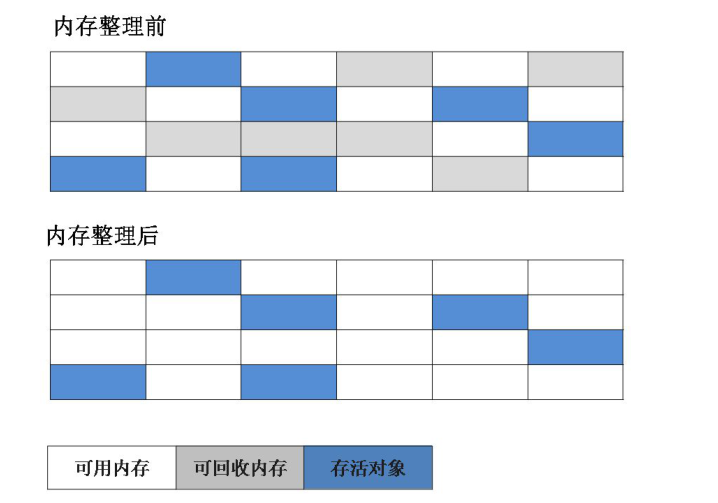

### 复制算法

为了解决效率问题，“复制”收集算法出现了。它可以将内存分为大小相同的两块，每次使用其中的一块。当这一块的内存使用完后，就将还存活的对象复制到另一块去，然后再把使用的空间一次清理掉。这样就使每次的内存回收都是对内存区间的一半进行回收。

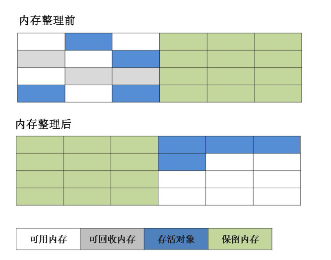

### 标记-整理算法

根据老年代的特点提出的一种标记算法，标记过程仍然与“标记-清除”算法一样，但后续步骤不是直接对可回收对象回收，而是让所有存活的对象向一端移动，然后直接清理掉端边界以外的内存。

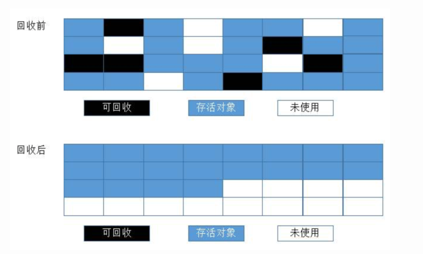

### 分代收集算法

当前虚拟机的垃圾收集都采用分代收集算法，这种算法没有什么新的思想，只是根据对象存活周期的不同将内存分为几块。一般将 java 堆分为新生代和老年代，这样我们就可以根据各个年代的特点选择合适的垃圾收集算法。

> 比如在新生代中，每次收集都会有大量对象死去，所以可以选择复制算法，只需要付出少量对象的复制成本就可以完成每次垃圾收集。而老年代的对象存活几率是比较高的，而且没有额外的空间对它进行分配担保，所以我们必须选择“标记-清除”或“标记-整理”算法进行垃圾收集。

## 常见的垃圾回收器有那些?

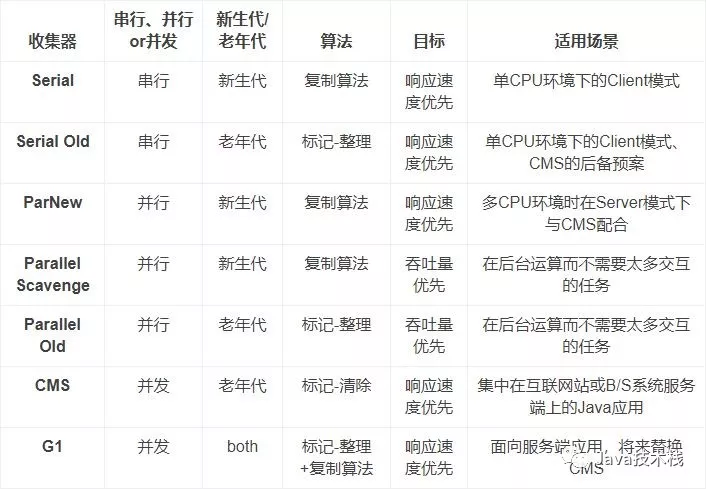

### Serial 收集器

新生代采用复制算法，老年代采用标记-整理算法。

它是一个单线程收集器，只会使用一个CPU或一条收集线程去完成垃圾收集工作，更重要的是它在进行垃圾收集时，必须暂停其他所有的工作线程，直至Serial收集器收集结束为止（“Stop The World”）。

下图展示了Serial 收集器（老年代采用Serial Old收集器）的运行过程:

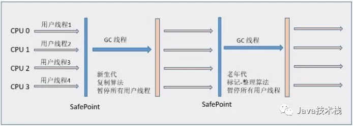

### ParNew 收集器

**ParNew收集器就是Serial收集器的多线程版本**，它也是一个新生代收集器。除了使用多线程进行垃圾收集外，其余行为包括Serial收集器可用的所有控制参数、收集算法（复制算法）、Stop The World、对象分配规则、回收策略等与Serial收集器完全相同，两者共用了相当多的代码。

ParNew收集器的工作过程如下图（老年代采用Serial Old收集器):

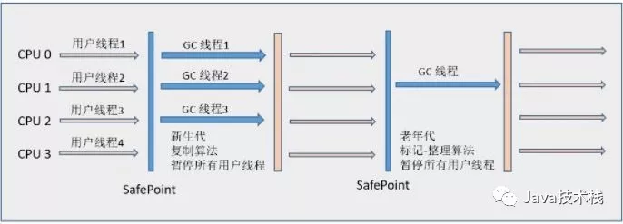

### Parallel Scavenge 收集器

Parallel Scavenge 收集器也是使用**复制**算法的多线程收集器。

Parallel Scavenge 收集器关注点是吞吐量（高效率的利用 CPU）。CMS 等垃圾收集器的关注点更多的是用户线程的停顿时间（提高用户体验）。所谓吞吐量就是 CPU 中用于运行用户代码的时间与 CPU 总消耗时间的比值。

使用 java -XX:+PrintCommandLineFlags -version 命令查看：

```java
-XX:InitialHeapSize=262921408 -XX:MaxHeapSize=4206742528 -
XX:+PrintCommandLineFlags -XX:+UseCompressedClassPointers -
XX:+UseCompressedOops -XX:+UseParallelGC
java version "1.8.0_211"
Java(TM) SE Runtime Environment (build 1.8.0_211-b12)
Java HotSpot(TM) 64-Bit Server VM (build 25.211-b12, mixed mode)
```

JDK1.8 默认使用的是 Parallel Scavenge + Parallel Old

Parallel Old收集器的工作流程与Parallel Scavenge相同，这里给出Parallel Scavenge/Parallel Old收集器配合使用的流程图：

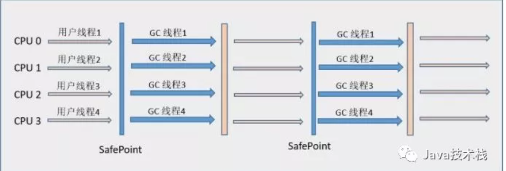

### Serial Old收集器

Serial Old 是 Serial收集器的老年代版本，它同样是一个**单线程**收集器，使用“**标记-整理**”（Mark-Compact）算法。

### Parallel Old 收集器

Parallel Scavenge 收集器的老年代版本。使用**多线程和“标记-整理”算法**。在注重吞吐量以及 CPU 资源的场合，都可以优先考虑 Parallel Scavenge 收集器和 Parallel Old 收集器。

### CMS 收集器

CMS（Concurrent Mark Sweep）收集器是一种以获取最短回收停顿时间为⽬标的收集器。它非常符合在注重用户体验的应用上使用。

从名字中的Mark Sweep这两个词可以看出，CMS 收集器是一种 “标记-清除”算法实现的，它的运作过程相比于前面几种垃圾收集器来说更加复杂一些。整个过程分为四个步骤：

- **初始标记（CMS initial mark）：**仅仅只是标记一下GC Roots能直接关联到的对象，速度很快，需要“Stop The World”。
- **并发标记（CMS concurrent mark）：**进行GC Roots Tracing的过程，在整个过程中耗时最长。
- **重新标记（CMS remark）：**为了修正并发标记期间因用户程序继续运作而导致标记产生变动的那一部分对象的标记记录，这个阶段的停顿时间一般会比初始标记阶段稍长一些，但远比并发标记的时间短。此阶段也需要 “Stop The World”。
- **并发清除（CMS concurrent sweep）**

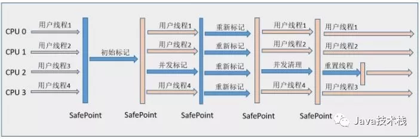

从它的名字就可以看出它是一款优秀的垃圾收集器，主要优点：并发收集、低停顿。

但是它有下面三个明显的缺点：

- 对 CPU 资源敏感；
- 无法处理浮动垃圾；（CMS并发清理阶段用户线程运行产生的新的垃圾）
- 它使用的回收算法-“标记-清除”算法会导致收集结束时会有大量空间碎片产生。

### G1 收集器

G1 (Garbage-First) 是一款面向服务器的垃圾收集器,主要针对配备多颗处理器及大容量内存的机器. 以极高概率满足 GC 停顿时间要求的同时,还具备高吞吐量性能特征。

被视为 JDK1.7 中 HotSpot 虚拟机的一个重要进化特征。它具备一下特点：

- 并行与并发：`G1 能充分利用 CPU、多核环境下的硬件优势，使用多个 CPU（CPU 或者 CPU 核心）来缩短 Stop-The-World 停顿时间`。部分其他收集器原本需要停顿 Java 线程执行的 GC 动作，G1 收集器仍然可以通过并发的方式让 java 程序继续执行。
- 分代收集：`虽然 G1 可以不需要其他收集器配合就能独立管理整个 GC 堆，但是还是保留了分代的概念`。
- 空间整合：与 CMS 的“标记--清理”算法不同，G1 从整体来看是基于“标记整理”算法实现的收集器；从局部上来看是基于“复制”算法实现的。`G1把Java堆分为多个Region，就是“化整为零”。`
- **可预测的停顿：**这是 G1 相对于 CMS 的另一个大优势，降低停顿时间是 G1 和 CMS 共同的关注点，但 G1 除了追求低停顿外，还能建立可预测的停顿时间模型，`能让使用者明确指定在一个长度为 M 毫秒的时间片段内`。

G1收集器的运作大致可划分为以下几个步骤：

- **初始标记（Initial Marking）** 仅仅只是标记一下GC Roots 能直接关联到的对象，并且修改TAMS（Nest Top Mark Start）的值，让下一阶段用户程序并发运行时，能在正确可以的Region中创建对象，此阶段需要停顿线程，但耗时很短。
- **并发标记（Concurrent Marking）** 从GC Root 开始对堆中对象进行可达性分析，找到存活对象，此阶段耗时较长，但可与用户程序并发执行。
- **最终标记（Final Marking）** 为了修正在并发标记期间因用户程序继续运作而导致标记产生变动的那一部分标记记录，虚拟机将这段时间对象变化记录在线程的Remembered Set Logs里面，最终标记阶段需要把Remembered Set Logs的数据合并到Remembered Set中，这阶段需要停顿线程，但是可并行执行。
- **筛选回收（Live Data Counting and Evacuation）** 首先对各个Region中的回收价值和成本进行排序，根据用户所期望的GC 停顿是时间来制定回收计划。此阶段其实也可以做到与用户程序一起并发执行，但是因为只回收一部分Region，时间是用户可控制的，而且停顿用户线程将大幅度提高收集效率。

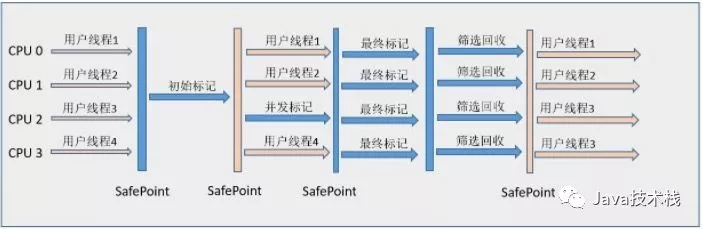

### ZGC 收集器

GC是java主要优势之一。 然而, 当GC停顿太长, 就会开始影响应用的响应时间。 消除或者减少GC停顿时长, java将对更广泛的应用场景是一个更有吸引力的平台。 此外, 现代系统中可用内存不断增长,用户和程序员希望JVM能够以高效的方式充分利用这些内存, 并且无需长时间的GC暂停时间。

ZGC, A Scalable Low-Latency Garbage Collector(Experimental)ZGC, 这应该是JDK11最为瞩目的特性, 没有之一。 但是后面带了Experimental,说明这还不建议用到生产环境。

ZGC 是一个并发, 基于region, 压缩型的垃圾收集器, 只有root扫描阶段会STW(stop the world), 因此GC停顿时间不会随着堆的增长和存活对象的增长而变长。

ZGC 与  ParNew 和 G1 类似，ZGC 也采用标记-复制算法，不过 ZGC 对该算法做了重大改进。在 ZGC 中出现 Stop The World 的情况会更少！

**优势：**

- GC暂停时间不会超过10ms；
- 既能处理几百兆的小堆, 也能处理几个T的大堆(OMG)；
- 和G1相比, 应用吞吐能力不会下降超过15%；
- 为未来的GC功能和利用colord指针以及Load barriers优化奠定基础；
- 初始只支持64位系统

ZGC的设计目标是：支持TB级内存容量， 暂停时间低（<10ms） ， 对整个程序吞吐量的影响小于15%。 将来还可以扩展实现机制， 以支持不少令人兴奋的功能， 例如多层堆（即热对象置于DRAM和冷对象置于NVMe闪存） ，或压缩堆。

## 查看 Java8 的默认 GC

**1. cmd命令行查看Java8的GC：**

```java
java -XX:+PrintCommandLineFlags -version
```

结果如下：

```bash
-XX:InitialHeapSize=132397312 // JVM默认初始化堆大小
-XX:MaxHeapSize=2118356992 //JVM堆的默认最大值
-XX:+PrintCommandLineFlags 
-XX:+UseCompressedClassPointers 
-XX:+UseCompressedOops 
-XX:-UseLargePagesIndividualAllocation 
-XX:+UseParallelGC //Java8使用的GC类型
java version "1.8.0_20" //使用的java版本
Java(TM) SE Runtime Environment (build 1.8.0_20-b26)
Java HotSpot(TM) 64-Bit Server VM (build 25.20-b23, mixed mode)
```

结果分析：由结果可以看出Java8的GC情况是：-XX:+UseParallelGC，即Parallel Scavenge（新生代） + Parallel Old（老生代），实际上几个主流Java版本的GC情况如下：

- jdk1.7 默认垃圾收集器Parallel Scavenge（新生代【标记-复制算法】）+Parallel Old（老年代【标记整理算法】）
- jdk1.8 默认垃圾收集器Parallel Scavenge（新生代）+Parallel Old（老年代）
- jdk1.9 默认垃圾收集器G1【从局部(两个Region之间)来看是基于"标记—复制"算法实现，从整体来看是基于"标记-整理"算法实现】

## JVM 类加载机制

JVM 类加载机制分为五个部分：加载，验证，准备，解析，初始化，下面我们就分别来看一下这五个过程。

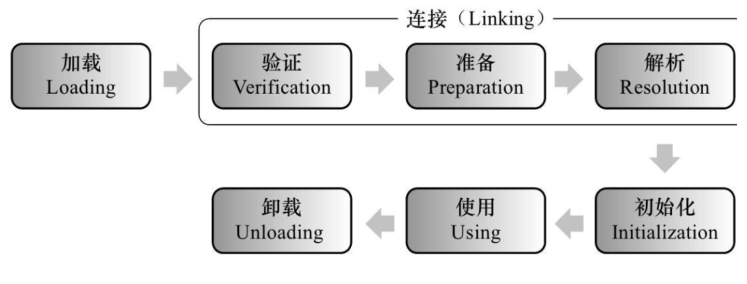

**加载：**

加载是类加载过程中的一个阶段， 这个阶段会在**内存中生成一个代表这个类的 java.lang.Class 对象， 作为方法区这个类的各种数据的入口。**注意这里不一定非得要从一个 Class 文件获取，这里既可以从 ZIP 包中读取（比如从 jar 包和 war 包中读取），也可以在运行时计算生成（动态代理），也可以由其它文件生成（比如将 JSP 文件转换成对应的 Class 类）。

**验证：**

这一阶段的主要目的是**为了确保 Class 文件的字节流中包含的信息是否符合当前虚拟机的要求，并且不会危害虚拟机自身的安全。**

**准备：**

准备阶段是正式**为类变量分配内存并设置类变量的初始值**阶段，即在方法区中分配这些变量所使用的内存空间。注意这里所说的初始值概念，比如一个类变量定义为：实际上变量 v 在准备阶段过后的初始值为 0 而不是 8080， 将 v 赋值为 8080 的 put static 指令是程序被编译后， 存放于类构造器方法之中。
但是注意如果声明为：

```java
public static final int v = 8080;
```

在编译阶段会为 v 生成 ConstantValue 属性，在准备阶段虚拟机会根据 ConstantValue 属性将 v赋值为 8080。

**解析：**

**解析阶段是指虚拟机将常量池中的符号引用替换为直接引用的过程。**

**符号引用：**

符号引用就是 class 文件中的：

CONSTANT_Class_info

CONSTANT_Field_info

CONSTANT_Method_info  等类型的常量。

符号引用与虚拟机实现的布局无关， 引用的目标并不一定要已经加载到内存中。 各种虚拟机实现的内存布局可以各不相同，但是它们能接受的符号引用必须是一致的，因为符号引用的字面量形式明确定义在 Java 虚拟机规范的 Class 文件格式中。

**直接引用：**

直接引用可以是指向目标的指针，相对偏移量或是一个能间接定位到目标的句柄。如果有了直接引用，那引用的目标必定已经在内存中存在。

**初始化：**

初始化是类加载过程的最后一步，到了此阶段，才真正开始执行类中定义的Java程序代码。在准备阶段，类变量已经被赋过一次系统要求的初始值，而在初始化阶段，则是根据程序员通过程序指定的主观计划去初始化类变量和其他资源，或者可以从另一个角度来表达：初始化阶段是执行类构造器`<clinit>()`方法的过程。

**类构造器：**

初始化阶段是执行类构造器方法的过程。 方法是由编译器自动收集类中的类变量的赋值操作和静态语句块中的语句合并而成的。虚拟机会保证子方法执行之前，父类的方法已经执行完毕， 如果一个类中没有对静态变量赋值也没有静态语句块，那么编译器可以不为这个类生成`<clinit>()`方法。

**注意以下几种情况不会执行类初始化：**

1. 通过子类引用父类的静态字段，只会触发父类的初始化，而不会触发子类的初始化。
2. 定义对象数组，不会触发该类的初始化。
3. 常量在编译期间会存入调用类的常量池中，本质上并没有直接引用定义常量的类，不会触发定义常量所在的类。
4. 通过类名获取 Class 对象，不会触发类的初始化。
5. 通过 Class.forName 加载指定类时，如果指定参数 initialize 为 false 时，也不会触发类初始化，其实这个参数是告诉虚拟机，是否要对类进行初始化。
6. 通过 ClassLoader 默认的 loadClass 方法，也不会触发初始化动作。

## 类加载器

虚拟机设计团队把加载动作放到 JVM 外部实现，以便让应用程序决定如何获取所需的类， JVM 提供了 3 种类加载器：

**启动类加载器(Bootstrap ClassLoader)**

负责加载 JAVA_HOME\lib 目录中的， 或通过-Xbootclasspath 参数指定路径中的， 且被虚拟机认可（按文件名识别， 如 rt.jar） 的类。

**扩展类加载器(Extension ClassLoader)**

负责加载 JAVA_HOME\lib\ext 目录中的，或通过 java.ext.dirs 系统变量指定路径中的类库。

**应用程序类加载器(Application ClassLoader)**

负责加载用户路径（classpath）上的类库。JVM 通过双亲委派模型进行类的加载， 当然我们也可以通过继承 java.lang.ClassLoader实现自定义的类加载器。


## 双亲委派

当一个类收到了类加载请求，他首先不会尝试自己去加载这个类，而是把这个请求委派给父类去完成，每一个层次类加载器都是如此，因此所有的加载请求都应该传送到启动类加载其中，只有当父类加载器反馈自己无法完成这个请求的时候（在它的加载路径下没有找到所需加载的Class）， 子类加载器才会尝试自己去加载。

采用双亲委派的一个好处是比如加载位于 rt.jar 包中的类 java.lang.Object，不管是哪个加载器加载这个类，最终都是委托给顶层的启动类加载器进行加载，这样就保证了使用不同的类加载器最终得到的都是同样的一个 Object 对象。

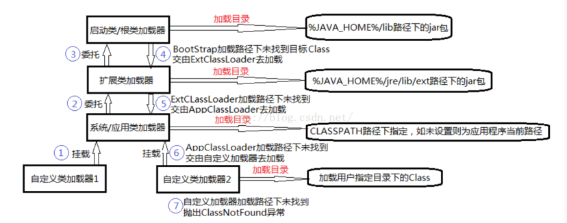

## 你知道哪些破坏双亲委派的情况？

### Spring 中的类加载机制 - ClassLoader

OverridingClassLoader 是 Spring 自定义的类加载器，默认会先自己加载(excludedPackages 或 excludedClasses 例外)，只有加载不到才会委托给双亲加载，这就破坏了 JDK 的双亲委派模式。

### JDBC为什么要破坏双亲委派模型

在JDBC 4.0之后实际上我们不需要再调用Class.forName来加载驱动程序了，我们只需要把驱动的jar包放到工程的类加载路径里，那么驱动就会被自动加载。

这个自动加载采用的技术叫做SPI，数据库驱动厂商也都做了更新。可以看一下jar包里面的META-INF/services目录，里面有一个java.sql.Driver的文件，文件里面包含了驱动的全路径名。

使用上，我们只需要通过下面一句就可以创建数据库的连接：

```java
Connection con = DriverManager.getConnection(url , username , password ) ;   
```

JDBC的Driver接口定义在JDK中，其实现由各个数据库的服务商来提供，比如MySQL驱动包。DriverManager 类中要加载各个实现了Driver接口的类，然后进行管理，但是 DriverManager 位于 $JAVA_HOME中jre/lib/rt.jar 包，由BootStrap类加载器加载，而其 Driver 接口的实现类是位于服务商提供的 Jar 包，**根据类加载机制，当被装载的类引用了另外一个类的时候，虚拟机就会使用装载第一个类的类装载器装载被引用的类。**也就是说BootStrap类加载器还要去加载 jar 包中的 Driver 接口的实现类。我们知道，BootStrap 类加载器默认只负责加载 $JAVA_HOME 中 jre/lib/rt.jar 里所有的 class ，所以需要由子类加载器去加载 Driver 实现，这就破坏了双亲委派模型。

### Tomcat 如何破坏双亲委派模型?

**每个Tomcat的webappClassLoader加载自己的目录下的class文件，不会传递给父类加载器。**

事实上，tomcat之所以造了一堆自己的classloader，大致是出于下面三类目的：

- 对于各个 `webapp`中的 `class`和 `lib`，需要相互隔离，不能出现一个应用中加载的类库会影响另一个应用的情况，而对于许多应用，需要有共享的lib以便不浪费资源。
- 与 `jvm`一样的安全性问题。使用单独的 `classloader`去装载 `tomcat`自身的类库，以免其他恶意或无意的破坏；
- 热部署。 `tomcat`修改文件不用重启就自动重新装载类库。

## Java对象创建过程

1. **类加载检查**

   虚拟机遇到一条 new 指令时，首先将去检查这个指令的参数是否能在常量池中定位到这个类的符号引用，并且检查这个符号引用代表的类是否已被加载过、解析和初始化过。如果没有，那必须先执行相应的类加载过程。
2. **分配内存**

   在类加载检查通过后，接下来虚拟机将为新生对象分配内存。

   一种办法“指针碰撞”、一种办法“空闲列表”，最常用的办法“本地线程分配缓冲(TLAB)”
3. **初始化零值**

   内存分配完成后，虚拟机需要将分配到的内存空间都初始化为零值（不包括对象头）
4. **设置对象头**

   初始化零值完成之后，虚拟机要对对象进行必要的设置，例如这个对象是哪个类的实例、如何才能找到类的元数据信息、对象的哈希码、对象的 GC 分代年龄等信息。 这些信息存放在对象头中。 另外，根据虚拟机当前运行状态的不同，如是否启用偏向锁等，对象头会有不同的设置方式。
5. **执行 init 方法**

   在上面工作都完成之后，从虚拟机的视角来看，一个新的对象已经产生了，但从 Java 程序的视角来看，对象创建才刚开始， <init>  方法还没有执行，所有的字段都还为零。所以一般来说，执行 new 指令之后会接着执行 <init>  方法，把对象按照程序员的意愿进行初始化，这样一个真正可用的对象才算完全产生出来。

- **指针碰撞**
  - 适用场合：堆内存规整（即没有内存碎片）的情况下
  - 原理：用过的内存全部整合到一边，没有用过的内存放在另一边，中间有一个分界值指针，只需要向着没用过的内存方向将该指针移动对象内存大小位置即可
  - GC收集器：Serial、ParNew
- **空闲列表**
  - 适用场合：堆内存不规整的情况下
  - 原理：虚拟机会维护一个列表，该列表中会记录哪些内存块是可用的，在分配的时候，找一块儿足够大的内存块儿来划分给对象实例（这一块儿可以类比memcached的slab模型），最后更新列表记录。
  - GC收集器：CMS
- 注意
  - 选择以上两种方式中的哪一种，取决于Java堆内存是否规整
  - Java堆内存是否规整，取决于GC收集器的算法是"标记-清除"，还是"标记-整理"（也称作"标记-压缩"），值得注意的是，复制算法内存也是规整的。

**内存分配并发问题**

堆内存是各个线程的共享区域，所以在操作堆内存的时候，需要处理并发问题。处理的方式有两种：

- CAS+失败重试

  - CAS 是乐观锁的一种实现方式。所谓乐观锁就是，每次不加锁而是假设没有冲突而去完成某项操作，如果因为冲突失败就重试，直到成功为止。虚拟机采用 CAS 配上失败重试的方式保证更新操作的原子性。具体的做法与AtomicInteger的getAndSet(int newValue)方法的实现方式类似。
- TLAB（Thread Local Allocation Buffer）
- - 原理：为每一个线程预先在Eden区分配一块儿内存，JVM在给线程中的对象分配内存时，首先在TLAB分配，当对象大于TLAB中的剩余内存或TLAB的内存已用尽时，再采用上述的CAS进行内存分配
- - -XX:+/-UseTLAB：是否使用TLAB
  - -XX:TLABWasteTargetPercent设置TLAB可占用的Eden区的比率，默认为1%
  - JVM会根据以下三个条件来给每个线程分配合适大小的TLAB
    - -XX:TLABWasteTargetPercent
    - 线程数量
    - 线程是否频繁分配对象
- - -XX:PrintTLAB：查看TLAB的使用情况

## Java的对象结构

**Java对象由三个部分组成：对象头、实例数据、对齐填充。**

- 对象头：由两部分组成，第一部分存储对象自身的运行时数据：哈希码、GC分代年龄、锁标识状态、线程持有的锁、偏向线程ID（一般占32/64 bit）。第二部分是指针类型，指向对象的类元数据类型（即对象代表哪个类）。如果是数组对象，则对象头中还有一部分用来记录数组长度。
- 实例数据：用来存储对象真正的有效信息（包括父类继承下来的和自己定义的）
- 对齐填充：JVM要求对象起始地址必须是8字节的整数倍（8字节对齐  )

## 对象头

对象头包括三部分：

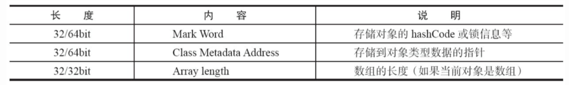

- **markword**
  第一部分`markword`，用于存储对象自身的运行时数据，如哈希码（HashCode）、GC分代年龄、锁状态标志、线程持有的锁、偏向线程ID、偏向时间戳等，这部分数据的长度在32位和64位的虚拟机（未开启压缩指针）中分别为32bit和64bit，官方称它为“MarkWord”。

  **markword：**

  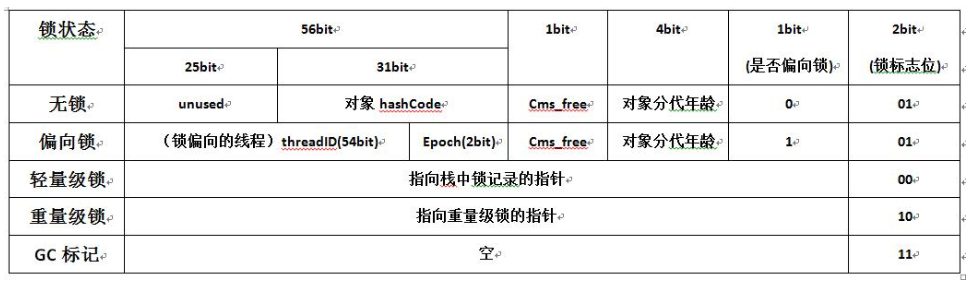
- **klass**
  **对象头的另外一部分是klass类型指针，即对象指向它的类元数据的指针，虚拟机通过这个指针来确定这个对象是哪个类的实例**
- **数组长度（只有数组对象有）**，如果对象是一个数组，那在对象头中还必须有一块数据用于记录数组长度。

## 对象如何晋升到老年代？

对象优先在新生代的 eden 区分配内存，但是也并不绝对，下面几种情况对象会晋升到老年代。

- 大对象直接进入老年代。比如很长的字符串，或者很大的数组等。
- **长期存活的对象进入老年代。**在堆中分配内存的对象，其内存布局的对象头中（Header）包含了 GC 分代年龄标记信息。如果对象在 eden 区出生，那么它的 GC 分代年龄会初始值为 1，每熬过一次 Minor GC 而不被回收，这个值就会增加 1 岁。**当它的年龄到达一定的数值时（jdk1.7 默认是 15 岁），就会晋升到老年代中。**
- **动态对象年龄判定。**当 Survivor 空间中相同年龄所有对象的大小总和大于 Survivor 空间的一半，年龄大于或等于该年龄的对象就可以直接进入老年代，而不需要达到默认的分代年龄。

## 什么时候会触发Young ？FullGC？

**触发MinorGC(Young GC)**

虚拟机在进行minorGC之前会判断老年代最大的可用连续空间是否大于新生代的所有对象总空间

1、如果大于的话，直接执行minorGC

2、如果小于，判断是否开启HandlerPromotionFailure，没有开启直接FullGC

3、如果开启了HanlerPromotionFailure, JVM会判断老年代的最大连续内存空间是否大于历次晋升的大小，如果小于直接执行FullGC

4、如果大于的话，执行minorGC

**触发FullGC**

- **老年代空间不足**

```
如果创建一个大对象，Eden区域当中放不下这个大对象，会直接保存在老年代当中，如果老年代空间也不足，就会触发Full GC。为了避免这种情况，最好就是不要创建太大的对象。
```

- **持久代空间不足**

```
如果有持久代空间的话，系统当中需要加载的类，调用的方法很多，同时持久代当中没有足够的空间，就出触发一次Full GC。
```

- **YGC出现promotion failure**

```
promotion failure发生在Young GC, 如果Survivor区当中存活对象的年龄达到了设定值，会就将Survivor区当中的对象拷贝到老年代，如果老年代的空间不足，就会发生promotion failure， 接下去就会发生Full GC.
```

- **统计YGC发生时晋升到老年代的平均总大小大于老年代的空闲空间**

```
在发生YGC是会判断，是否安全，这里的安全指的是，当前老年代空间可以容纳YGC晋升的对象的平均大小，如果不安全，就不会执行YGC,转而执行Full GC。
```

- **显示调用System.gc**

除了以上几种状况外，对于使用RMI来进行RPC或管理的Sun JDK应用而言，默认情况下会一小时执行一次Full GC。可通过在启动时通过- java-Dsun.rmi.dgc.client.gcInterval=3600000来设置Full GC执行的间隔时间或通过-XX:+ DisableExplicitGC来禁止RMI调用System.gc。

## 排查内存故障的方法

**对于还在正常运行的系统：**

1. top命令：Linux命令。可以查看实时的内存使用情况。
2. 可以使用jmap来查看JVM中各个区域的使用情况
3. 可以通过jstack来查看线程的运行情况，比如哪些线程阻塞、是否出现了死锁
4. 可以通过jstat命令来查看垃圾回收的情况，特别是fullgc，如果发现fullgc比较频繁，那么就得进行调优了
5. 通过各个命令的结果，或者jvisualvm等工具来进行分析
6. 首先，初步猜测频繁发送fullgc的原因，如果频繁发生fullgc但是又一直没有出现内存溢出，那么表示fullgc实际上是回收了很多对象了，所以这些对象最好能在younggc过程中就直接回收掉，避免这些对象进入到老年代，对于这种情况，就要考虑这些存活时间不长的对象是不是比较大，导致年轻代放不下，直接进入到了老年代，尝试加大年轻代的大小，如果改完之后，fullgc减少，则证明修改有效
7. 同时，还可以找到占用CPU最多的线程，定位到具体的方法，优化这个方法的执行，看是否能避免某些对象的创建，从而节省内存

**对于已经发生了OOM的系统：**

1. 一般生产系统中都会设置当系统发生了OOM时，生成当时的dump文件（-XX:+HeapDumpOnOutOfMemoryError -XX:HeapDumpPath=/usr/local/base）
2. 我们可以利用jsisualvm等工具来分析dump文件
3. 根据dump文件找到异常的实例对象，和异常的线程（占用CPU高），定位到具体的代码
4. 然后再进行详细的分析和调试

总之，调优不是一蹴而就的，需要分析、推理、实践、总结、再分析，最终定位到具体的问题

## jdk命令行工具

- jps（jvm process status）：查看所有java进程启动类、传入参数和java虚拟机参数等信息。
- jps：显示虚拟机执行主类名称以及这些进程的本地虚拟机唯一 ID（Local Virtual Machine Identifier,LVMID）。
- jps -q ：只输出进程的本地虚拟机唯一 ID。
- jps -l:输出主类的全名，如果进程执行的是 Jar 包，输出 Jar 路径。
- jps -v：输出虚拟机进程启动时 JVM 参数。
- jps -m：输出传递给 Java 进程 main() 函数的参数。
- jstat （JVM Statistics Monitoring Tool）: 用于监视虚拟机各种运行状态信息的命令行工具。它可以显示虚拟机进程中的类信息、内存、垃圾收集、JIT 编译等运行数据，在没有 GUI，只提供了纯文本控制台环境的服务器上，它将是运行期间定位虚拟机性能问题的首选工具。
- jstat 命令使用格式：
  jstat - [-t] [-h] [ []]
  比如 jstat -gc -h3 31736 1000 10表示分析进程 id 为 31736 的 gc 情况，每隔 1000ms 打印一次记录，打印 10 次停止，每 3 行后打印指标头部。
- jstat -class vmid ：显示 ClassLoader 的相关信息；
- jstat -compiler vmid ：显示 JIT 编译的相关信息；
- jstat -gc vmid ：显示与 GC 相关的堆信息；
- jstat -gccapacity vmid ：显示各个代的容量及使用情况；
- jstat -gcnew vmid ：显示新生代信息；
- jstat -gcnewcapcacity vmid ：显示新生代大小与使用情况；
- jstat -gcold vmid ：显示老年代和永久代的行为统计，从jdk1.8开始,该选项仅表示老年代，因为永久代被移除了；
- jstat -gcoldcapacity vmid ：显示老年代的大小；
- jstat -gcpermcapacity vmid ：显示永久代大小，从jdk1.8开始,该选项不存在了，因为永久代被移除了；
- jstat -gcutil vmid ：显示垃圾收集信息；
- 另外，加上 -t参数可以在输出信息上加一个 Timestamp 列，显示程序的运行时间。
- jinfo (Configuration Info for Java) :输出当前 jvm 进程的全部参数和系统属性 (第一部分是系统的属性，第二部分是 JVM 的参数)。
- jinfo -flag name vmid :输出对应名称的参数的具体值。
- 使用 jinfo 可以在不重启虚拟机的情况下，可以动态的修改 jvm 的参数。jinfo -flag [+|-]name vmid 开启或者关闭对应名称的参数。
- jmap (Memory Map for Java) :生成堆转储快照;
- jhat (JVM Heap Dump Browser ) : 用于分析 heapdump 文件，它会建立一个 HTTP/HTML 服务器，让用户可以在浏览器上查看分析结果;
- jstack (Stack Trace for Java):生成虚拟机当前时刻的线程快照，线程快照就是当前虚拟机内每一条线程正在执行的方法堆栈的集合。
- 生成线程快照的目的主要是定位线程长时间出现停顿的原因，如线程间死锁、死循环、请求外部资源导致的长时间等待等都是导致线程长时间停顿的原因。线程出现停顿的时候通过jstack来查看各个线程的调用堆栈，就可以知道没有响应的线程到底在后台做些什么事情，或者在等待些什么资源。

**可视化分析工具**

- jconsole 检测死锁 显示内存信息，细化到Eden区，survivor区的详细情况。 可强制执行gc。
- Visual VM，能够监控线程，内存情况，查看方法的CPU时间和内存中的对象，已被GC的对象，反向查看分配的堆栈(如100个String对象分别由哪几个对象分配出来的).
