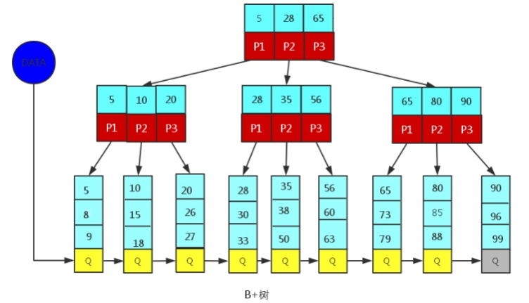
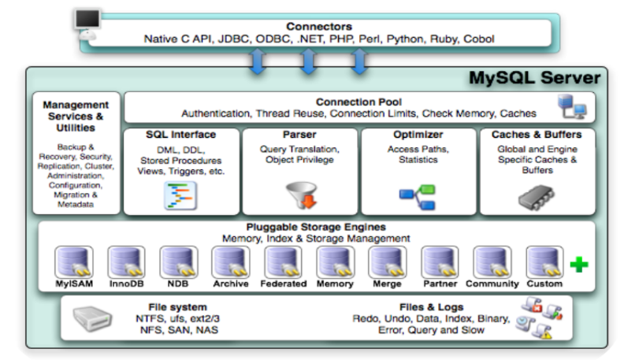
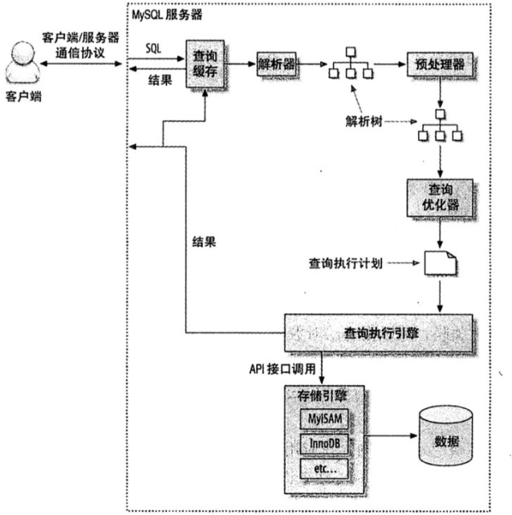

# MySQL

## Drop、Delete、TRUNCATE的区别

**drop**

- **drop直接删掉表；**
- **drop语句将表所占用的空间全释放掉。**
- **drop语句将删除表的结构被依赖的约束（constrain)，触发器（trigger)索引（index)**；依赖于该表的存储过程/函数将被保留，但其状态会变为：invalid。

**delete**

- delete删除表中数据，可以加where字句
- delete操作不会减少表或索引所占用的空间。
- 范围：可以是table和view。
- **只删除数据，而不删除表的结构（定义）**
- delete语句为DML（Data Manipulation Language),这个操作会被放到 rollback segment中,事务提交后才生效。如果有相应的 tigger,执行的时候将被触发。
- delete语句每次删除一行，并在事务日志中为所删除的每行记录一项。

**truncate**

- **truncate删除表中数据，再插入时自增长id又从1开始, 只删除数据，而不删除表的结构（定义）**
- truncate、drop是DDL（Data Define Language)，操作立即生效，原数据不放到 rollback segment中，不能回滚
- Truncate table 表名  速度快,而且效率高，因为: truncate table 在功能上与不带 WHERE 子句的 DELETE 语句相同：二者均删除表中的全部行。但 TRUNCATE TABLE 比 DELETE 速度快，且使用的系统和事务日志资源少。
- 对于由 FOREIGN KEY 约束引用的表，不能使用 TRUNCATE TABLE

**效率方面：drop > truncate > delete**

## MyISAM和InnoDB区别

1. **是否支持行级锁 :** MyISAM 只有表级锁(table-level locking)，而InnoDB 支持行级锁(row-level locking)和表级锁,默认为行级锁。
2. **是否支持事务和崩溃后的安全恢复**： MyISAM 强调的是性能，每次查询具有原子性，其执行速度比InnoDB类型更快，但是不提供事务支持。但是InnoDB 提供事务支持事务，外部键等高级数据库功能。 具有事(commit)、回滚(rollback)和崩溃修复能力(crash recovery capabilities)的事务安全(transaction-safe (ACID compliant))型表。
3. **是否支持外键：** MyISAM不支持，而InnoDB支持。
4. **是否支持MVCC ：**仅 InnoDB 支持。应对高并发事务， MVCC比单纯的加锁更高效；MVCC只在 READ COMMITTED  和 REPEATABLE READ  两个隔离级别下工作；MVCC可以使用 乐观(optimistic)锁 和 悲观(pessimistic)锁来实现;各数据库中MVCC实现并不统一。

## 索引

MySQL官方对索引的定义为：

**索引（index）是帮助MySQL高效获取数据的数据结构（有序）**。在数据之外，数据库系统还维护者满足特定查找算法的数据结构，这些数据结构以某种方式引用（指向）数据， 这样就可以在这些数据结构上实现高级查找算法，这种数据结构就是索引。

左边是数据表，一共有两列七条记录，最左边的是数据记录的物理地址（注意逻辑上相邻的记录在磁盘上也并不是一定物理相邻的）。为了加快Col2的查找，可以维护一个右边所示的二叉查找树，每个节点分别包含索引键值和一个指向对应数据记录物理地址的指针，这样就可以运用二叉查找快速获取到相应数据。一般来说索引本身也很大，不可能全部存储在内存中，因此索引往往以索引文件的形式存储在磁盘上。**索引是数据库中用来提高性能的最常用的工具。**

**MyISAM: B+Tree叶节点的data域存放的是数据记录的地址**。**索引文件和数据文件是分离的，**在索引检索的时候，首先按照B+Tree搜索算法搜索索引，如果指定的Key存在，则取出其 data 域的值，然后以 data 域的值为地址读取相应的数据记录。这被称为**“非聚簇索引”。**

**InnoDB: 其数据文件本身就是索引文件。**其表数据文件本身就是按B+Tree组织的一个索引结构，树的叶节点data域保存了完整的数据记录。这个索引的key是数据表的主键，因此InnoDB表数据文件本身就是主索引。这被称为**“聚簇索引（或聚集索引）**”。而其余的索引都作为**辅助索引**，辅助索引的data域存储相应记录主键的值而不是地址，这也是和MyISAM不同的地方。在根据主索引搜索时，直接找到key所在的节点即可取出数据；在根据辅助索引查找时，则需要先取出主键的值，再⾛一遍主索引。 因此，在设计表的时候，不建议使用过长的字段作为主键，也不建议使用非单调的字段作为主键，这样会造成主索引频繁分裂。


## 索引的好处与坏处？

**优势：**

1） 类似于书籍的目录索引，**提高数据检索的效率**，降低数据库的IO成本。

2） 通过索引列对数据进行排序，降低数据排序的成本，降低CPU的消耗。

**劣势：**

1） 实际上索引也是一张表，该表中保存了主键与索引字段，并指向实体类的记录，所以索引列也是要**占用空间**的。

2） **虽然索引大大提高了查询效率，同时却也降低更新表的速度**，如对表进行INSERT、UPDATE、DELETE。因为更新表时，MySQL 不仅要保存数据，还要保存一下索引文件每次更新添加了索引列的字段，都会调整因为更新所带来的键值变化后的索引信息。

## 索引的结构

**MySQL索引使用的数据结构主要有B+Tree索引 和 哈希索引 。**对于哈希索引来说，底层的数据结构就是哈希表，因此在绝大多数需求为单条记录查询的时候，可以选择哈希索引，查询性能最快；其余大部分场景，建议选择BTree索引。

> **为什么MySQL 没有使用哈希表作为索引的数据结构呢？**
>
> 1. Hash 冲突问题。
> 2. Hash 索引不支持顺序和范围查询。

索引是在MySQL的存储引擎层中实现的，而不是在服务器层实现的。所以每种存储引擎的索引都不一定完全相同，也不是所有的存储引擎都支持所有的索引类型的。MySQL目前提供了以下4种索引：

- BTREE 索引 ： 最常见的索引类型，大部分索引都支持 B 树索引。
- HASH 索引：只有Memory引擎支持 ， 使用场景简单 。
- R-tree 索引（空间索引）：空间索引是MyISAM引擎的一个特殊索引类型，主要用于地理空间数据类型，通常使用较少，不做特别介绍。
- Full-text （全文索引） ：全文索引也是MyISAM的一个特殊索引类型，主要用于全文索引，InnoDB从Mysql5.6版本开始支持全文索引。

<center><b>MyISAM、InnoDB、Memory三种存储引擎对各种索引类型的支持</b></center>


| 索引        | InnoDB引擎      | MyISAM引擎 | Memory引擎 |
| ----------- | --------------- | ---------- | ---------- |
| BTREE索引   | **支持**        | 支持       | 支持       |
| HASH 索引   | 不支持          | 不支持     | 支持       |
| R-tree 索引 | 不支持          | 支持       | 不支持     |
| Full-text   | 5.6版本之后支持 | 支持       | 不支持     |

## B 树和 B+ 树

B 树也称 B-树,全称为 **多路平衡查找树** ，B+ 树是 B 树的一种变体。B 树和 B+树中的 B 是 `Balanced` （平衡）的意思。目前大部分数据库系统及文件系统都采用 B-Tree 或其变种 B+Tree 作为索引结构。

### B 树的结构

BTree又叫多路平衡搜索树，一颗m叉的BTree特性如下：

- 树中每个节点最多包含m个孩子。
- 除根节点与叶子节点外，每个节点至少有[ceil(m/2)]个孩子。
- 若根节点不是叶子节点，则至少有两个孩子。
- 所有的叶子节点都在同一层。
- 每个非叶子节点由n个key与n+1个指针组成，其中[ceil(m/2)-1] <= n <= m-1

以5叉BTree为例，key的数量：公式推导[ceil(m/2)-1] <= n <= m-1。所以 2 <= n <=4 。当n>4时，中间节点分裂到父节点，两边节点分裂。

插入 C N G A H E K Q M F W L T Z D P R X Y S 数据为例。

演变过程如下：

1). 插入前4个字母 C N G A


2). 插入H，n>4，中间元素G字母向上分裂到新的节点


3). 插入E，K，Q不需要分裂


4). 插入M，中间元素M字母向上分裂到父节点G


5). 插入F，W，L，T不需要分裂


6). 插入Z，中间元素T向上分裂到父节点中


7). 插入D，中间元素D向上分裂到父节点中。然后插入P，R，X，Y不需要分裂


8). 最后插入S，NPQR节点n>5，中间节点Q向上分裂，但分裂后父节点DGMT的n>5，中间节点M向上分裂


到此，该BTREE树就已经构建完成了， BTREE树 和 二叉树 相比， 查询数据的效率更高， 因为对于相同的数据量来说，BTREE的层级结构比二叉树小，因此搜索速度快。

### B+ 树的结构

B+Tree为BTree的变种，B+Tree与BTree的区别为：

1. n叉B+Tree最多含有n个key，而BTree最多含有n-1个key。
2. B+Tree的叶子节点保存所有的key信息，依key大小顺序排列。
3. 所有的非叶子节点都可以看作是key的索引部分。



### B 树和B+树两者有何异同呢？

- B 树的所有节点既存放键(key) 也存放数据(data)，而 B+树只有叶子节点存放 key 和 data，其他内节点只存放 key。
- B 树的叶子节点都是独立的，B+树的叶子节点有一条引用链指向与它相邻的叶子节点。
- B 树的检索的过程相当于对范围内的每个节点的关键字做二分查找，可能还没有到达叶子节点，检索就结束了。而 B+树的检索效率就很稳定了，任何查找都是从根节点到叶子节点的过程，叶子节点的顺序检索很明显。
- `B+树中，层数少，只在叶子节点存数据的特点就能极大的保证磁盘IO次数少，效率高`

### MySQL中的B+Tree

MySql索引数据结构对经典的B+Tree进行了优化。在原B+Tree的基础上，增加一个指向相邻叶子节点的链表指针，就形成了带有顺序指针的B+Tree，提高区间访问的性能。

**innodb B+Tree的叶子节点是一个页，每个叶子节点之间是一个双向链表的结构。**

MySQL中的 B+Tree 索引结构示意图:


## 为什么MySQL数据库要用B+树存储索引？而不用红黑树、Hash、B树？

红黑树： 如果在内存中，红黑树的查找效率比B树更高，但是涉及到磁盘操作，B树就更优了。因为红黑树是二叉树，数据量大时树的层数很高，从树的根结点向下寻找的过程，每读1个节点，都相当于一次IO操作，因此红黑树的I/O操作会比B树多的多。

**hash 索引：** 如果只查询单个值的话，hash 索引的效率非常高。但是 hash 索引有几个问题：1）不支持范围查询；2）不支持索引值的排序操作；3）不支持联合索引的最左匹配规则。

**B树索引：** B树索相比于B+树，在进行范围查询时，需要做局部的中序遍历，可能要跨层访问，跨层访问代表着要进行额外的磁盘I/O操作；另外，B树的非叶子节点存放了数据记录的地址，会导致存放的节点更少，树的层数变高。

## 索引分类

根据索引的存储方式来划分，索引可以分为**聚簇索引**和**非聚簇索引**。聚簇索引的特点是叶子节点包含了完整的记录行，而非聚簇索引的叶子节点只有索引字段和主键的键值。

**聚簇索引也叫聚集索引，**它实际上并不是一种单独的索引类型，而是一种数据存储方式，聚簇索引的叶子节点保存了一行记录的所有列信息。也就是说，聚簇索引的叶子节点中，包含了一个完整的记录行。聚集索引是根据数据行的键值在表中排序存储数据行。每个表只能有一个聚集索引。

**非聚簇索引也叫辅助索引、普通索引，**它的叶子节点只包含一个主键值，通过非聚簇索引查找记录要先找到主键，然后通过主键再到聚簇索引中找到对应的记录行，这个过程被称为**回表**。

> 聚簇索引按照如下规则创建：
>
> - 当定义了主键后，InnoDB会利用主键来生成其聚簇索引；
> - 如果没有主键，InnoDB会选择一个非空的唯一索引来创建聚簇索引；
> - 如果这也没有，InnoDB会隐式的创建一个自增的列来作为聚簇索引。

根据聚簇索引和非聚簇索引还能继续下分还能分为普通索引、覆盖索引、唯一索引以及联合索引等。

> 1） 单值索引 ：即一个索引只包含单个列，一个表可以有多个单列索引
>
> 2） 唯一索引 ：索引列的值必须唯一，但允许有空值
>
> 3） 复合索引 ：即一个索引包含多个列

**非聚集索引一定回表查询吗?**

**非聚集索引不一定回表查询。**

> 试想一种情况，用户准备使用 SQL 查询用户名，而用户名字段正好建立了索引。
>
> 那么这个索引的 key 本身就是 name，查到对应的 name 直接返回就行了，无需回表查询。

```text
 SELECT name FROM table WHERE name='guang19';
```

## 什么是回表查询？

InnoDB 中，对于主键索引，只需要走一遍主键索引的查询就能在叶子节点拿到数据。

而对于普通索引，叶子节点存储的是 key + 主键值，因此需要再走一次主键索引，通过主键索引找到行记录，这就是所谓的回表查询，先定位主键值，再定位行记录。

## 覆盖索引？

**如果一个索引包含（或者说覆盖）所有需要查询的字段的值，我们就称之为“覆盖索引”**。我们知道在 InnoDB 存储引擎中，如果不是主键索引，叶子节点存储的是主键+列值。最终还是要“回表”，也就是要通过主键再查找一次。这样就会比较慢覆盖索引就是把要查询出的列和索引是对应的，不做回表操作。

**覆盖索引即需要查询的字段正好是索引的字段，那么直接根据该索引，就可以查到数据了， 而无需回表查询。**

> 如主键索引，如果一条 SQL 需要查询主键，那么正好根据主键索引就可以查到主键。
>
> 再如普通索引，如果一条 SQL 需要查询 name，name 字段正好有索引， 那么直接根据这个索引就可以查到数据，也无需回表。

## MySQL 如何为表字段添加索引？

1.添加 PRIMARY KEY（主键索引）

```sql
ALTER TABLE `table_name` ADD PRIMARY KEY ( `column` )
```

2.添加 UNIQUE(唯一索引)

```sqlite
ALTER TABLE `table_name` ADD UNIQUE ( `column` )
```

3.添加 INDEX(普通索引)

```sql
ALTER TABLE `table_name` ADD INDEX index_name ( `column` )
```

4.添加 FULLTEXT(全文索引)

```sql
ALTER TABLE `table_name` ADD FULLTEXT ( `column`)
```

5.添加多列索引

```sql
ALTER TABLE `table_name` ADD INDEX index_name ( `column1`, `column2`, `column3` )
```

## 索引的设计原则？

**1. 选择合适的字段创建索引：**

- **不为 NULL 的字段** ：索引字段的数据应该尽量不为 NULL，因为对于数据为 NULL 的字段，数据库较难优化。如果字段频繁被查询，但又避免不了为 NULL，建议使用 0,1,true,false 这样语义较为清晰的短值或短字符作为替代。
- **被频繁查询的字段** ：我们创建索引的字段应该是查询操作非常频繁的字段。
- **被作为条件查询的字段** ：被作为 WHERE 条件查询的字段，应该被考虑建立索引。
- **频繁需要排序的字段** ：索引已经排序，这样查询可以利用索引的排序，加快排序查询时间。
- **被经常频繁用于连接的字段** ：经常用于连接的字段可能是一些外键列，对于外键列并不一定要建立外键，只是说该列涉及到表与表的关系。对于频繁被连接查询的字段，可以考虑建立索引，提高多表连接查询的效率。
- **使用唯一索引，区分度越高，使用索引的效率越高。**

**2. 被频繁更新的字段应该慎重建立索引。**

虽然索引能带来查询上的效率，但是维护索引的成本也是不小的。 如果一个字段不被经常查询，反而被经常修改，那么就更不应该在这种字段上建立索引了。

**3. 尽可能的考虑建立联合索引而不是单列索引。**

因为索引是需要占用磁盘空间的，可以简单理解为每个索引都对应着一颗 B+树。如果一个表的字段过多，索引过多，那么当这个表的数据达到一个体量后，索引占用的空间也是很多的，且修改索引时，耗费的时间也是较多的。如果是联合索引，多个字段在一个索引上，那么将会节约很大磁盘空间，且修改数据的操作效率也会提升。

**4. 注意避免冗余索引** 。

冗余索引指的是索引的功能相同，能够命中索引(a, b)就肯定能命中索引(a) ，那么索引(a)就是冗余索引。如（name,city ）和（name ）这两个索引就是冗余索引，能够命中前者的查询肯定是能够命中后者的 在大多数情况下，都应该尽量扩展已有的索引而不是创建新索引。

**5. 考虑在字符串类型的字段上使用前缀索引代替普通索引。**

前缀索引仅限于字符串类型，较普通索引会占用更小的空间，所以可以考虑使用前缀索引带替普通索引。

**6.  利用最左前缀**，N个列组合而成的组合索引，那么相当于是创建了N个索引，如果查询时where子句中使用了组成该索引的前几个字段，那么这条查询SQL可以利用组合索引来提升查询效率。

```java
创建复合索引:
	CREATE INDEX idx_name_email_status ON tb_seller(NAME,email,STATUS);
就相当于
	对name 创建索引 ;
	对name , email 创建了索引 ;
	对name , email, status 创建了索引 ;
```

## 如何避免索引失效？

1. **全值匹配 ，** 对索引中所有列都指定具体值。
2. **单列索引和复合索引。** 尽量使用复合索引，而少使用单列索引 。
3. 尽量使用覆盖索引，避免select *
4. **最左前缀法则，** 如果索引了多列，要遵守最左前缀法则。指的是查询从索引的最左前列开始，并且不跳过索引中的列。
5. **范围查询右边的列，不能使用索引 。**
6. **不要在索引列上进行运算操作， 索引将失效。**
7. **字符串不加单引号，造成索引失效。** 在查询时，没有对字符串加单引号，MySQL的查询优化器，会自动的进行类型转换，造成索引失效。
8. **用 or 分割开的条件， 如果or前的条件中的列有索引，而后面的列中没有索引，那么涉及的索引都不会被用到。** 建议使用 union 替换 or 。
9. **以%开头的Like模糊查询，索引失效。** 如果仅仅是尾部模糊匹配，索引不会失效。如果是头部模糊匹配，索引失效。
10. **如果MySQL评估使用索引比全表更慢，则不使用索引。**
11. **is  NULL ， is NOT NULL  <font color='red'>有时</font>索引失效。**
12. **in 走索引， not in 索引失效。**

## 使用索引的一些建议？

- 对于中到大型表索引都是非常有效的，但是特大型表的话维护开销会很大，不适合建索引
- 避免 where 子句中对字段施加函数，这会造成无法命中索引。
- 在使用 InnoDB 时使用与业务无关的自增主键作为主键，即使用逻辑主键，而不要使用业务主键。
- 删除长期未使用的索引，不用的索引的存在会造成不必要的性能损耗 MySQL 5.7 可以通过查询 sys 库的 schema_unused_indexes 视图来查询哪些索引从未被使用
- 在使用 limit offset 查询缓慢时，可以借助索引来提高性能
- 索引可以有效的提升查询数据的效率，但索引数量不是多多益善，索引越多，维护索引的代价自然也就水涨船高。对于插入、更新、删除等DML操作比较频繁的表来说，索引过多，会引入相当高的维护代价，降低DML操作的效率，增加相应操作的时间消耗。另外索引过多的话，MySQL也会犯选择困难病，虽然最终仍然会找到一个可用的索引，但无疑提高了选择的代价。
- 使用短索引，索引创建之后也是使用硬盘来存储的，因此提升索引访问的I/O效率，也可以提升总体的访问效率。假如构成索引的字段总长度比较短，那么在给定大小的存储块内可以存储更多的索引值，相应的可以有效的提升MySQL访问索引的I/O效率。

## MySQL事务？

**什么是事务?**

事务是逻辑上的一组操作，要么都执行，要么都不执行。

**事物的四大特性(ACID)**

1. **原子性（Atomicity）：** 事务是最小的执行单位，不允许分割。事务的原子性确保动作要么全部完成，要么完全不起作用；
2. **一致性（Consistency）：** 执行事务前后，数据保持一致，多个事务对同一个数据读取的结果是相同的；
3. **隔离性（Isolation）：** 并发访问数据库时，一个用户的事务不被其他事务所干扰，各并发事务之间数据库是独立的；
4. **持久性（Durability）：** 一个事务被提交之后。它对数据库中数据的改变是持久的，即使数据库发生故障也不应该对其有任何影响。

## MySQL并发事务带来的问题?

**脏读（Dirty read）:** 当一个事务正在访问数据并且对数据进行了修改，而这种修改还没有提交到数据库中，这时另外一个事务也访问了这个数据，然后使用了这个数据。因为这个数据是还没有提交的数据，那么另外一个事务读到的这个数据是“脏数据”，依据“脏数据”所做的操作可能是不正确的。

**丢失修改（Lost to modify）**: 指在一个事务读取一个数据时，另外一个事务也访问了该数据，那么在第一个事务中修改了这个数据后，第二个事务也修改了这个数据。这样第一个事务内的修改结果就被丢失，因此称为丢失修改。 例如：事务1读取某表中的数据A=20，事务2也读取A=20，事务1修改A=A-1，事务2也修改A=A-1，最终结果A=19，事务1的修改被丢失。

**不可重复读（Unrepeatableread）:** 指在一个事务内多次读同一数据。在这个事务还没有结束时，另一个事务也访问该数据。那么，在第一个事务中的两次读数据之间，由于第二个事务的修改导致第一个事务两次读取的数据可能不太一样。这就发生了在一个事务内两次读到的数据是不一样的情况，因此称为不可重复读。

**幻读（Phantom read）:** 幻读与不可重复读类似。它发生在一个事务（T1）读取了几行数据，接着另一个并发事务（T2）插入了一些数据时。在随后的查询中，第一个事务（T1）就会发现多了一些原本不存在的记录，就好像发生了幻觉一样，所以称为幻读。

## MySQL事务的隔离级别?

**READ-UNCOMMITTED(读取未提交)：** 最低的隔离级别，允许读取尚未提交的数据变更，可能会导致脏读、幻读或不可重复读。

**READ-COMMITTED(读取已提交)：** 允许读取并发事务已经提交的数据，可以阻止脏读，但是幻读或不可重复读仍有可能发生。

**REPEATABLE-READ(可重复读)：**  对同一字段的多次读取结果都是一致的，除非数据是被本身事务自己所修改，可以阻止脏读和不可重复读，但幻读仍有可能发生。

**SERIALIZABLE(可串行化)：** 最高的隔离级别，完全服从ACID的隔离级别。所有的事务依次逐个执行，这样事务之间就完全不可能产生干扰，也就是说，该级别可以防止脏读、不可重复读以及幻读。


| 隔离级别                     | 脏读 | 不可重复读 | 幻读 |
| ---------------------------- | ---- | ---------- | ---- |
| 读未提交（read-uncommitted） | 是   | 是         | 是   |
| 不可重复读（read-committed） | 否   | 是         | 是   |
| 可重复读（repeatable-read）  | 否   | 否         | 是   |
| 串行化（serializable）       | 否   | 否         | 否   |

**MySQL InnoDB 存储引擎的默认支持的隔离级别是 REPEATABLE-READ（可重读）。**

我们可以通过 SELECT @@tx_isolation; 命令来查看。

## Innodb是如何实现事务的

Innodb通过Buffer Pool，LogBuffer，Redo Log，Undo Log来实现事务，以一个update语句为例：

1. Innodb在收到一个update语句后，会先根据条件找到数据所在的⻚，并将该⻚缓存在Buffer Pool
   中
2. 执行update语句，修改Buffer Pool中的数据，也就是内存中的数据
3. 针对update语句生成一个RedoLog对象，并存入LogBuffer中
4. 针对update语句生成undolog⽇志，用于事务回滚
5. 如果事务提交，那么则把RedoLog对象进行持久化，后续还有其他机制将Buffer Pool中所修改的
   数据⻚持久化到磁盘中
6. 如果事务回滚，则利用undolog⽇志进行回滚

## InnoDB可重复读隔离级别的底层实现原理

*Repeatable Read*（可重复读）：一个事务在执行过程中可以看到其他事务已经提交的新插入的记录（读已经提交的，其实是读早于本事务开始且已经提交的），但是不能看到其他事务对已有记录的更新（即晚于本事务开始的），并且，该事务不要求与其他事务是“可串行化”的。

使用MVCC（多版本并发控制）。InnoDB为每行记录添加了一个版本号（系统版本号），每当修改数据时，版本号加一。
在读取事务开始时，系统会给事务一个当前版本号，事务会读取版本号<=当前版本号的数据，这时就算另一个事务插入一个数据，并立马提交，新插入这条数据的版本号会比读取事务的版本号高，因此读取事务读的数据还是不会变。

如果数据库并发控制引擎是单纯的封锁协议机制，则应该在读取数据的时候，判断数据项是不是其他事务更新过的。可是*InnoDB*没有这么做，而是通过如下方式，在*RR*隔离级别下为事务设置了一个“一致性读视图（即快照）”，之后读取数据，就是根据这个快照来获取，这样，就不能看到他晚于本事务的事务对已有记录的更新（更新生成新版本，必然不在旧的快照所限定的范围内）。

## MySQL的锁？

**MyISAM 和 InnoDB 存储引擎使用的锁：**

- MyISAM 采用表级锁(table-level locking)。
- InnoDB 支持行级锁(row-level locking)和表级锁，默认为行级锁。

**从对数据操作的类型分：**

1） 读锁（共享锁）：针对同一份数据，多个读操作可以同时进行而不会互相影响。

2） 写锁（排它锁）：当前操作没有完成之前，它会阻断其他写锁和读锁。

**锁的分类：**

**按锁粒度分类**

- **表级锁：** MySQL 中锁定 **粒度最大** 的一种锁，对当前操作的整张表加锁，实现简单，资源消耗也比较少，加锁快，不会出现死锁。其锁定粒度最大，触发锁冲突的概率最高，并发度最低，MyISAM 和 InnoDB 引擎都支持表级锁。
- **行级锁：** MySQL 中锁定 **粒度最小** 的一种锁，只针对当前操作的行进行加锁。 行级锁能大大减少数据库操作的冲突。其加锁粒度最小，并发度高，但加锁的开销也最大，加锁慢，会出现死锁。
- **页级锁：**页级锁是 MySQL 中锁定粒度介于行级锁和表级锁中间的一种锁。表级锁速度快，但冲突多，行级冲突少，但速度慢。因此，采取了折衷的页级锁，一次锁定相邻的一组记录。BDB 支持页级锁。

**锁级别分类**

- **共享锁（Share Lock）：**共享锁又称读锁，是读取操作创建的锁。其他用户可以并发读取数据，但任何事务都不能对数据进行修改（获取数据上的排他锁），直到已释放所有共享锁。

  共享锁：SELECT … LOCK IN SHARE MODE
- **排他锁（Exclusive Lock）：**排他锁又称写锁、独占锁，如果事务T对数据A加上排他锁后，则其他事务不能再对A加任何类型的封锁。获准排他锁的事务既能读数据，又能修改数据。

  排他锁：SELECT … FOR UPDATE
- **意向锁（Intention Lock）：**意向锁是表级锁，是InnoDB存储引擎自己维护的，用户无法手动添加意向锁。

  其设计目的主要是为了加表锁时提升互斥判断的效率，加速检测表锁与行锁的冲突。

  InnoDB 意向锁分为：

  意向共享锁（IS）：表示事务准备给数据行加入共享锁，也就是说一个数据行加共享锁前必须先取得该表的IS锁；

  意向排他锁（IX）：类似上面，表示事务准备给数据行加入排他锁，说明事务在一个数据行加排他锁前必须先取得该表的IX锁。

  

**InnoDB 存储引擎的锁的算法有三种：**

- Record lock：记录锁，单个行记录上的锁
- Gap lock：间隙锁，锁定一个范围，不包括记录本身
- Next-key lock：record+gap临键锁，锁定一个范围，包含记录本身

**MySQL锁优化建议：**

- 尽可能让所有数据检索都能通过索引来完成，避免无索引行锁升级为表锁。
- 合理设计索引，尽量缩小锁的范围
- 尽可能减少索引条件，及索引范围，避免间隙锁
- 尽量控制事务大小，减少锁定资源量和时间长度
- 尽可使用低级别事务隔离（但是需要业务层面满足需求）

## MySQL 基本架构概览?

如下图，整个MySQL Server由以下组成：

- Connection Pool : 连接池组件
- Management Services & Utilities : 管理服务和工具组件
- SQL Interface : SQL接口组件
- Parser : 查询分析器组件
- Optimizer : 优化器组件
- Caches & Buffers : 缓冲池组件
- Pluggable Storage Engines : 存储引擎
- File System : 文件系统



**1） 连接层**

最上层是一些客户端和链接服务，包含本地socket通信和大多数基于客户端/服务端工具实现的类似于 TCP/IP的通信。主要完成一些类似于连接处理、授权认证、及相关的安全方案。在该层上引入了线程池的概念，为通过认证安全接入的客户端提供线程。同样在该层上可以实现基于SSL的安全链接。服务器也会为安全接入的每个客户端验证它所具有的操作权限。

**2） 服务层**

第二层架构主要完成大多数的核心服务功能，如SQL接口，并完成缓存的查询，SQL的分析和优化，部分内置函数的执行。所有跨存储引擎的功能也在这一层实现，如 过程、函数等。在该层，服务器会解析查询并创建相应的内部解析树，并对其完成相应的优化如确定表的查询的顺序，是否利用索引等， 最后生成相应的执行操作。如果是select语句，服务器还会查询内部的缓存，如果缓存空间足够大，这样在解决大量读操作的环境中能够很好的提升系统的性能。

**3） 引擎层**

存储引擎层， 存储引擎真正的负责了MySQL中数据的存储和提取，服务器通过API和存储引擎进行通信。不同的存储引擎具有不同的功能，这样我们可以根据自己的需要，来选取合适的存储引擎。

**4）存储层**

数据存储层， 主要是将数据存储在文件系统之上，并完成与存储引擎的交互。

## 一条SQL 语句在 MySQL 内部是如何执行的？

下图是 MySQL 的一个简要架构图，从下图你可以很清晰的看到用户的 SQL 语句在 MySQL 内部是如何执行的。



1. **客户端发送一条查询给服务器；**
2. **服务器先会检查查询缓存，如果命中了缓存，则立即返回存储在缓存中的结果。否则进入下一阶段；**
3. **服务器端进行SQL解析、预处理，再由优化器生成对应的执行计划；**
4. **MySQL根据优化器生成的执行计划，调用存储引擎的API来执行查询；**
5. **将结果返回给客户端。**

- **连接器：** 身份认证和权限相关(登录 MySQL 的时候)。
- **查询缓存:** 执行查询语句的时候，会先查询缓存（MySQL 8.0 版本后移除，因为这个功能不太实用）。
- **分析器:** 没有命中缓存的话，SQL 语句就会经过分析器，分析器说白了就是要先看你的 SQL 语句要干嘛，再检查你的 SQL 语句语法是否正确。
- **优化器：** 按照 MySQL 认为最优的方案去执行。
- **执行器:** 执行语句，然后从存储引擎返回数据。

> - 查询语句的执行流程如下：
>
>   权限校验（如果命中缓存）---》查询缓存---》分析器---》优化器---》权限校验---》执行器---》引擎
> - 更新语句执行流程如下：
>
>   分析器----》权限校验----》执行器---》引擎---redo log(prepare 状态---》binlog---》redo log(commit状态)

## SQL 语句的执行顺序

以下的每一步操作都会生成一个虚拟表，作为下一个处理的输入，在这个过程中，这些虚拟表对于用户都是透明的，只用最后一步执行完的虚拟表返回给用户，在处理过程中，没有的步骤会直接跳过。

以下为逻辑上的执行顺序：


(1) from：对左表left-table和右表right-table执行笛卡尔积(a*b)，形成虚拟表VT1;

(2) on: 对虚拟表VT1进行on条件进行筛选，只有符合条件的记录才会插入到虚拟表VT2中;

(3) join: 指定out join会将未匹配行添加到VT2产生VT3,若有多张表，则会重复(1)~(3);

(4) where: 对VT3进行条件过滤，形成VT4, where条件是从左向右执行的;

(5) group by: 对VT4进行分组操作得到VT5;

(6) cube | rollup: 对VT5进行cube | rollup操作得到VT6;

(7) having: 对VT6进行过滤得到VT7;

(8) select: 执行选择操作得到VT8，本人看来VT7和VT8应该是一样的;

(9) distinct: 对VT8进行去重，得到VT9;

(10) order by: 对VT9进行排序，得到VT10;

(11) limit: 对记录进行截取，得到VT11返回给用户。

> on 条件应用于连表过滤，where 应用于on 过滤后的结果（有on的话），having 应用于分组过滤

## 视图？

**视图（View）是一种虚拟存在的表。**视图并不在数据库中实际存在，行和列数据来自定义视图的查询中使用的表，并且是在使用视图时动态生成的。通俗的讲，**视图就是一条SELECT语句执行后返回的结果集**。所以我们在创建视图的时候，主要的工作就落在创建这条SQL查询语句上。

视图相对于普通的表的优势主要包括以下几项。

- **简单：**使用视图的用户完全不需要关心后面对应的表的结构、关联条件和筛选条件，对用户来说已经是过滤好的复合条件的结果集。
- **安全：**使用视图的用户只能访问他们被允许查询的结果集，对表的权限管理并不能限制到某个行某个列，但是通过视图就可以简单的实现。
- **数据独立：**一旦视图的结构确定了，可以屏蔽表结构变化对用户的影响，源表增加列对视图没有影响；源表修改列名，则可以通过修改视图来解决，不会造成对访问者的影响。

## 存储过程和函数 ？

**存储过程和函数是  事先经过编译并存储在数据库中的一段 SQL 语句的集合，**调用存储过程和函数可以简化应用开发人员的很多工作，减少数据在数据库和应用服务器之间的传输，对于提高数据处理的效率是有好处的。

```

```

**存储过程和函数的区别在于函数必须有返回值，而存储过程没有。**

```
函数 ： 是一个有返回值的过程 ；
```

```
过程 ： 是一个没有返回值的函数 ；
```

## MySQL存储过程与事务transaction

Mysql 中，单个 Store Procedure(SP) 不是原子操作，而 oracle 则是原子的。如下的存储过程，即使语句2 失败，语句 1 仍然会被 commit 到数据库中：

```sql
create table testproc(id int(4) primary key, name varchar(100));
CREATE PROCEDURE test_proc_ins(
IN i_id INT,
IN i_name VARCHAR(100)
)
BEGIN
     INSERT INTO testproc VALUES (i_id, i_name);  -- 语句1
     INSERT INTO testproc VALUES (i_id, i_name);  -- 语句2（因为id为PK，此语句将出错）。
END;
```

要使整个存储过程成为一个原子操作的办法是：在存储过程主体开始部分，指定开始一个事务。语句 2 失败，语句 1 不会被 commit 到数据库中，存储过程将会在调用时抛出一个异常。

```sql
CREATE PROCEDURE test_proc_ins(
IN i_id INT,
IN i_name VARCHAR(100)
)
BEGIN
start transaction; --整个存储过程指定为一个事务
      INSERT INTO testproc VALUES (i_id, i_name);
      INSERT INTO testproc VALUES (i_id+1, i_name); -- 这里把id+1，避免主键冲突
commit; -- 语句1。必须主动提交
END;
```

MySQL的存储过程在处理事务时如何回滚，首先使用SQLException捕获SQL错误，然后处理； 按照这个推论，我们必须在 MySQL 存储过程中捕获 SQL 错误，最后判断是回滚( ROLLBACK )还是提交(COMMIT)。

```sql
DROP PROCEDURE IF EXISTS  test_sp1 
CREATE PROCEDURE test_sp1( )  
    BEGIN  
    DECLARE t_error INTEGER DEFAULT 0;  
    DECLARE CONTINUE HANDLER FOR SQLEXCEPTION SET t_error=1;  
  
        START TRANSACTION;  
            INSERT INTO test VALUES(NULL, 'test sql 001');   
            INSERT INTO test VALUES('1', 'test sql 002');   
  
        IF t_error = 1 THEN  
            ROLLBACK;  
        ELSE  
            COMMIT;  
        END IF;  
   select t_error;   //返回标识位的结果集；
END
```

## 触发器 ？

**触发器是与表有关的数据库对象，指在 insert/update/delete 之前或之后，触发并执行触发器中定义的SQL语句集合。** 触发器的这种特性可以协助应用在数据库端确保数据的完整性 , 日志记录 , 数据校验等操作 。

## 什么是内联接、左外联接、右外联接？

**内联接（Inner Join）**：匹配2张表中相关联的记录。

**左外联接（Left Outer Join）**：除了匹配2张表中相关联的记录外，还会匹配左表中剩余的记录，右表中未匹配到的字段用NULL表示。

**右外联接（Right Outer Join）**：除了匹配2张表中相关联的记录外，还会匹配右表中剩余的记录，左表中未匹配到的字段用NULL表示。在判定左表和右表时，要根据表名出现在Outer Join的左右位置关系。

## 如何快速定位慢SQL

**导致SQL执行慢的原因：**

```
1. 硬件问题。如网络速度慢，内存不足，I/O吞吐量小，磁盘空间满了等。
```

```
2. 没有索引或者索引失效。（一般在互联网公司，DBA会在半夜把表锁了，重新建立一遍索引，因为当你删除某个数据的时候，索引的树结构就不完整了。所以互联网公司的数据做的是假删除.一是为了做数据分析, 二是为了不破坏索引 ）
```

```
3. 数据过多（分库分表）
```

```
4. 服务器调优及各个参数设置（调整my.cnf）
```

**分析原因时，一定要找切入点：**

```
1. 先观察，**开启慢查询日志，**设置相应的阈值（比如超过3秒就是慢SQL），在生产环境跑上个一天过后，看看哪些SQL比较慢。
```

```
2. **Explain和慢SQL分析。**比如SQL语句写的烂，索引没有或失效，关联查询太多（有时候是设计缺陷或者不得以的需求）等等。
```

```
3.
```

**Show Profile是比Explain更近一步的执行细节，**可以查询到执行每一个SQL都干了什么事，这些事分别花了多少秒。在MySQL5.7中， show profile 命令已经开始不推荐使用，MySQL使用**performance_schema** 中系统表的信息来替代show profile 命令。

```
4. 找DBA或者运维对MySQL进行服务器的参数调优。
```

## explain 执行计划有哪些字段？

**explain 字段有：**

**id：标识符**

**select_type：查询的类型**

**table：输出结果集的表**

**partitions：匹配的分区**

**type：表的连接类型**

**possible_keys：查询时，可能使用的索引**

**key：实际使用的索引**

**key_len：使用的索引字段的长度**

**ref：列与索引的比较**

**rows：估计要检查的行数**

**filtered：按表条件过滤的行百分比**

**Extra：附加信息**

```
其中type 中有哪些常见的值？
```

```
按类型排序，从好到坏，常见的有：const > eq_ref > ref > range > index > ALL。
```

- const：通过主键或唯一键查询，并且结果只有1行（也就是用等号查询）。因为仅有一行，所以优化器的其余部分可以将这一行中的列值视为常量。
- eq_ref：通常出现于两表关联查询时，使用主键或者非空唯一键关联，并且查询条件不是主键或唯一键的等号查询。
- ref：通过普通索引查询，并且使用的等号查询。
- range：索引的范围查找（>=、<、in 等）。
- index：全索引扫描。
- All：全表扫描

## MySQL 中的日志文件

- **二进制日志（binlog）：**该日志文件会以二进制的形式记录数据库的各种操作，但不记录查询语句。用于复制，在主从复制中，从库利用主库上的binlog进行重播，实现主从同步。用于数据库的基于时间点的还原。
- **错误日志（errorlog）：**该日志文件会记录 MySQL 服务器的启动、关闭和运行错误等信息。
- **通用查询日志（general log）：**该日志记录 MySQL 服务器的启动和关闭信息、客户端的连接信息、更新、查询数据记录的 SQL 语句等。
- **慢查询日志（slow query log）：**记录执行事件超过指定时间的操作，通过工具分析慢查询日志可以定位 MySQL 服务器性能瓶颈所在。
- **重做日志（redo log）：**确保事务的持久性。防止在发生故障的时间点，尚有脏页未写入磁盘，在重启mysql服务的时候，根据redo log进行重做，从而达到事务的持久性这一特性。
- **回滚日志（undo log）：**保存了事务提交之前的数据的一个版本，可以用于回滚，同时可以提供多版本并发控制下的读（MVCC），也即非锁定读。

## SQL优化_ 大批量插入数据

1. **主键顺序插入**

因为InnoDB类型的表是按照主键的顺序保存的，所以将导入的数据按照主键的顺序排列，可以有效的提高导入数据的效率。如果InnoDB表没有主键，那么系统会自动默认创建一个内部列作为主键，所以如果可以给表创建一个主键，将可以利用这点，来提高导入数据的效率。

2. **关闭唯一性校验**

   在导入数据前执行 SET UNIQUE_CHECKS = 0，关闭唯一性校验，在导入结束后执行SET UNIQUE_CHECKS = 1，恢复唯一性校验，可以提高导入的效率。
3. **手动提交事务**

   如果应用使用自动提交的方式，建议在导入前执行 SET AUTOCOMMIT = 0，关闭自动提交，导入结束后再执行 SET AUTOCOMMIT = 1，打开自动提交，也可以提高导入的效率。

## SQL优化_  分页查询

一般分页查询时，通过创建覆盖索引能够比较好地提高性能。

一个常见又非常头疼的问题就是 limit 2000000,10，此时需要MySQL排序前2000010 记录，仅仅返回2000000 - 2000010 的记录，其他记录丢弃，查询排序的代价非常大 。

1. **该方案适用于主键自增的表，可以把Limit 查询转换成某个位置的查询 。**

   ```sql
   explain select * from tb_item where id > 2000000 limit 10;
   ```
2. **在索引上完成排序分页操作，最后根据主键关联回原表查询所需要的其他列内容。**

   ```sql
   explain select * from tb_item t,(select id from tb_item order by id limit 10) a 
   where t.id = a.id;
   ```

## MySQL优化_  应用优化

1. **使用连接池**

对于访问数据库来说，建立连接的代价是比较昂贵的，因为我们频繁的创建关闭连接，是比较耗费资源的，我们有必要建立 数据库连接池，以提高访问的性能。

2. **减少对MySQL的访问**

避免对数据列进行重复检索。

增加cache层。

3. **负载均衡 **

   利用MySQL复制分流查询，通过MySQL的主从复制，实现读写分离，使增删改操作走主节点，查询操作走从节点，从而可以降低单台服务器的读写压力。

   采用分布式数据库架构，分布式数据库架构适合大数据量、负载高的情况，它有良好的拓展性和高可用性。通过在多台服务器之间分布数据，可以实现在多台服务器之间的负载均衡，提高访问效率。

## MySQL优化_  SQL 语句优化

1、Where 子句中：where 表之间的连接必须写在其他 Where 条件之前，那些可以过滤掉最大数量记录的条件必须写在 Where 子句的末尾，HAVING 最后。

2、用 EXISTS 替代 IN、用 NOT EXISTS 替代 NOT IN。

3、 避免在索引列上使用计算

4、避免在索引列上使用 IS NULL 和 IS NOT NULL

5、对查询进行优化，应尽量避免全表扫描，首先应考虑在 where 及 order by 涉及的列上建立索引。

6、应尽量避免在 where 子句中对字段进行 null 值判断，否则将导致引擎放弃使用索引而进行全表扫描

7、应尽量避免在 where 子句中对字段进行表达式操作，这将导致引擎放弃使用索引而进行全表扫描

## 什么是MVCC？

> MVCC，全称Multi-Version Concurrency Control，即多版本并发控制。MVCC是一种并发控制的方法，一般在数据库管理系统中，实现对数据库的并发访问，在编程语言中实现事务内存。
>
> **核心思想，“维持一个数据的多个版本，使得读写操作没有冲突”，**

### MVCC带来的好处

多版本并发控制（MVCC）是一种用来解决读-写冲突的无锁并发控制，也就是为事务分配单向增长的时间戳，为每个修改保存一个版本，版本与事务时间戳关联，读操作只读该事务开始前的数据库的快照。 所以MVCC可以为数据库解决以下问题：

- 在并发读写数据库时，可以做到在读操作时不用阻塞写操作，写操作也不用阻塞读操作，提高了数据库并发读写的性能。
- 同时还可以解决脏读，幻读，不可重复读等事务隔离问题，但不能解决更新丢失问题。

### 什么是当前读和快照读？

- **当前读**

  **读取的是记录的最新版本，**读取时还要保证其他并发事务不能修改当前记录，会对读取的记录进行加锁。
- **快照读**

  像不加锁的 select 操作就是快照读，即**不加锁的非阻塞读**；快照读的前提是隔离级别不是串行级别，串行级别下的快照读会退化成当前读；之所以出现快照读的情况，是基于提高并发性能的考虑，快照读的实现是基于多版本并发控制，即MVCC,可以认为MVCC是行锁的一个变种，但它在很多情况下，避免了加锁操作，降低了开销；既然是基于多版本，即快照读可能读到的并不一定是数据的最新版本，而有可能是之前的历史版本

  ```sql
  当前读:select...lock in share mode; select...for update;
  当前读:update、insert、delete
  快照读:不加锁的非阻塞读，select
  ```

说白了MVCC就是为了实现读-写冲突不加锁，而这个读指的就是快照读, 而非当前读，当前读实际上是一种加锁的操作，是悲观锁的实现。

### MVCC的实现原理

实现原理主要是版本链，undo日志 ，Read View 来实现的。

InnoDB的MVCC，通过在每行记录后面保存两个隐藏的列来实现：一个保存了行的创建时间，一个保存行的过期时间（删除时间），当然，这里的时间并不是时间戳，而是系统版本号，每开始一个新的事务，系统版本号就会递增。每个查询必须去检查每行数据的版本号与事务的版本号是否相同。

### 隐式字段

每行记录除了我们自定义的字段外，还有数据库隐式定义的DB_TRX_ID,DB_ROLL_PTR,DB_ROW_ID等字段。


- **DB_TRX_ID**
  6byte，最近修改(修改/插入)事务ID：记录创建这条记录/最后一次修改该记录的事务ID
- **DB_ROLL_PTR**
  7byte，回滚指针，用于配合undo日志，指向这条记录的上一个版本（存储于rollback segment里）
- **DB_ROW_ID**
  6byte，隐含的自增ID（隐藏主键），如果数据表没有主键，InnoDB会自动以DB_ROW_ID产生一个聚簇索引
- 实际还有一个删除flag隐藏字段, 既记录被更新或删除并不代表真的删除，而是删除flag变了

### undo日志

undo log 是一种用于撤销回退的日志，用于事务没提交之前，会先记录存放到 Undo 日志文件里，当事务回滚时或者数据库崩溃时，可以利用 Undo 日志回退事务。

undo log 主要分为两种：

- **insert undo log**
  代表事务在insert新记录时产生的undo log, 只在事务回滚时需要，并且在事务提交后可以被立即丢弃
- **update undo log**
  事务在进行update或delete时产生的undo log; 不仅在事务回滚时需要，在快照读时也需要；所以不能随便删除，只有在快速读或事务回滚不涉及该日志时，对应的日志才会被purge线程统一清除。

### Read View(读视图)

事务进行快照读操作的时候生产的读视图(Read View)，在该事务执行的快照读的那一刻，会生成数据库系统当前的一个快照。

**Read View几个属性：**

- trx_ids: 当前系统活跃(未提交)事务版本号集合；
- low_limit_id: 创建当前read view 时“当前系统最大事务版本号+1”；
- up_limit_id: 创建当前read view 时“系统正处于活跃事务最小版本号”；
- creator_trx_id: 创建当前read view的事务版本号；

**Read View可见性判断条件：**

- db_trx_id < up_limit_id || db_trx_id == creator_trx_id（显示）

  - 如果数据事务ID小于read view中的最小活跃事务ID，则可以肯定该数据是在当前事务启之前就已经存在了的,所以可以显示。
  - 或者数据的事务ID等于creator_trx_id ，那么说明这个数据就是当前事务自己生成的，自己生成的数据自己当然能看见，所以这种情况下此数据也是可以显示的。
- db_trx_id >= low_limit_id（不显示）

  如果数据事务ID大于read view 中的当前系统的最大事务ID，则说明该数据是在当前read view 创建之后才产生的，所以数据不显示。如果小于则进入下一个判断
- db_trx_id是否在活跃事务（trx_ids）中

  - 不存在：则说明read view产生的时候事务已经commit了，这种情况数据则可以显示。
  - 已存在：则代表我Read View生成时刻，你这个事务还在活跃，还没有Commit，你修改的数据，我当前事务也是看不见的。

**RC、RR级别下的InnoDB快照读区别：**

**在RR级别下的某个事务的对某条记录的第一次快照读会创建一个快照及Read View，** 将当前系统活跃的其他事务记录起来，此后在调用快照读的时候，还是使用的是同一个Read View，所以只要当前事务在其他事务提交更新之前使用过快照读，那么之后的快照读使用的都是同一个Read View，所以对之后的修改不可见；

**而在RC级别下的，事务中，每次快照读都会新生成一个快照和Read View,** 这就是我们在RC级别下的事务中可以看到别的事务提交的更新的原因。

[MVCC多版本并发控制 ](https://www.jianshu.com/p/8845ddca3b23)
