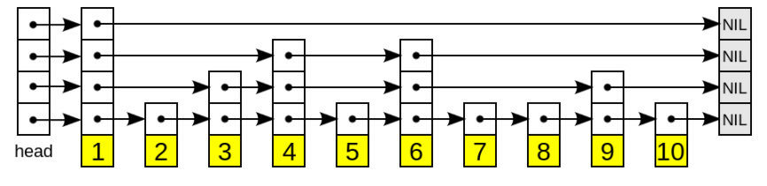
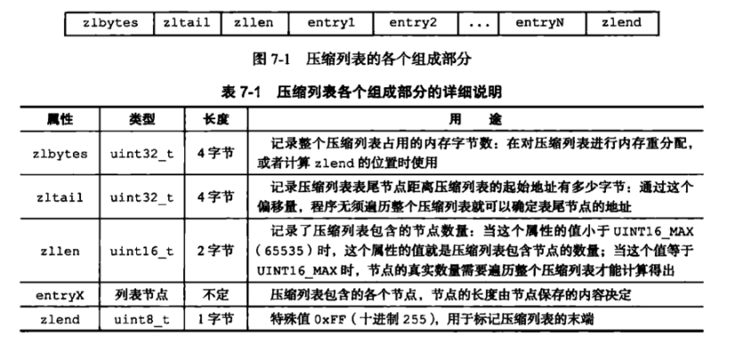
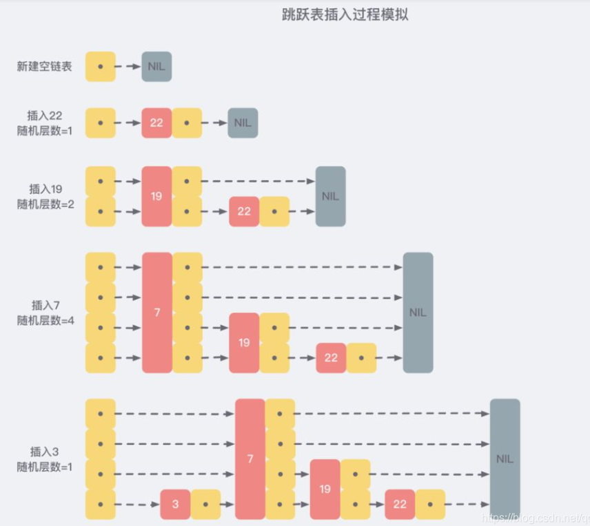

# Redis

## 使用 Redis 有哪些好处？

1、速度快，因为数据存在内存中，类似于 HashMap，HashMap 的优势就是查找和操作的时间复杂度都是 O（1）

2、支持丰富数据类型，支持 string，list，set，Zset，hash 等

3、支持事务，操作都是原子性，所谓的原子性就是对数据的更改要么全部执行，要么全部不执行

4、丰富的特性：可用于缓存，发布订阅、消息，按 key 设置过期时间，过期后将会自动删除

## Redis的五种数据类型何应用场景

Redis的数据结构有：

1. 字符串（String）：可以用来做最简单的数据缓存，可以缓存某个简单的字符串，也可以缓存某个json格式的字符串，Redis分布式锁的实现就利用了这种数据结构，还包括可以实现计数器、Session共享、分布式ID；
2. 哈希表（Hash）：可以用来存储一些key-value对，更适合用来存储对象；
3. 列表（List）：Redis的列表通过命令的组合，既可以当做栈，也可以当做队列来使用，可以用来缓存类似微信公众号、微博等消息流数据；
4. 集合（Set）：和列表类似，也可以存储多个元素，但是不能重复，集合可以行交集、并集、差集操作，从而可以实现类似，我和某⼈共同关注的人、朋友圈点赞等功能；
5. 有序集合（Sorted Set）：集合是无序的，有序集合可以设置顺序，可以用来实现排行榜功能；

**高级数据类型:**

我们实际项目中比较常用的是 string，hash 如果你是 Redis 中高级用户，还需要加上下面几种数据结构HyperLogLog、Geo、Pub/Sub。

如果你说还玩过 Redis Module，像 BloomFilter，RedisSearch，Redis-ML，面试官得眼睛就开始发亮了。

### 1. BitMaps

在应用场景中，有一些数据只有两个属性，比如是否是学生，是否是党员等等，对于这些数据，最节约内存的方式就是用bit去记录，以是否是学生为例，1代表是学生，0代表不是学生。那么1000110就代表7个人中3个是学生，这就是BitMaps的存储需求。

- bitmaps不是一个真实的数据结构，而是String类型上的一组面向bit操作的集合
- BitMaps就是通过一个bit位来表示某个元素对应的值或者状态,其中的key就是对应元素本身
- 可以把Bitmaps想象成是一串二进制数字，每个位置只存储0和1（某种状态），下标是Bitmaps的偏移量（offset）
- 我们知道8个bit可以组成一个Byte，所以bitmaps本身会极大的节省储存空间。

**BitMaps的基本操作：**

获取指定key对应偏移量上的bit值

```java
getbit key offset   如果没有设置的话，默认是0
```

设置指定key对应偏移量上的bit值，value只能是0或1

```java
setbit key offset value  偏移量很大的话，也能设置，但是前面要补0，比较耗时
```

对指定key按位进行交、并、非、异或操作，并将结果保存到destKey中

```java
 bitop op destKey key1 [key2...] 
```

op：and（交）、or（并）、not（非）、xor（异或）

统计指定key中1的数量

```java
bitcount key [start end]
```

### 2. HyperLogLog

HyperLogLog是用来做基数统计的，所谓基数统计，就是指一串数字中不重复的数字个数，如{1，2，1，2，3}的基数集就是{1，2，3}，基数就是3，内部运用了LogLog算法。

**HyperLogLog 类型的基本操作**

添加数据

```java
 pfadd key element [element ...] 
```

统计数据

```java
 pfcount key [key ...]
```

合并数据

```java
 pfmerge destkey sourcekey [sourcekey...]
```

**注意：**

- 用于进行基数统计，不是集合，不保存数据，只记录数量而不是具体数据
- 核心是基数估算算法，最终数值存在一定误差
- 误差范围：基数估计的结果是一个带有 0.81% 标准错误的近似值
- 耗空间极小，每个hyperloglog key占用了12K的内存用于标记基数
- pfadd命令不是一次性分配12K内存使用，会随着基数的增加内存逐渐增大
- Pfmerge命令合并后占用的存储空间为12K，无论合并之前数据量多少

> 业务场景：统计页面实时 UV 数、统计在线用户数、统计用户每天搜索不同词条的个数。而Bitmaps则用于判断某个用户是否访问过搜索页面。这是它们用法的不同。

### GEO 介绍

GEO是redis中关于地理位置计算的高级数据类型，比如微信中的附近好友会展示好友离你的距离，这就是GEO的一个应用。

## Redis持久化机制

Redis是一个支持持久化的内存数据库，通过持久化机制把内存中的数据同步到硬盘文件来保证数据持久化。当Redis重启后通过把硬盘文件重新加载到内存，就能达到恢复数据的目的。

实现：单独创建fork()一个子进程，将当前父进程的数据库数据复制到子进程的内存中，然后由子进程写入到临时文件中，持久化的过程结束了，再用这个临时文件替换上次的快照文件，然后子进程退出，内存释放。

> RDB: 将当前数据状态进行保存，快照形式，存储数据结果，存储格式简单，关注点在数据
> AOF: 将数据的操作过程进行保存，日志形式，存储操作过程，存储格式复杂，关注点在数据的操作过程

## RDB

**RDB：**  是Redis默认的持久化方式。按照一定的时间周期策略把内存的数据以快照的形式保存到硬盘的二进制文件。即Snapshot快照存储，对应产生的数据文件为dump.rdb，通过配置文件中的save参数来定义快照的周期。（ 快照可以是其所表示的数据的一个副本，也可以是数据的一个复制品。）

快照持久化是 Redis 默认采用的持久化方式，在 Redis.conf 配置文件中默认有此下配置：

```java
save 900 1       #在900秒(15分钟)之后，如果至少有1个key发生变化，Redis就会自动触发BGSAVE命令创建快照。
save 300 10      #在300秒(5分钟)之后，如果至少有10个key发生变化，Redis就会自动触发BGSAVE命令创建快照。
save 60 10000    #在60秒(1分钟)之后，如果至少有10000个key发生变化，Redis就会自动触发BGSAVE命令创建快照。
```

**优点：**
1、只有一个文件 dump.rdb，存储效率较高，方便持久化。

2、容灾性好，一个文件可以保存到安全的磁盘。

3、性能最大化，fork 子进程来完成写操作，让主进程继续处理命令，所以是 IO最大化。使用单独子进程来进行持久化，主进程不会进行任何 IO 操作，保证了 redis的高性能)

4、相对于数据集大时，比 AOF 恢复数据的效率更高。

**缺点：**

1、数据安全性低。RDB 是间隔一段时间进行持久化，如果持久化之间 redis 发生故障，会发生数据丢失。所以这种方式更适合数据要求不严谨的时候)。

2、bgsave指令每次运行要执行fork操作创建子进程，要牺牲掉一些性能。

## AOF

**AOF：** Redis会将每一个收到的写命令都通过Write函数追加到文件最后，类似于MySQL的binlog。当Redis重启是会通过重新执行文件中保存的写命令来在内存中重建整个数据库的内容。当两种方式同时开启时，数据恢复Redis会优先选择AOF恢复。

默认情况下 Redis 没有开启 AOF（append only file）方式的持久化，可以通过 appendonly 参数开启：`appendonly yes`，开启 AOF 持久化后每执行一条会更改 Redis 中的数据的命令，Redis 就会将该命令写入硬盘中的 AOF 文件。AOF 文件的保存位置和 RDB 文件的位置相同，都是通过 dir 参数设置的，默认的文件名是 appendonly.aof。

在 Redis 的配置文件中存在三种不同的 AOF 持久化方式，它们分别是：

```java
appendfsync always    #每次有数据修改发生时都会写入AOF文件,这样会严重降低Redis的速度
appendfsync everysec  #每秒钟同步一次，显示地将多个写命令同步到硬盘
appendfsync no        #让操作系统决定何时进行同步
```

**优点：**

1、数据安全，aof 持久化可以配置 appendfsync 属性，有 always，每进行一次命令操作就记录到 aof 文件中一次。

2、通过 append 模式写文件，即使中途服务器宕机，可以通过 redis-check-aof工具解决数据一致性问题。

3、AOF 机制的 rewrite 模式。AOF 文件没被 rewrite 之前（文件过大时会对命令进行合并重写，可以删除其中的某些命令（比如误操作的 flushall）)

**缺点：**

1、AOF 文件比 RDB 文件大，且恢复速度慢。

2、数据集大的时候，比 rdb 启动效率低。

## AOF重写

随着命令不断写入AOF，文件会越来越大，为了解决这个问题，Redis引入了AOF重写机制压缩文件体积。AOF文件重写是将Redis进程内的数据转化为写命令同步到新AOF文件的过程。简单说就是将对同一个数据的若干个条命令执行结果转化成最终结果数据对应的指令进行记录。

**AOF重写作用**

- 降低磁盘占用量，提高磁盘利用率
- 提高持久化效率，降低持久化写时间，提高IO性能
- 降低数据恢复用时，提高数据恢复效率

**AOF重写规则**

- 进程内已超时的数据不再写入文件
- 忽略无效指令，重写时使用进程内数据直接生成，这样新的AOF文件只保留最终数据的写入命令，如del key1、 hdel key2、srem key3、set key4 111、set key4 222等
- 对同一数据的多条写命令合并为一条命令 ， 如lpush list1 a、lpush list1 b、 lpush list1 c 可以转化为：lpush list1 a b c。  为防止数据量过大造成客户端缓冲区溢出，对list、set、hash、zset等类型，每条指令最多写入64个元素

## RDB与AOF的区别


| 持久化方式   | RDB                | AOF                |
| ------------ | ------------------ | ------------------ |
| 占用存储空间 | 小（数据级：压缩） | 大（指令级：重写） |
| 存储速度     | 慢                 | 快                 |
| 恢复速度     | 快                 | 慢                 |
| 数据安全性   | 会丢失数据         | 依据策略决定       |
| 资源消耗     | 高/重量级          | 低/轻量级          |
| 启动优先级   | 低                 | 高                 |

## 单线程的redis为什么这么快

(一)纯内存操作

(二)单线程操作，避免了频繁的上下文切换

(三)采用了非阻塞I/O多路复用机制

## Redis 的线程模型了解么？

Redis 内部使用文件事件处理器 file event handler，这个文件事件处理器是单线程的，所以 Redis 才叫做单线程的模型。它采用 IO 多路复用机制同时监听多个 Socket，根据 Socket 上的事件来选择对应的事件处理器进行处理。

文件事件处理器的结构包含 4 个部分：

- 多个 Socket
- IO 多路复用程序
- 文件事件分派器
- 事件处理器（连接应答处理器、命令请求处理器、命令回复处理器）

多个 Socket 可能会并发产生不同的操作，每个操作对应不同的文件事件，但是 IO 多路复用程序会监听多个 Socket，会将 Socket 产生的事件放入队列中排队，事件分派器每次从队列中取出一个事件，把该事件交给对应的事件处理器进行处理。

## redis 的过期策略

1. ~~**定时删除** :  创建一个定时器，当key设置有过期时间，且过期时间到达时，由定时器任务立即执行对键的删除操作。~~
2. **惰性删除** ：只会在取出key的时候才对数据进行过期检查。这样对CPU最友好，但是可能会造成太多过期 key 没有被删除。
3. **定期删除** ： 每隔一段时间抽取一批 key 执行删除过期key操作。并且，Redis 底层会通过限制删除操作执行的时长和频率来减少删除操作对CPU时间的影响。

## redis 内存淘汰机制

Redis 提供 6 种数据淘汰策略：

1. volatile-lru（least recently used）：从已设置过期时间的数据集（server.db[i].expires）中挑选最近最少使用的数据淘汰；
2. volatile-ttl：从已设置过期时间的数据集（server.db[i].expires）中挑选将要过期的数据淘汰；
3. volatile-random：从已设置过期时间的数据集（server.db[i].expires）中任意选择数据淘汰；
4. allkeys-lru（least recently used）：当内存不足以容纳新写入数据时，在键空间中，移除最近最少使用的key（这个是最常用的）；
5. allkeys-random：从数据集（server.db[i].dict）中任意选择数据淘汰；
6. no-eviction：禁止驱逐数据，也就是说当内存不足以容纳新写入数据时，新写入操作会报错。这个应该没⼈使用吧！

4.0 版本后增加以下两种：
7. volatile-lfu（least frequently used）：从已设置过期时间的数据集(server.db[i].expires)中挑选最不经常使用的数据淘汰；
8. allkeys-lfu（least frequently used）：当内存不足以容纳新写入数据时，在键空间中，移除最不经常使用的 key；

## Redis 事务

Redis事务功能是通过MULTI、EXEC、DISCARD和WATCH 四个原语实现的；

Redis会将一个事务中的所有命令序列化，然后按顺序执行。

1. **MULTI： 命令用于开启一个事务**，它总是返回OK。 MULTI执行之后，客户端可以继续向服务器发送任意多条命令，这些命令不会立即被执行，而是被放到一个队列中，当EXEC命令被调用时，所有队列中的命令才会被执行。
2. **EXEC：执行所有事务块内的命令**。返回事务块内所有命令的返回值，按命令执行的先后顺序排列。当操作被打断时，返回空值 nil 。
3. **DISCARD：客户端可以清空事务队列，并放弃执行事务**， 并且客户端会从事务状态中退出。
4. **WATCH： 命令可以为 Redis 事务提供 check-and-set （CAS）行为**。 可以监控一个或多个键，一旦其中有一个键被修改（或删除），之后的事务就不会执行，监控一直持续到EXEC命令。

- redis 不支持回滚“Redis 在事务失败时不进行回滚，而是继续执行余下的命令”， 所以 Redis 的内部可以保持简单且快速。
- 如果在一个事务中的命令出现错误，那么所有的命令都不会执行；
- 如果在一个事务中出现运行错误，那么正确的命令会被执行。

> 你可以将Redis中的事务就理解为 ：Redis事务提供了一种将多个命令请求打包的功能。然后，再按顺序执行打包的所有命令，并且不会被中途打断。

## 缓存穿透

**什么是缓存穿透？**

缓存穿透说简单点就是大量请求的 key 根本不存在于缓存中，导致请求直接到了数据库上，根本没有经过缓存这一层。举个例子：某个黑客故意制造我们缓存中不存在的 key 发起大量请求，导致大量请求落到数据库。

**缓存穿透有哪些解决办法？**

1. 接口层增加校验，如用户鉴权校验，id做基础校验，id<=0的直接拦截；
2. 缓存无效 key

   如果缓存和数据库都查不到某个 key 的数据就写一个到 Redis 中去并设置过期时间；
3. 布隆过滤器

   将所有可能存在的数据哈希到一个足够大的bitmap中，一个一定不存在的数据会被这个bitmap拦截掉，从而避免了对底层存储系统的查询压力。

> Bloom-Filter算法的核心思想就是利用多个不同的Hash函数来解决“冲突”。
>
> 但是，需要注意的是布隆过滤器可能会存在误判的情况。总结来说就是：
>
> 布隆过滤器说某个元素存在，小概率会误判。布隆过滤器说某个元素不在，那么这个元素一定不在。

## 缓存击穿

对于一些设置了过期时间的key，如果这些key可能会在某些时间点被超高并发地访问，是一种非常“热点”的数据。这个时候，需要考虑一个问题：缓存被“击穿”的问题，这个和缓存雪崩的区别在于这里针对某一key缓存，前者则是很多key。

缓存在某个时间点过期的时候，恰好在这个时间点对这个Key有大量的并发请求过来，这些请求发现缓存过期一般都会从后端DB加载数据并回设到缓存，这个时候大并发的请求可能会瞬间把后端DB压垮。

**解决方案？**

1. 设置热点数据永远不过期
2. 使用互斥锁(mutex key)

## 缓存雪崩

**什么是缓存雪崩？**

缓存在同一时间大面积的失效，后面的请求都直接落到了数据库上，造成数据库短时间内承受大量请求。

**有哪些解决办法？**

针对热点缓存失效的情况

1. 设置不同的失效时间比如随机设置缓存的失效时间。
2. 缓存永不失效。
3. 排斥锁，即第一个线程过来读取cache，发现没有，就去访问DB。后续线程再过来就需要等待第一个线程读取DB成功，cache里的value变得可用，后续线程返回新的value。
4. 缓存过期标记 + 异步刷新：

   排斥锁方案对缓存过期是零容忍的：cache一旦过期，后续所有读操作就必须返回新的value。如果我们稍微放宽点限制：在cache过期时间T到达后，允许短时间内部分读请求返回旧值，我们就能提出兼顾吞吐率的方案。实际上既然用了cache，系统就默许了容忍cache和DB的数据短时间的不一致。

   限制放宽后，下面我们提出一个优化思路。时间T到达后，cache中的key和value不会被清掉，而只是被标记为过期（逻辑上过期，物理上不过期），然后程序异步去刷新cache。而后续部分读线程在前面的线程刷新cache成功之前，暂时获取cache中旧的value返回。一旦cache刷新成功，后续所有线程就能直接获取cache中新的value。

针对 Redis 服务不可用的情况：

1. 采用 Redis 集群，避免单机出现问题整个缓存服务都没办法使用。
2. 限流，避免同时处理大量的请求。

## 如何保证缓存和数据库数据的一致性？

**Cache Aside Pattern（旁路缓存模式)：**

**写** ：先更新 DB、然后直接删除 cache 。

**读** :  从 cache 中读取数据，读取到就直接返回、cache中读取不到的话，就从 DB 中读取数据返回、再把数据放到 cache 中。

**延时双删，**步骤是：先删除Redis缓存数据，再更新Mysql，延迟几百毫秒再删除Redis缓存数据，这样就算在更新Mysql时，有其他线程读了Mysql，把老数据读到了Redis中，那么也会被删除掉，从而把数据保持一致。

**Read/Write Through Pattern（读写穿透）：**

**写（Write Through）：**

- 先查 cache，cache 中不存在，直接更新 DB。
- cache 中存在，则先更新 cache，然后 cache 服务自己更新 DB（**同步更新 cache 和 DB**）。

**读(Read Through)：**

- 从 cache 中读取数据，读取到就直接返回 。
- 读取不到的话，先从 DB 加载，写入到 cache 后返回响应。

**Write Behind Pattern（异步缓存写入）：**

Write Behind Pattern 和 Read/Write Through Pattern 很相似，两者都是由 cache 服务来负责 cache 和 DB 的读写。

但是，两个又有很大的不同：**Read/Write Through 是同步更新 cache 和 DB，而 Write Behind Caching 则是只更新缓存，不直接更新 DB，而是改为异步批量的方式来更新 DB。**

## Redis集群策略

Redis提供了三种集群策略：

1. **主从模式：**这种模式比较简单，主库可以读写，并且会和从库进行数据同步，这种模式下，客户端直接连主库或某个从库，但是但主库或从库宕机后，客户端需要手动修改IP，另外，这种模式也比较难进行扩容，整个集群所能存储的数据受到某台机器的内存容量，所以不可能支持特大数据量；
2. **哨兵模式：**这种模式在主从的基础上新增了哨兵节点，但主库节点宕机后，哨兵会发现主库节点宕机，然后在从库中选择一个库作为进的主库，另外哨兵也可以做集群，从而可以保证但某一个哨兵节点宕机后，还有其他哨兵节点可以继续工作，这种模式可以比较好的保证Redis集群的高可用，但是仍然不能很好的解决Redis的容量上限问题。
3. **Cluster模式：**Cluster模式是用得比较多的模式，它支持多主多从，这种模式会按照key进行槽位的分配，可以使得不同的key分散到不同的主节点上，利用这种模式可以使得整个集群支持更大的数据容量，同时每个主节点可以拥有自己的多个从节点，如果该主节点宕机，会从它的从节点中选举一个新的主节点。

对于这三种模式，如果Redis要存的数据量不大，可以选择哨兵模式，如果Redis要存的数据量大，并且需要持续的扩容，那么选择Cluster模式。

## Redis主从复制的核心原理

Redis的主从复制是提高Redis的可靠性的有效措施，主从复制的流程如下：

1. 集群启动时，主从库间会先建立连接，为全量复制做准备。
2. 主库将所有数据同步给从库。从库收到数据后，在本地完成数据加载，这个过程依赖于内存快照 RDB。
3. 在主库将数据同步给从库的过程中，主库不会阻塞，仍然可以正常接收请求。否则，redis的服务就被中断了。但是，这些请求中的写操作并没有记录到刚刚生成的RDB文件中。为了保证主从库的数据一致性，主库会在内存中用专⻔的replication buffer，记录RDB文件生成收到的所有写操作。
4. 最后，也就是第三个阶段，主库会把第二阶段执行过程中新收到的写命令，再发送给从库。具体的操作是，当主库完成RDB文件发送后，就会把此时replocation buffer中修改操作发送给从库，从库再执行这些操作。这样一来，主从库就实现同步了
5. 后续主库和从库都可以处理客户端读操作，写操作只能交给主库处理，主库接收到写操作后，还会将写操作发送给从库，实现增量同步

## Redis 底层数据结构

> 总结：
>
> 1. Redis使用**简单字符串**SDS作为字符串的表示，相对于C语言字符串，SDS具有常数复杂度获取字符串长度，杜绝了缓存区的溢出，减少了修改字符串长度时所需的内存重分配次数，以及二进制安全能存储各种类型的文件，并且还兼容部分C函数。
> 2. 通过为**链表**设置不同类型的特定函数，Redis链表可以保存各种不同类型的值，除了用作列表键，还在发布与订阅、慢查询、监视器等方面发挥作用。
> 3. Redis的**字典**底层使用哈希表实现，每个字典通常有两个哈希表，一个平时使用，另一个用于rehash时使用，使用链地址法解决哈希冲突。
> 4. **跳跃表**通常是有序集合的底层实现之一，表中的节点按照分值大小进行排序。
> 5. **整数集合**是集合键的底层实现之一，底层由数组构成，升级特性能尽可能的节省内存。
> 6. **压缩列表**是Redis为节省内存而开发的顺序型数据结构，通常作为列表键和哈希键的底层实现之一。

1. **简单动态字符串**

   Redis 是用 C 语言写的，但是对于Redis的字符串，却不是 C 语言中的字符串（即以空字符’\0’结尾的字符数组），它是自己构建了一种名为 简单动态字符串（simple dynamic string，SDS）的抽象类型，并将 SDS 作为 Redis的默认字符串表示。

   ```c
   struct sdshdr{
        //记录buf数组中已使用字节的数量
        //等于 SDS 保存字符串的长度
        int len;
        //记录 buf 数组中未使用字节的数量
        int free;
        //字节数组，用于保存字符串
        char buf[];
   }
   ```
2. **链表**

   ```c
   typedef` `struct` `list{
      ``//表头节点
      ``listNode *head;
      ``//表尾节点
      ``listNode *tail;
      ``//链表所包含的节点数量
      ``unsigned ``long` `len;
      ``//节点值复制函数
      ``void` `(*``free``) (``void` `*ptr);
      ``//节点值释放函数
      ``void` `(*``free``) (``void` `*ptr);
      ``//节点值对比函数
      ``int` `(*match) (``void` `*ptr,``void` `*key);
   }list;
   ```

   Redis链表特性：

   　　①双端：链表具有前置节点和后置节点的引用，获取这两个节点时间复杂度都为O(1)。

   　　②无环：表头节点的 prev 指针和表尾节点的 next 指针都指向 NULL，对链表的访问都是以 NULL 结束。　　

   　　③带链表长度计数器：通过 len 属性获取链表长度的时间复杂度为 O(1)。

   　　④多态：链表节点使用 void* 指针来保存节点值，可以保存各种不同类型的值。
3. **字典**

   字典又称为符号表或者关联数组、或映射（map），是一种用于保存键值对的抽象数据结构。字典中的每一个键 key 都是唯一的，通过 key 可以对值来进行查找或修改。
4. **跳跃表**

   跳跃表（skiplist）是一种有序数据结构，它通过在每个节点中维持多个指向其它节点的指针，从而达到快速访问节点的目的。具有如下性质：

   ```
   1、由很多层结构组成；
   ```

   　　2、每一层都是一个有序的链表，排列顺序为由高层到底层，都至少包含两个链表节点，分别是前面的head节点和后面的nil节点；

   　　3、最底层的链表包含了所有的元素；

   　　4、如果一个元素出现在某一层的链表中，那么在该层之下的链表也全都会出现（上一层的元素是当前层的元素的子集）；

   　　5、链表中的每个节点都包含两个指针，一个指向同一层的下一个链表节点，另一个指向下一层的同一个链表节点；

   

   ```c
   typedef struct zskiplistNode {
        //层
        struct zskiplistLevel{
              //前进指针
              struct zskiplistNode *forward;
              //跨度
              unsigned int span;
        }level[];
        //后退指针
        struct zskiplistNode *backward;
        //分值
        double score;
        //成员对象
        robj *obj;
   } zskiplistNode

   typedef struct zskiplist{
        //表头节点和表尾节点
        structz skiplistNode *header, *tail;
        //表中节点的数量
        unsigned long length;
        //表中层数最大的节点的层数
        int level;

   }zskiplist;
   ```
5. **整数集合**

整数集合（intset）是Redis用于保存整数值的集合抽象数据类型，它可以保存类型为int16_t、int32_t 或者int64_t 的整数值，并且保证集合中不会出现重复元素。

```c
typedef struct intset{
     //编码方式
     uint32_t encoding;
     //集合包含的元素数量
     uint32_t length;
     //保存元素的数组
     int8_t contents[];
 
}intset;
```

6. **压缩列表**

   　压缩列表（ziplist）是Redis为了节省内存而开发的，是由一系列特殊编码的连续内存块组成的顺序型数据结构，一个压缩列表可以包含任意多个节点（entry），每个节点可以保存一个字节数组或者一个整数值。

   　

## zset实现原理/什么是skipList?

zset是 Redis五种数据结构中的一种（String、List、Hash、Set、Zset）。也称为sortedSet，它类似于Java里面是soretdSet和HashMap的结合体，因为它本身具有HashSet中不含重复元素的特性，又包含了SortedSet中内部有序的特性(通过传入一个score，根据score来排序)。但它内部的数据结构却与上述两种完全不同，它内部是通过一种名为 SkipList(跳跃表) 的数据结构来实现的。

### 什么是skipList?

SkipList是一种随机化的数据结构，是一种层次化的链表结构，它使得在进行增删改查时，都能在可接收的时间范围内完成操作。

它的原理就是每次查找数据时，先在最上层查找，然后在定位到下一层，层层定位，最终找到目标数据，这种查找方式不用遍历整个链表，而是跳跃着查，这样就使得查找的时间复杂度退化到了logn（近似于二分查找），大大提高了查找效率。

一般来说，我们可以按下一层的链表来构造上一层的链表，举个例子，最下一层是所有数据构成的链表，我们将它分段，隔一个节点构造一个新的节点，这样，第二层的链表长度就是第一层的一半，第三层又是第二层的一半，以此类推。但是这里我们会发现一个严重的问题，每次对zset进行更新时，需要重新构建zset，这又增加了时间复杂度，所以zset在构建skiplist的时候，就给每个节点赋予了一个随机的层数，这样就避免了重新构建。


### 为什么不使用List/红黑树或平衡二叉树呢？

List是顺序存储，访问速度很快，但是添加和删除操作是一个(On)的操作，对于Redis这样要求高写入和高读取的数据库来说，List显然不能满足其要求。

至于红黑树和平衡二叉树，每次更新redis的值，都要调整树结构，这样会造成额外的开销，而跳跃表只需要调整表局部的链表结构就行，显然跳跃表更适合。

### 跳跃表的层数可以一直增加下去吗？

不能， 跳跃表的层数最大只能到达32层，这也被源码ZSKIPLIST_MAXLEVEL 定义了。
