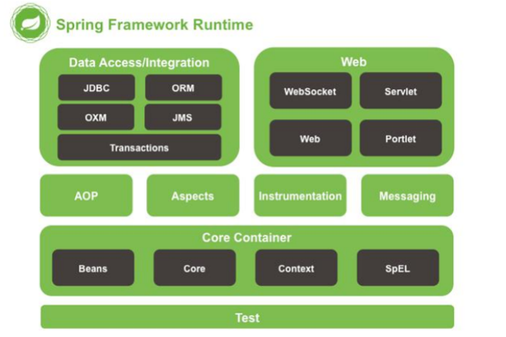
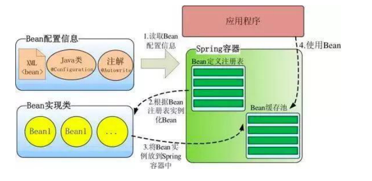
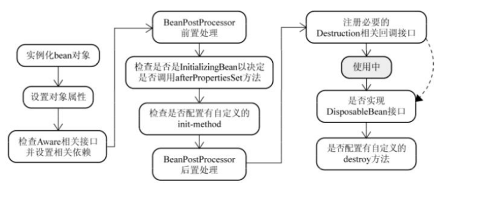
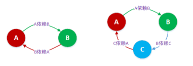
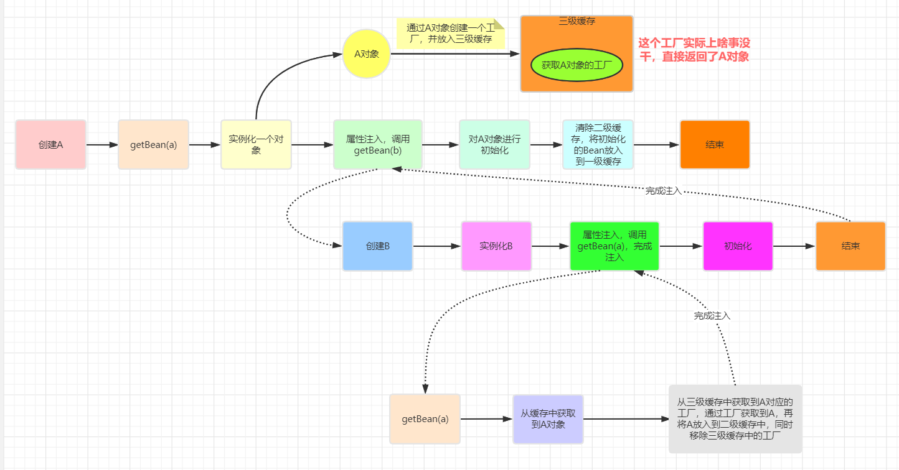
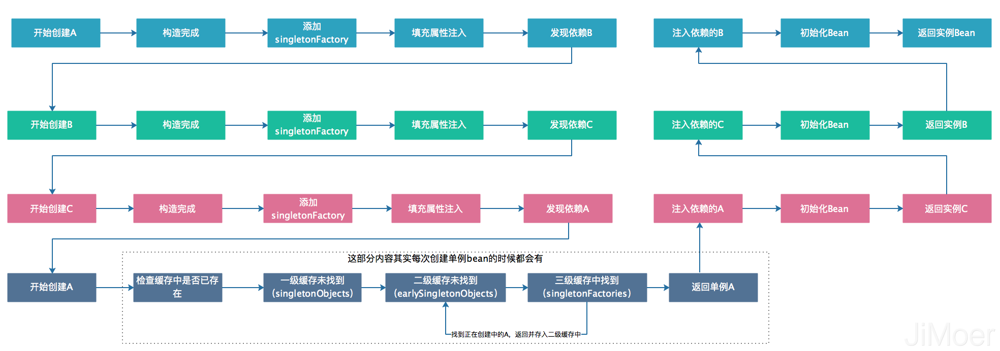
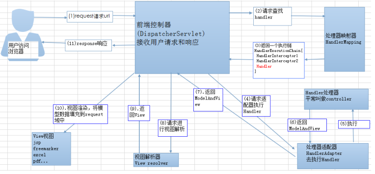
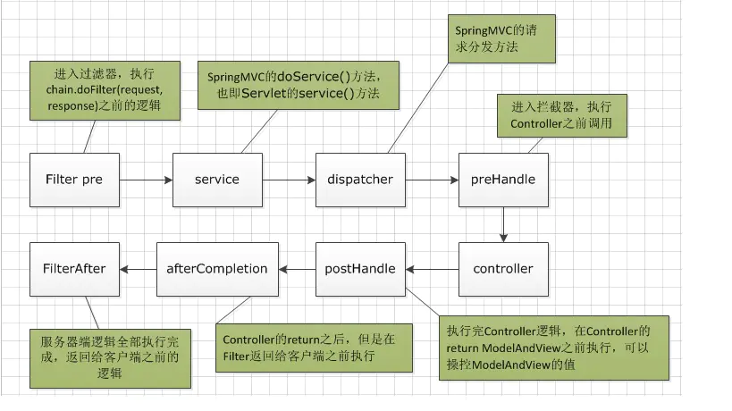
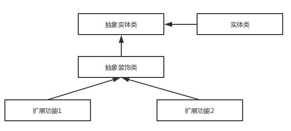

# Spring

## 什么是 Spring Framework？

Spring 是一个开源应用框架，旨在降低应用程序开发的复杂度。它是轻量级、松散耦合的。它具有分层体系结构，允许用户选择组件，同时还为 J2EE 应用程序开发提供了一个有凝聚力的框架。它可以集成其他框架，如 Structs、Hibernate、EJB 等，所以又称为框架的框架。

## Spring Framework 中有多少个模块，它们分别是什么？



- spring core：提供了框架的基本组成部分，包括控制反转（Inversion of Control，IOC）和依赖注入（Dependency Injection，DI）功能。
- spring beans：提供了BeanFactory，是工厂模式的一个经典实现，Spring将管理对象称为Bean。
- spring context：构建于 core 封装包基础上的 context 封装包，提供了一种框架式的对象访问方法。
- spring jdbc：提供了一个JDBC的抽象层，消除了烦琐的JDBC编码和数据库厂商特有的错误代码解析， 用于简化JDBC。
- spring aop：提供了面向切面的编程实现，让你可以自定义拦截器、切点等。
- spring Web：提供了针对 Web 开发的集成特性，例如文件上传，利用 servlet listeners 进行 ioc 容器初始化和针对 Web 的 ApplicationContext。
- spring test：主要为测试提供支持的，支持使用JUnit或TestNG对Spring组件进行单元测试和集成测试。
- 几个杂项模块:  Messaging – 该模块为 STOMP 提供支持。它还支持注解编程模型，该模型用于从 WebSocket 客户端路由和处理 STOMP 消息。Aspects – 该模块为与 AspectJ 的集成提供支持。

## Spring框架的设计目标，设计理念，和核心是什么？

**Spring设计目标**：Spring为开发者提供一个一站式轻量级应用开发平台；

**Spring设计理念**：在JavaEE开发中，支持POJO和JavaBean开发方式，使应用面向接口开发，充分支持OO（面向对象）设计方法；Spring通过IoC容器实现对象耦合关系的管理，并实现依赖反转，将对象之间的依赖关系交给IoC容器，实现解耦；

**Spring框架的核心**：IoC容器和AOP模块。通过IoC容器管理POJO对象以及他们之间的耦合关系；通过AOP以动态非侵入的方式增强服务。

IoC让相互协作的组件保持松散的耦合，而AOP编程允许你把遍布于应用各层的功能分离出来形成可重用的功能组件。

## Spring的优缺点是什么？

优点

- 方便解耦，简化开发
  Spring就是一个大工厂，可以将所有对象的创建和依赖关系的维护，交给Spring管理。
- AOP编程的支持
  Spring提供面向切面编程，可以方便的实现对程序进行权限拦截、运行监控等功能。
- 声明式事务的支持
  只需要通过配置就可以完成对事务的管理，而无需手动编程。
- 方便程序的测试
  Spring对Junit4支持，可以通过注解方便的测试Spring程序。
- 方便集成各种优秀框架
  Spring不排斥各种优秀的开源框架，其内部提供了对各种优秀框架的直接支持（如：Struts、Hibernate、MyBatis等）。
- 降低JavaEE API的使用难度
  Spring对JavaEE开发中非常难用的一些API（JDBC、JavaMail、远程调用等），都提供了封装，使这些API应用难度大大降低。

缺点

- Spring明明一个很轻量级的框架，却给人感觉大而全
- Spring依赖反射，反射影响性能
- 使用门槛升高，入门Spring需要较长时间

## Spring容器启动流程

1. 在创建Spring容器，也就是启动Spring时
2. 首先会进行扫描，扫描得到所有的BeanDefinition对象，并存在一个Map中
3. 然后筛选出非懒加载的单例BeanDefinition进行创建Bean，对于多例Bean不需要在启动过程中去进行创建，对于多例Bean会在每次获取Bean时利用BeanDefinition去创建
4. 利用BeanDefinition创建Bean就是Bean的创建生命周期，这期间包括了合并BeanDefinition、推断构造方法、实例化、属性填充、初始化前、初始化、初始化后等步骤，其中AOP就是发生在初始化后这一步骤中
5. 单例Bean创建完了之后，Spring会发布一个容器启动事件
6. Spring启动结束
7. 在源码中会更复杂，比如源码中会提供一些模板方法，让子类来实现，比如源码中还涉及到一些
   BeanFactoryPostProcessor和BeanPostProcessor的注册，Spring的扫描就是通过
   BenaFactoryPostProcessor来实现的，依赖注入就是通过BeanPostProcessor来实现的
8. 在Spring启动过程中还会去处理@Import等注解

## Spring IoC  ？

**IoC（Inverse of Control:控制反转）是一种设计思想，就是 将原本在程序中手动创建对象的控制权，交由Spring框架来管理。**

Spring 通过一个配置文件描述 Bean 及 Bean 之间的依赖关系，利用 Java 语言的反射功能实例化 Bean 并建立 Bean 之间的依赖关系。 Spring 的 IoC 容器在完成这些底层工作的基础上，还提供了 Bean 实例缓存、生命周期管理、 Bean 实例代理、事件发布、资源装载等高级服务。



## 什么是依赖注入？

依赖注入是Spring实现IoC的一种重要手段，将对象间的依赖关系的控制权从开发人员手里转移到容器。

## Bean 可以通过多少种方式完成依赖注入？

通常，依赖注入可以通过三种方式完成，即：

1. 构造函数注入
2. setter 注入
3. 接口注入

在 Spring Framework 中，仅使用构造函数和 setter 注入。

## Spring Bean有三种配置方式

- 传统的XML配置方式
- 基于注解的配置
- 基于类的Java Config

## spring 中有多少种 IOC 容器？

BeanFactory - BeanFactory 就像一个包含 bean 集合的工厂类。它会在客户端要求时实例化 bean。

ApplicationContext - ApplicationContext 接口扩展了 BeanFactory 接口。它在 BeanFactory 基础上提供了一些额外的功能。


| BeanFactory                | ApplicationContext       |
| -------------------------- | ------------------------ |
| 它使用懒加载               | 它使用即时加载           |
| 它使用语法显式提供资源对象 | 它自己创建和管理资源对象 |
| 不支持国际化               | 支持国际化               |
| 不支持基于依赖的注解       | 支持基于依赖的注解       |

## Spring IoC 的实现机制

Spring 中的 IoC 的实现原理就是工厂模式加反射机制。

```java
interface Fruit {
    public abstract void eat();
} 
class Apple implements Fruit {
    public void eat(){
    System.out.println("Apple");
    }
} 
class Orange implements Fruit {
    public void eat(){
    System.out.println("Orange");
    }
} 
class Factory {
    public static Fruit getInstance(String ClassName) {
        Fruit f=null;
        try {
            f=(Fruit)Class.forName(ClassName).newInstance();
        } catch (Exception e) {
            e.printStackTrace();
        } 
        return f;
    }
} 
class Client {
    public static void main(String[] a) {
        Fruit f=Factory.getInstance("com.kunaly.spring.Apple");
        if(f!=null){
            f.eat();
        }
    }
}
```

## Spring 中 bean 的作用域scope？

1. **singleton :** 单例，唯一 bean 实例，Spring 中的 bean 默认都是单例的。
2. **prototype :** 原型， 每次请求都会创建一个新的 bean 实例。
3. **request :** 每一次HTTP请求都会产生一个新的bean，该bean仅在当前HTTP request内有效。
4. **session :** 每一次HTTP请求都会产生一个新的 bean，该bean仅在当前 HTTP session 内有效。
5. **global-session：**全局session作用域，仅仅在基于portlet的web应用中才有意义，Spring5已经没有了。Portlet是能够生成语义代码(例如：HTML)片段的小型Java Web插件。它们基于portlet容器，可以像servlet一样处理HTTP请求。但是，与 servlet 不同，每个 portlet 都有不同的会话

## 将一个类声明为Spring的 bean 的注解有哪些?

我们一般使用 @Autowired  注解自动装配 bean，要想把类标识成可用于 @Autowired  注解自动装配的 bean 的类,采用以下注解可实现：

1. **@Component  ：**通用的注解，可标注任意类为 Spring  组件。如果一个Bean不知道属于哪个层，可以使用@Component  注解标注。
2. **@Repository  :** 对应持久层即 Dao 层，主要用于数据库相关操作。
3. **@Service  :** 对应服务层，主要涉及一些复杂的逻辑，需要用到 Dao层。
4. **@Controller  :** 对应 Spring MVC 控制层，主要用户接受用户请求并调用 Service 层返回数据给前端⻚面。

## @Component 和 @Bean 的区别是什么？

1. 作用对象不同: @Component  注解作用于类，而 @Bean 注解作用于方法。
2. @Component 标注该类为 Spring  组件，自动装配到Spring容器中。

@Bean  注解声明当前方法的返回值为一个bean，可替代xml中配置的方式。

3. @Bean  注解比 @Component  注解的自定义性更强，而且很多地方我们只能通过 @Bean  注解来注册bean。比如当我们引用第三方库中的类需要装配到 Spring 容器时，则只能通过 @Bean 来实现。

**@Bean 注解使用示例：**

```java
@Configuration
public class AppConfig {
    @Bean
    public TransferService transferService() {
        return new TransferServiceImpl();
    }
}
```

上面的代码相当于下面的 xml 配置：

```java
<beans>
    <bean id="transferService" class="com.acme.TransferServiceImpl"/>
</beans>
```

## spring bean 容器的生命周期？

spring bean 容器的生命周期流程如下：

**（1）实例化Bean：**

对于BeanFactory容器，当客户向容器请求一个尚未初始化的bean时，或初始化bean的时候需要注入另一个尚未初始化的依赖时，容器就会调用createBean进行实例化。对于ApplicationContext容器，当容器启动结束后，通过获取BeanDefinition对象中的信息，实例化所有的bean。

**（2）设置对象属性（依赖注入）：**

实例化后的对象被封装在BeanWrapper对象中，紧接着，Spring根据BeanDefinition中的信息 以及 通过BeanWrapper提供的设置属性的接口完成依赖注入。

**（3）处理Aware接口：**

接着，Spring会检测该对象是否实现了xxxAware接口，并将相关的xxxAware实例注入给Bean：

- ① 如果这个Bean已经实现了BeanNameAware接口，会调用它实现的setBeanName(String beanId)方法，此处传递的就是Spring配置文件中Bean的id值；
- ② 如果这个Bean已经实现了BeanFactoryAware接口，会调用它实现的setBeanFactory()方法，传递的是Spring工厂自身。
- ③ 如果这个Bean已经实现了ApplicationContextAware接口，会调用setApplicationContext(ApplicationContext)方法，传入Spring上下文；

**（4）处理前置 BeanPostProcessor：**

如果想对Bean进行一些自定义的处理，那么可以让Bean实现了BeanPostProcessor接口，那将会调用
postProcessBeforeInitialization(Object obj, String s)方法。

**（5）InitializingBean 与 init-method：**

如果Bean在Spring配置文件中配置了 init-method 属性，则会自动调用其配置的初始化方法。

**（6）处理后置 BeanPostProcessor：**

如果这个Bean实现了BeanPostProcessor接口，将会调用postProcessAfterInitialization(Object obj, String s)方法；由于这个方法是在Bean初始化结束时调用的，所以可以被应用于内存或缓存技术

`以上几个步骤完成后，Bean就已经被正确创建了，之后就可以使用这个Bean了   `

**7）DisposableBean：**

当Bean不再需要时，会经过清理阶段，如果Bean实现了DisposableBean这个接口，会调用其实现的destroy()方法；

**（8）destroy-method：**

最后，如果这个Bean的Spring配置中配置了destroy-method属性，会自动调用其配置的销毁方法



## Spring 如何解决循环依赖?

**什么是循环依赖 ？**

循环依赖就是循环引用，也就是两个或者两个以上的 Bean 互相持有对方，最终形成闭环。

比如 A 依赖 B，B 依赖 C，C 又依赖A。

```java
public class Student {
    private Long id;

    private String name;

    @Autowired
    private ClassRoom classRoom;
}

public class ClassRoom {
    private String name;

    @Autowired
    private Collection<Student> students;
}
```

**Spring 对循环依赖处理的三种情况**

1. 构造器的循环依赖：这种依赖 Spring 是处理不了的，直接抛出 BeanCurrentlylnCreationException 异常。
2. 单例模式下的 setter 循环依赖：通过“三级缓存`singletonFactories`”处理循环依赖。
3. 非单例循环依赖：无法处理。

**Spring 单例对象的初始化**

1. 实例化 createBeanInstance，
2. 填充属性 populateBean，对 Bean 的依赖属性进行填充
3. 调用 init 方法

循环依赖主要发生在第一、第二步。

A 依赖 B 的情况下，伪代码如下：

```java
public Object getBean(String name) {
    //省略根据name获取A的过程
    A a = new A(); //实例化A
    a.setB(getBean("B")); //设置属性，发现a依赖于b，所以先加载b，加载B完成以后再继续加载a
    a.initialze(); //执行初始化方法
    singletonObjects.put(name, a); //将a放入单例池中
    return a;
}
```

**Spring的三级缓存**

三个 Map 是 Spring 设计的处理属性注入循环依赖的关键。

```java
/** 用于存放完全初始化好的bean，从该缓存中取出的bean可以直接使用 */
private final Map<String, Object> singletonObjects = new ConcurrentHashMap<>(256);

/** 存放原始的bean对象，用于解决依赖循环，存放的对象还未被填充属性 */
private final Map<String, Object> earlySingletonObjects = new HashMap<>(16);

/** 存放bean工厂对象，用于解决循环依赖 */
private final Map<String, ObjectFactory<?>> singletonFactories = new HashMap<>(16);
```

**一级缓存：singletonObjects 单例池**

单例 Bean 创建完成后就放在 singletonObjects 这个 Map 里面，这就是一级缓存。

**二级缓存：earlySingletonObjects**

earlySingletonObjects 这个 Map 存放提前暴露 Bean 的引用，实例化以后，就把对象放入到这个 Map 中。

`b.setA(getBean("a"))` 在加载 b 的过程中，可以在 earlySingletonObjects 拿到 a 的引用，此时 a 仅仅经过了实例化，并没有设置属性。

getEarlyBeanReference(beanName, mbd, bean)有可能会进行 AOP 的增强，创建代理类，因此二级缓存 earlySingletonObjects 存放的有可能是经过 AOP 增强的代理对像。

**三级缓存：singletonFactories**

为了解决二级缓存中 AOP 生成新对象的问题，Spring 中的解决方案就是提前 AOP。

在加载 b 的流程中，如果发生了循环依赖，就是说 b 又依赖了 a，我们就要对 a 执行 AOP，提前获取增强以后的 a 对象，这样 b 对象依赖的 a 对象就是增强以后的 a 了。

三级缓存的 key 是 beanName，value 是一个 lambda 表达式，这个 lambda 表达式的作用就是进行提前 AOP。







## Spring  AOP ？

AOP（Aspect Oriented Programming 面向切面编程），通过预编译方式和运行期动态代理实现程序功能的统一维护的一种技术。利用AOP可以对业务逻辑的各个部分进行隔离，从而使得业务逻辑各部分之间的耦合度降低，提高程序的可重用性，同时提高了开发的效率。

常用于日志记录，性能统计，安全控制，事务处理，异常处理等等。

**AOP相关术语**

- **切面（Aspect）：**切面是通知（增强）和切入点的结合。通知说明了干什么和什么时候干，而切入点说明了在哪干，这就是一个完整的切面定义。
- **连接点（Join Point）：简单来说，就是允许你使用通知、增强的地方。**就比如在方法前后打印日志一样，我们可以在一段代码的前后做操作，可以在一段代码前做操作，可以在一段代码后做操作，可以在一段代码抛异常之后做操作。所以，在这里这些可以操作的一行行代码（方法等等）都是一个个的连接点。
- **通知（Advice）：**指在切面的某个特定的连接点上执行的动作。Spring切面可以应用5中通知：

  - 前置通知（Before）:在目标方法或者说连接点被调用前执行的通知；
  - 后置通知（After）：指在某个连接点完成后执行的通知；
  - 返回通知（After-returning）：指在某个连接点成功执行之后执行的通知；
  - 异常通知（After-throwing）：指在方法抛出异常后执行的通知；
  - 环绕通知（Around）：指包围一个连接点通知，在被通知的方法调用之前和之后执行自定义的方法。
- **切点（Pointcut）：**把一个个方法等代码看作连接点，那我们从哪个位置打印日志（增强操作）呢，而我们挑选出需要打印日志的位置（也就是连接点的周围），就被称为切入点。
- **引入（Introduction）：**允许我们向现有的类添加新方法属性。这不就是把切面（也就是增强定义的新方法属性）用到目标对象中。
- **目标对象（Target Object）：**目标对象，简单来说是要被增强的对象。
- **AOP代理（AOP Proxy）**：AOP代理是指AOP框架创建的对对象，用来实现切面契约（包括通知方法等功能）
- **织入（Wearving）**：指把切面连接到其他应用出程序类型或者对象上，并创建一个被通知的对象。或者说形成代理对象的方法的过程。

## AOP 有哪些实现方式？

### 什么是代理？

为某一个对象创建一个代理对象，程序不直接用原本的对象，而是由创建的代理对象来控制原对象，通过代理类这中间一层，能有效控制对委托类对象的直接访问，也可以很好地隐藏和保护委托类对象，同时也为实施不同控制策略预留了空间。

### 静态代理个动态代理

**静态代理**

由程序创建或特定工具自动生成源代码，从而在编译阶段就可生成 AOP 代理类，在程序运行前，代理类的.class文件就已经存在，因此也称为编译时增强；

- 编译时编织（特殊编译器实现）
- 类加载时编织（特殊的类加载器实现）

**动态代理**

在运行时在内存中“临时”生成 AOP 动态代理类，因此也被称为运行时增强。

- JDK 动态代理
- CGLIB

[Spring AOP里的静态代理和动态代理，你真的了解嘛 (cnblogs.com)](https://www.cnblogs.com/chenyanbin/p/13306055.html)

## AOP 的动态代理技术

常用的动态代理技术

- JDK 代理 : 基于接口的动态代理技术
- cglib 代理：基于父类的动态代理技术

**JDK 动态代理：**

JDK 动态代理主要涉及到 java.lang.reflect 包中的两个类：Proxy 和 InvocationHandler。InvocationHandler 是一个接口，通过实现该接口定义横切逻辑，并通过反射机制调用目标类的代码，动态将横切逻辑和业务逻辑编制在一起。Proxy 利用 InvocationHandler 动态创建一个符合某一接口的实例，生成目标类的代理对象。

**cglib 代理：**

CGLib 全称为 Code Generation Library，是一个强大的高性能，高质量的代码生成类库，可以在运行期扩展 Java 类与实现 Java 接口，CGLib 封装了 asm，可以再运行期动态生成新的 class。

和 JDK 动态代理相比较：**JDK 创建代理有一个限制，就是只能为接口创建代理实例**，而对于没有通过接口定义业务方法的类，则可以通过 CGLib 创建动态代理。

**JDK 动态代理实现：**

```java
//1.目标类接口
interface TargetInterface {
    public void method();
}

//2.目标类
class Target implements TargetInterface {
    @Override
    public void method() {
        System.out.println("Target running....");
    }
}

public class test {
    public static void main(String[] args) {
        //3 .动态代理代码
        Target target = new Target(); //创建目标对象
        //创建代理对象
        TargetInterface proxy = (TargetInterface) Proxy.newProxyInstance(target.getClass()
                .getClassLoader(),target.getClass().getInterfaces(),new InvocationHandler() {
            @Override
            public Object invoke(Object proxy, Method method, Object[] args) throws Throwable {
                System.out.println("前置增强代码...");
                Object invoke = method.invoke(target, args);
                System.out.println("后置增强代码...");
                return invoke;
            }
        });

        // 4. 调用代理对象的方法测试测试
        proxy.method();

    }
}
```

输出结果：

```java
前置增强代码...
Target running....
后置增强代码...
```

**cglib 代理实现：**

```java
package com.proxy.cglib;
import org.springframework.cglib.proxy.Enhancer;
import org.springframework.cglib.proxy.MethodInterceptor;
import org.springframework.cglib.proxy.MethodProxy;

import java.lang.reflect.InvocationHandler;
import java.lang.reflect.Method;
import java.lang.reflect.Proxy;

class Target {
    public void save() {
        System.out.println("save running.....");
    }
}

class Advice {
    public void before(){
        System.out.println("前置增强....");
    }
    public void afterReturning(){
        System.out.println("后置增强....");
    }
}

public class ProxyTest {
    public static void main(String[] args) {
        //目标对象
        final Target target = new Target();
        //增强对象
        final Advice advice = new Advice();
  
        //返回值 就是动态生成的代理对象  基于cglib
        //1、创建增强器
        Enhancer enhancer = new Enhancer();
        //2、设置父类（目标）
        enhancer.setSuperclass(Target.class);
        //3、设置回调
        enhancer.setCallback(new MethodInterceptor() {
            public Object intercept(Object proxy, Method method, Object[] args, MethodProxy methodProxy) throws Throwable {
                advice.before(); //执行前置
                Object invoke = method.invoke(target, args);//执行目标
                advice.afterReturning(); //执行后置
                return invoke;
            }
        });
        //4、创建代理对象
        Target proxy = (Target) enhancer.create();
        proxy.save();
    }
}

```

## Spring常用注解

**1.声明bean的注解**

**@Component** 组件，没有明确的角色

**@Service** 在业务逻辑层使用（service层）

**@Repository** 在数据访问层使用（dao层）

**@Controller** 在展现层使用，控制器的声明（Controller层）

**2.注入bean的注解**

@Autowired：由Spring提供，自动导入对象到类中

@Inject：由JSR-330提供

@Resource：由JSR-250提供

都可以注解在set方法和属性上，推荐注解在属性上。

**3.java配置类相关注解**

@Configuration 声明当前类为配置类，相当于xml形式的Spring配置（类上）

@Bean 注解在方法上，声明当前方法的返回值为一个bean，替代xml中的方式（方法上）

@Configuration 声明当前类为配置类，其中内部组合了@Component注解，表明这个类是一个bean（类上）

@ComponentScan 用于对Component进行扫描，相当于xml中的（类上）

@WishlyConfiguration 为@Configuration与@ComponentScan的组合注解，可以替代这两个注解

**切面（AOP）相关注解**

Spring支持AspectJ的注解式切面编程。

**@Aspect** 声明一个切面（类上）
使用**@After、@Before、@Around**定义通知advice，可直接将拦截规则（切点）作为参数。

**@After** 在方法执行之后执行（方法上）
**@Before** 在方法执行之前执行（方法上）
**@Around** 在方法执行之前与之后执行（方法上）

**@PointCut** 声明切点
在java配置类中使用@EnableAspectJAutoProxy注解开启Spring对AspectJ代理的支持（类上）

**Bean的属性支持**

**@Scope** 设置Spring容器如何新建Bean实例（方法上，得有@Bean）
其设置类型包括：

- Singleton （单例,一个Spring容器中只有一个bean实例，默认模式）,
- Protetype （每次调用新建一个bean）,
- Request （web项目中，给每个http request新建一个bean）,
- Session （web项目中，给每个http session新建一个bean）,
- GlobalSession（给每一个 global http session新建一个Bean实例）

**@PostConstruct**由JSR-250提供，在构造函数执行完之后执行，等价于xml配置文件中bean的initMethod

**@PreDestory** 由JSR-250提供，在Bean销毁之前执行，等价于xml配置文件中bean的destroyMethod

**Value注解**

**@Value** 为属性注入值（属性上）

```java
》注入普通字符
@Value("Michael Jackson")
String name;

》注入表达式结果
@Value("#{ T(java.lang.Math).random() * 100 }") 
String randomNumber;

》注入其它bean属性
@Value("#{domeClass.name}")
String name;

》注入文件资源
@Value("classpath:com/hgs/hello/test.txt")
String Resource file;

》注入网站资源
@Value("http://www.cznovel.com")
Resource url;

》注入配置文件
@Value("${book.name}")
String bookName;
```

**处理常见的 HTTP 请求类型：**

**5 种常见的请求类型:**

- **GET** ：请求从服务器获取特定资源。举个例子：`GET /users`（获取所有学生）
- **POST** ：在服务器上创建一个新的资源。举个例子：`POST /users`（创建学生）
- **PUT** ：更新服务器上的资源（客户端提供更新后的整个资源）。举个例子：`PUT /users/12`（更新编号为 12 的学生）
- **DELETE** ：从服务器删除特定的资源。举个例子：`DELETE /users/12`（删除编号为 12 的学生）
- **PATCH** ：更新服务器上的资源（客户端提供更改的属性，可以看做作是部分更新），使用的比较少。

> `@GetMapping("users")`	 等价于 `@RequestMapping(value="/users",method=RequestMethod.GET)`
> `@PostMapping("users")`   等价于 `@RequestMapping(value="/users",method=RequestMethod.POST)`
>
> `@PutMapping("/users/{userId}")` 等价于`@RequestMapping(value="/users/{userId}",method=RequestMethod.PUT)   `
>
> `@DeleteMapping("/users/{userId}")`等价于`@RequestMapping(value="/users/{userId}",method=RequestMethod.DELETE)`

**异步相关**

**@EnableAsync** 配置类中，通过此注解开启对异步任务的支持，叙事性AsyncConfigurer接口（类上）

**@Async** 在实际执行的bean方法使用该注解来申明其是一个异步任务（方法上或类上*所有的方法都将异步*，需要@EnableAsync开启异步任务）

**定时任务相关**

**@EnableScheduling** 在配置类上使用，开启计划任务的支持（类上）

**@Scheduled** 来申明这是一个任务，包括cron,fixDelay,fixRate等类型（方法上，需先开启计划任务的支持）

**Enable 注解说明**

这些注解主要用来开启对xxx的支持。
**@EnableAspectJAutoProxy** 开启对AspectJ自动代理的支持

**@EnableAsync** 开启异步方法的支持

**@EnableScheduling** 开启计划任务的支持

**@EnableWebMvc** 开启Web MVC的配置支持

**@EnableConfigurationProperties** 开启对@ConfigurationProperties注解配置Bean的支持

**@EnableJpaRepositories** 开启对SpringData JPA Repository的支持

**@EnableTransactionManagement** 开启注解式事务的支持

**@EnableTransactionManagement** 开启注解式事务的支持

**@EnableCaching** 开启注解式的缓存支持

**测试相关注解**

**@RunWith** 运行器，Spring中通常用于对JUnit的支持

**@ContextConfiguration** 用来加载配置ApplicationContext，其中classes属性用来加载配置类

```java
@RunWith(SpringJUnit4ClassRunner.class)
@ContextConfiguration(classes={TestConfig.class})
```

**SpringMVC部分**

**@EnableWebMvc** 在配置类中开启Web MVC的配置支持，如一些ViewResolver或者MessageConverter等，若无此句，重写WebMvcConfigurerAdapter方法（用于对SpringMVC的配置）。

**@Controller** 声明该类为SpringMVC中的Controller

**@RequestMapping** 用于映射Web请求，包括访问路径和参数（类或方法上）

**@ResponseBody** 支持将返回值放在response内，而不是一个页面，通常用户返回json数据（返回值旁或方法上）

**@RequestBody** 允许request的参数在request体中，而不是在直接连接在地址后面。（放在参数前）

**@PathVariable** 用于接收路径参数，比如`@RequestMapping(“/hello/{name}”)`申明的路径，将注解放在参数中前，即可获取该值，通常作为Restful的接口实现方法。

**@RestController** 该注解为一个组合注解，相当于@Controller和@ResponseBody的组合，注解在类上，意味着，该Controller的所有方法都默认加上了@ResponseBody。

**@ControllerAdvice** 通过该注解，我们可以将对于控制器的全局配置放置在同一个位置，注解了@Controller的类的方法可使用@ExceptionHandler、@InitBinder、@ModelAttribute注解到方法上， 这对所有注解了 @RequestMapping的控制器内的方法有效。

**@ExceptionHandler** 用于全局处理控制器里的异常

**@InitBinder** 用来设置WebDataBinder，WebDataBinder用来自动绑定前台请求参数到Model中。

**@ModelAttribute** 本来的作用是绑定键值对到Model里，在@ControllerAdvice中是让全局的@RequestMapping都能获得在此处设置的键值对。

## SpringMVC 工作原理了解吗?



流程说明（重要）：

1. 客户端（浏览器）发送请求，直接请求到 DispatcherServlet 。
2. DispatcherServlet  根据请求信息调用 HandlerMapping ，解析请求对应的 Handler 。
3. 解析到对应的 Handler （也就是我们平常说的 Controller  控制器）后，开始由 HandlerAdapter  适配器处理。
4. HandlerAdapter  会根据 Handler 来调用真正的处理器开处理请求，并处理相应的业务逻辑。
5. 处理器处理完业务后，会返回一个 ModelAndView  对象， Model  是返回的数据对象， View  是个逻辑上的 View 。
6. ViewResolver  会根据逻辑 View  查找实际的 View 。
7. DispaterServlet  把返回的 Model  传给 View （视图渲染）。
8. 把 View  返回给请求者（浏览器）

## 过滤器和拦截器的区别

**①拦截器是基于java的反射机制的，而过滤器是基于函数回调。**

②拦截器不依赖与servlet容器，过滤器依赖与servlet容器。

③拦截器只能对action请求起作用，而过滤器则可以对几乎所有的请求起作用。

④拦截器可以访问action上下文、值栈里的对象，而过滤器不能访问。

⑤在action的生命周期中，拦截器可以多次被调用，而过滤器只能在容器初始化时被调用一次。

**⑥拦截器可以获取IOC容器中的各个bean，而过滤器就不行，这点很重要，在拦截器里注入一个service，可以调用业务逻辑。**

SpringMVC的机制是由同一个Servlet来分发请求给不同的Controller，其实这一步是在Servlet的service()方法中执行的。所以过滤器、拦截器、service()方法，dispatc()方法的执行顺序应该是这样的，大致如下图：



拦截器是被包裹在过滤器之中的。

过滤器Filter是在请求进入容器后，但在进入servlet之前进行预处理，请求结束是在servlet处理完以后。

拦截器 Interceptor 是在请求进入servlet后，在进入Controller之前进行预处理的，Controller 中渲染了对应的视图之后请求结束。

## Spring 中都用到了哪些设计模式?

（1）**工厂模式：BeanFactory就是简单工厂模式的体现，用来创建对象的实例；**

- Spring使用工厂模式可以通过 `BeanFactory` 或 `ApplicationContext` 创建 bean 对象。

**（2）单例模式：Bean默认为单例模式。**

**（3）代理模式：Spring的AOP功能用到了JDK的动态代理和CGLIB字节码生成技术；**

**（4）模板方法：用来解决代码重复的问题。比如: jdbcTemplate,RestTemplate, JmsTemplate, JpaTemplate。**

（5）观察者模式：定义对象键一种一对多的依赖关系，当一个对象的状态发生改变时，所有依赖于它的对象都会得到通知被制动更新，如Spring中listener的实现--ApplicationListener

**（6）适配器模式 : spring MVC 中用到了适配器模式适配 Controller，Spring AOP 的增强或通知(Advice)使用到了适配器模式，与之相关的接口是`AdvisorAdapter ` 。**

- 在Spring MVC中，`DispatcherServlet` 根据请求信息调用 `HandlerMapping`，解析请求对应的 `Handler`。解析到对应的 `Handler`（也就是我们平常说的 `Controller` 控制器）后，开始由`HandlerAdapter` 适配器处理。`HandlerAdapter` 作为期望接口，具体的适配器实现类用于对目标类进行适配，`Controller` 作为需要适配的类。
- 我们知道 Spring AOP 的实现是基于代理模式，但是 Spring AOP 的增强或通知(Advice)使用到了适配器模式，与之相关的接口是`AdvisorAdapter ` 。

  Advice 常用的类型有：

  `BeforeAdvice`（目标方法调用前,前置通知）、

  `AfterAdvice`（目标方法调用后,后置通知）、

  `AfterReturningAdvice`(目标方法执行结束后，return之前)等等。

  每个类型Advice（通知）都有对应的拦截器:`MethodBeforeAdviceInterceptor`、`AfterReturningAdviceAdapter`、`AfterReturningAdviceInterceptor`。

  Spring预定义的通知要通过对应的适配器，适配成 `MethodInterceptor`接口(方法拦截器)类型的对象（如：`MethodBeforeAdviceInterceptor` 负责适配 `MethodBeforeAdvice`）。

（7）**装饰者模式：**

装饰者模式可以动态地给对象添加一些额外的属性或行为。相比于使用继承，装饰者模式更加灵活。简单点儿说就是当我们需要修改原有的功能，但我们又不愿直接去修改原有的代码时，设计一个Decorator套在原有代码外面。其实在 JDK 中就有很多地方用到了装饰者模式，比如 `InputStream`家族，`InputStream` 类下有 `FileInputStream` (读取文件)、`BufferedInputStream` (增加缓存,使读取文件速度大大提升)等子类都在不修改`InputStream` 代码的情况下扩展了它的功能。



Spring 中配置 DataSource 的时候，DataSource 可能是不同的数据库和数据源。我们能否根据客户的需求在少修改原有类的代码下动态切换不同的数据源？

Spring 中用到的包装器模式在类名上含有 `Wrapper`或者 `Decorator`。这些类基本上都是动态地给一个对象添加一些额外的职责。

## Spring AOP 和 AspectJ AOP 有什么区别?

**Spring AOP 属于运行时增强，而 AspectJ 是编译时增强。** Spring AOP 基于代理(Proxying)，而 AspectJ 基于字节码操作(Bytecode Manipulation)。

Spring AOP 已经集成了 AspectJ ，AspectJ 应该算的上是 Java 生态系统中最完整的 AOP 框架了。AspectJ 相比于 Spring AOP 功能更加强大，但是 Spring AOP 相对来说更简单，

如果我们的切面比较少，那么两者性能差异不大。但是，当切面太多的话，最好选择 AspectJ ，它比Spring AOP 快很多。

## Spring使用 BeanFactory或 ApplicationContext 创建 bean 对象的区别

- `BeanFactory` ：延迟注入(使用到某个 bean 的时候才会注入),相比于`ApplicationContext` 来说会占用更少的内存，程序启动速度更快。
- `ApplicationContext` ：容器启动的时候，不管你用没用到，一次性创建所有 bean 。`BeanFactory` 仅提供了最基本的依赖注入支持，` ApplicationContext` 扩展了 `BeanFactory` ,除了有`BeanFactory`的功能还有额外更多功能，所以一般开发人员使用` ApplicationContext`会更多。

**ApplicationContext的三个实现类：**

1. `ClassPathXmlApplication`：把上下文文件当成类路径资源。
2. `FileSystemXmlApplication`：从文件系统中的 XML 文件载入上下文定义信息。
3. `XmlWebApplicationContext`：从Web系统中的XML文件载入上下文定义信息。

```java
import org.springframework.context.ApplicationContext;
import org.springframework.context.support.FileSystemXmlApplicationContext;
 
public class App {
    public static void main(String[] args) {
        ApplicationContext context = new FileSystemXmlApplicationContext(
                "C:/.../src/main/resources/bean-factory-config.xml");
 
        HelloApplicationContext obj = (HelloApplicationContext) context.getBean("helloApplicationContext");
        obj.getMsg();
    }
}

```

## Spring 事务

**Spring 管理事务的方式有几种？**

1. 编程式事务，在代码中硬编码。(不推荐使用)
2. 声明式事务，在配置文件中配置（推荐使用）

**声明式事务又分为两种：**

1. 基于XML的声明式事务
2. 基于注解的声明式事务

## Spring中的事务的实现原理

1. Spring事务底层是基于数据库事务和AOP机制的
2. 首先对于使用了@Transactional注解的Bean，Spring会创建一个代理对象作为Bean
3. 当调用代理对象的方法时，会先判断该方法上是否加了@Transactional注解
4. 如果加了，那么则利用事务管理器创建一个数据库连接
5. 并且修改数据库连接的autocommit属性为false，禁止此连接的自动提交，这是实现Spring事务非
   常重要的一步
6. 然后执行当前方法，方法中会执行sql
7. 执行完当前方法后，如果没有出现异常就直接提交事务
8. 如果出现了异常，并且这个异常是需要回滚的就会回滚事务，否则仍然提交事务
9. Spring事务的隔离级别对应的就是数据库的隔离级别
10. Spring事务的传播机制是Spring事务自己实现的，也是Spring事务中最复杂的
11. Spring事务的传播机制是基于数据库连接来做的，一个数据库连接一个事务，如果传播机制配置为
    需要新开一个事务，那么实际上就是先建立一个数据库连接，在此新数据库连接上执行sql

## Spring 事务中的隔离级别有哪几种?

TransactionDefinition 接口中定义了五个表示隔离级别的常量：

- TransactionDefinition.ISOLATION_DEFAULT:  使用后端数据库默认的隔离级别，Mysql 默认采用的 REPEATABLE_READ隔离级别 Oracle 默认采用的 READ_COMMITTED隔离级别。
- TransactionDefinition.ISOLATION_READ_UNCOMMITTED: 最低的隔离级别，允许读取尚未提交的数据变更，可能会导致脏读、幻读或不可重复读
- TransactionDefinition.ISOLATION_READ_COMMITTED:   允许读取并发事务已经提交的数据，可以阻止脏读，但是幻读或不可重复读仍有可能发生
- TransactionDefinition.ISOLATION_REPEATABLE_READ:  对同一字段的多次读取结果都是一致的，除非数据是被本身事务自己所修改，可以阻止脏读和不可重复读，但幻读仍有可能发生。
- TransactionDefinition.ISOLATION_SERIALIZABLE:   最高的隔离级别，完全服从ACID的隔离级别。所有的事务依次逐个执行，这样事务之间就完全不可能产生干扰，也就是说，该级别可以防止脏读、不可重复读以及幻读。但是这将严重影响程序的性能。通常情况下也不会用到该级别。

## Spring 事务中哪几种事务传播行为?

什么是事务传播行为？

事务往往在service层进行控制，如果出现service层方法A调用了另外一个service层方法B， A和B方法本身都已经被添加了事务控制，那么A调用B的时候，就需要进行事务的一些协商，这就叫做事务的传播行为。

**支持当前事务的情况：**

TransactionDefinition.PROPAGATION_REQUIRED： 如果当前存在事务，则加入该事务；如果当前没有事务，则创建一个新的事务。

TransactionDefinition.PROPAGATION_SUPPORTS： 如果当前存在事务，则加入该事务；如果当前没有事务，则以非事务的方式继续运行。

TransactionDefinition.PROPAGATION_MANDATORY： 如果当前存在事务，则加入该事务；如果当前没有事务，则抛出异常。（mandatory：强制性）

**不支持当前事务的情况：**

TransactionDefinition.PROPAGATION_REQUIRES_NEW： 创建一个新的事务，如果当前存在事务，则把当前事务挂起。

TransactionDefinition.PROPAGATION_NOT_SUPPORTED： 以非事务方式运行，如果当前存在事务，则把当前事务挂起。

TransactionDefinition.PROPAGATION_NEVER： 以非事务方式运行，如果当前存在事务，则抛出异常。

**其他情况：**
TransactionDefinition.PROPAGATION_NESTED： 如果当前存在事务，则创建一个事务作为当前事务的嵌套事务来运行；如果当前没有事务，则该取值等价于TransactionDefinition.PROPAGATION_REQUIRED。

## Spring事务隔离级别与数据库隔离级别不一致怎么办？

**两者的关系：**

数据库是可以控制事务的传播和隔离级别的，Spring在之上又进一步进行了封装，可以在不同的项目、不同的操作中再次对事务的传播行为和隔离级别进行策略控制。

所以说，spring事务本质上使用数据库事务，而数据库事务本质上使用数据库锁，所以spring事务本质上使用数据库锁，开启spring事务意味着使用数据库锁。

Spring事务由 @Transactional 注解实现，隔离级别由它的参数 isolation 控制，Isolation 的 Eum 类中定义了“五个”表示隔离级别的值，其中，`Isolation.DEFAULT `是 PlatfromTransactionManager 默认的隔离级别，它的含义是：`使用数据库默认的事务隔离级别`。

除此之外，另外四个与 JDBC 的隔离级别是相对应的，就好像 Java 里的重写一样，所以说：Spring事务隔离级别是在数据库隔离级别之上又进一步进行了封装。

**不一致会怎么样？**

**以Spring设置的隔离级别为准。**

既然是封装，那么Spring项目应该就是以Spring事务为准的，除非使用 @Transactional（isolation = Isolation.DEFAULT）时，才会使用数据库设置的隔离级别。

JDBC 加载的流程有四步：注册驱动，建立连接，发起请求，输出结果。其中，

```java
conn = DriverManager.getConnection("jdbc:mysql://localhost:3306/my_db","root","root");
```

在创建连接阶段，JDBC 从数据库获取一个连接 Connection 对象，该对象不仅有连接数据库的方法，还有设置**当前连接**的事物隔离级别的方法。

Connection 实体类中包含了

```java
void setTransactionIsolation(int level) throws SQLException;
```

设置设置**当前连接**的事物隔离级别的方法。该方法的注释说明：尝试将**此连接**对象的事务隔离级别更改为给定的级别，如果在事务期间调用此方法，则结果由实现定义。强调的是本次连接 Connection，所以，**如果 spring 与数据库事务隔离级别不一致时，以 spring 为准。**

## spring事务什么时候会自动回滚？

**Spring事务回滚机制是这样的：当所拦截的方法有指定异常抛出，事务才会自动进行回滚！**

在java中异常的基类为Throwable，他有两个子类xception与Errors。同时RuntimeException就是Exception的子类，只有RuntimeException才会进行回滚；

我们需要注意的地方有四点： 如果你在开发当中引入Spring进行事务管理，但是事务没能正常的自动回滚，可以对照下面四点，缺一不可。

- ① 被拦截方法-—— 注解式：方法或者方法所在类被@Transactional注解；
- ② 异常—— 该方法的执行过程必须出现异常，这样事务管理器才能被触发，并对此做出处理；
- ③ 指定异常——  默认配置下，事务只会对Error与RuntimeException及其子类这些UNChecked异常，做出回滚。 一般的Exception这些Checked异常不会发生回滚（如果一般Exception想回滚要做出配置）；
- ④ 异常抛出—— 即方法中出现的指定异常，只有在被事务管理器捕捉到以后，事务才会据此进行事务回滚；如果异常被try{}捕捉到，那么事务管理器就无法再捕捉异常，所以就无法做出反应，事务不回滚；

## spring事务什么情况会失效？

**事务失效的7种情况：**

1. 未启用spring事务管理功能
2. 方法不是public类型的
3. 数据源未配置事务管理器
4. 自身调用问题
5. 异常类型错误
6. 异常被吞了
7. 业务和spring事务代码必须在一个线程中

### 1.1、未启用spring事务管理功

@EnableTransactionManagement 注解用来启用spring事务自动管理事务的功能，这个注解千万不要忘记写了。

### 1.2、方法不是public类型的

@Transaction 可以用在类上、接口上、public方法上，如果将@Trasaction用在了非public方法上，事务将无效。

### 1.3、数据源未配置事务管理器

spring是通过事务管理器了来管理事务的，一定不要忘记配置事务管理器了，要注意为每个数据源配置一个事务管理器：

```javascript
@Bean
public PlatformTransactionManager transactionManager(DataSource dataSource) {
    return new DataSourceTransactionManager(dataSource);
}
```

### 1.4、自身调用问题

spring是通过aop的方式，对需要spring管理事务的bean生成了代理对象，然后通过代理对象拦截了目标方法的执行，在方法前后添加了事务的功能，所以必须通过代理对象调用目标方法的时候，事务才会起效。

看下面代码，大家思考一个问题：当外部直接调用m1的时候，m2方法的事务会生效么？

```javascript
@Component
public class UserService {
    public void m1(){
        this.m2();
    }
  
    @Transactional
    public void m2(){
        //执行db操作
    }
}
```

显然不会生效，因为m1中通过this的方式调用了m2方法，而this并不是代理对象，this.m2()不会被事务拦截器，所以事务是无效的，如果外部直接调用通过UserService这个bean来调用m2方法，事务是有效的，上面代码可以做一下调整，如下，@1在UserService中注入了自己，此时m1中的m2事务是生效的

```java
@Component
public class UserService {
    @Autowired //@1
    private UserService userService;

    public void m1() {
        this.userService.m2();
    }

    @Transactional
    public void m2() {
        //执行db操作
    }
}
```

**重点：必须通过代理对象访问方法，事务才会生效。**

### 1.5、异常类型错误

spring事务回滚的机制：对业务方法进行try catch，当捕获到有指定的异常时，spring自动对事务进行回滚，那么问题来了，哪些异常spring会回滚事务呢？

并不是任何异常情况下，spring都会回滚事务，默认情况下，RuntimeException和Error的情况下，spring事务才会回滚。

也可以自定义回滚的异常类型：

```java
@Transactional(rollbackFor = {异常类型列表})
```

### 1.6、异常被吞了

当业务方法抛出异常，spring感知到异常的时候，才会做事务回滚的操作，若方法内部将异常给吞了，那么事务无法感知到异常了，事务就不会回滚了。

如下代码，事务操作2发生了异常，但是被捕获了，此时事务并不会被回滚

```java
@Transactional
public void m1(){
    事务操作1
    try{
        事务操作2，内部抛出了异常
    }catch(Exception e){
  
    }
}
```

### 1.7、业务和spring事务代码必须在一个线程中

spring事务实现中使用了ThreadLocal，ThreadLocal大家应该知道吧，可以实现同一个线程中数据共享，必须是同一个线程的时候，数据才可以共享，这就要求业务代码必须和spring事务的源码执行过程必须在一个线程中，才会受spring事务的控制，比如下面代码，方法内部的子线程内部执行的事务操作将不受m1方法上spring事务的控制，这个大家一定要注意

```java
@Transactional
public void m1() {
    new Thread() {
        一系列事务操作
    }.start();
}
```
