# Java 基础

## 面向对象和面向过程的区别?

**面向过程 ：** 面向过程是一种以事件为中心的编程思想，编程的时候把解决问题的步骤分析出来，然后用函数把这些步骤实现，在一步一步的具体步骤中再按顺序调用函数。

**面向对象 ：** 面向对象是按人们认识客观世界的系统思维方式，采用基于对象（实体）的概念建立模型，模拟客观世界分析、设计、实现软件的编程思想，通过面向对象的理念使计算机软件系统能与现实世界中的系统一一对应。

面向对象易维护、易复用、易扩展。 因为面向对象有封装、继承、多态性的特性，所以可以设计出低耦合的系统，使系统更加灵活、更加易于维护。但是，面向对象性能比面向过程低。

## 类与对象的区别？

**类的概念：**
类是具有相同属性和服务的一组对象的集合。它为属于该类的所有对象提供了统一的抽象描述，其内部包括属性和服务两个主要部分。在面向对象的编程语言中，类是一个独立的程序单位，它应该有一个类名并包括属性说明和服务说明两个主要部分。

**对象的概念：**
对象是系统中用来描述客观事物的一个实体，它是构成系统的一个基本单位。一个对象由一组属性和对这组属性进行操作的一组服务组成。从更抽象的角 度来说，对象是问题域或实现域中某些事物的一个抽象，它反映该事物在系统中需要保存的信息和发挥的作用；它是一组属性和有权对这些属性进行操作的一组服务的封装体。客观世界是由对象和对象之间的联系组成的。

**类与对象的关系：**
类与对象的关系就如模具和铸件的关系，`类的实例化结果就是对象，而对一类对象的抽象就是类`。类描述了一组有相同特性（属性）和相同行为（方法）的对象。

## Java 面向对象编程三大特性: 封装 继承 多态

**封装**

封装把一个对象的属性私有化，同时提供一些可以被外界访问的属性的方法，如果属性不想被外界访问，我们大可不必提供方法给外界访问。但是如果一个类没有提供给外界访问的方法，那么这个类也没有什么意义了。

**继承**

继承是使用已存在的类的定义作为基础建立新类的技术，新类的定义可以增加新的数据或新的功能，也可以用父类的功能，但不能选择性地继承父类。通过使用继承我们能够非常方便地复用以前的代码。

关于继承如下 3 点请记住：

1. 子类拥有父类对象所有的属性和方法（包括私有属性和私有方法），但是父类中的私有属性和方法子类是无法访问，只是拥有。
2. 子类可以拥有自己属性和方法，即子类可以对父类进行扩展。
3. 子类可以用自己的方式实现父类的方法。（以后介绍）。

**多态**

**多态是同一个行为具有多个不同表现形式或形态的能力。**

**多态就是同一个接口，使用不同的实例而执行不同操作。**

所谓多态就是指程序中定义的引用变量所指向的具体类型和通过该引用变量发出的方法调用在编程时并不确定，而是在程序运行期间才确定，即一个引用变量到底会指向哪个类的实例对象，该引用变量发出的方法调用到底是哪个类中实现的方法，必须在由程序运行期间才能决定。在 Java 中有两种形式可以实现多态：继承（多个子类对同一方法的重写）和接口（实现接口并覆盖接口中同一方法）。

## 访问修饰符 public,private,protected,default 的区别？


| 修饰符    | 当前类 | 同 包 | 同包子类 | 不同包子 类 | 其他包 |
| --------- | ------ | ----- | -------- | ----------- | ------ |
| public    | 能     | 能    | 能       | 能          | 能     |
| protected | 能     | 能    | 能       | 能          | 不能   |
| default   | 能     | 能    | 能       | 不能        | 不能   |
| private   | 能     | 不能  | 不能     | 不能        | 不能   |

类的成员不写访问修饰时默认为 default。默认对于同一个包中的其他类相当于公 开（public），对于不是同一个包中的其他类相当于私有（private）。受保护 （protected）对子类相当于公开，对不是同一包中的没有父子关系的类相当于私有。Java 中，外部类的修饰符只能是 public 或默认，类的成员（包括内部类）的 修饰符可以是以上四种。

## Static关键字有什么作用？

Static可以修饰内部类、方法、变量、代码块

- Static修饰的类是静态内部类
- Static修饰的方法是静态方法，表示该方法属于当前类的，而不属于某个对象的，静态方法也不能被重写，可以直接使用类名来调用。在static方法中不能使用this或者super关键字。
- Static修饰变量是静态变量或者叫类变量，静态变量被所有实例所共享，不会依赖于对象。静态变量在内存中只有一份拷贝，在JVM加载类的时候，只为静态分配一次内存。
- Static修饰的代码块叫静态代码块，通常用来做程序优化的。静态代码块中的代码在整个类加载的时候只会执行一次。静态代码块可以有多个，如果有多个，按照先后顺序依次执行。

## final 在java中的作用，有哪些用法?

final也是很多面试喜欢问的地方,但我觉得这个问题很无聊,通常能回答下以下5点就不错了:

1. 被final修饰的类不可以被继承。
2. 被final修饰的方法不可以被重写。
3. **被final修饰的变量不可以被改变，如果修饰引用，那么表示引用不可变，引用指向的内容可变。**
4. 被final修饰的方法，JVM会尝试将其内联，以提高运行效率。
5. 被final修饰的常量，在编译阶段会存入常量池中。

## Java的重写与重载是什么？有什么区别？

重载与重写是Java 多态性的不同表现。
重写是父类与子类之间多态性的表现，而重载是一个类中多态性的表现。

**重载：**

1、方法名相同，必须具有不同的参数列表。

2、可以有不同的返回类型，只要参数列表不同即可。

3、可有不同的访问修饰符。

4、可以抛出不同的异常。

**重写：**

1、参数列表必须与被重写的方法相同。

2、返回的类型必须与被重写的方法的返回类型相同。

（注意：jdk7、jdk8 子类方法返回的类型是父类方法返回类型的子类算成一致）

3、访问修饰符的限制一定要大于被重写的方法的访问修饰符。

4、重写方法一定不能抛出新的检查异常或比被重写的方法申明更加宽泛的检查型异常。


| 区别点     | 重载方法 | 重写方法                                                         |
| ---------- | -------- | ---------------------------------------------------------------- |
| 发⽣范围   | 同一个类 | 子类                                                             |
| 参数列表   | 必须修改 | ⼀定不能修改                                                     |
| 返回类型   | 可修改   | ⼦类⽅法返回值类型应⽐⽗类⽅法返回值类型更⼩或相等               |
| 异常       | 可修改   | ⼦类⽅法声明抛出的异常类应⽐⽗类⽅法声明抛出的异常类更⼩或相等； |
| 访问修饰符 | 可修改   | ⼀定不能做更严格的限制（可以降低限制）                           |
| 发生阶段   | 编译期   | 运行期                                                           |

方法的重写要遵循“**两同两小一大**”：

“两同”即方法名相同、形参列表相同；

“两小”指的是子类方法返回值类型应比父类方法返回值类型更小或相等，子类方法声明抛出的异常类应比父类方法声明抛出的异常类更小或相等；

“一大”指的是子类方法的访问权限应比父类方法的访问权限更大或相等。

## 构造方法有哪些特性？

1. 名字与类名相同。
2. 没有返回值，但不能用 void 声明构造函数。
3. 生成类的对象时自动执行，无需调用。

## 无参构造方法的作用？

Java 程序在执行子类的构造方法之前，如果没有用 super() 来调用父类特定的构造方法，则会调用父类中“没有参数的构造方法”。因此，如果父类中只定义了有参数的构造方法，而在子类的构造方法中又没有用 super() 来调用父类中特定的构造方法，则编译时将发生错误，因为 Java 程序在父类中找不到没有参数的构造方法可供执行。解决办法是在父类里加上一个不做事且没有参数的构造方法。

## 父子类的加载顺序

- (1) 父类静态代码块(包括静态初始化块，静态属性，但不包括静态方法)
- (2) 子类静态代码块(包括静态初始化块，静态属性，但不包括静态方法 )
- (3) 父类非静态代码块( 包括非静态初始化块，非静态属性 )
- (4) 父类构造函数
- (5) 子类非静态代码块 ( 包括非静态初始化块，非静态属性 )
- (6) 子类构造函数

```java
class A {
    public A() {//构造函数
        System.out.println("class A");
    }
    { //代码块
        System.out.println("I'm A class"); 
    }
    static { //静态代码块
        System.out.println("class A static"); 
    }
}
public class B extends A {
    public B() {//构造函数
        System.out.println("class B");
    }
    { //代码块
        System.out.println("I'm B class"); 
    }
    static { System.out.println("class B static"); 
    }   //静态代码块
    public static void main(String[] args) {
         new B();
    }
}
```

结果：

```java
 class A static 
 class B static 
 I'm A class 
 class A
 I'm B class 
 class B
```

## String 是基本数据类型吗？

不是。Java 中的基本数据类型只有 8 个：byte、short、int、long、float、double、 char、boolean；除了基本类型（primitive type），剩下的都是引用类型（reference type），Java 5 以后引入的枚举类型也算是一种比较特殊的引用类型。

## 基本类型和包装类型的区别

Java 的每个基本类型都对应了一个包装类型，比如说 int 的包装类型为 Integer，double 的包装类型为 Double。

基本类型和包装类型的区别主要有以下 4 点：

**1.包装类型可以为 null，而基本类型不可以**

> 它使得包装类型可以应用于 POJO 中，而基本类型则不行 **POJO**：简单无规则的 Java 对象，只有属性字段以及 setter 和 getter 方法。为什么 POJO 的属性必须要用包装类型? 《阿里巴巴 Java 开发手册》上有详细的说明 数据库的查询结果可能是 null，如果使用基本类型的话，因为要自动拆箱（将包装类型转为基本类型，比如说把 Integer 对象转换成 int 值），就会抛出 NullPointerException 的异常。

**2.包装类型可用于泛型，而基本类型不可以**

**3.基本类型比包装类型更高效**

基本类型在栈中直接存储的具体数值，而包装类型则存储的是堆中的引用

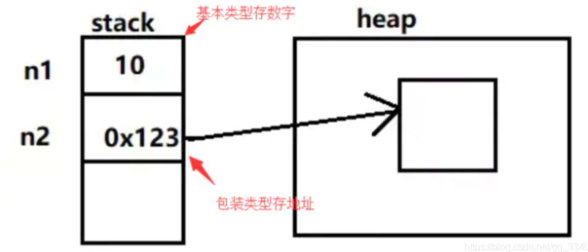

**4.自动装箱和自动拆箱**

有了基本类型和包装类型，肯定有些时候要在它们之间进行转换。 把基本类型转换成包装类型的过程叫做装箱。 反之，把包装类型转换成基本类型的过程叫做拆箱, 在 Java SE5 之前，开发人员要手动进行装拆箱

## int 和 Integer

```java
public static void main(String[] args) {  
    Integer i1 = 100;
    Integer i2 = 100;
    // i1 == i2?
    Integer i3 = 128;
    Integer i4 = 128;
  // i3 == i4?
}
```

答案：

i1 == i2为true

i3 == i4为false

在Interger类中，存在一个静态内部类IntegerCache， 该类中存在一个Integer cache[]， 并且存在一个static块，会在加载类的时候执行，会将-128至127这些数字提前生成Integer对象，并缓存在cache数组中，当我们在定义Integer数字时，会调用Integer的valueOf方法，valueOf方法会判断所定义的数字是否在-128至127之间，如果存在则直接从cache数组中获取Integer对象，如果超过，则生成一个新的 Integer 对象。

## 简述内部类、静态内部类、匿名内部类的区别

**成员内部类：**

成员内部类可访问外部类所有的方法和成员变量。

不能有静态方法和静态成员变量。  ( static 成员变量，必须同时使用 final 和 static 修饰。)

在外部类的静态方法和外部类以外的其他类中，必须通过外部类的实例创建内部类的实例。

在外部类中不能直接访问内部类的成员，而必须通过内部类的实例去访问。

**局部内部类：**

`在方法中定义的内部类称为局部内部类`。与局部变量类似，局部内部类不能有访问说明符，因为它不是外围类的一部分，但是它可以访问当前代码块内的常量，和此外围类所有的成员。

需要注意的是：

　　(1)、局部内部类只能在定义该内部类的方法内实例化，不可以在此方法外对其实例化。

　　(2)、局部内部类对象不能使用该内部类所在方法的非final局部变量。

**静态内部类：**

只能访问外部类的静态成员变量与静态方法。

静态内部类的非静态成员可访问外部类的静态变量，而不可访问外部类的非静态变量。

在创建静态内部类的实例时，不需要创建外部类的实例。

**匿名内部类：**

**类的定义和对象的实例化同时进行。**

1、匿名内部类不能定义任何静态成员、方法。

2、匿名内部类中的方法不能是抽象的；

3、匿名内部类必须实现接口或抽象父类的所有抽象方法。

4、匿名内部类不能定义构造器；

5、匿名内部类访问的外部类成员变量或成员方法必须用static修饰；

6、内部类可以访问外部类私有变量和方法。

## 接口和抽象类的区别是什么？

1. 接口的方法默认是 public ，所有方法在接口中不能有实现(Java 8 开始接口方法可以有默认实现），而抽象类可以有非抽象的方法。
2. 接口中除了 static  final  变量，不能有其他变量，而抽象类中则不一定。
3. 一个类可以实现多个接口，但只能实现一个抽象类。接口自己本身可以通过 extends  关键字扩展多个接口。
4. 接口方法默认修饰符是 public ，抽象方法可以有 public 、 protected  和 default  这些修饰符（抽象方法就是为了被重写所以不能使用 private  关键字修饰！）。
5. 从设计层面来说，抽象是对类的抽象，是一种模板设计，而接口是对行为的抽象，是一种行为的规范。

> 总结一下 jdk7~jdk9 Java 中接口概念的变化：
>
> 1. 在 jdk 7 或更早版本中，接口里面只能有常量变量和抽象方法。这些接口方法必须由选择实现接口的类实现。
> 2. jdk 8 的时候接口可以有默认方法和静态方法功能。
> 3. jdk 9 在接口中引入了私有方法和私有静态方法。

## 成员变量与局部变量的区别有哪些？

1. **从语法形式上看**：**成员变量是属于类的，而局部变量是在方法中定义的变量或是方法的参数；**成员变量可以被 public , private , static  等修饰符所修饰，而局部变量不能被访问控制修饰符及 static  所修饰；但是，成员变量和局部变量都能被 final  所修饰。
2. **从变量在内存中的存储方式来看：**如果成员变量是使用 static 修饰的，那么这个成员变量是属于类的，如果没有使用 static 修饰，这个成员变量是属于实例的。对象存于堆内存，如果局部变量类型为基本数据类型，那么存储在栈内存，如果为引用数据类型，那存放的是指向堆内存对象的引用或者是指向常量池中的地址。
3. **从变量在内存中的生存时间上看**：**成员变量是对象的一部分，它随着对象的创建而存在，而局部变量随着方法的调用而自动消失。**
4. **成员变量如果没有被赋初值：**则会自动以类型的默认值而赋值（一种情况例外:被 final  修饰的成员变量也必须显式地赋值），而局部变量则不会自动赋值。

## == 与 equals 的区别？

== : 它的作用是判断两个对象的地址是不是相等。即，判断两个对象是不是同一个对象(基本数据类型==比较的是值，引用数据类型==比较的是内存地址)。

equals() : 它的作用也是判断两个对象是否相等。但它一般有两种使用情况：

- 情况 1：类没有覆盖 equals() 方法。则通过 equals() 比较该类的两个对象时，等价于通过“==”比较这两个对象。
- 情况 2：类覆盖了 equals() 方法。一般，我们都覆盖 equals() 方法来比较两个对象的内容是否相等；若它们的内容相等，则返回 true (即，认为这两个对象相等)。

```java
public class test1 {
    public static void main(String[] args) {
        String a = new String("ab"); // a 为一个引用
        String b = new String("ab"); // b为另一个引用,对象的内容一样
        String aa = "ab"; // 放在常量池中
        String bb = "ab"; // 从常量池中查找
        if (aa == bb) // true
            System.out.println("aa==bb");
        if (a == b) // false，非同一对象
            System.out.println("a==b");
        if (a.equals(b)) // true
            System.out.println("aEQb");
        if (42 == 42.0) { // true
            System.out.println("true");
        }
    }
}
```

**说明：**
String 中的 equals 方法是被重写过的，因为 object 的 equals 方法是比较的对象的内存地址，而 String 的 equals 方法比较的是对象的值。

当创建 String 类型的对象时，虚拟机会在常量池中查找有没有已经存在的值和要创建的值相同的对象，如果有就把它赋给当前引用。如果没有就在常量池中重新创建一个 String 对象。

## hashCode 与 equals ？

`hashCode() ` 的作用是获取哈希码，也称为散列码；它实际上是返回一个 int 整数。这个哈希码的作用是确定该对象在哈希表中的索引位置。` hashCode()` 定义在 JDK 的 Object  类中，这就意味着 Java 中的任何类都包含有 `hashCode()`  函数。另外需要注意的是： Object  的 `hashcode() `方法是本地方法，也就是用 c 语⾔或 c++ 实现的，该方法通常用来将对象的内存地址转换为整数之后返回。

**为什么要有 hashCode？**

我们以“ HashSet  如何检查重复”为例子来说明为什么要有 hashCode？

当你把对象加入 HashSet  时， HashSet  会先计算对象的 hashcode 值来判断对象加入的位置，同时也会与其他已经加入的对象的 hashcode 值作比较，如果没有相符的 hashcode， HashSet  会假设对象没有重复出现。但是如果发现有相同 hashcode 值的对象，这时会调用 equals()  方法来检查 hashcode 相等的对象是否真的相同。如果两者相同， HashSet  就不会让其加入操作成功。如果不同的话，就会重新散列到其他位置。这样我们就大大减少了 equals 的次数，相应就大大提高了执行速度。

两个对象有相同的 hashcode 值，它们也不一定是相等。

**请你解释Object若不重写hashCode()的话，hashCode()如何计算出来的？**

Object 的 hashcode 方法是本地方法，也就是用 c 或 c++ 实现的，该方法直接返回对象的内存地址。
如果没有重写hashCode()，则任何对象的hashCode()值都不相等（而Hashmap想让部分值的hashCode值一样，所以就要重写）。

**为什么在Java中重写equals()方法同时要重写hashcode()方法？**

由上个问题知道没有重写hashCode()，则任何对象的hashCode()值都不相等。

HashMap中的比较key是这样的，先求出key的hashcode()，比较其值是否相等，若相等再比较equals(),若相等则认为他们是相等的。若equals()不相等则认为他们不相等。

如果只重写equals没有重写hashCode()，就会导致相同的key值也被hashcode认为是不同的key值（因为没有重写hashCode()，则任何对象的hashCode() 值都不相等），就会在HashMap中存储相同的key值（map中key值不能相同），这就不符合条件了。

**equals和hashcode的关系:**

1、如果两个对象相同（即用equals比较返回true），那么它们的hashCode值一定要相同；

2、如果两个对象的hashCode相同，它们并不一定相同(即用equals比较返回false)

## Error与Exception的区别

在 Java 中，所有的异常都有一个共同的祖先 Throwable（可抛出）。

**Throwable**： 有两个重要的子类：Exception（异常）和 Error（错误），二者都是 Java 异常处理的重要子类，各自都包含大量子类。异常和错误的区别是：异常能被程序本身可以处理，错误是无法处理。

**Error（错误）:** 是程序无法处理的错误，表示运行应用程序中较严重问题。大多数错误与代码编写者执行的操作无关，而表示代码运行时 JVM（Java 虚拟机）出现的问题。例如，Java虚拟机运行错误（Virtual MachineError），当 JVM 不再有继续执行操作所需的内存资源时，将出现 OutOfMemoryError。这些异常发生时，Java虚拟机（JVM）一般会选择线程终止。这些错误表示故障发生于虚拟机自身、或者发生在虚拟机试图执行应用时，如Java虚拟机运行错误（Virtual MachineError）、类定义错误（NoClassDefFoundError）等。这些错误是不可查的，因为它们在应用程序的控制和处理能力之 外，而且绝大多数是程序运行时不允许出现的状况。对于设计合理的应用程序来说，即使确实发生了错误，本质上也不应该试图去处理它所引起的异常状况。在 Java中，错误通过Error的子类描述。

**Exception（异常）:**  是程序本身可以处理的异常。Exception 类有一个重要的子类 RuntimeException。RuntimeException 类及其子类表示“JVM 常用操作”引发的错误。例如，若试图使用空值对象引用、除数为零或数组越界，则分别引发运行时异常（NullPointerException、ArithmeticException）和 ArrayIndexOutOfBoundException。

**Exception（异常）分两大类：运行时异常和非运行时异常(编译异常)。**程序中应当尽可能去处理这些异常。

1. **运行时异常：**都是RuntimeException类及其子类异常，如NullPointerException(空指针异常)、IndexOutOfBoundsException(下标越界异常)等，这些异常是不检查异常，程序中可以选择捕获处理，也可以不处理。这些异常一般是由程序逻辑错误引起的，程序应该从逻辑角度尽可能避免这类异常的发生。运行时异常的特点是Java编译器不会检查它，也就是说，当程序中可能出现这类异常，即使没有用try-catch语句捕获它，也没有用throws子句声明抛出它，也会编译通过。
2. **非运行时异常 （编译异常）：**是RuntimeException以外的异常，类型上都属于Exception类及其子类。从程序语法角度讲是必须进行处理的异常，如果不处理，程序就不能编译通过。如IOException、SQLException等以及用户自定义的Exception异常，一般情况下不自定义检查异常。

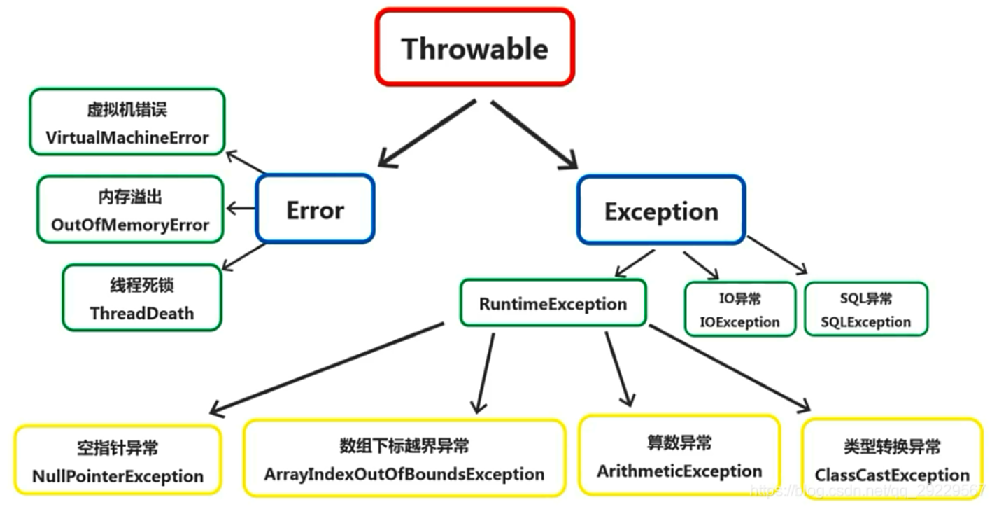

## 获取用键盘输入常用的两种方法？

**方法 1：通过 Scanner**

```java
Scanner input = new Scanner(System.in);
String s  = input.nextLine();
input.close();
```

**方法 2：通过 BufferedReader**

```java
BufferedReader input = new BufferedReader(new InputStreamReader(System.in));
String s = input.readLine();
```

## Java中的IO流分为几种？

**Java 中 IO 流分为几种?**

- 按照流的流向分，可以分为输入流和输出流；
- 按照操作单元划分，可以划分为字节流和字符流；
- 按照流的角色划分为节点流和处理流。

> InputStream/Reader: 所有的输入流的基类，前者是字节输入流，后者是字符输入流。
>
> OutputStream/Writer: 所有输出流的基类，前者是字节输出流，后者是字符输出流。

**按操作方式分类结构图：**

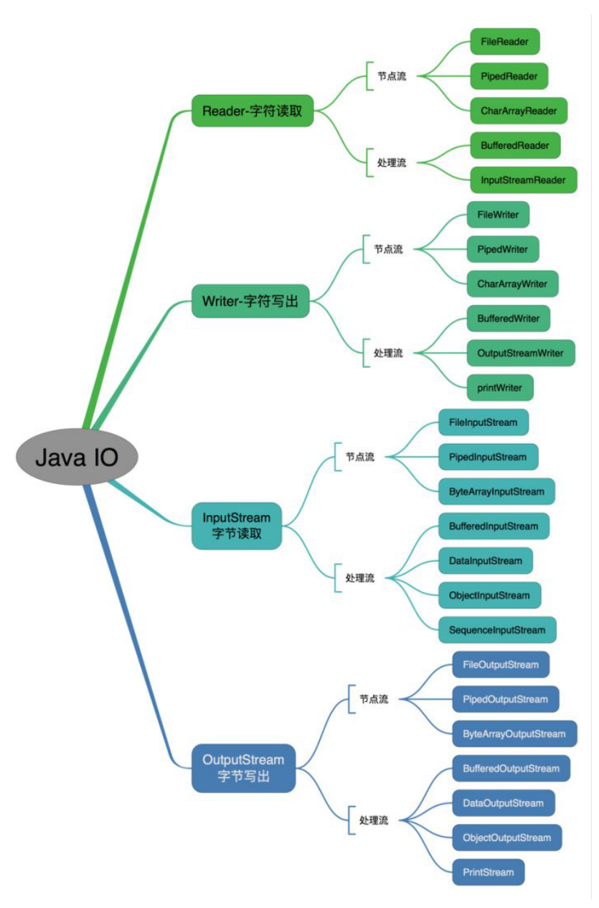

**按操作对象分类结构图：**

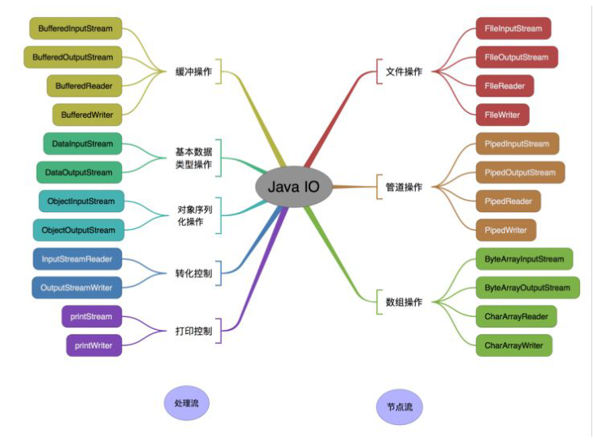

## 既然有了字节流、为什么还要有字符流?

问题本质想问：不管是文件读写还是网络发送接收，信息的最小存储单元都是字节，那为什么 I/O 流操作要分为字节流操作和字符流操作呢？

回答：字符流是由 Java 虚拟机将字节转换得到的，问题就出在这个过程还算是非常耗时，并且，如果我们不知道编码类型就很容易出现乱码问题。所以， I/O 流就干脆提供了一个直接操作字符的接口，方便我们平时对字符进行流操作。如果音频文件、图片等媒体文件用字节流比较好，如果涉及到字符的话使用字符流比较好。

## IO 操作

> IO分两阶段（一旦拿到数据后就变成了数据操作，不再是IO）：
>
> 1. 数据准备阶段
> 2. 内核空间复制数据到用户进程缓冲区（用户空间）阶段

在操作系统中，程序运行的空间分为内核空间和用户空间，应用程序都是运行在用户空间的，所以它们能操作的数据也都在用户空间。

**阻塞IO和非阻塞IO的区别在于第一步发起IO请求是否会被阻塞：**

如果阻塞直到完成那么就是传统的阻塞IO，如果不阻塞，那么就是非阻塞IO。

一般来讲：阻塞IO模型、非阻塞IO模型、IO复用模型(select/poll/epoll)、信号驱动IO模型都属于同步IO，因为阶段2是阻塞的(尽管时间很短)。

**同步IO和异步IO的区别就在于第二个步骤是否阻塞：**

如果不阻塞，而是操作系统帮你做完IO操作再将结果返回给你，那么就是异步IO

> 同步和异步IO的概念：
>
> - 同步是用户线程发起I/O请求后需要等待或者轮询内核I/O操作完成后才能继续执行
> - 异步是用户线程发起I/O请求后仍需要继续执行，当内核I/O操作完成后会通知用户线程，或者调用用户线程注册的回调函数
>
> 阻塞和非阻塞IO的概念：
>
> - 阻塞是指I/O操作需要彻底完成后才能返回用户空间
> - 非阻塞是指I/O操作被调用后立即返回一个状态值，无需等I/O操作彻底完成

## 什么是同步、异步、阻塞、非阻塞？

先来个例子理解一下概念，以银行取款为例：

**同步 ：** 自己亲自出马持银行卡到银行取钱（**使用同步IO时，Java自己处理IO读写**）；

**异步 ：** 委托一小弟拿银行卡到银行取钱，然后给你（**使用异步IO时，Java将IO读写委托给OS处理，需要将数据缓冲区地址和大小传给OS(银行卡和密码)**）；

**阻塞 ：** ATM排队取款，你只能等待（**使用阻塞IO时，Java调用会一直阻塞到读写完成才返回**）；

**非阻塞 ：** 柜台取款，取个号，然后坐在椅子上做其它事，等号广播会通知你办理，没到号你就不能去，你可以不断问大堂经理排到了没有，大堂经理如果说还没到你就不能去（**使用非阻塞IO时，如果不能读写 Java 调用会马上返回，当 IO 事件分发器会通知可读写时再继续进行读写，不断循环直到读写完成**）

**同步阻塞IO：** 在此种方式下，用户进程在发起一个IO操作以后，必须等待IO操作的完成，只有当真正完成了IO操作以后，用户进程才能运行。JAVA传统的IO模型属于此种方式！

**同步非阻塞IO：** 在此种方式下，用户进程发起一个 IO 操作以后边可返回做其它事情，但是用户进程需要时不时的询问 IO 操作是否就绪，这就要求用户进程不停的去询问，从而引入不必要的 CPU 资源浪费。JAVA的NIO就属于同步非阻塞IO。

**异步非阻塞IO：** 在此种模式下，用户进程只需要发起一个IO操作然后立即返回，等IO操作真正的完成以后，应用程序会得到IO操作完成的通知，此时用户进程只需要对数据进行处理就好了，不需要进行实际的IO读写操作，因为真正的IO读取或者写入操作已经由内核完成了。Java AIO属于这种异步非阻塞模型。

**IO多路复用**

**select：** 轮询，遍历所有连接，调用对应设备驱动的poll函数，检测读流、写流、异常流。容量是固定的，连接数有限制。

**poll**：轮询，和select差不多，但是它对fd集合做了优化，使用链表存储，解决了连接数上限的问题。

**epoll**：**epoll最大的优化就是让就绪的fd执行回调函数，不需要再去fd集合轮询哪些fd就绪了**。epoll是在2.6内核中提出的，是之前的select和poll的增强版本。相对于select和poll来说，**epoll更加灵活，没有描述符限制。epoll使用一个文件描述符管理多个描述符，将用户关系的文件描述符的事件存放到内核的一个事件表中，这样在用户空间和内核空间的copy只需一次。**

调用`epoll_create`创建句柄，并采用红黑树而不是数组来存储描述符和事件，用双向链表rdllist存放准备就绪的事件；

调用`epoll_ctl`添加监听事件时，若红黑树中没有相应的节点，增加节点，并新增回调函数。每当有事件中断来临时，调用回调函数向双向链表rdllist中插入数据；

调用`epoll_wait`返回或判断rdllist中的数据，便可以得到事件完成的描述符。

epoll两种工作模式：水平触发，边缘触发。红黑树和双向链表都存在内核cache中，避免额外开销。

- **LT模式**：当epoll_wait检测到描述符事件发生并将此事件通知应用程序，**应用程序可以不立即处理该事件**。下次调用epoll_wait时，会再次响应应用程序并通知此事件。
- **ET模式**：当epoll_wait检测到描述符事件发生并将此事件通知应用程序，**应用程序必须立即处理该事件**。如果不处理，下次调用epoll_wait时，不会再次响应应用程序并通知此事件。

## BIO、NIO、AIO 有什么区别?

**Java 中 3 种常⻅ IO 模型:**

- **BIO 属于同步阻塞 IO 模型 。**
  同步阻塞 IO 模型中，应用程序发起 read 调用后，会一直阻塞，直到在内核把数据拷贝到用户空间。

  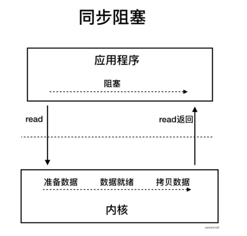
- 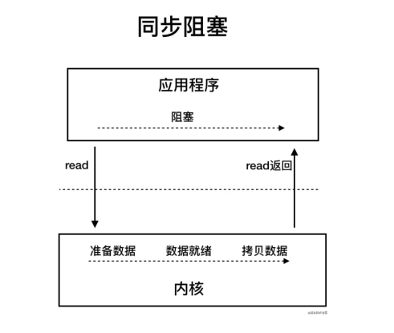
- **NIO (Non-blocking/New I/O): 同步非阻塞的 I/O。**
  同步非阻塞 IO 模型中，应用程序会一直发起 read 调用，等待数据从内核空间拷贝到用户空间的这段时间里，线程依然是阻塞的，直到在内核把数据拷贝到用户空间。 相比于同步阻塞 IO 模型，同步非阻塞 IO 模型确实有了很大改进。通过轮询操作，避免了一直阻塞。

  但是，这种 IO 模型同样存在问题：**应用程序不断进行 I/O 系统调用轮询数据是否已经准备好的过程是⼗分消耗 CPU 资源的。**

  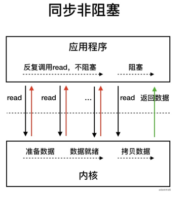

  **I/O 多路复用模型**

  IO 多路复用模型中，线程首先发起 select 调用，询问内核数据是否准备就绪，等内核把数据准备好了，用户线程再发起 read 调用。read 调用的过程（数据从内核空间->用户空间）还是阻塞的。

  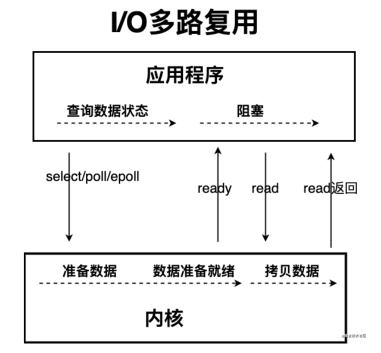

  Java 中的 NIO 于 Java 1.4 中引入，对应 java.nio  包，提供了 Channel  , Selector， Buffer  等抽象。NIO 中的 N 可以理解为 Non-blocking，不单纯是 New。它支持面向缓冲的，基于通道的 I/O 操作方法。 对于高负载、高并发的（网络）应用，应使用 NIO 。

  Java 中的 NIO 可以看作是 I/O 多路复用模型。也有很多⼈认为，Java 中的 NIO 属于同步非阻塞 IO 模型。

  > **Java NIO 主要有三大核心部分： Channel(通道)， Buffer(缓冲区)， Selector（选择器）。**
  >
  > 传统 IO 基于字节流和字符流进行操作， 而 NIO 基于 Channel 和 Buffer(缓冲区)进行操作，数据总是从通道读取到缓冲区中，或者从缓冲区写入到通道中。 Selector(选择区)用于监听多个通道的事件（比如：连接打开，数据到达）。因此，单个线程可以监听多个数据通道。  NIO 和传统 IO 之间第一个最大的区别是， IO 是面向流的， NIO 是面向缓冲区的。
  >

  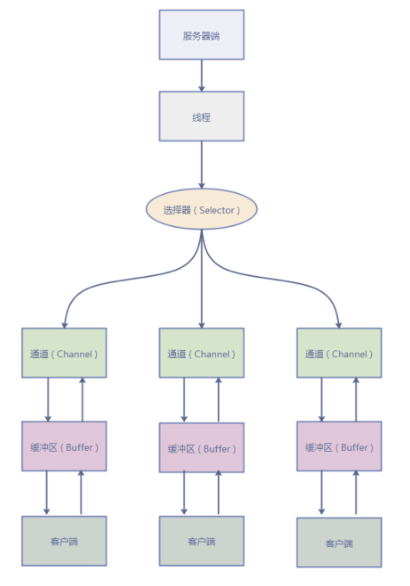
- **AIO (Asynchronous I/O): 异步非阻塞的 IO。**在 Java 7 中引入了 NIO 的改进版 NIO 2。异步 IO 是基于事件和回调机制实现的，也就是应用操作之后会直接返回，不会堵塞在那里，当后台处理完成，操作系统会通知相应的线程进行后续的操作。

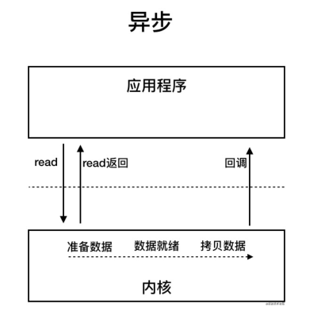

[Linux内核之 I/O多路复用 ](https://www.cnblogs.com/orange-CC/p/13571016.html)

## java中是值传递引用传递？

理论上说，java都是引用传递，对于基本数据类型，传递是值的副本，而不是值本身。对于对象类型，传递是对象的引用，当在一个方法操作操作参数的时候，其实操作的是引用所指向的对象。

## 形参与实参区别

**实参(argument)：**

全称为"实际参数"是在调用时传递给函数的参数，实参可以是常量、变量、表达式、函数等， 无论实参是何种类型的量，在进行函数调用时，它们都必须具有确定的值， 以便把这些值传送给形参。 因此应预先用赋值，输入等办法使实参获得确定值。

**形参(parameter)：**

全称为"形式参数" 由于它不是实际存在变量，所以又称虚拟变量。是在定义函数名和函数体的时候使用的参数,目的是用来接收调用该函数时传入的参数.在调用函数时，实参将赋值给形参。因而，必须注意实参的个数，类型应与形参一一对应，并且实参必须要有确定的值。

> 实参出现在主调函数中，进入被调函数后，实参变量也不能使用。
>
> 形参出现在函数定义中，在整个函数体内都可以使用， 离开该函数则不能使用。
>
> **形参和实参的功能是作数据传送。发生函数调用时， 主调函数把实参的值传送给被调函数的形参从而实现主调函数向被调函数的数据传送。**

1. **形参变量只有在被调用时才分配内存单元，在调用结束时， 即刻释放所分配的内存单元。**因此，参只有在函数内部有效。 函数调用结束返回主调函数后则不能再使用该形参变量。
2. **实参可以是常量、变量、表达式、函数等， 无论实参是何种类型的量，在进行函数调用时，它们都必须具有确定的值，** 以便把这些值传送给形参。 因此应预先用赋值，输入等办法使实参获得确定值。
3. **实参和形参在数量上，类型上，顺序上应严格一致， 否则会发生“类型不匹配”的错误。**
4. **函数调用中发生的数据传送是单向的。** 即只能把实参的值传送给形参，而不能把形参的值反向地传送给实参。 因此在函数调用过程中，形参的值发生改变，而实参中的值不会变化。
5. 当形参和实参不是指针类型时，在该函数运行时，形参和实参是不同的变量，他们在内存中位于不同的位置，形参将实参的内容复制一份，在该函数运行结束的时候形参被释放，而实参内容不会改变。而如果函数的参数是指针类型变量,在调用该函数的过程中，传给函数的是实参的地址，在函数体内部使用的也是实参的地址，即使用的就是实参本身。所以在函数体内部可以改变实参的值。

## 深拷贝 vs 浅拷贝？

1. 浅拷贝：对基本数据类型进行值传递，对引用数据类型进行引用传递般的拷贝，此为浅拷贝。
2. 深拷贝：对基本数据类型进行值传递，对引用数据类型，创建一个新的对象，并复制其内容，此为深拷贝。

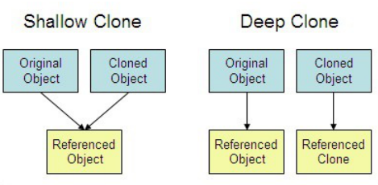

## 如何实现对象的克隆？

有两种方式：

1). 实现 Cloneable 接口并重写 Object 类中的 clone()方法；

2). 实现 Serializable 接口，通过对象的序列化和反序列化实现克隆，可以实现真正的深度克隆。

## 什么是泛型？为什么要使用泛型？

泛型，即“参数化类型”。

一提到参数，最熟悉的就是定义方法时有形参，然后调用此方法时传递实参。那么参数化类型怎么理解呢？顾名思义，就是将类型由原来的具体的类型参数化，类似于方法中的变量参数，此时类型也定义成参数形式（可以称之为类型形参），然后在使用/调用时传入具体的类型（类型实参）。

泛型的本质是为了参数化类型（在不创建新的类型的情况下，通过泛型指定的不同类型来控制形参具体限制的类型）。也就是说在泛型使用过程中，操作的数据类型被指定为一个参数，这种参数类型可以用在类、接口和方法中，分别被称为泛型类、泛型接口、泛型方法。

## 什么是反射

Java反射就是在运行状态中，对于任意一个类，都能够知道这个类的所有属性和方法；对于任意一个对象，都能够调用它的任意方法和属性；并且能改变它的属性。

**反射能做什么？**

我们知道反射机制允许程序在运行时取得任何一个已知名称的class的内部信息，包括包括其modifiers(修饰符)，fields(属性)，methods(方法)等，并可于运行时改变fields内容或调用methods。那么我们便可以更灵活的编写代码，代码可以在运行时装配，无需在组件之间进行源代码链接，降低代码的耦合度；还有动态代理的实现等等；但是需要注意的是反射使用不当会造成很高的资源消耗！

## 反射的实现，获取Class类的方式

1. 使用 Class 类的 forName 静态方法

   ```java
   Class aClass1 = Class.forName("java.lang.String");
   ```
2. 任何数据类型（包括基本的数据类型）都有一个“静态”的class属性

   ```java
   Class aClass2 = String.class;
   ```
3. 使用对象的getClass()方法

   ```java
   Class aClass3 = "hello".getClass();
   ```
4. 通过类加载器ClassLoader的loadClass方法

   ```java
   ClassLoader cl = this.getClass().getClassLoader();
   Class aClass4 = cl.loadClass("类的全类名");
   ```

## 反射中，Class.forName和ClassLoader区别

（1）Class.forName除了将类的.class文件加载到jvm中之外，还会对类进行解释，执行类中的static块。

（2）而classloader只干一件事情，就是将.class文件加载到jvm中，不会执行static中的内容，只有在newInstance才会去执行static块。

> Class.forName(name,initialize,loader)带参数也可控制是否加载static块。并且只有调用了newInstance()方法采用调用构造函数，创建类的对象。

ClassLoader就是遵循双亲委派模型最终调用启动类加载器的类加载器，实现的功能是“通过一个类的全限定名来获取描述此类的二进制字节流”，获取到二进制流后放到JVM中。Class.forName()方法实际上也是调用的CLassLoader来实现的。

## Java 反射 API

**反射 API 用来生成 JVM 中的类、接口或则对象的信息。**

1. Class 类：反射的核心类，可以获取类的属性，方法等信息。
2. Field 类：Java.lang.reflec 包中的类，表示类的成员变量，可以用来获取和设置类之中的属性值。
3. Method 类： Java.lang.reflec 包中的类，表示类的方法，它可以用来获取类中的方法信息或者执行方法。
4. Constructor 类： Java.lang.reflec 包中的类，表示类的构造方法。

```java
//获取 Person 类的 Class 对象
 Class clazz=Class.forName("reflection.Person");
//获取 Person 类的所有方法信息
 Method[] method=clazz.getDeclaredMethods();
 for(Method m:method){
    System.out.println(m.toString());
 }
 //获取 Person 类的所有成员属性信息
 Field[] field=clazz.getDeclaredFields();
 for(Field f:field){
    System.out.println(f.toString());
 }
 //获取 Person 类的所有构造方法信息
 Constructor[] constructor=clazz.getDeclaredConstructors();
 for(Constructor c:constructor){
    System.out.println(c.toString());
 
```

## 如何利用反射动态创建对象实例

**Class 对象的 newInstance()**

1. 使用 Class 对象的 newInstance()方法来创建该 Class 对象对应类的实例，但是这种方法要求
   该 Class 对象对应的类有默认的空构造器。

**调用 Constructor 对象的 newInstance()**

2. 先使用 Class 对象获取指定的 Constructor 对象，再调用 Constructor 对象的 newInstance()
   方法来创建 Class 对象对应类的实例,通过这种方法可以选定构造方法创建实例。

```java
//获取 Person 类的 Class 对象
 Class clazz=Class.forName("reflection.Person"); 
 //使用.newInstane 方法创建对象
 Person p=(Person) clazz.newInstance();
//获取构造方法并创建对象
 Constructor c=clazz.getDeclaredConstructor(String.class,String.class,int.class);
 //创建对象并设置属性 
 Person p1=(Person) c.newInstance("李四","男",20);
```

## 什么是java序列化，如何实现序列化？

**序列化就是一种用来处理对象流的机制，所谓对象流也就是将对象的内容进行流化。**

可以对流化后的对象进行读写操作，也可将流化后的对象传输于网络之间。序列化是为了解决在对对象流进行读写操作时所引发的问题。

### 序列化的实现

将需要被序列化的类实现`Serializable`接口，该接口没有需要实现的方法，`implements Serializable`只是为了标注该对象是可被序列化的，然后使用一个输出流(如：`FileOutputStream`)来构造一个`ObjectOutputStream`(对象流)对象，接着，使用`ObjectOutputStream`对象的`writeObject(Object obj)`方法就可以将参数为`obj`的对象写出(即保存其状态)，要恢复的话则用输入流。

**序列化对象以字节数组保持--静态成员不保存**

使用 Java 对象序列化， 在保存对象时，会把其状态保存为一组字节，在未来， 再将这些字节组装成对象。必须注意地是， 对象序列化保存的是对象的”状态”，即它的成员变量。由此可知，对象序列化不会关注类中的静态变量。

要想将父类对象也序列化，就需要让父类也实现 Serializable 接口。

### Transient 关键字

Transient 关键字阻止该变量被序列化到文件中：

1. 在变量声明前加上 Transient 关键字，可以阻止该变量被序列化到文件中，在被反序列化后， transient 变量的值被设为初始值，如 int 型的是 0，对象型的是 null。
2. 服务器端给客户端发送序列化对象数据，对象中有一些数据是敏感的，比如密码字符串等，希望对该密码字段在序列化时，进行加密，而客户端如果拥有解密的密钥，只有在客户端进行反序列化时，才可以对密码进行读取，这样可以一定程度保证序列化对象的数据安全。

## 什么是注解？

Annotation（注解）是 Java 提供的一种对元程序中元素关联信息和元数据（metadata）的途径和方法。 Annatation(注解)是一个接口，程序可以通过反射来获取指定程序中元素的 Annotation对象，然后通过该 Annotation 对象来获取注解中的元数据信息。

**4 种标准元注解是哪四种？**

元注解的作用是负责注解其他注解。

1. **@Target 修饰的对象范围：** 可被用于 packages、types（类、接口、枚举、Annotation 类型）、类型成员（方法、构造方法、成员变量、枚举值）、方法参数和本地变量（如循环变量、catch 参数）。
2. **@Retention 定义 被保留的时间长短：** 表示需要在什么级别保存注解信息，用于描述注解的生命周期（即：被描述的注解在什么范围内有效），取值（RetentionPoicy）有：SOURCE:在源文件中有效（即源文件保留）、CLASS:在 class 文件中有效（即 class 保留）、RUNTIME:在运行时有效（即运行时保留）。
3. **@Documented 描述-javadoc：**@Documented 用于描述其它类型的 annotation 应该被作为被标注的程序成员的公共 API，因此可以被例如 javadoc 此类的工具文档化。
4. **@Inherited 阐述了某个被标注的类型是被继承的：** 如果一个使用了@Inherited 修饰的 annotation 类型被用于一个 class，则这个 annotation 将被用于该class 的子类。

## JDK 1.8 的新特性

- **Lambda 表达式** − Lambda 允许把函数作为一个方法的参数（函数作为参数传递到方法中）。
- **方法引用** − 方法引用提供了非常有用的语法，可以直接引用已有Java类或对象（实例）的方法或构造器。与lambda联合使用，方法引用可以使语言的构造更紧凑简洁，减少冗余代码。
- **默认方法** − 默认方法就是一个在接口里面有了一个实现的方法。
- **新工具** − 新的编译工具，如：Nashorn引擎 jjs、 类依赖分析器jdeps。
- **Stream API** −新添加的Stream API（java.util.stream） 把真正的函数式编程风格引入到Java中。
- **Date Time API** − 加强对日期与时间的处理。
- **Optional 类** − Optional 类已经成为 Java 8 类库的一部分，用来解决空指针异常。
- **Nashorn, JavaScript 引擎** − Java 8提供了一个新的Nashorn javascript引擎，它允许我们在JVM上运行特定的javascript应用。
