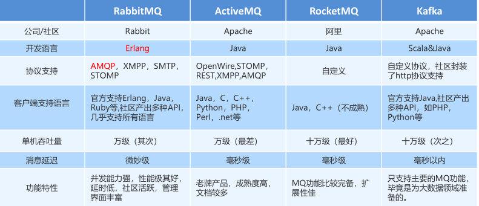
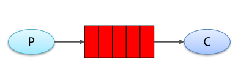
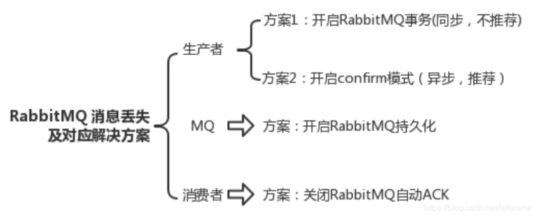
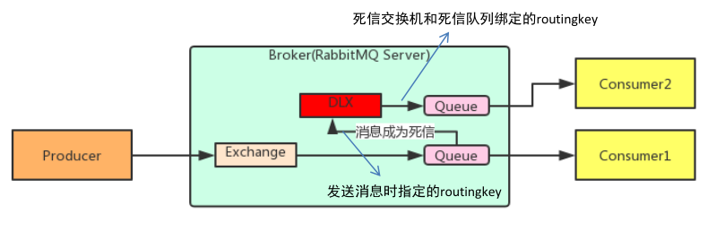

# RabbitMQ

## 什么是 rabbitmq?

采用 AMQP (Advanced Message Queuing Protocol，高级消息队列协议）的一种消息队列技术,最大的特点就是消费并不需要确保提供方存在，实现了服务之间的高度解耦。

RabbitMQ的基础架构如下：

## 为什么要使用 rabbitmq？

1. 在分布式系统下具备异步、削峰、负载均衡等一系列高级功能；
2. 拥有持久化的机制，进程消息，队列中的信息也可以保存下来。
3. 实现消费者和生产者之间的解耦。
4. 对于高并发场景下，利用消息队列可以使得同步访问变为串行访问达到一定量的限流，利于数据库的操作。
5. 可以使用消息队列达到异步下单的效果，排队中，后台进行逻辑下单

## 使用 rabbitmq 的场景

1. 服务间异步通信
2. 顺序消费
3. 定时任务
4. 请求削峰

## Kafka、ActiveMQ、RabbitMQ、RocketMQ 都有什么区别？

对于吞吐量来说kafka和RocketMQ支撑高吞吐，ActiveMQ和RabbitMQ比他们低一个数量级。对于延迟量来说RabbitMQ是最低的。

## mq 的缺点

**系统可用性降低**

系统引入的外部依赖越多，越容易挂掉，本来你就是 A 系统调用 BCD 三个系统的接口就好了，人 ABCD 四个系统好好的，没啥问题，你偏加个 MQ 进来，万一MQ 挂了怎么办？

**系统复杂性提高**

硬生生加个 MQ 进来，你怎么保证消息没有重复消费？怎么处理消息丢失的情况？怎么保证消息传递的顺序性？

**一致性问题**

A 系统处理完了直接返回成功了，人都以为你这个请求就成功了；但是问题是，要是 BCD 三个系统那里，BD 两个系统写库成功了，结果 C 系统写库失败了，你这数据就不一致了。

所以消息队列实际是一种非常复杂的架构，你引入它有很多好处，但是也得针对它带来的坏处做各种额外的技术方案和架构来规避掉。

## RabbitMQ 中的相关概念

- **Broker：**接收和分发消息的应用，RabbitMQ Server就是 Message Broker。
- **Virtual host：**出于多租户和安全因素设计的，把 AMQP 的基本组件划分到一个虚拟的分组中，类似于网络中的 namespace 概念。当多个不同的用户使用同一个 RabbitMQ server 提供的服务时，可以划分出多个vhost，每个用户在自己的 vhost 创建 exchange／queue 等。
- **Connection：**publisher／consumer 和 broker 之间的 TCP 连接。
- **Channel：**如果每一次访问 RabbitMQ 都建立一个 Connection，在消息量大的时候建立 TCP Connection的开销将是巨大的，效率也较低。Channel 是在 connection 内部建立的逻辑连接，如果应用程序支持多线程，通常每个thread创建单独的 channel 进行通讯，AMQP method 包含了channel id 帮助客户端和message broker 识别 channel，所以 channel 之间是完全隔离的。Channel 作为轻量级的 Connection 极大减少了操作系统建立 TCP connection 的开销。
- **Exchange：**message 到达 broker 的第一站，根据分发规则，匹配查询表中的 routing key，分发消息到queue 中去。常用的类型有：direct (point-to-point), topic (publish-subscribe) and fanout (multicast)。
- **Queue：**消息最终被送到这里等待 consumer 取走。
- **Binding：**exchange 和 queue 之间的虚拟连接，binding 中可以包含 routing key。Binding 信息被保存
  到 exchange 中的查询表中，用于 message 的分发依据。

## RabbitMQ  6 种工作模式

RabbitMQ 提供了 6 种工作模式：简单模式、work queues、Publish/Subscribe 发布与订阅模式、Routing路由模式、Topics 主题模式、RPC 远程调用模式（远程调用，不太算 MQ；暂不作介绍）。（现在好像又多了一种Publisher Confirms 模式，详细信息看下面的官方链接）

官网对应模式介绍：https://www.rabbitmq.com/getstarted.html

### 简单模式(Hello World)：

在上图的模型中，有以下概念：

- P：生产者，也就是要发送消息的程序
- C：消费者：消息的接收者，会一直等待消息到来
- queue：消息队列，图中红色部分。类似一个邮箱，可以缓存消息；生产者向其中投递消息，消费者从其中取出消息

### 工作队列模式(Work queues)：

- Work Queues：与入门程序的简单模式相比，多了一个或一些消费端，多个消费端共同消费同一个队列中的消息。消费者之间对于同一个消息的关系是`竞争`的关系。
- 应用场景：对于任务过重或任务较多情况使用工作队列可以提高任务处理的速度。

### 订阅模式( Pub/Sub):

在订阅模型中，多了一个 Exchange 角色，而且过程略有变化：

- P：生产者，也就是要发送消息的程序，但是不再发送到队列中，而是发给X（交换机）
- C：消费者，消息的接收者，会一直等待消息到来
- Queue：消息队列，接收消息、缓存消息

Exchange：交换机（X）。一方面，接收生产者发送的消息。另一方面，知道如何处理消息，例如递交给某个特别队列、递交给所有队列、或是将消息丢弃。到底如何操作，取决于Exchange的类型。

**Exchange有常见以下3种类型：**

- ➢ Fanout：广播，将消息交给所有绑定到交换机的队列
- ➢ Direct：定向，把消息交给符合指定routing key 的队列
- ➢ Topic：通配符，把消息交给符合routing pattern（路由模式） 的队列
- ➢ Headers Exchanges：不处理路由键。而是根据发送的消息内容中的headers属性进行匹配。在绑定Queue与Exchange时指定一组键值对；当消息发送到RabbitMQ时会取到该消息的headers与Exchange绑定时指定的键值对进行匹配；如果完全匹配则消息会路由到该队列，否则不会路由到该队列。headers属性是一个键值对，可以是Hashtable，键值对的值可以是任何类型。而fanout，direct，topic 的路由键都需要要字符串形式的。

> Exchange（交换机）只负责转发消息，不具备存储消息的能力，因此如果没有任何队列与 Exchange 绑定，或者没有符合路由规则的队列，那么消息会丢失！

### 路由模式(Routing ):

- 队列与交换机的绑定，不能是任意绑定了，而是要指定一个 RoutingKey（路由key）
- 消息的发送方在向 Exchange 发送消息时，也必须指定消息的 RoutingKey
- Exchange 不再把消息交给每一个绑定的队列，而是根据消息的 Routing Key 进行判断，只有队列的Routingkey 与消息的 Routing key 完全一致，才会接收到消息

图解：

- P：生产者，向 Exchange 发送消息，发送消息时，会指定一个routing key
- X：Exchange（交换机），接收生产者的消息，然后把消息递交给与 routing key 完全匹配的队列
- C1：消费者，其所在队列指定了需要 routing key 为 error 的消息
- C2：消费者，其所在队列指定了需要 routing key 为 info、error、warning 的消息

### 通配符模式(Topics):

- Topic 类型与 Direct 相比，都是可以根据 RoutingKey 把消息路由到不同的队列。只不过 Topic 类型Exchange 可以让队列在绑定 Routing key 的时候使用通配符！
- Routingkey 一般都是有一个或多个单词组成，多个单词之间以”.”分割，例如： item.insert
- 通配符规则：# 匹配一个或多个词，* 匹配不多不少恰好1个词，例如：item.# 能够匹配 item.insert.abc 或者 item.insert，item.* 只能匹配 item.insert

图解：

Queue1：绑定的是 `*.orange.*` ，因此凡是以`orange`在中间部分的 routing key 都会被匹配到

Queue2：绑定的是 `*.*.rabbite`和`Lazy.#`，因此凡是以 `*.*.rabbite`和`Lazy`开头的 routing key 都会被匹配

> 工作模式总结：
>
> 1.简单模式 HelloWorld
>
> 一个生产者、一个消费者，不需要设置交换机（使用默认的交换机）。
>
> 2.工作队列模式 Work Queue
>
> 一个生产者、多个消费者（竞争关系），不需要设置交换机（使用默认的交换机）。
>
> 3.发布订阅模式 Publish/subscribe
>
> 需要设置类型为 fanout 的交换机，并且交换机和队列进行绑定，当发送消息到交换机后，交换机会将消息发送到绑定的队列。
>
> 4.路由模式 Routing
>
> 需要设置类型为 direct 的交换机，交换机和队列进行绑定，并且指定 routing key，当发送消息到交换机后，交换机会根据 routing key 将消息发送到对应的队列。
>
> 5.通配符模式 Topic
>
> 需要设置类型为 topic 的交换机，交换机和队列进行绑定，并且指定通配符方式的 routing key，当发送消息到交换机后，交换机会根据 routing key 将消息发送到对应的队列。

## 消息基于什么传输？

由于 TCP 连接的创建和销毁开销较大，且并发数受系统资源限制，会造成性能瓶颈。RabbitMQ 使用信道的方式来传输数据。信道是建立在真实的 TCP 连接内的虚拟连接，且每条 TCP 连接上的信道数量没有限制。

## RabbitMQ 为什么需要信道？为什么不是TCP直接通信？

1. TCP的创建和销毁，开销大，创建需要三次握手，销毁需要四次分手
2. 如果不使用信道，那么引用程序就会使用TCP的方式连接到rabbitmq，高峰时每秒成千上万条连接会造成资源的巨大浪费(一条tcp消耗资源，成千上万的tcp会非常消耗资源)，而且操作系统每秒处理TCP连接数量也是有限的，必定会造成性能瓶颈
3. 信道的原理是一条线程一条信道，多条线程多条信道共同使用一条TCP连接。一条TCP连接可以容纳无限的信道，及时每秒造成成千上万的请求也不会造成性能瓶颈

## 如何保证消息的可靠传输？

**数据的丢失问题，可能出现在生产者、MQ、消费者中：**

**生产者丢失**：

生产者将数据发送到 RabbitMQ 的时候，可能数据就在半路给搞丢了，因为网络问题啥的，都有可能。

- **可以选择用 RabbitMQ 提供的事务功能**，就是生产者发送数据之前开启 RabbitMQ事务channel.txSelect，然后发送消息，如果消息没有成功被 RabbitMQ 接收到，那么生产者会收到异常报错，此时就可以回滚事务channel.txRollback，然后重试发送消息；如果收到了消息，那么可以提交事务channel.txCommit。吞吐量会下来，因为太耗性能。

  使用channel下列方法，完成事务控制：

  - txSelect()： 用于将当前channel设置成transaction模式
  - txCommit()：用于提交事务
  - txRollback()：用于回滚事务
- **可以开启confirm模式**，在生产者那里设置开启confirm模式之后，你每次写的消息都会分配一个唯一的 id，然后如果写入了 RabbitMQ 中，RabbitMQ 会给你回传一个ack消息，告诉你说这个消息 ok 了。如果 RabbitMQ 没能处理这个消息，会回调你一个nack接口，告诉你这个消息接收失败，你可以重试。而且你可以结合这个机制自己在内存里维护每个消息 id 的状态，如果超过一定时间还没接收到这个消息的回调，那么你可以重发。事务机制和cnofirm机制最大的不同在于，事务机制是同步的，你提交一个事务之后会阻塞在那儿，但是confirm机制是异步的，你发送个消息之后就可以发送下一个消息，然后那个消息RabbitMQ 接收了之后会异步回调你一个接口通知你这个消息接收到了。所以一般在生产者这块避免数据丢失，都是用confirm机制的 。

  > **rabbitmq 整个消息投递的路径为：**
  >
  > `producer--->rabbitmq broker--->exchange--->queue--->consume`
  >
  > 消息从 producer 到 exchange 则会返回一个 confirmCallback 。
  >
  > 消息从 exchange-->queue 投递失败则会返回一个 returnCallback 。
  >
  > - ➢ 设置ConnectionFactory的publisher-confirms="true" 开启 **确认模式**。
  > - ➢ 使用rabbitTemplate.setConfirmCallback设置回调函数。当消息发送到exchange后回调confirm方法。在方法中判断ack，如果为true，则发送成功，如果为false，则发送失败，需要处理。
  > - ➢ 设置ConnectionFactory的publisher-returns="true" 开启 **退回模式。**
  > - ➢ 使用rabbitTemplate.setReturnCallback设置退回函数，当消息从exchange路由到queue失败后，如果设置了rabbitTemplate.setMandatory(true)参数，则会将消息退回给producer。并执行回调函数returnedMessage。
  >

**MQ中丢失**：

就是 RabbitMQ 自己弄丢了数据，这个你必须开启 RabbitMQ 的持久化，就是消息写入之后会持久化到磁盘，哪怕是 RabbitMQ 自己挂了，恢复之后会自动读取之前存储的数据，一般数据不会丢。

设置持久化有两个步骤：

创建 queue 的时候将其设置为**持久化**，这样就可以保证 RabbitMQ 持久化 queue 的元数据，但是不会持久化 queue 里的数据。第二个是发送消息的时候将消息的deliveryMode 设置为 2，就是将消息设置为持久化的，此时的RabbitMQ 就会将消息持久化到磁盘上去。必须要同时设置这两个持久化才行，RabbitMQ 哪怕是挂了，再次重启，也会从磁盘上重启恢复queue，恢复这个 queue 里的数据。持久化可以跟生产者那边的confirm机制配合起来，只有消息被持久化到磁盘之后，才会通知生产者ack了，所以哪怕是在持久化到磁盘之前，RabbitMQ 挂了，数据丢了，生产者收不到ack，你也是可以自己重发的。注意，哪怕是你给 RabbitMQ 开启了持久化机制，也有一种可能，就是这个消息写到了 RabbitMQ 中，但是还没来得及持久化到磁盘上，结果不巧，此时RabbitMQ 挂了，就会导致内存里的一点点数据丢失 。

**消费端丢失：**

你消费的时候，刚消费到，还没处理，结果进程挂了，比如重启了，那么就尴尬了，RabbitMQ 认为你都消费了，这数据就丢了。

这个时候得用 RabbitMQ 提供的ack机制，简单来说，就是你关闭 RabbitMQ 的自动ack，可以通过一个 api 来调用就行，然后每次你自己代码里确保处理完的时候，再在程序里ack一把。这样的话，如果你还没处理完，不就没有ack？那 RabbitMQ 就认为你还没处理完，这个时候 RabbitMQ 会把这个消费分配给别的 consumer 去处理，消息是不会丢的。

> **ack指Acknowledge，确认。 表示消费端收到消息后的确认方式。**
>
> 有三种确认方式：
>
> - 自动确认：acknowledge="none"
> - 手动确认：acknowledge="manual"
> - 根据异常情况确认：acknowledge="auto"，（这种方式使用麻烦，不作讲解）
>
> 其中自动确认是指，当消息一旦被Consumer接收到，则自动确认收到，并将相应 message 从 RabbitMQ 的消息缓存中移除。但是在实际业务处理中，很可能消息接收到，业务处理出现异常，那么该消息就会丢失。如果设置了手动确认方式，则需要在业务处理成功后，调用channel.basicAck()，手动签收，如果出现异常，则调用channel.basicNack()方法，让其自动重新发送消息。

## TTL

➢ TTL 全称 Time To Live（存活时间/过期时间）。

➢ 当消息到达存活时间后，还没有被消费，会被自动清除。

➢ RabbitMQ可以对消息设置过期时间，也可以对整个队列（Queue）设置过期时间。

> ➢ 设置队列过期时间使用参数：x-message-ttl，单位：ms(毫秒)，会对整个队列消息统一过期。
> ➢ 设置消息过期时间使用参数：expiration。单位：ms(毫秒)，当该消息在队列头部时（消费时），会单独判断这一消息是否过期。
> ➢ 如果两者都进行了设置，以时间短的为准。

## 死信队列

队列绑定死信交换机：

给队列设置参数： x-dead-letter-exchange 和 x-dead-letter-routing-key

- 死信交换机和死信队列和普通的没有区别
- 当消息成为死信后，如果该队列绑定了死信交换机，则消息会被死信交换机重新路由到死信队
  列
- 消息成为死信的三种情况：
  1. 队列消息长度到达限制；
  2. 消费者拒接消费消息，并且不重回队列；
  3. 原队列存在消息过期设置，消息到达超时时间未被消费；

## 延迟队列

延迟队列，即消息进入队列后不会立即被消费，只有到达指定时间后，才会被消费。

需求：

1. 下单后，30分钟未支付，取消订单，回滚库存。
2. 新用户注册成功7天后，发送短信问候。

很可惜，在RabbitMQ中并未提供延迟队列功能。但是可以使用：TTL+死信队列 组合实现延迟队列的效果。

