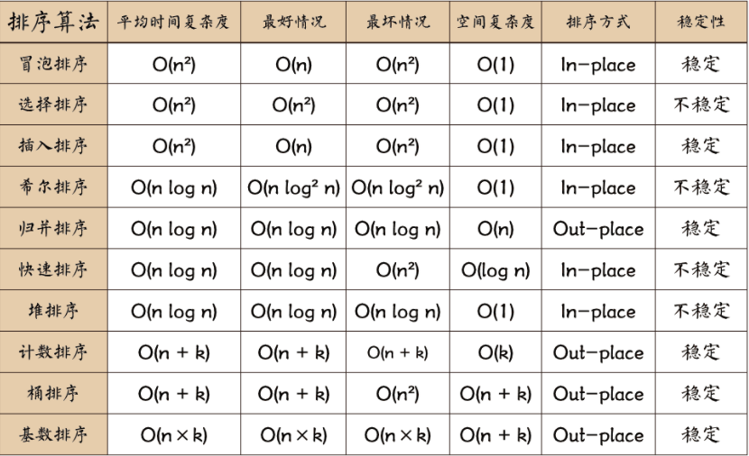
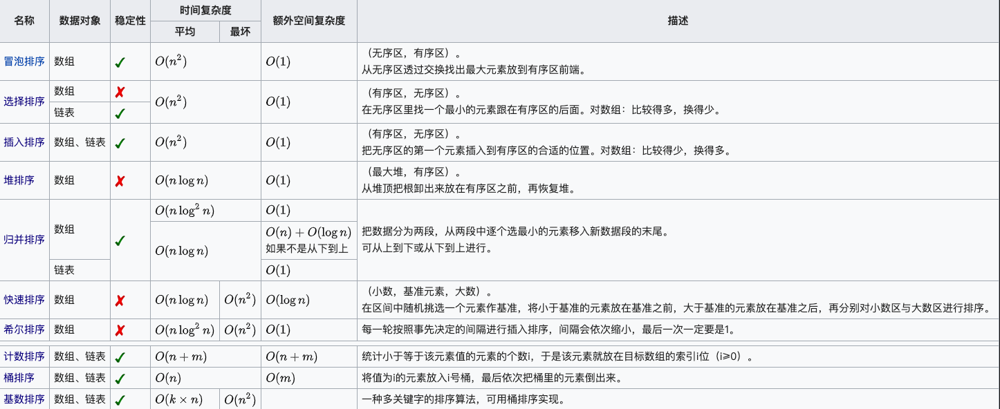
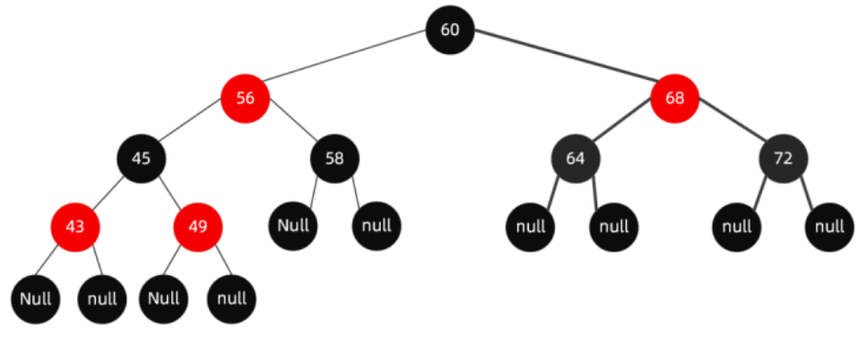

# 数据结构

## 排序算法总结

排序算法可以分为内部排序和外部排序，内部排序是数据记录在内存中进行排序，而外部排序是因排序的数据很大，一次不能容纳全部的排序记录，在排序过程中需要访问外存。常见的内部排序算法有：插入排序、希尔排序、选择排序、冒泡排序、归并排序、快速排序、堆排序、基数排序等。用一张图概括：





关于稳定性

稳定性：排序后 2 个相等键值的顺序和排序之前它们的顺序相同

稳定的排序算法：冒泡排序、插入排序、归并排序和基数排序。

不是稳定的排序算法：选择排序、快速排序、希尔排序、堆排序。

### 1. 冒泡排序

**算法步骤：**

比较相邻的元素。如果第一个比第二个大，就交换他们两个。

对每一对相邻元素作同样的工作，从开始第一对到结尾的最后一对。这步做完后，最后的元素会是最大的数。

针对所有的元素重复以上的步骤，除了最后一个。

持续每次对越来越少的元素重复上面的步骤，直到没有任何一对数字需要比较。

**动图演示：**


**代码实现**

```java
public class BubbleSort implements IArraySort {

    @Override
    public int[] sort(int[] sourceArray) throws Exception {
        // 对 arr 进行拷贝，不改变参数内容
        int[] arr = Arrays.copyOf(sourceArray, sourceArray.length);
        for (int i = 1; i < arr.length; i++) {
            // 设定一个标记，若为true，则表示此次循环没有进行交换，
            //也就是待排序列已经有序，排序已经完成,直接跳出循环。
            boolean flag = true;

            for (int j = 0; j < arr.length - i; j++) {
                if (arr[j] > arr[j + 1]) {
                    int tmp = arr[j];
                    arr[j] = arr[j + 1];
                    arr[j + 1] = tmp;

                    flag = false;
                }
            }
            if (flag) {
                break;
            }
        }
        return arr;
    }
}
```

### 2. 选择排序

**算法步骤**

首先在未排序序列中找到最小（大）元素，存放到排序序列的起始位置。

再从剩余未排序元素中继续寻找最小（大）元素，然后放到已排序序列的末尾。

重复第二步，直到所有元素均排序完毕。

**动图演示**


```java
public class SelectionSort implements IArraySort {

    @Override
    public int[] sort(int[] sourceArray) throws Exception {
        int[] arr = Arrays.copyOf(sourceArray, sourceArray.length);

        // 总共要经过 N-1 轮比较
        for (int i = 0; i < arr.length - 1; i++) {
            int min = i;

            // 每轮需要比较的次数 N-i
            for (int j = i + 1; j < arr.length; j++) {
                if (arr[j] < arr[min]) {
                    // 记录目前能找到的最小值元素的下标
                    min = j;
                }
            }

            // 将找到的最小值和i位置所在的值进行交换
            if (i != min) {
                int tmp = arr[i];
                arr[i] = arr[min];
                arr[min] = tmp;
            }

        }
        return arr;
    }
}
```

### 3. 插入排序

**算法步骤**

将第一待排序序列第一个元素看做一个有序序列，把第二个元素到最后一个元素当成是未排序序列。

从头到尾依次扫描未排序序列，将扫描到的每个元素插入有序序列的适当位置。（如果待插入的元素与有序序列中的某个元素相等，则将待插入元素插入到相等元素的后面。）

**动图演示**


**代码实现**

```java
public class InsertSort implements IArraySort {

    @Override
    public int[] sort(int[] sourceArray) throws Exception {
        // 对 arr 进行拷贝，不改变参数内容
        int[] arr = Arrays.copyOf(sourceArray, sourceArray.length);

        // 从下标为1的元素开始选择合适的位置插入，因为下标为0的只有一个元素，默认是有序的
        for (int i = 1; i < arr.length; i++) {

            // 记录要插入的数据
            int tmp = arr[i];

            // 从已经排序的序列最右边的开始比较，找到比其小的数
            int j = i;
            while (j > 0 && tmp < arr[j - 1]) {
                arr[j] = arr[j - 1];
                j--;
            }

            // 存在比其小的数，插入
            if (j != i) {
                arr[j] = tmp;
            }

        }
        return arr;
    }
}
```

### 4. 希尔排序

**算法步骤**

选择一个增量序列 t1，t2，……，tk，其中 ti > tj，tk = 1；

按增量序列个数 k，对序列进行 k 趟排序；

每趟排序，根据对应的增量 ti，将待排序列分割成若干长度为 m 的子序列，分别对各子表进行直接插入排序。仅增量因子为 1 时，整个序列作为一个表来处理，表长度即为整个序列的长度。

**动图演示**


**代码实现**

```java
public static void shellSort(int[] arr) {
    int length = arr.length;
    int temp;
    for (int step = length / 2; step >= 1; step /= 2) {
        for (int i = step; i < length; i++) {
            temp = arr[i];
            int j = i - step;
            while (j >= 0 && arr[j] > temp) {
                arr[j + step] = arr[j];
                j -= step;
            }
            arr[j + step] = temp;
        }
    }
}
```

### 5. 归并排序

**算法步骤**

1. 申请空间，使其大小为两个已经排序序列之和，该空间用来存放合并后的序列；
2. 设定两个指针，最初位置分别为两个已经排序序列的起始位置；
3. 比较两个指针所指向的元素，选择相对小的元素放入到合并空间，并移动指针到下一位置；
4. 重复步骤 3 直到某一指针达到序列尾；
5. 将另一序列剩下的所有元素直接复制到合并序列尾。

**动图演示**


**代码实现**

```java
package Algorithm.sort;

public class MergeSort {
    public static void main(String[] args) {
        int[] data = new int[] { 5, 3, 6, 2, 1, 9, 4, 8, 7 };
        print(data);
        mergeSort(data);
        System.out.println("排序后的数组：");
        print(data);
    }
    public static void mergeSort(int[] data) {
        sort(data, 0, data.length - 1);
    }
    public static void sort(int[] data, int left, int right) {
        if (left >= right)
            return;
        // 找出中间索引
        int center = (left + right) / 2;
        // 对左边数组进行递归
        sort(data, left, center);
        // 对右边数组进行递归
        sort(data, center + 1, right);
        // 合并
        merge(data, left, center, right);
        print(data);
    }

    /**
     * 将两个数组进行归并，归并前面2个数组已有序，归并后依然有序
     *
     * @param data   数组对象
     * @param left   左数组的第一个元素的索引
     * @param center 左数组的最后一个元素的索引，center+1是右数组第一个元素的索引
     * @param right  右数组最后一个元素的索引
     */
    public static void merge(int[] data, int left, int center, int right) {
        // 临时数组
        int[] tmpArr = new int[data.length];
        // 右数组第一个元素索引
        int mid = center + 1;
        // third 记录临时数组的索引
        int third = left;
        // 缓存左数组第一个元素的索引
        int tmp = left;
        while (left <= center && mid <= right) {
            // 从两个数组中取出最小的放入临时数组
            if (data[left] <= data[mid]) {
                tmpArr[third++] = data[left++];
            } else {
                tmpArr[third++] = data[mid++];
            }
        }
        // 剩余部分依次放入临时数组（实际上两个while只会执行其中一个）
        while (mid <= right) {
            tmpArr[third++] = data[mid++];
        }
        while (left <= center) {
            tmpArr[third++] = data[left++];
        }
        // 将临时数组中的内容拷贝回原数组中
        // （原left-right范围的内容被复制回原数组）
        while (tmp <= right) {
            data[tmp] = tmpArr[tmp++];
        }
    }

    public static void print(int[] data) {
        for (int i = 0; i < data.length; i++) {
            System.out.print(data[i] + "\t");
        }
        System.out.println();
    }
}
```

### 6. 快速排序

**算法步骤**

1. 从数列中挑出一个元素，称为 "基准"（pivot）;
2. 重新排序数列，所有元素比基准值小的摆放在基准前面，所有元素比基准值大的摆在基准的后面（相同的数可以到任一边）。在这个分区退出之后，该基准就处于数列的中间位置。这个称为分区（partition）操作；
3. 递归地（recursive）把小于基准值元素的子数列和大于基准值元素的子数列排序；

**动态演示**


**代码实现**

```java
public class QuickSort {
    public static void main(String[] args) {
        int[] nums = new int[]{1,2,3,5,4,1,7,4,9,8,6,5,4,1};
        quickSort(nums,0,nums.length-1);
        for (int num : nums) {
            System.out.print(num+" ");
        }
    }

    private static void quickSort(int[] nums, int left, int right) {
        if(left > right) return;
        int i = left, j = right;
        int key = nums[left];
        while (i < j){
            while(i < j && nums[j] >= key){
                j --;
            }
            while(i < j && nums[i] <= key){
                i++;
            }
            if (i < j) {
                swap(nums, i, j);
            }
        }
        swap(nums,left,i);
        quickSort(nums,left,i-1);
        quickSort(nums,i+1,right);
    }

    private static void swap(int[] nums, int end, int start) {
        int temp = nums[start];
        nums[start] = nums[end];
        nums[end] = temp;
    }
}
```

### 7. 堆排序

**算法步骤**

1. 创建一个堆 H[0……n-1]；
2. 把堆首（最大值）和堆尾互换；
3. 把堆的尺寸缩小 1，并调用 shift_down(0)，目的是把新的数组顶端数据调整到相应位置；
4. 重复步骤 2，直到堆的尺寸为 1。

**动图演示**


**代码实现**

```java
public class HeapSort {
    public static void main(String[] args) {
        int[] nums = new int[]{5,2,3,5,4,1,7,4,9,8,6,5,4,1};
        heapSort(nums);
        for (int num : nums) {
            System.out.print(num+" ");
        }
    }

    //堆排序
    private static void heapSort(int[] arr) {
        //创建堆
        for(int i = (arr.length-1)/2; i>=0; i--){
            //从第一个非叶子节点开始，从下到上，从右到左
            adjustHeap(arr,i,arr.length);
        }
        //交换堆顶元素和末尾元素 调整堆
        for(int i = arr.length-1; i >= 0; i--){
            int temp = arr[i];
            arr[i] = arr[0];
            arr[0] = temp;
            adjustHeap(arr,0, i);
        }
    }

    //调整堆
    private static void adjustHeap(int[] arr, int parent, int length) {
        int temp = arr[parent];
        //左孩子
        int lChild = 2 * parent + 1;
        while(lChild < length){
            //右孩子
            int rChild = lChild + 1;
            if(rChild <  length && arr[lChild] < arr[rChild]){
                lChild++;
            }
            if(arr[lChild] > temp){
                arr[parent] = arr[lChild];
                parent = lChild;
                lChild = 2 * lChild + 1;
            }else{
                break;
            }
            arr[parent] = temp;
        }
    }
}
```

### 8. 计数排序

**算法步骤**

（1）找出待排序的数组中最大和最小的元素

（2）统计数组中每个值为i的元素出现的次数，存入数组C的第i项

（3）对所有的计数累加（从C中的第一个元素开始，每一项和前一项相加）

（4）反向填充目标数组：将每个元素i放在新数组的第C(i)项，每放一个元素就将C(i)减去1

**动图演示**


**代码实现**

```java
public class CountingSort implements IArraySort {

    @Override
    public int[] sort(int[] sourceArray) throws Exception {
        // 对 arr 进行拷贝，不改变参数内容
        int[] arr = Arrays.copyOf(sourceArray, sourceArray.length);

        int maxValue = getMaxValue(arr);

        return countingSort(arr, maxValue);
    }

    private int[] countingSort(int[] arr, int maxValue) {
        int bucketLen = maxValue + 1;
        int[] bucket = new int[bucketLen];

        for (int value : arr) {
            bucket[value]++;
        }

        int sortedIndex = 0;
        for (int j = 0; j < bucketLen; j++) {
            while (bucket[j] > 0) {
                arr[sortedIndex++] = j;
                bucket[j]--;
            }
        }
        return arr;
    }

    private int getMaxValue(int[] arr) {
        int maxValue = arr[0];
        for (int value : arr) {
            if (maxValue < value) {
                maxValue = value;
            }
        }
        return maxValue;
    }
}
```

### 9.  桶排序

元素分布在桶中：


然后，元素在每个桶中排序：


**代码实现**

```java
public class BucketSort implements IArraySort {

    private static final InsertSort insertSort = new InsertSort();

    @Override
    public int[] sort(int[] sourceArray) throws Exception {
        // 对 arr 进行拷贝，不改变参数内容
        int[] arr = Arrays.copyOf(sourceArray, sourceArray.length);

        return bucketSort(arr, 5);
    }

    private int[] bucketSort(int[] arr, int bucketSize) throws Exception {
        if (arr.length == 0) {
            return arr;
        }

        int minValue = arr[0];
        int maxValue = arr[0];
        for (int value : arr) {
            if (value < minValue) {
                minValue = value;
            } else if (value > maxValue) {
                maxValue = value;
            }
        }

        int bucketCount = (int) Math.floor((maxValue - minValue) / bucketSize) + 1;
        int[][] buckets = new int[bucketCount][0];

        // 利用映射函数将数据分配到各个桶中
        for (int i = 0; i < arr.length; i++) {
            int index = (int) Math.floor((arr[i] - minValue) / bucketSize);
            buckets[index] = arrAppend(buckets[index], arr[i]);
        }

        int arrIndex = 0;
        for (int[] bucket : buckets) {
            if (bucket.length <= 0) {
                continue;
            }
            // 对每个桶进行排序，这里使用了插入排序
            bucket = insertSort.sort(bucket);
            for (int value : bucket) {
                arr[arrIndex++] = value;
            }
        }

        return arr;
    }

    /**
     * 自动扩容，并保存数据
     *
     * @param arr
     * @param value
     */
    private int[] arrAppend(int[] arr, int value) {
        arr = Arrays.copyOf(arr, arr.length + 1);
        arr[arr.length - 1] = value;
        return arr;
    }
}
```

### 10. 基数排序

**动图演示**


**代码实现**

```java
/**
 * 基数排序
 * 考虑负数的情况还可以参考： https://code.i-harness.com/zh-CN/q/e98fa9
 */
public class RadixSort implements IArraySort {

    @Override
    public int[] sort(int[] sourceArray) throws Exception {
        // 对 arr 进行拷贝，不改变参数内容
        int[] arr = Arrays.copyOf(sourceArray, sourceArray.length);

        int maxDigit = getMaxDigit(arr);
        return radixSort(arr, maxDigit);
    }

    /**
     * 获取最高位数
     */
    private int getMaxDigit(int[] arr) {
        int maxValue = getMaxValue(arr);
        return getNumLenght(maxValue);
    }

    private int getMaxValue(int[] arr) {
        int maxValue = arr[0];
        for (int value : arr) {
            if (maxValue < value) {
                maxValue = value;
            }
        }
        return maxValue;
    }

    protected int getNumLenght(long num) {
        if (num == 0) {
            return 1;
        }
        int lenght = 0;
        for (long temp = num; temp != 0; temp /= 10) {
            lenght++;
        }
        return lenght;
    }

    private int[] radixSort(int[] arr, int maxDigit) {
        int mod = 10;
        int dev = 1;

        for (int i = 0; i < maxDigit; i++, dev *= 10, mod *= 10) {
            // 考虑负数的情况，这里扩展一倍队列数，其中 [0-9]对应负数，[10-19]对应正数 (bucket + 10)
            int[][] counter = new int[mod * 2][0];

            for (int j = 0; j < arr.length; j++) {
                int bucket = ((arr[j] % mod) / dev) + mod;
                counter[bucket] = arrayAppend(counter[bucket], arr[j]);
            }

            int pos = 0;
            for (int[] bucket : counter) {
                for (int value : bucket) {
                    arr[pos++] = value;
                }
            }
        }

        return arr;
    }

    /**
     * 自动扩容，并保存数据
     *
     * @param arr
     * @param value
     */
    private int[] arrayAppend(int[] arr, int value) {
        arr = Arrays.copyOf(arr, arr.length + 1);
        arr[arr.length - 1] = value;
        return arr;
    }
}
```

## 红黑树



红黑树是一种含有红黑结点并能自平衡的二叉查找树。它必须满足下面性质：

- 性质1：每个节点要么是黑色，要么是红色。
- 性质2：根节点是黑色。
- 性质3：每个叶子节点（NIL）是黑色。
- 性质4：每个红色结点的两个子结点一定都是黑色。
- **性质5：任意一结点到每个叶子结点的路径都包含数量相同的黑结点。**

从性质5又可以推出：

- 性质5.1：如果一个结点存在黑子结点，那么该结点肯定有两个子结点

**不是完全平衡：从根节点到叶子节点的最长路径不大于最短路径的 2 倍
