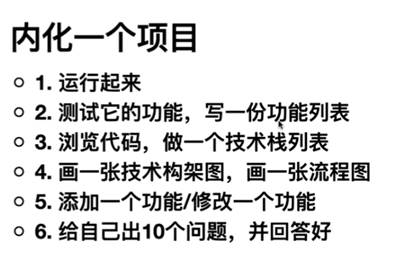

# 项目与HR

## 自我介绍

面试官好，我叫XX。现在是就读于杭州电子科技大学计算机技术专业的研究生。

XX公司是我一直比较向往的公司，我应聘的是JAVA后端开发工程师的工作，从事后端开发也是我一直以来对自己工作的职业规划。为此呢，我很早就结合工作岗位的要求进行了相关学习。

我在本科时候就加入了学校的ACM集训队，参加了一些大学生程序竞赛，学习了一些算法知识。

后来加到了java实验室，从零开始参与开发了学校的一个毕业生论文选题管理的一个教务系统。系统使用的是SSM的框架，主要是对毕业生导师双选，论文选题，开题，答辩，整个流程的管理，这个系统从18届毕业生开始正式上线使用。

研究生阶段呢，我的实验室叫做工业互联网研究院；我也重点参与了实验室的相关项目研发；

前期呢，主要是针对Linux系统进行一些实时性优化的研究；另外就是，在生产线平台上，负责然后在业务层OPC UA协议的相关接口,再通过这个协议将数据发送到监控平台，使用redis对监控状态做了个缓存，用消息队列和websocket对报警信息进行一个异步推送和入库。

最后呢，希望能够加入公司，从事后端研发相关的工作，谢谢！

计算机学院学生第五党支部 副书记 2019.07 – 至今

负责计算机学院学生第五党支部党务工作。

信息学院青年志愿者协会 编辑部部长  2016.03-2017.10

负责维护学院青公众号平台；

策划和组织日常活动，编写新闻发布稿，活动策划书等。

## 项目介绍

**项目名称：灌装饮料生产线智能管理云平台 2020.09 - 2021.03**

项目描述：此项目为互联网+工业 4.0 解决方案，实现对工业生产线中异构生产设备的远程监控，提供工业生产线的一站式执行服务，对设备运行状态实现实时在线监测、预警、具有自动记录，生产定制、异常监测、数据通信等功能，实现对设备生产，监控等全方位一体化高效管理，降低人员维护成本，以减少事故发生或事故的扩大化。

涉及技术：Spring Boot、MyBatis、MySQL、Redis、WebSocket、RabbitMQ、OPC UA、Quartz等。

责任描述：

\1. 负责完成底层数据采集，基于 OPC UA 协议实现网关协议转换；

\2. 负责在客户端提供 OPC UA 协议相关接口，读取 OPC UA Server 端数据；

\3. 使用 Redis 缓存监控设备信息，降低数据库访问压力；

\4. 通过 WebSocket 和 RabbitMQ 完成设备实时数据监控和报警提示；

\5. 负责对接现场六轴工业机器人部分、完成机器人控制程序开发；

**项目名称：基于自主平台的装备实时优化控制方法与关键技术  2019.09 - 2020.01**

项目描述：在研究 EtherCAT 协议的过程中，针对传统 Linux 系统难以满足工业以太网实时性的问题，其在嵌入式应用中有一定的局限性，对可编程控制器进行实时性优化，通过在 Ubuntu16.04系统上进行Xenomai实时内核的移植和修改，构建一种具有实时网络的 Linux 系统，以达到硬时要求。

责任描述：

\1. 进行 Xenomai 实时内核的移植，实现嵌入式 Linux 内核的硬实时性；

\2. 利用 RTnet 对 Linux 进行网络实时化改造，实现 linux 系统在工业上的应用。

Xenomai 基于Adeos(Adaptive Domain Environment for Operating System)实现双内核机制。Adeos 是扩展Linux 的基础环境，

Adeos 的设计目标是为操作系统提供一个灵活的、可扩展的自适应环境，在这个环境下，多个相同或不同的操作系统可以共存，共享硬件资源。目前，Adeos 是基于Linux 内核实现的，主要的应用是在Linux 的实时化方面，使基于Linux 的系统能满足强实时的要求（例如Xenomai 和RTAI3.2 以上版本都是基于Adeos 实现的）。在基于Adeos 的系统中，每个操作系统都是在独立的域内运行（但不一定所有的域实现的都是操作系统，也可以是完成其它功能的软件实体），每个域可以有独立的地址空间和类似于进程、虚拟内存等的软件抽象层，而且这些资源也可以由不同的域共享。

Xenomai 在Adeos 系统中的域优先级高于Linux 域，每当中断到来之后，Adeos先调度Xenomai 对该中断进行处理、执行中断相应的实时任务，只有当Xenomai 没有实时任务和中断需要处理的时候，Adeos 才会调度Linux 运行，这就保证了Xenomai的中断响应速度和实时任务不受Linux 的影响，从而提供了实时系统的可确定性。

Xenomai 实时内核为开发强实时应用提供了丰富的功能，主要包括实时线程调度与管理、用户空间实时任务支持、线程同步服务、时钟服务、中断服务、动态内存申请和实时对象注册服务等。

**Linux在实时应用中的技术障碍**

　　尽管Linux本身提供了一些支持实时性的机制，然而，由于Linux系统是以高的吞吐量和公平性为追求目标，基本上没有考虑实时应用所要满足的时间约束，它只是提供了一些相对简单的任务调度策略。因此，实时性问题是将Linux应用于嵌入式系统开发的一大障碍,无法在硬实时系统中得到应用。 Linux在实时应用中的技术障碍具体表现在:

　　(1)Linux系统时钟精度太过粗糙，时钟中断周期为10ms，使得其时间粒度过大，加大了任务响应延迟。

　　(2) Linux的内核是不可抢占的, 当一个任务通过系统调用进入内核态运行时,一个具有更高优先级的进程，只有等待处于核心态的系统调用返回后方能执行，这将导致优先级逆转。实时任务执行时间的不确定性，显然不能满足硬实时应用的要求。

　　(3) Linux采用对临界区操作时屏蔽中断的方式，在中断处理中是不允许进行任务调度的，从而抑制了系统及时响应外部操作的能力。

　　(4) 缺乏有效的实时任务调度机制和调度算法。

**项目名称：XX师范毕业生论文选题系统 2017.07 - 2018.01**

项目描述：此系统用于管理毕业生的论文选题信息，帮助完成学生与老师之间的双选，选题，任务书，开题报告，论文答，成绩分析，整个流程的管理。方便统计查看论文完成进度，审核状态等信息。系统采用 SSM 框架开发，使用MySQL数据库进行数据存储，并搭配前端技术LayUI、JQuery、bootstrap、Echarts进行页面展示。系统按照学院毕业设计(论文)的时间安排及流程顺序进行相应功能模块的设计与开发，贴合实际应用环境，降低了整个毕业设计(论文)阶段中人工进行数据统计整合的参与度，最大程度的保证相关数据的完整性、时效性；已从信息学院2018 届毕业生开始上线使用，大大提高了流程管理效率。

涉及技术：SpringMVC、Spring、MyBatis、Maven、MySQL 数据库、LayUI、JQuery、bootstrap、Echarts 等。

责任描述：

\1. 从0到1参与整个项目的研发、负责项目的需求分析，数据库表设计；

\2. 负责双选、选题、统计分析等部分模块的开发；

\3. 负责对项目使用过程中的 bug 修复和完善；

## Redis 缓存一致性

对于主页数据（监控设备的属性信息（（阈值，单位等）））提前放入缓存中。

写：(在配置页面更新参数时，先更新数据库，同时删除缓存)

读：

缓存中有 直接读

如果缓存中没有，同时将所要监控的设备属性信息从数据库读取并保存到缓存中（阈值，单位等）

请求监控，缓存中有 直接返回。

如果缓存中没有 将要监控的设备属性ID加入到监控列表里，定时任务通过这个列表去读取底层状态数据 将读取数据存入 redis 缓存中

定时任务会将读取数据与redis中的数据进行比较 不一致 更新缓存 websocket 推送新的数据状态

## 报警是怎么做的

比较现在的状态值  和  设备的阈值    是否发生报警  比较次数操过3次不一致 报警

产生异常报警 报警信息加入消息队列消费端 使用rabbitMQ 订阅 报警信息

解耦  接收到订阅消息队列的报警消息后

异步报警 将报警信息队列的数据通过WebSocket推送到前端对应用户 不在线的用户通过邮件提醒

报警信息异步入库

报警信息入库时 判断 当前设备 当前属性 报警类型 根据是否处理的状态 进行入库  未处理就不入库。

间隔报警 只入库一次   阶段报警 一直入库

## 为什么用 websocket？

在websocket以前大多是长轮询实现，长轮询需要不停的主动去连接服务器询问是否有新消息，耗费性能。而websocket浏览器和服务器只需要做一个握手的动作，然后，浏览器和服务器之间就形成了一条快速通道。两者之间就直接可以数据互相传送。

在websocket以前大多是长轮询实现，长轮询需要不停的主动去连接服务器询问是否有新消息，耗费性能。而websocket浏览器和服务器只需要做一个握手的动作，然后，浏览器和服务器之间就形成了一条快速通道。两者之间就直接可以数据互相传送。

Rabbitmq消息队列简单组成就可以看成是生产者，队列，消费者，生产者创建信息通过队列发送给消费者，消费者接收消息。两者结合起来，用户登录时就创建websocket连接，建立起一个浏览器和服务器的通道，同时创建一个特定的Rabbitmq消费者，用来代表这个用户来处理生产者发送过来的消息。那么生产者发送信息，消费者只要在线就能自动收取到信息，通过建立好的通道推送到前端。

因此，我们可以使用RabbitMQ的订阅发布技术，订阅后，当RabbitMQ端有新的数据就直接发布到指定的queue，订阅端接收到订阅队列的数据直接通过WebSocket推送到前端，前端拿到数据之后实时解析上显，此过程相比传统的Rest接口定时请求，减去了数据入库、读库、客户端不断的请求服务器和刷新页面，大大的减小了服务器的压力和减少了请求时间。该设计更适用于实时数据接收后直接推送到前端上显的一些不需要处理和统计的场景，如实时船舶的上显，导航等。

## 为什么用 Quartz？

Quartz 可以满足复杂的调度需求。

Quartz可以通过cron表达式精确到特定时间执行

多线程；可以做数据存储型的定时任务，维护性高；

quartz 支持分布式 Quartz是有cluster支持的

**对异常的处理**

Quartz的某次执行任务过程中抛出异常，不影响下一次任务的执行，当下一次执行时间到来时，定时器会再次执行任务。

SpringTask不同，一旦某个任务在执行过程中抛出异常，则整个定时器生命周期就结束，以后永远不会再执行定时器任务。

## 项目的难点和遇到的问题

**Linux实时性不够，实时内核**

百度、谷歌、老师、请教大牛、论文、开源项目、解决问题、总结问题、博客分享记录

尝试方式：抢占式的 RT-Preempt 补丁 、英特尔ACRN实时架构、Xenomai 实时内核(双内核)+rtnet实时网卡驱动

//1.根据系统内核linux4.9版本,xenomai3.7版本、2.解压内核、对应的补丁、3.配置、编译、安装、4.更新GRUB  5.测试实时内核

RTnet调试相关问题，启动实时网卡导致非实时网卡不能启动

Rtnet是xenomai下提供的实时网络通信框架。在调试中遇到的问题主要是两块网卡无法分别使用。官网上提供的参考方法是针对于比较老的网卡，按照他们提供的配置方法会出现cards参数不识别的现象。

对内核的网卡模块驱动做了相应改变，富士康提供的网卡用的是igb驱动，所以在相应文件夹下对main文件做了相关修改。文件路径/usr/src/linux-4.9.90/drivers/xenomai/net/drivers/igb/igb_main.c,该文件其实是一个链接文件，其真实路径为：/usr/src/xenomai-3.0.7/kernel/drivers/net/drivers/igb/igb_main.c。

**解决办法：**

通过dmesg命令可以查看到registered rteth0只注册了一次。其它加载时仅出现*****not first call*****

显示所有的网卡 **ifconfig -a**  查看网卡所需驱动   **ethtool -i 网卡名**   查看网卡型号  **lspci -nn | grep "Eth"**

查看目标内核的网卡驱动是否支持当前型号网卡  **modinfo命令查看*.ko对哪种设备型号的支持**

修改驱动文件：这里我是在igb_main.c添加一个全局变量然后再在igb_probe函数中加一个判断，限制实时网卡的注册次数。重新编译这个驱动文件，将生成驱动文件拷贝到对应的目录，执行`depmod`加载模块依赖,这样我们的执行modprobe 才会加载新的驱动文件。

**websocket链接断开服务器报错 java.io.EOFException**

websocket间隔几秒十几秒断开，由于加上了断线重连，所以就是一直断一直连，一直报错 java.io.EOFException 然候网上各种百度。

websocket需要进行心跳包维持连接，浏览器不会帮你维持，所以隔段时间就断开了，你自己实现的客户端就需要维持这个连接、检查代码发现没做心跳。。。。加上心跳异常就解决了。 10 min

新技术的使用尽量在开发前期就发现问题、避免上线之后手忙脚乱。

## 你的职业规划？

走技术方向，CTO路线，向架构师发展。

首席技术官（外语词全称chief technology officer，外语词缩略语CTO）是[技术资源](https://baike.baidu.com/item/技术资源/2422923)的行政管理者。

不论在长期还是短期，我的个人策略是根据当前目标评价自己所处的位置，然后相应地修改自己的计划。比如，我每五年就制定一项个人计划，这个计划中包含一个总体目标和一系列短期目标。每6 个月我就回顾一下自己的进展，然后做出必要的修改。很明显，我当前的计划就是实现职业转变，也就是找到更满意的工作。除此之外，我已经实现了近期制定的个人目标。e

**你认为你未来两年内达到什么标准是比较满意的？**

两年内，通过对Java后端的技术栈的丰富，给一个项目，能够达到对一个项目的整个系统架构，从上到下的技术栈都能有一定的了解，能够快速构建项目的系统架构，和选择合适的技术栈去解决每一层可能的问题。最好是能达到一个独立带领团队的效果。

**为什么申请这个岗位？**

首先，本身就是计算机专业的，在学校做的项目也和java后端开发工程师这个岗位相关。

## 你希望通过这份工作获得什么?

对我来说，最重要的是自己所做的工作是否适合我。我的意思是说，这份工作应该能让我发挥专长——这会给我带来一种满足感。我还希望所做的工作能够对我目前的技能水平形成挑战，从而能促使我提升自己。

## 给你一个任务，你会怎么做?

## 你个人的优缺点？

**你认为你的优势/核心竞争力是什么？**

优点：

本科和硕士都是 计算机专业的，有相对扎实的计算机基础常识。

适应能力强，注重团队合作意识，包括组织协调能力，能快速融入团队。本科在青协、研究生党支部副书记，协调和组织一些活动。

有计划、目标坚定、反思，遇到问题会坚持不懈。

学习能力强，有良好的学习习惯，自学能力。技术视野开阔，喜欢学习和研究一些新技术;

缺点：

表达能力不是太好，容易紧张，有些东西可能自己比较清楚、再传达给别人就表达的不是很好，这就导致我面试其实是很吃亏的。能力够了反而没有别人面试的好。

另外就是，因为是学生，一直在学校，所以比较有学生气，所以对问题的思考会站在一个学生的角度，考虑不够全面，如果作为一个员工的话，肯定更多的考虑是为公司的利益。

## 请描述一件最有成就感的事情？

就是在我刚上大学的时候加入了学校的校ACM集训队，其实刚上大学的时候大家都还是比较想玩的，而集训队呢，需要打比赛，要一直在机房里刷题学习。所以当时集训队也有着这么一句话：“一入机房深似海，从此假期是路人”，也正是因为在集训队的那段时间，养成了一个良好的自学习惯，遇到问题不断地钻研。

## 如果工作当中你和别人发生了冲突，你会如何处理？

首先，以我的性格很少会与他人冲突。

如果说产生冲突，我会先冷静一下，分析问题的原因，如果是我的问题，我会道歉认错，反思。

如果是别人的问题，我会先冷静，事后再去讨论，或者找其他人帮忙以旁观者的角度去分析，帮忙协调。

## 你期望的薪资是多少？

行业标准都能接受。

薪资是税前还是税后？

有没有试用期？试用期薪资会不会有折扣？

有没有加班费？

## 你还有什么问题要问我的？

部门业务？

多久会有反馈结果？

一共有几轮面试？

您感觉我面试过程如何，有哪些地方需要注意和改进的？

新员工的培养？

晋升机制？

## 谈薪问题？

多久会调薪一次？

适用期多久？工资会有折扣吗？

公积金缴纳比例？缴纳基数？薪资结构？

是双休吗？平时加班多吗？加班费怎么算的？

年终奖怎么算的？一般会拿多少？

实习期的时间，有没有年终奖？

有没有什么其他补贴，员工福利？

我能考虑一下吗？最迟什么时候给你回复？

## 你有什么崇拜的人吗？

**林纳斯·托瓦兹（Linus Torvalds）**

我最崇拜Linux操作系统的创始人利纳斯托瓦兹，欣赏他的创造力，他写的代码改变了这个世界，我希望自己有一天也可以写出来一个牛x的产品。也正是因为他，才会有优秀的开源软件吸引更多人对开源进行贡这样的机制，然后开源软件事实上是在他的倡导下发展了。

“有些人生来就具有统率百万人的领袖风范；另一些人则是为写出颠覆世界的软件而生。唯一一个能同时做到这两者的人，就是托瓦兹。”美国《时代》周刊对“Linux之父”林纳斯·托瓦兹（Linus Torvalds）给出了极高的评价。

著有自传《乐者为王》。

以前学习内核的时候，看了linus 的 Linux 0.11内核的源代码。说下感觉吧，一脸的懵逼的进去，一脸懵逼的出来。巨他妈的复杂。最后一段段看，每个函数加上了注释。然后编译过一遍，发现能通过。 Linux 本身只是一个内核，以这个内核为基础，诞生了这个世界上的绝大多数电子设备（路由器，交换机，手机，服务器）

## 如何将一个开源项目变为自己的项目？



## 项目介绍怎么写？

项目介绍本系统是X委托Y开发的用于Z的系统，系统包括A、B、C、D等模块。系统使用了Java企业级开发的开源框架E以及前端技术F。表示层运用了G架构，使用H作为视图I作为控制器并实现了REST风格的请求；业务逻辑层运用了J模式，并通过K实现事务、日志和安全性等功能，通过L实现缓存服务；持久层使用了M封装CRUD操作，底层使用N实现数据存取。整个项目采用了P开发模型。 项目开发流程（根据情况依次填入）可行性分析 >>> 可行性分析报告 / 项目开发计划书需求分析 >>> 需求规格说明书设计 >>> 概要设计说明书/详细设计说明书编码测试 >>> 测试报告 / 缺陷报告交付和维护 >>> 用户手册 / 操作手册

项目简介：主要用于描述整个项目流程，按照数据流的输入到输出来写或者从前端到后端逻辑来写，基于某些技术或框架实现了某种功能，最终达到了某种效果。

实际操作-可以将项目流程先在纸上画出来，然后对照流程进行从头至尾的描述，可以把主要环节用到的什么技术解决了什么问题突出即可，也不用面面俱到。

举例：本项目基于Spring MVC + Spring + Mybatis框架，利用× ×埋点记录× ×日志，利用Redis实现对××数据的缓存，处理后的数据最终落地MySQL等等，最终实现了对× ×指标监控分析。

项目职责：只要写项目亮点和你负责的技术，比如说，利用某种技术解决了某种问题，优化了数据的访问，提高了n倍的速度，或者说，设计出某种技术，实现了某种功能。

实际操作-找出你项目中希望被面试官问到的点，或者你认为属于项目亮点的部分，突出你对项目的优化部分。

举例：

●使用nginx实现了负载均衡，提高了访问速度

●定义热点数据并缓存在Redis，降低了数据库访问压力

●利用zookeeper实现HA，解决单点故障

●利用JVM指令排查出GC问题，调整JVM配置，降低GC次数

工作时间：2016-10到2017-09公司名称：xxx有限公司 | 所在部门：xxx | 所在岗位：java开发工程师

工作描述：

1 NETTY通信框架下的物联网连接服务器开发

2 基于微框架springboot+mybatis-plus+springmvc的后台服务器接口开发

3 能在linux环境下使用docker打包部署项目，后期进行监控维护调试

4 涉及物联网相关通信技术：MQTT，SOAP，Kafka，activeMq，zookeeper的使用

5 使用树莓派模拟开发。

## 华为机试题目

```java
package bishi.HUAWEI;

import java.util.Scanner;

public class HUAWEI_Demo1 {

    public static void main(String[] args) {
        Scanner in = new Scanner(System.in);
        int x = in.nextInt();
        int n = in.nextInt();
        int[] price = new int[n];
        int[] count = new int[n];
        int[] love = new int[n];
        for(int i = 0; i < n; i++){
            price[i] = in.nextInt();
            count[i] = in.nextInt();
            love[i] = in.nextInt();
        }
        int[] dp = new int[x+1];
        for(int i = 0; i < n; i++){
            if(price[i] * count[i] >= x){
                for(int j = price[i];j <= x; j++){
                    dp[j] = Math.max(dp[j],dp[j-price[i]]+love[i]);
                }
            }else{
                int k = 1;
                int temp = count[i];
                while(k < temp){
                    int v_temp = k * price[i];
                    for(int j = x; j >= v_temp; j--){
                        dp[j] = Math.max(dp[j],dp[j-v_temp]+k*love[i]);
                    }
                    temp -= k;
                    k *= 2;
                }
                for(int j = x; j >= temp * price[i];j--){
                    dp[j] = Math.max(dp[j],dp[j-temp*price[i]]+temp*love[i]);
                }
            }
        }
        System.out.println(dp[x]);
    }
}
```

```java
package bishi.HUAWEI;

import java.util.Scanner;

public class HUAWEI_Demo2 {
    public static void main(String[] args) {

        Scanner in = new Scanner(System.in);
        int x = in.nextInt();
        int m = in.nextInt();
        int[] price = new int[m];
        for(int i = 0; i < m; i++){
            price[i] = in.nextInt();
        }

        int[] dp = new int[x+1];
        dp[0] = 1;
        for(int i = 0; i < m; i++){
            for(int j = x; j >= price[i]; j--){
                //dp[j] = Math.max(dp[j],dp[j-price[i]]+1);
                if(dp[j - price[i]] != 0){
                    dp[j] = dp[j] + dp[j-price[i]];
                }
            }
        }
        if(dp[x] == 0){
            System.out.println("-1");
        }else{
            System.out.println(dp[x]);
        }

    }
}
```

```java
package bishi.HUAWEI;

import java.util.Scanner;

public class HUAWEI_Demo3 {
    static int ans = Integer.MAX_VALUE;
    public static void main(String[] args) {
        Scanner in = new Scanner(System.in);
        int m = in.nextInt();
        int n = in.nextInt();
        boolean[][] visit = new boolean[m][n];
        int[][] map = new int[m][n];
        for (int i = 0; i < m; i++) {
            for(int j = 0; j < n; j++){
                map[i][j] = in.nextInt();
                visit[i][j] = false;
            }
        }
        int x1 = in.nextInt();
        int y1 = in.nextInt();
        int x2 = in.nextInt();
        int y2 = in.nextInt();

        DFS(map,visit,x1,y1,x2,y2,0);
        System.out.println(ans);

    }

    private static void DFS(int[][] map, boolean[][] visit, int i,int j,int x2, int y2, int count) {
        if(i < 0 || j < 0 || i > map.length || j > map[0].length){
            return ;
        }
        if(count > 0 && i == x2 && j == y2){
            ans =  Math.min(ans,count);
        }
        visit[i][j] = true;
        count ++;
        int[][] dis = {{0,0,1,-1},{1,-1,0,0}};
        for(int k = 0; k < 4; k++){
            int dx = i + dis[0][k];
            int dy = j + dis[1][k];
            if((dx >= 0 && dy >= 0 && dx < map.length && dy < map[0].length && map[dx][dy] == 0 && !visit[dx][dy]) || (dx == x2 && dy == y2)){
                visit[dx][dy] = true;
                DFS(map,visit,dx,dy,x2,y2,count);
                visit[dx][dy] = false;
            }
        }
    }
}
```

//多重背包：

```java
package Algorithm.DP.beibao;

import java.util.Scanner;

public class BeibaoDuochong {
    public static void main(String[] args) {
        Scanner in = new Scanner(System.in);
        int V = in.nextInt(); //背包容量
        int n = in.nextInt();//物品种类
        int[] w = new int[n];//物品的重量
        int[] v = new int[n];//物品的价值
        int[] num = new int[n];//物品的数量

        for (int i = 0; i < n; i++) {
            w[i] = in.nextInt();
            v[i] = in.nextInt();
            num[i] = in.nextInt();
        }

        int[] dp = new int[V+1];
        for (int i = 0; i < n; i++) {
            for (int j = 1; j <= num[i]; j++) {
                for (int k = V; k >= w[i]; k--) {
                    dp[k] = Math.max(dp[k],dp[k-w[i]]+v[i]);
                }
            }
        }
        System.out.println(dp[V]);
    }
}
```
