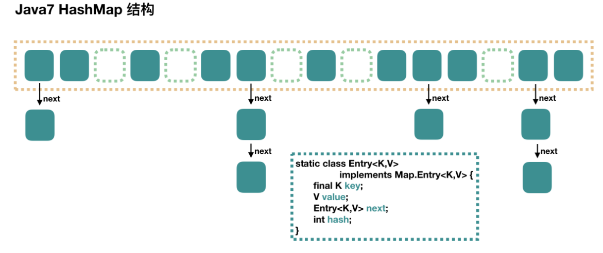
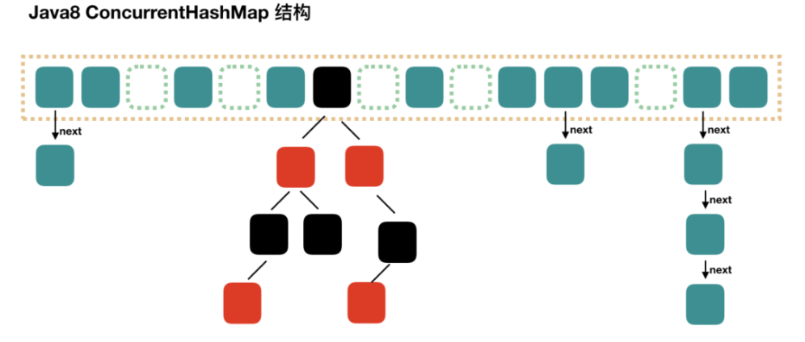
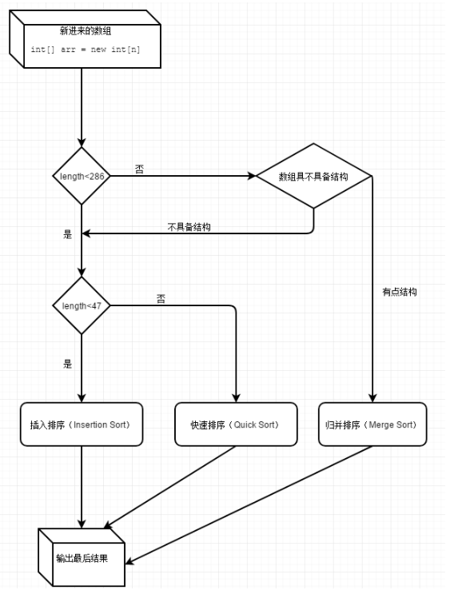

# Java 集合

**Java 集合框架图**


## String 为什么是不可变的?

简单的来说：String 类中使用 final 关键字修饰字符数组来保存字符串， private final char value[] ，所以 String 对象是不可变的。

## String、StringBuffer 和 StringBuilder 的区别?

而 StringBuilder 与 StringBuffer 都继承自 AbstractStringBuilder 类，在 AbstractStringBuilder 中也是使用字符数组保存字符串 char[] value  但是没有用 final 关键字修饰，所以这两种对象都是可变的。

String 中的对象是不可变的，也就可以理解为常量，线程安全。

StringBuffer 对方法加了同步锁或者对调用的方法加了同步锁，所以是线程安全的。

StringBuilder 并没有对方法进行加同步锁，所以是线程不安全的。

**性能**

每次对 String 类型进行改变的时候，都会生成一个新的 String 对象，然后将指针指向新的 String 对象。StringBuffer 每次都会对 StringBuffer 对象本身进行操作，而不是生成新的对象并改变对象引用。相同情况下使用 StringBuilder 相比使用 StringBuffer 仅能获得 10%~15% 左右的性能提升，但却要冒多线程不安全的⻛险。

对于三者使用的总结：

1. 操作少量的数据: 适用 String
2. 单线程操作字符串缓冲区下操作大量数据: 适用 StringBuilder
3. 多线程操作字符串缓冲区下操作大量数据: 适用 StringBuffer

## 说说List、Set、Map三者的区别？

- List (对付顺序的好帮手)：存储的元素是有序的、可重复的。
- Set (注重独一无二的性质)： 存储的元素是无序的、不可重复的。
- Map (用 Key 来搜索的专家)：使用键值对（kye-value）存储，类似于数学上的函数 y=f(x)，“x”代表 key，"y"代表 value，Key 是无序的、不可重复的，value 是无序的、可重复的，每个键最多映射到一个值。

## Arraylist 与 LinkedList 区别?

1. **底层数据结构： Arraylist  底层使用的是 Object  数组； LinkedList  底层使用的是 双向链表 数据结构**（JDK1.6 之前为循环链表，JDK1.7 取消了循环，改为双向链表，原因：1、头尾表示更清晰；2、头尾插入元素维护指针更少，效率更高；3、省去了一个header节点的空间）
2. **插入和删除是否受元素位置的影响：**

   ① ArrayList  采用数组存储，所以插入和删除元素的时间复杂度受元素位置的影响。 比如：执行 add(E e) 方法的时候， ArrayList  会默认在将指定的元素追加到此列表的末尾，这种情况时间复杂度就是 O(1)。但是如果要在指定位置 i 插入和删除元素的话（ add(int index, E element) ）时间复杂度就为 O(n-i)。因为在进行上述操作的时候集合中第 i 和第 i 个元素之后的(n-i)个元素都要执行向后位/向前移一位的操作。

   ② LinkedList  采用链表存储，所以对于 add(E e) 方法的插入，删除元素时间复杂度不受元素位置的影响，近似 O(1)，如果是要在指定位置 i 插入和删除元素的话（ (add(int index, E element) ） 时间复杂度近似为 o(n)) 因为需要先移动到指定位置再插入。
3. **是否支持快速随机访问：** LinkedList  不支持高效的随机元素访问，而 ArrayList  支持。快速随机访问就是通过元素的序号快速获取元素对象(对应于 get(int index) 方法)。
4. **内存空间占用：** ArrayList 的空 间浪费主要体现在在 list 列表的结尾会预留一定的容量空间，而 LinkedList 的空间花费则体现在它的每一个元素都需要消耗比 ArrayList 更多的空间（因为要存放直接后继和直接前驱以及数据）。

## ArrayList 与 Vector 区别呢?

- **ArrayList**  是 List  的主要实现类，底层使用 Object[ ] 存储，适用于频繁的查找工作，线程不安全 ;
- **Vector**  是 List  的古老实现类，底层使用 Object[ ] 存储，线程安全的。

## HashMap 说一说？

1. HashMap 的底层是个 Node 数组（Node<K,V>[] table），在数组的具体索引位置，如果存在多个节点，则可能是以链表或红黑树的形式存在。
2. 增加、删除、查找键值对时，定位到哈希桶数组的位置是很关键的一步，源码中是通过下面3个操作来完成这一步：
   1. 拿到 key 的 hashCode 值；
   2. 将 hashCode 的高位参与运算，重新计算 hash 值；
   3. 将计算出来的 hash 值与 “table.length - 1” 进行 & 运算。
3. HashMap 的默认初始容量（capacity）是 16，capacity 必须为 2 的幂次方；默认负载因子（load factor）是 0.75；实际能存放的节点个数（threshold，即触发扩容的阈值）= capacity * load factor。
4. HashMap 在触发扩容后，阈值会变为原来的 2 倍，并且会对所有节点进行重 hash 分布，重 hash 分布后节点的新分布位置只可能有两个：“原索引位置” 或 “原索引+oldCap位置”。例如 capacity 为16，索引位置 5 的节点扩容后，只可能分布在新表 “索引位置5” 和 “索引位置21（5+16）”。
5. 导致 HashMap 扩容后，同一个索引位置的节点重 hash 最多分布在两个位置的根本原因是：1）table的长度始终为 2 的 n 次方；2）索引位置的计算方法为 “(table.length - 1) & hash”。HashMap 扩容是一个比较耗时的操作，定义 HashMap 时尽量给个接近的初始容量值。
6. HashMap 有 threshold 属性和 loadFactor 属性，但是没有 capacity 属性。初始化时，如果传了初始化容量值，该值是存在 threshold 变量，并且 Node 数组是在第一次 put 时才会进行初始化，初始化时会将此时的 threshold 值作为新表的 capacity 值，然后用 capacity 和 loadFactor 计算新表的真正 threshold 值。
7. **当同一个索引位置的节点在增加后大于8，并且此时数组的长度大于等于 64，则会触发链表节点（Node）转红黑树节点（TreeNode），**转成红黑树节点后，其实链表的结构还存在，通过 next 属性维持。链表节点转红黑树节点的具体方法为源码中的 treeifyBin 方法。而如果数组长度小于64，则不会触发链表转红黑树，而是会进行扩容。
8. 当同一个索引位置的节点在移除后达到 6 个时，并且该索引位置的节点为红黑树节点，会触发红黑树节点转链表节点。红黑树节点转链表节点的具体方法为源码中的 untreeify 方法。
9. HashMap 在 JDK 1.8 之后不再有死循环的问题，JDK 1.8 之前存在死循环的根本原因是在扩容后同一索引位置的节点顺序会反掉。
10. HashMap 是非线程安全的，在并发场景下使用 ConcurrentHashMap 来代替。

**为什么要转红黑树？**

红黑树是一个特殊的平衡二叉树，查找的时间复杂度是 O(logn) ；而链表查找元素的时间复杂度为 O(n)，远远大于红黑树的 O(logn)，尤其是在节点越来越多的情况下，O(logn) 体现出的优势会更加明显；简而言之就是为了提升查询的效率。

**为什么不一开始就用红黑树？**

单个 TreeNode 需要占用的空间大约是普通 Node 的两倍，所以只有当包含足够多的 Nodes 时才会转成 TreeNodes，而是否足够多就是由 TREEIFY_THRESHOLD 的值（默认值8）决定的。而当桶中节点数由于移除或者 resize 变少后，又会变回普通的链表的形式，以便节省空间，这个阈值是 UNTREEIFY_THRESHOLD（默认值6）。

## HashTable和HashMap的区别？

1. Hashtable是线程安全的，HashMap不是线程安全的；
2. HashMap效率较高，Hashtable效率较低；

   如果对同步性或与遗留代码的兼容性没有任何要求，建议使用HashMap。 查看Hashtable的源代码就可以发现，除构造函数外，Hashtable的所有 public 方法声明中都有 synchronized关键字，而HashMap的源码中则没有。
3. 对 Null key 和 Null value 的支持： HashMap  可以存储 null 的 key 和 value，但 null 作为键只能有一个，null 作为值可以有多个；HashTable 不允许有 null 键和 null 值，否则会抛出 NullPointerException 。
4. 父类不同：Hashtable的父类是Dictionary，HashMap的父类是AbstractMap；
5. 初始容量大小和每次扩充容量大小的不同 ：

   ① 创建时如果不指定容量初始值， Hashtable  默认的初始大小为 11，之后每次扩充，容量变为原来的 2n+1。 HashMap  默认的初始化大小为 16。之后每次扩充，容量变为原来的 2 倍。

   ② 创建时如果给定了容量初始值，那么 Hashtable 会直接使用你给定的大小，而 HashMap  会将其扩充为 2 的幂次方大小（ HashMap  中的 tableSizeFor() 方法保证，下面给出了源代码）。也就是说 HashMap  总
   是使用 2 的幂作为哈希表的大小。
6. 底层数据结构： JDK1.8 以后的 HashMap  在解决哈希冲突时有了较大的变化，当链表长度大于阈值（默认为 8）（将链表转换成红黑树前会判断，如果当前数组的长度小于 64，那么会选择先进行数组扩容，而不是转换为红黑树）时，将链表转化为红黑树，以减少搜索时间。Hashtable 没有这样的机制。




## 为什么HashMap的容量总是为2的整次幂?

HashMap 通过 key 的 hashCode 经过扰动函数处理过后得到 hash 值，然后通过 (n - 1) & hash 判断当前元素
存放的位置（这里的 n 指的是数组的长度）这里的`hash%length==hash&(length-1)`的前提是 length 是2的 n 次方。 并且 采用二进制位操作 &，相对于%能够提高运算效率，这就解释了 HashMap 的长度为什么是2的幂次方。

## ConcurrentHashMap 和 Hashtable 的区别？

ConcurrentHashMap  和 Hashtable  的区别主要体现在实现线程安全的方式上不同。

- **底层数据结构：**

  JDK1.7 的 ConcurrentHashMap  底层采用 **分段的数组+链表** 实现，JDK1.8 采用的数据结构跟 HashMap1.8  的结构一样，**数组+链表/红黑树**。

  Hashtable  和 JDK1.8 之前的 HashMap  的底层数据结构类似都是采用 数组+链表 的形式，数组是 HashMap 的主体，链表则是主要为了解决哈希冲突而存在的；
- **实现线程安全的方式（重要）：**

  ① 在 JDK1.7 的时候， ConcurrentHashMap （分段锁） 对整个桶数组进行了分割分段( Segment )，每一把锁只锁容器其中一部分数据，多线程访问容器里不同数据段的数据，就不会存在锁竞争，提高并发访问率。 到了 JDK1.8 的时候已经摒弃了 Segment  的概念，而是直接用 **Node  数组+链表+红黑树**的数据结构来实现，并发控制使用 `synchronized  和 CAS `来操作。

  ② Hashtable （同一把锁, **全表锁**） :使用 `synchronized ` 来保证线程安全，效率非常低下。当一个线程访问同步方法时，其他线程也访问同步方法，可能会进入阻塞或轮询状态，如使用 put 添加元素，另一个线程不能使用 put 添加元素，也不能使用 get，竞争会越来越激烈效率越低。

  


**JDK1.8 的 ConcurrentHashMap：(锁头节点)**

JDK1.8 的 ConcurrentHashMap  不在是 Segment 数组 + HashEntry 数组 + 链表，而是 **Node 数组 + 链表 / 红黑树**。不过，Node 只能用于链表的情况，红黑树的情况需要使用 TreeNode 。当冲突链表达到一定长度时，链表会转换成红黑树。



## ConcurrentHashMap线程安全的具体实现方式？

**JDK1.7：**

ConcurrentHashMap  是由 Segment  数组结构和 HashEntry  数组结构组成。

```java
static class Segment<K,V> extends ReentrantLock implements Serializable {
}
```

Segment 实现了 ReentrantLock ,所以 Segment  是一种可重入锁，扮演锁的角色。 HashEntry  用于存储键值对数据。首先将数据分为一段一段的存储，然后给每一段数据配一把锁，当一个线程占用锁访问其中一个段数据时，其他段的数据也能被其他线程访问。

一个 ConcurrentHashMap  里包含一个 Segment  数组。 Segment  的结构和 HashMap  类似，是一种数组和链表结构，一个 Segment  包含一个 HashEntry  数组，每个 HashEntry  是一个链表结构的元素，每个 Segment  守护着一个 HashEntry  数组里的元素，当对 HashEntry  数组的数据进行修改时，必须首先获得对应的 Segment  的锁。

**JDK1.8：**

ConcurrentHashMap  取消了 Segment  分段锁，采用 CAS 和 synchronized  来保证并发安全。数据结构跟HashMap1.8 的结构类似，数组+链表/红黑二叉树。Java 8 在链表长度超过一定阈值 `8 `时将链表（寻址时间复杂度为 O(N)）转换为红黑树（寻址时间复杂度为 O(log(N))），synchronized  只锁定当前链表或红黑二叉树的首节点，这样只要 hash 不冲突，就不会产生并发，效率又提升 N 倍。

## HashMap的扩容机制原理

**1.7版本**

1. 先生成新数组
2. 遍历老数组中的每个位置上的链表上的每个元素
3. 取每个元素的key，并基于新数组长度，计算出每个元素在新数组中的下标
4. 将元素添加到新数组中去
5. 所有元素转移完了之后，将新数组赋值给HashMap对象的table属性

**1.8版本**

1. 先生成新数组
2. 遍历老数组中的每个位置上的链表或红黑树
3. 如果是链表，则直接将链表中的每个元素重新计算下标，并添加到新数组中去
4. 如果是红黑树，则先遍历红黑树，先计算出红黑树中每个元素对应在新数组中的下标位置

   a. 统计每个下标位置的元素个数
   b. 如果该位置下的元素个数超过了8，则生成一个新的红黑树，并将根节点的添加到新数组的对应位置
   c. 如果该位置下的元素个数没有超过8，那么则生成一个链表，并将链表的头节点添加到新数组的对应位置
5. 所有元素转移完了之后，将新数组赋值给HashMap对象的table属性

## HashMap 和 HashSet区别？

HashSet  底层就是基于 HashMap  实现的。


| HashMap                            | HashSet                                                                                                             |
| ---------------------------------- | ------------------------------------------------------------------------------------------------------------------- |
| 实现了 Map  接口                   | 实现 Set  接口                                                                                                      |
| 存储键值对                         | 仅存储对象                                                                                                          |
| 调用put() 向 map 中添加加元素      | 调用add() 方法向 Set  中添加元素                                                                                    |
| HashMap  使用键（Key）计算hashcode | HashSet  使用成员对象来计算 hashcode  值，对于两个对象来说hashcode 可能相同，所以 equals() 方法用来判断对象的相等性 |

## HashSet如何检查重复？

当你把对象加入 HashSet 时， HashSet  会先计算对象的 hashcode 值来判断对象加入的位置，同时也会与其他加入的对象的 hashcode  值作比较，如果没有相符的 hashcode ， HashSet  会假设对象没有重复出现。但是如果发现有相同 hashcode  值的对象，这时会调用 equals() 方法来检查 hashcode  相等的对象是否真的相同。如果两者相同， HashSet  就不会让加入操作成功。

hashCode() 与 equals()  的相关规定：

1. 如果两个对象相等，则 hashcode  一定也是相同的
2. 两个对象相等,对两个 equals()  方法返回 true
3. 两个对象有相同的 hashcode  值，它们也不一定是相等的
4. 综上， equals()  方法被覆盖过，则 hashCode()  方法也必须被覆盖
5. hashCode() 的默认行为是对堆上的对象产生独特值。如果没有重写 hashCode() ，

## HashSet、LinkedHashSet 和 TreeSet 三者的异同

- **HashSet**  是 Set  接口的主要实现类 ， HashSet  的底层使用的是 HashMap 的键值，线程不安全的，可以存储 null 值；
- **LinkedHashSet**  是 HashSet  的子类，能够按照添加的顺序遍历；同样是根据元素的hashCode值来决定元素的存储位置，但是它同时使用链表维护元素的次序。
- **TreeSet**  是SortedSet接口的唯一实现类，TreeSet可以确保集合元素处于排序状态。排序的方式有自然排序和定制排序。

> **如果你需要一个访问快速的Set，你应该使用HashSet；**
>
> **当你需要一个排序的Set，你应该使用TreeSet；**
>
> **当你需要记录下插入时的顺序时，你应该使用LinkedHashSet。**

## CopyOnWriteArrayList 的底层原理是怎样的

1. 首先CopyOnWriteArrayList内部也是用过数组来实现的，在向CopyOnWriteArrayList添加元素时，会复制一个新的数组，写操作在新数组上进行，读操作在原数组上进行
2. 并且，写操作会加锁，防止出现并发写入丢失数据的问题
3. 写操作结束之后会把原数组指向新数组
4. CopyOnWriteArrayList允许在写操作时来读取数据，大大提高了读的性能，因此适合读多写少的应用场景，但是CopyOnWriteArrayList会比较占内存，同时可能读到的数据不是实时最新的数据，所以不适合实时性要求很高的场景

## Java的Arrays.sort()方法用的什么排序

Arrays.sort并不是单一的排序，而是插入排序，快速排序，归并排序三种排序的组合；

1. **元素少于INSERTION_SORT_THRESHOLD（47）用插入排序**；
2. **大于INSERTION_SORT_THRESHOLD（47）少于阀值 QUICKSORT_THRESHOLD（286），用快速排序的方法；**
3. **大于阀值QUICKSORT_THRESHOLD（286），归并排序**；

如下图：


