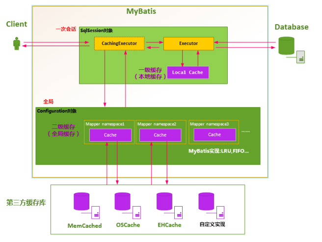

# MyBatis

## MyBatis

Mybatis是一个优秀的持久层ORM框架，它对jdbc的操作数据库的过程进行封装，使得开发者只需要关注SQL本身。不需要花费精力去处理一些重复和繁琐的步骤。通过java对象和statement中的sql进行映射生成最终执行的sql语句。最后由mysql框架执行sql并将结果映射成java对象并返回。

## MyBatis的优点

- 基于SQL语句编程，相当灵活。SQL写在XML中，解除sql与程序代码的耦合，便于统一管理。提供XML标签，支持编写动态SQL语句，并可重用
- 消除了 JDBC 大量冗余的代码，不需要手动开关连接；
- 很好的与各种数据库兼容
- 能够与 Spring 很好的集成；
- 提供映射标签，支持对象与数据库的 ORM 字段关系映射；提供对象关系映射标签，支持对象关系组件维护。

## MyBatis框架的缺点

- SQL 语句的编写工作量较大，尤其当字段多、关联表多时，对开发人员编写SQL 语句的功底有一定要求。
- SQL 语句依赖于数据库，导致数据库移植性差，不能随意更换数据库。

## MyBatis与Hibernate有哪些不同

- MyBatis是一个半ORM框架，需要自己编写sql语句，灵活性高，但是需要自定义多套sql映射文件，工作量大
- Hibernate数据库无关性好，节省代码，提高效率

## MyBatis 编程步骤

- 通过SqlSessionFactoryBuilder（构造器）创建SqlSessionFactory
- 通过SqlSessionFactory（工厂接口）创建SqlSession
- 通过sqlsession（会话）执行数据库操作
- 调用session.commit()提交事务
- 调用session.close关闭会话

## MyBatis的工作原理

- 读取MyBatis配置文件。（获取MyBatis的运行环境等信息）
- 加载映射文件。（SQL映射文件，其中配置了操作数据库的SQL语句）
- 构造会话工厂：通过MyBatis的环境等配置信息构建会话工厂SqlSessionFactory
- 创建会话对象：有会话工厂创建SqlSession对象，该对象包括了执行SQL语句的所有方法
- Executor执行器：根据SqlSession传递的参数动态的生成需要执行的SQL语句，同时负责查询缓存的维护
- Mappredstatement对象：用于存储要映射的SQL语句的id、参数等信息
- 输入参数映射：参数类型可以为Map、List等集合类型也可以使用基本数据类型和POJO类型
- 输出结果映射：和输入类似。

## Mapper/Dao接口的工作原理是什么

Dao接口就是Mapper接口。

- 接口的全限定名就是映射文件的namespace的值
- 接口的方法名就是映射文件中Mapper的Statement的id值
- 接口方法内的参数就是传递给sql的参数

Mapper接口是没有实现类的，当调用接口方法的时候，`接口的全限定名+方法名`拼接字符串作为key值，可以唯一定位一个MapperStatement。在MyBatis中，每一个<select>、<insert>、<update>、<delete>标签都会被解析为一个MapperStatement对象。

**Mapper接口的工作原理是JDK动态代理，MyBatis运行时会使用JDK动态代理为Mapper接口生成代理对象proxy，代理对象会拦截接口方法，转而执行MapperStatement所代表的sql，然后将sql执行结果返回。**

## #{}和${}的区别是什么？

- #{}是预编译处理、是占位符， ${}是字符串替换、是拼接符

2. Mybatis 在处理#{}时，会将 sql 中的#{}替换为?号，调用 PreparedStatement 来赋值
3. Mybatis 在处理${}时， 就是把${}替换成变量的值，调用 Statement 来赋值

- 使用#{}可以有效的防止SQL注入，提高系统安全性

## 当实体类的属性名和表中的字段名不一致如何处理

- 通过在查询的sql语句中定义字段名的**别名**，让字段名的别名和实体类的属性名一致。
- 通过<resultMap>类映射字段名和实体类属性名的一一对应的关系

## Dao接口的方法，参数不同时，方法能重载吗

Mapper接口里的方法，是不能重载的，因为使用`全限定名+方法名`的保存和寻找策略。所以不能重载。

Mapper接口的工作原理是JDK动态代理，MyBatis运行时会使用JDK动态代理为Mapper接口生成代理对象proxy，代理对象会拦截接口方法，转而执行MapperStatement所代表的sql，然后将sql执行结果返回。

## MyBatis是如何进行分页的以及分页插件的原理是什么

MyBatis使用RowBounds对象进行分页，它是针对ResultSet结果集执行的内存分页，而非物理分页。可以在sql内直接书写带有物理分页的参数来完成物理的分页功能，或者使用分页插件来完成物理分页

分页插件的基本原理就是使用MyBatis提供的插件接口，实现自定义插件，在插件的拦截方法内拦截待执行的sql，然后重写sql，根据dialect，添加对应的物理分页语句和物理分页参数。

## Mybatis是如何将sql执行机构封装为对象并返回的？有哪些映射形式

- 使用<resultMap>标签，逐一定义数据库列名和对象属性名之间的映射关系。
- 使用sql列的别名功能，将列别名书写为对象属性名

有了列名和属性名的映射关系后，MyBatis通过反射创建对象，同时使用反射给对象的属性逐一赋值并返回，那些找不到映射关系的属性，是无法完成赋值的

## MyBatis动态sql

MyBatis动态sql可以在Xml映射文件内，以标签的形式编写动态sql，执行原理是根据表达式的值完成逻辑判断并动态拼接sql功能。

MyBatis提供了九种sql标签

- trim
- where
- set
- foreach
- if
- choose
- when
- otherwise
- bind

## XML文件标签

- select
- insert
- update
- delete
- resultMap
- parameterMap
- sql
- include
- selectKey

## MyBatis的Xml映射文件中，不同的Xml文件id是否可以重复

如果配置了namespace那么id可以重复，要是没有配置namespace，id就不可以重复

原因就是 namespace+id 是作为 Map<String, MapperStatement>的 key 使用的，如果没有 namespace，就剩下 id，那么，id 重复会导致数据互相覆盖。有了 namespace，自然 id 就可以重复，namespace 不同，namespace+id 自然也就不同。

## MyBatis是否支持延迟加载，以及如何实现

Mybatis仅支持association关联对象和collection关联集合对象的延迟加载。可以通过配置lazyLoadingEnabled来进行配置。

**原理**

使用 CGLIB 创建目标对象的代理对象，当调用目标方法时，进入拦截器方法，比如调用 a.getB().getName()，拦截器 invoke()方法发现 a.getB()是null 值，那么就会单独发送事先保存好的查询关联 B 对象的 sql，把 B 查询上来，然后调用 a.setB(b)，于是 a 的对象 b 属性就有值了，接着完成 a.getB().getName()方法的调用。这就是延迟加载的基本原理。

## Mybatis 缓存

Mybatis 中有一级缓存和二级缓存，默认情况下一级缓存是开启的，而且是不能关闭的。一级缓存是指 SqlSession 级别的缓存，当在同一个 SqlSession 中进行相同的 SQL 语句查询时，第二次以后的查询不会从数据库查询，而是直接从缓存中获取，一级缓存最多缓存 1024 条 SQL。二级缓存是指可以跨 SqlSession 的缓存。是 mapper 级别的缓存，对于 mapper 级别的缓存不同的sqlsession 是可以共享的。



**Mybatis 的一级缓存原理（sqlsession 级别）**

第一次发出一个查询 sql，sql 查询结果写入 sqlsession 的一级缓存中，缓存使用的数据结构是一个 map。

key：MapperID+offset+limit+Sql+所有的入参

value：用户信息

同一个 sqlsession 再次发出相同的 sql，就从缓存中取出数据。如果两次中间出现 commit 操作（修改、添加、删除），本 sqlsession 中的一级缓存区域全部清空，下次再去缓存中查询不到所以要从数据库查询，从数据库查询到再写入缓存。

**二级缓存原理（mapper 级别）**

二级缓存的范围是 mapper 级别（mapper 同一个命名空间），mapper 以命名空间为单位创建缓存数据结构，结构是 map。mybatis 的二级缓存是通过 CacheExecutor 实现的。CacheExecutor 其实是 Executor 的代理对象。所有的查询操作，在 CacheExecutor 中都会先匹配缓存中是否存在，不存在则查询数据库。

key：MapperID+offset+limit+Sql+所有的入参

具体使用需要配置：

1. Mybatis 全局配置中启用二级缓存配置， 全局开关在 **mybatis-config.xml** 中如下配置:

   ```java
   <settings>
     <!--全局地开启或关闭配置文件中的所有映射器已经配置的任何缓存。 -->
     <setting name="cacheEnabled" value="true"/>
   </settings>
   ```
2. 在对应的 Mapper.xml 中配置 cache 节点
3. 在对应的 select 查询节点中添加 useCache=true

**mybatis二级缓存存在的问题**

**多表操作会产生脏数据**

多表操作一定不能使用二级缓存，例如两个表：role和user_role，如果我想查询出某个用户的全部角色role，就一定会涉及到多表的操作。不管是写到RoleMapper.xml还是UserRoleMapper.xml，或者是一个独立的XxxMapper.xml中。如果使用了二级缓存，都会导致上面这个查询结果可能不正确。

所以，只能在【只有单表操作】的表上使用缓存，不只是要保证这个表在整个系统中只有单表操作，而且和该表有关的全部操作必须全部在一个namespace下。

**解决办法：**通过拦截器判断执行的sql涉及到那些表（可以用jsqlparser解析），然后把相关表的缓存自动清空。但是这种方式对缓存的使用效率是很低的。建议放弃二级缓存，在业务层使用可控制的缓存代替更好。

## MyBatis的接口绑定，以及实现方式

接口绑定：就是在MyBatis中任意定义接口，然后把接口里面的方法和SQL语句进行绑定，我们在使用的时候直接调用接口方法即可

实现方式

- 通过注解绑定
- 通过xml里面写sql语句来绑定，需要指定xml中namespace必须为接口的全路径名。

## Mybatis的mapper接口调用时有哪些要求

- Mapper接口的方法名和mapper.xml中sql的id相同
- Mapper 接口方法的输入参数类型和 mapper.xml 中定义的每个 sql 的parameterType 的类型相同
- Mapper 接口方法的输出参数类型和 mapper.xml 中定义的每个 sql 的resultType 的类型相同
- Mapper.xml 文件中的 namespace 即是 mapper 接口的全限定名

## ResultType和ResultMap的区别

首先MyBatis在查询进行select映射的时候，返回类型可以用resultType也可以用resultMap，其中resultType是直接表示返回类型的，而resultMap则是对外部ResultMap的引用。这两不能同时存在。

在MyBatis进行查询映射的时候，其实查询出来的每一个属性都是放在一个对应的Map中，键是属性名、值是对应的值。

## 简述 Mybatis 的插件运行原理，以及如何编写一个插件

**什么是Mybatis插件**

与其称为Mybatis插件，不如叫Mybatis拦截器，更加符合其功能定位，实际上它就是一个拦截器，应用代理模式，在方法级别上进行拦截。

**支持拦截的方法**

- 执行器Executor（update、query、commit、rollback等方法）；
- 参数处理器ParameterHandler（getParameterObject、setParameters方法）；
- 结果集处理器ResultSetHandler（handleResultSets、handleOutputParameters等方法）；
- SQL语法构建器StatementHandler（prepare、parameterize、batch、update、query等方法）；

Mybatis 仅可以编写针对 ParameterHandler 、 ResultSetHandler 、 StatementHandler 、 Executor  这 4 种接口的插件，Mybatis 使用 JDK 的动态代理，为需要拦截的接口生成代理对象以实现接口方法拦截功能，每当执行这 4 种接口对象的方法时，就会进入拦截方法，具体就是 InvocationHandler  的 invoke() 方法，当然，只会拦截那些你指定需要拦截的方法。

实现 Mybatis 的 Interceptor 接口并复写 intercept() 方法，然后在给插件编写注解，指定要拦截哪一个接口的哪些方法即可，最后，别忘了在配置文件中配置你编写的插件。

## MyBatis有哪些Executor执行器，他们之间的区别是什么

有三种基本的Executor执行器：SimpleExecutor、ReuseExxecutor、BatchExecutor。

### SimpleExecutor

每执行一次update或者select就开启一个Statement对象，用完就立即关闭。

### ReuseRxecutor

执行 update 或 select，以 sql 作为 key 查找 Statement 对象，存在就使用，不存在就创建，用完后，不关闭 Statement 对象，而是放置于 Map<String, Statement>内，供下一次使用。简⾔之，就是重复使用 Statement 对象。

### BatchExecutor

执行update，将所有sql都添加到批处理中，等待同一执行。其缓存了多个Statement对象。每个 Statement 对象都是 addBatch()完毕后，等待逐一执行 executeBatch()批处理。与 JDBC 批处理相同。

## 简述 Mybatis 的 Xml 映射文件和 Mybatis 内部数据结构之间的映射关系？

答：Mybatis 将所有 Xml 配置信息都封装到 All-In-One 重量级对象 Configuration 内部。在 Xml 映射文件中， `<parameterMap>` 标签会被解析为 ParameterMap  对象，其每个子元素会被解析为 ParameterMapping 对象。 `<resultMap> `标签会被解析为 ResultMap  对象，其每个子元素会被解析为 ResultMapping  对象。每一个 `<select><insert><update><delete> `标签均会被解析为 MappedStatement  对象，标签内的 sql 会被解析为 BoundSql 对象。
