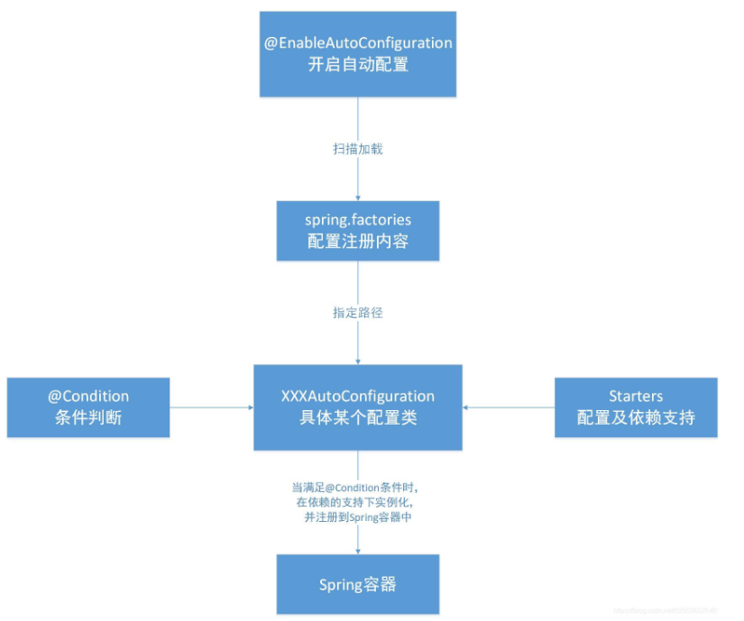

# Spring Boot

## 什么是 Spring Boot？

Spring Boot 是由 Pivotal 团队提供的全新框架，其设计目的是用来**简化 Spring 应用**的初始搭建以及开发过程。该框架使用了特定的方式来进行配置，从而**使开发人员不再需要定义样板化的配置**。通过这种方式，Spring Boot 致力于在蓬勃发展的快速应用开发领域(rapid application development)成为领导者

## Spring Boot 特点 ？

**一、独立运行**

Spring Boot而且内嵌了各种servlet容器，Tomcat、Jetty等，现在不再需要打成war包部署到容器中，Spring Boot只要打成一个可执行的jar包就能独立运行，所有的依赖包都在一个jar包内。

**二、简化配置**

spring-boot-starter-web启动器自动依赖其他组件，简少了maven的配置

**三、自动配置**

Spring Boot能根据当前类路径下的类、jar包来自动配置bean，如添加一个spring-boot-starter-web启动器就能拥有web的功能，无需其他配置。

**四、无代码生成和XML配置**

Spring Boot配置过程中无代码生成，也无需XML配置文件就能完成所有配置工作，这一切都是借助于条件注解完成的，这也是Spring4.x的核心功能之一。

**五、应用监控**

Spring Boot提供一系列端点可以监控服务及应用，做健康检测

## Spring Boot 有哪些优点？

1、减少开发，测试时间和努力。

2、使用 JavaConfig 有助于避免使用 XML。

3、避免大量的 Maven 导入和各种版本冲突。

4、提供意见发展方法。

5、通过提供默认值快速开始开发。

6、没有单独的 Web 服务器需要。这意味着你不再需要启动 Tomcat，Glassfish或其他任何东西。

7、需要更少的配置 因为没有 web.xml 文件。只需添加用@ Configuration 注释的类，然后添加用@Bean 注释的方法，Spring 将自动加载对象并像以前一样对其进行管理。您甚至可以将@Autowired 添加到 bean 方法中，以使 Spring 自动装入需要的依赖关系中。

8、基于环境的配置 使用这些属性，您可以将您正在使用的环境传递到应用程序：-Dspring.profiles.active = {enviornment}。在加载主应用程序属性文件后，Spring 将在（application{environment} .properties）中加载后续的应用程序属性文件。

## Spring Boot 的核心注解`@SpringBootApplication`？

启动类上面的注解是@SpringBootApplication，它也是 Spring Boot 的核心注解，主要组合包含了以下3 个注解：

1. `@SpringBootConfiguration：`组合了 @Configuration 注解，实现配置文件的功能。
2. `@EnableAutoConfiguration：`打开自动配置的功能，也可以关闭某个自动配置的选项，如关闭数据源自动配置功能：@SpringBootApplication(exclude = { DataSourceAutoConfiguration.class })。
3. `@ComponentScan：`Spring组件扫描，默认扫描该类所在包及其子包下所有带有指定注解的类，将它们自动装配到bean容器中，会被自动装配的注解包括@Controller、@Service、@Component、@Repository等。也可以指定扫描路径。

## 运行Spring Boot有哪几种方式

1）打包用命令或者放到容器中运行

2）用 Maven/Gradle 插件运行

3）直接执行 main 方法运行

## 什么是Spring Boot Starters？

Starters可以理解为启动器，它包含了一系列可以集成到应用里面的依赖包，你可以一站式集成Spring及其他技术，而不需要到处找示例代码和依赖包。

如你想使用Spring JPA访问数据库，只要加入springboot-starter-data-jpa启动器依赖就能使用了。Starters包含了许多项目中需要用到的依赖，它们能快速持续的运行，都是一系列得到支持的管理传递性依赖。

## 什么是 JavaConfig？

Spring JavaConfig 是 Spring 社区的产品，它提供了配置 Spring IoC 容器的纯Java 方法。因此它有助于避免使用 XML 配置。

使用 JavaConfig 的优点在于：

1. **面向对象的配置**。由于配置被定义为 JavaConfig 中的类，因此用户可以充分利用 Java 中的面向对象功能。一个配置类可以继承另一个，重写它的@Bean 方法等。
2. **减少或消除 XML 配置**。基于依赖注入原则的外化配置的好处已被证明。但是，许多开发人员不希望在 XML 和 Java 之间来回切换。JavaConfig 为开发人员提供了一种纯 Java 方法来配置与 XML 配置概念相似的 Spring 容器。从技术角度来讲，只使用 JavaConfig 配置类来配置容器是可行的，但实际上很多人认为将JavaConfig 与 XML 混合匹配是理想的。
3. **类型安全和重构友好**。JavaConfig 提供了一种类型安全的方法来配置 Spring容器。由于 Java 5.0 对泛型的支持，现在可以按类型而不是按名称检索 bean，不需要任何强制转换或基于字符串的查找。

## Spring Boot自动配置原理？

Spring Boot通过@EnableAutoConfiguration注解开启自动配置，对jar包下的META-INF/spring.factories文件进行扫描，这个文件中包含了可以进行自动配置的类，当满足@Condition注解指定的条件时，便在依赖的支持下进行实例化，注册到Spring容器中。



## @Condition

在上面的步骤中我们得到了一个动配置类的全限定名数组，这些配置类需要在满足@Condition后才能真正的被注册到Spring容器之中。但在Spring Boot项目中我们更多的是看到@Condition注解的衍生注解，如下：

- @ConditionOnBean    在容器中有指定Bean的条件下。
- @ConditionalOnMissingBean    在容器中没有指定Bean的条件下。
- @ConditionOnClass    在classpath类路径下有指定类的条件下。
- @ConditionalOnMissingClass    在classpath类路径下没有指定类的条件下。
- @ConditionalOnResource    类路径是否有指定的值。
- @ConditionalOnWebApplication    在项目是一个Web项目的条件下。
- @ConditionOnProperty    在指定的属性有指定的值条件下。
- ......

## Spring Boot 的加载流程


1. SpringBoot的启动类是TestApplication，以注解@SpringBootApplication注明。

   该启动类默认只有一个main方法，调用的是SpringApplication.run方法。

   ```java
   @SpringBootApplication
   public class TestApplication {
       public static void main(String[] args) {
           SpringApplication.run(TestApplication.class, args);
       }
   }
   ```
2. 启动程序执行SpringApplication.run方法，run方法创建了一个SpringApplication实例并执行run方法。

   ```java
   public static ConfigurableApplicationContext run(Object source, String... args) {
           return run(new Object[]{source}, args);
       }
   ...
   public static ConfigurableApplicationContext run(Object[] sources, String[] args) {
           return (new SpringApplication(sources)).run(args);//sources为具体的TestApplication.class类
       }
   ...
   ```

   查看SpringApplication构造方法：

   ```java
       public SpringApplication(ResourceLoader resourceLoader, Class<?>... primarySources) {
           this.sources = new LinkedHashSet();
           this.bannerMode = Mode.CONSOLE;
           this.logStartupInfo = true;
           this.addCommandLineProperties = true;
           this.addConversionService = true;
           this.headless = true;
           this.registerShutdownHook = true;
           this.additionalProfiles = Collections.emptySet();
           this.isCustomEnvironment = false;
           this.lazyInitialization = false;
           this.applicationContextFactory = ApplicationContextFactory.DEFAULT;
           this.applicationStartup = ApplicationStartup.DEFAULT;
           this.resourceLoader = resourceLoader;
           Assert.notNull(primarySources, "PrimarySources must not be null");
           this.primarySources = new LinkedHashSet(Arrays.asList(primarySources));
           this.webApplicationType = WebApplicationType.deduceFromClasspath();
           this.bootstrapRegistryInitializers = this.getBootstrapRegistryInitializersFromSpringFactories();
           this.setInitializers(this.getSpringFactoriesInstances(ApplicationContextInitializer.class));
           this.setListeners(this.getSpringFactoriesInstances(ApplicationListener.class));
           this.mainApplicationClass = this.deduceMainApplicationClass();
       }
   ```

   初始化方法主要做了几步：

   1. **配置source**，将source放入SpringApplication的sources属性中管理，sources是一个LinkedHashSet()，这意味着我们可以同时创建多个自定义不重复的Application，但是目前只有一个。
   2. **配置是否为web环境**(javax.servlet.Servlet和org.springframework.web.context.ConfigurableWebApplicationContext都必须在类加载器中存在，并设置到webEnvironment属性中 。
   3. **创建初始化构造器**，从spring.factories中找出ApplicationContextInitializer并设置到初始化器initializers。
   4. **配置应用监听器**，spring.factories中找出ApplicationListener，并实例化后设置到SpringApplication的监听器listeners属性中。这个过程就是找出所有的应用程序事件监听器。
   5. **配置应用的主方法所在类**。
3. SpringApplication构造和初始化完成后，便是运行其run方法：

   ```java
       public ConfigurableApplicationContext run(String... args) {
           StopWatch stopWatch = new StopWatch(); // 构造一个任务执行观察器
           stopWatch.start();// 开始执行，记录开始时间
           DefaultBootstrapContext bootstrapContext = this.createBootstrapContext();
           ConfigurableApplicationContext context = null;
           // 配置Headless属性，Headless模式是在缺少显示屏、键盘或者鼠标时候的系统配置
           this.configureHeadlessProperty();
           // 获取SpringApplicationRunListeners，内部只有一个EventPublishingRunListener
           SpringApplicationRunListeners listeners = this.getRunListeners(args);
           //启动监听
           listeners.starting(bootstrapContext, this.mainApplicationClass);

           try {
                // 构造一个应用程序参数持有类
               ApplicationArguments applicationArguments = new DefaultApplicationArguments(args);
                // 加载配置环境
               ConfigurableEnvironment environment = this.prepareEnvironment(listeners, bootstrapContext, applicationArguments);
               this.configureIgnoreBeanInfo(environment);
               // 打印Banner信息
               Banner printedBanner = this.printBanner(environment);
               // 创建Spring容器
               context = this.createApplicationContext();
               context.setApplicationStartup(this.applicationStartup);
               // 设置容器配置环境，监听等
               this.prepareContext(bootstrapContext, context, environment, listeners, applicationArguments, printedBanner);
               // 刷新容器
               this.refreshContext(context);
               this.afterRefresh(context, applicationArguments);
               stopWatch.stop();// 执行结束，记录执行时间
               if (this.logStartupInfo) {
                   (new StartupInfoLogger(this.mainApplicationClass)).logStarted(this.getApplicationLog(), stopWatch);
               }

               listeners.started(context);//发布ApplicationStartedEvent事件
               this.callRunners(context, applicationArguments);
           } catch (Throwable var10) {
               this.handleRunFailure(context, var10, listeners);
               throw new IllegalStateException(var10);
           }

           try {
               listeners.running(context);//发布ApplicationReadyEvent事件
               return context;// 返回Spring容器
           } catch (Throwable var9) {
               this.handleRunFailure(context, var9, (SpringApplicationRunListeners)null);
               throw new IllegalStateException(var9);
           }
       }
   ```

   run方法过程分析如上，该方法几个关键步骤如下：

   1. **创建一个StopWatch并执行start方法，这个类主要记录任务的执行时间；**
   2. 配置**Headless**属性，Headless模式是在缺少显示屏、键盘或者鼠标时候的系统配置；
   3. 在文件META-INF\spring.factories中获取**应用启动监听器SpringApplicationRunListener**接口的实现类EventPublishingRunListener，主要发布SpringApplicationEvent；
   4. 构造一个应用程序参数持有类，DefaultApplicationArguments类；
   5. **创建配置环境ConfigurableEnvironment**，并设置比如环境信息，系统熟悉，输入参数和profile信息；
   6. **打印Banner信息；**
   7. **创建Spring容器：ApplicationContext**，根据WebApplicationTyp来创建Context类，如果非web项目则创建AnnotationConfigApplicationContext，在构造方法中初始化AnnotatedBeanDefinitionReader和ClassPathBeanDefinitionScanner；
   8. **设置容器配置环境，监听等**，准备application的上下文初始化；
   9. **refresh() 刷新上下文**，在这里真正加载bean到容器中。如果是web容器，会在onRefresh方法中创建一个Server并启动。

      refresh()方法做了很多核心工作比如BeanFactory的设置，BeanFactoryPostProcessor接口的执行、BeanPostProcessor接口的执行、自动化配置类的解析、spring.factories的加载、bean的实例化、条件注解的解析、国际化的初始化等等。

## SpringBoot中配置文件的加载顺序是怎样的？

优先级从高到低，高优先级的配置覆盖低优先级的配置，所有配置会形成互补配置。

1. 命令行参数。所有的配置都可以在命令行上进行指定；
2. Java系统属性（System.getProperties()）；
3. 操作系统环境变量 ；
4. jar包外部的application-{profile}.properties或application.yml(带spring.profile)配置文件
5. jar包内部的application-{profile}.properties或application.yml(带spring.profile)配置文件 再来加载不带profile
6. jar包外部的application.properties或application.yml(不带spring.profile)配置文件
7. jar包内部的application.properties或application.yml(不带spring.profile)配置文件
8. @Configuration注解类上的@PropertySource
